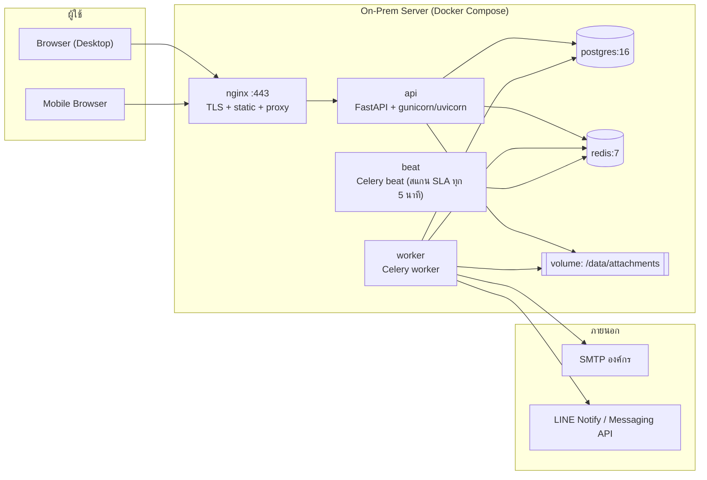

# ADR-001: การเลือก Technology Stack — AIDC Helpdesk

| หัวข้อ | รายละเอียด |
|---|---|
| รหัสเอกสาร | ADR-001 |
| สถานะ | ⚠️ **ถูกแทนที่โดย [ADR-002](./07-adr-002-tech-stack.md)** เมื่อ 2026-08-31 — ฝั่ง backend / ฐานข้อมูล / worker / deployment ยังใช้ตามเอกสารนี้ทุกประการ **สิ่งที่เปลี่ยนคือชั้นเว็บ: จาก React SPA (Vite) เป็น Next.js 15 + Tailwind** |
| วันที่ | 2026-08-31 |
| ผู้จัดทำ | System Analyst (SA) |
| ผู้เกี่ยวข้อง | PM, Senior Frontend, Senior Backend |
| เอกสารที่เกี่ยวข้อง | `01-srs.md`, `02-data-model.md`, `03-api-spec.md`, `04-rbac-sla.md` |

---

## 1. บริบทและปัญหาที่ต้องตัดสินใจ

ต้องเลือก stack สำหรับระบบ AIDC Helpdesk (MVP เฟส 1) ภายใต้เงื่อนไขจริงของโครงการ:

| เงื่อนไข | ผลกระทบต่อการเลือก |
|---|---|
| ทีมพัฒนา 4 คน (PM คน + AI: SA / FE / BE) | ต้องแยกงาน FE–BE ขนานกันได้ชัดเจน, ลด context ที่แต่ละคนต้องแบก |
| Deploy บนเซิร์ฟเวอร์ภายในองค์กร (on-prem) | ห้ามพึ่ง managed service ของ cloud, ต้อง self-host ได้ทั้งหมด, ออฟไลน์ได้ |
| ผู้ใช้ 7 บริษัท หลักร้อย–พันคน | โหลดต่ำ–กลาง ไม่ต้องสถาปัตยกรรมกระจาย |
| ผู้ใช้จำนวนมากใช้มือถือหน้างาน | ต้อง responsive จริง, bundle เล็ก, ทำงานบนเน็ตช้าได้ |
| ต่อยอด AI/automation ในเฟสถัดไป (auto-classify, KB suggestion, chatbot) | ฝั่ง backend ควรอยู่ในระบบนิเวศที่ต่อ AI ได้โดยไม่ต้องสร้าง service ภาษาที่สองมาแปะ |
| ต้องดูแลระยะยาวโดยทีมเล็ก | เลือกของที่ documentation ดี, หา pattern สำเร็จรูปได้, ไม่ใช่ของหายาก |

> **หมายเหตุ:** PM เคยใช้ Python + FastAPI ในโปรเจกต์อื่น — เป็นข้อมูลประกอบเรื่องต้นทุนการดูแลหลังส่งมอบ ไม่ได้ถูกใช้เป็นเหตุผลหลักในการตัดสิน

---

## 2. ตัวเลือกที่พิจารณา

| # | ตัวเลือก | องค์ประกอบ |
|---|---|---|
| A | **FastAPI + React (SPA)** | Python 3.12 + FastAPI + SQLAlchemy 2 / React 18 + TypeScript + Vite |
| B | **Next.js Fullstack** | Next.js 14 App Router + Server Actions + Prisma (TypeScript ภาษาเดียว) |
| C | **Laravel + Vue** | PHP 8.3 + Laravel 11 + Inertia.js + Vue 3 |

---

## 3. ตารางเปรียบเทียบตามเกณฑ์

คะแนน 1–5 (5 = ดีที่สุด) ถ่วงน้ำหนักตามความสำคัญต่อโครงการนี้

| เกณฑ์ | น้ำหนัก | A: FastAPI+React | B: Next.js | C: Laravel+Vue |
|---|---|---|---|---|
| เหมาะกับทีมเล็ก / แบ่งงาน FE-BE ขนานได้ | 20% | 5 — สัญญา OpenAPI คั่นกลาง FE/BE ทำงานแยกกันได้เต็มที่ | 3 — โค้ดปนกัน คนสองคนชนไฟล์เดียวกันบ่อย | 4 — แยกได้แต่ Inertia ผูก FE กับ controller |
| Deploy on-prem | 20% | 5 — container เดียว + uvicorn ไม่มี dependency ภายนอก | 3 — SSR ต้องมี Node runtime ตลอดเวลา, ISR/cache ออกแบบมาเพื่อ edge | 4 — ต้องมี PHP-FPM + Nginx + queue worker |
| ความเร็วในการพัฒนา MVP | 20% | 4 — Pydantic + auto OpenAPI + client codegen ตัดงาน glue ทิ้งเยอะ | 5 — ไม่มีชั้น API ให้เขียน เร็วที่สุดใน 1–2 เดือนแรก | 4 — scaffold/Eloquent/queue/mail ครบในกล่องเดียว |
| การดูแลระยะยาว | 15% | 4 — API เสถียร, type ชัด, breaking change น้อย | 2 — App Router เปลี่ยน pattern บ่อย, upgrade cost สูง | 4 — LTS ชัดเจน แต่หาคนดูแล PHP ในองค์กรยากกว่า |
| ต่อยอด AI/automation | 15% | 5 — อยู่ใน Python แล้ว ต่อ LLM/OCR/embedding/pandas ได้ทันที | 2 — ต้องแยก Python service เพิ่ม กลายเป็นสอง stack | 2 — เหมือน B |
| Mobile web / bundle เล็ก | 10% | 4 — SPA + code splitting คุมได้ | 5 — SSR ทำ first paint ได้ดีที่สุด | 4 |
| **คะแนนถ่วงน้ำหนัก** | 100% | **4.55** | 3.30 | 3.70 |

---

## 4. การตัดสินใจ

> ### เลือก **ตัวเลือก A: FastAPI (Python) + React SPA (TypeScript) + PostgreSQL**

### เหตุผลหลัก (เรียงตามน้ำหนัก)

1. **โครงสร้างทีมบังคับให้ต้องมีสัญญากลาง** — ทีมมี Senior Frontend และ Senior Backend แยกกัน การมี OpenAPI schema ที่ FastAPI สร้างอัตโนมัติจาก Pydantic model ทำให้ทั้งสองฝั่งทำงานขนานได้ตั้งแต่วันแรก (FE ใช้ mock จาก schema, BE ทำ logic) ส่วน Next.js fullstack ที่เอา server logic ไปวางในไฟล์เดียวกับ component จะทำให้สองคนแก้ไฟล์เดียวกันตลอดเวลา — เป็นต้นทุนที่มองไม่เห็นแต่แพงที่สุดสำหรับทีมเล็ก
2. **On-prem เป็นข้อจำกัดจริง ไม่ใช่ preference** — Next.js ให้ประโยชน์สูงสุดบน edge/serverless (ISR, streaming, image optimization) ซึ่งบนเซิร์ฟเวอร์ในองค์กรใช้ไม่ได้เต็ม เท่ากับจ่ายค่า complexity แต่ไม่ได้ของ FastAPI รันเป็น process เดียวหลัง Nginx จบ
3. **AI/automation เฟส 2 เป็นแผนที่ยืนยันแล้ว** — auto-classify ticket, แนะนำบทความ KB, สรุป ticket ล้วนอยู่ในระบบนิเวศ Python ถ้าเลือก B หรือ C จะต้องสร้าง Python service เพิ่มอยู่ดี = ดูแลสอง stack ด้วยคนกลุ่มเดิม
4. **โหลดของระบบต่ำ** — ผู้ใช้หลักพัน ticket หลักหมื่นต่อปี ไม่มีข้อจำกัดด้าน performance ที่บังคับให้เลือกอย่างอื่น จึงตัดสินด้วยต้นทุนการพัฒนา/ดูแลล้วน ๆ

### ข้อเสียที่ยอมรับ (Accepted trade-offs)

| ข้อเสีย | วิธีบรรเทา |
|---|---|
| ต้องดูแล 2 ภาษา (Python + TypeScript) | จำกัด TS ไว้ที่ UI เท่านั้น, ใช้ `openapi-typescript` gen type จาก backend ไม่เขียน type ซ้ำมือ |
| SPA ไม่มี SSR → first load ช้ากว่า Next.js | code splitting ตาม route + gzip/brotli ที่ Nginx + คุม bundle แรกไม่เกิน 300 KB (ระบบภายในองค์กร ไม่ต้องแคร์ SEO) |
| ต้องเขียนชั้น API เอง (งานเพิ่มช่วงแรก ~15%) | ชดเชยด้วย codegen + FastAPI dependency injection สำหรับ RBAC/scoping ที่ใช้ซ้ำทุก endpoint |
| Python ช้ากว่า Node ในงาน I/O หนักมาก | ไม่ใช่ข้อจำกัดที่ระดับโหลดนี้ (ประเมิน < 20 req/s peak) |
| ต้องจัดการ auth เอง (ไม่มี built-in เหมือน Laravel) | ใช้ pattern JWT มาตรฐาน + `passlib[argon2]`, ขอบเขตชัดเจน ทดสอบง่าย |

---

## 5. Stack ที่กำหนด (pin version)

### 5.1 Backend

| ส่วนประกอบ | เวอร์ชัน | เหตุผล |
|---|---|---|
| Python | 3.12.x | LTS-ish, รองรับถึงปี 2028 |
| FastAPI | 0.115.x | async, OpenAPI 3.1 auto |
| Uvicorn (+ gunicorn worker) | 0.32.x | ASGI server production |
| SQLAlchemy | 2.0.x | ORM แบบ typed, async support |
| Alembic | 1.13.x | database migration |
| Pydantic | 2.9.x | validation + settings |
| psycopg (binary) | 3.2.x | driver PostgreSQL |
| python-jose / PyJWT | PyJWT 2.9.x | ออก/ตรวจ JWT |
| passlib[argon2] | 1.7.x | hash password ด้วย Argon2id |
| Celery | 5.4.x | background job (แจ้งเตือน, สแกน SLA, ส่งรายงาน) |
| redis-py | 5.1.x | broker + cache |
| openpyxl | 3.1.x | export Excel |
| WeasyPrint | 62.x | export PDF (รองรับฟอนต์ไทย — ต้องติดตั้ง Sarabun/Noto Sans Thai ใน image) |
| pytest + httpx | 8.3 / 0.27 | ทดสอบ |

### 5.2 Frontend

| ส่วนประกอบ | เวอร์ชัน | เหตุผล |
|---|---|---|
| React | 18.3.x | เสถียร, ecosystem กว้าง (ยังไม่ขึ้น 19 จนกว่า lib หลักจะพร้อม) |
| TypeScript | 5.6.x | |
| Vite | 5.4.x | build เร็ว, dev server เบา |
| React Router | 6.26.x | routing |
| TanStack Query | 5.x | cache/refetch ข้อมูลจาก API — ตัดงาน state management ทิ้งเกือบทั้งหมด |
| React Hook Form + Zod | 7.53 / 3.23 | ฟอร์ม + validation ฝั่ง client |
| Tailwind CSS + shadcn/ui | 3.4.x | สร้าง UI เร็ว, คุม responsive สำหรับมือถือได้ดี |
| Recharts | 2.12.x | กราฟ dashboard |
| openapi-typescript | 7.x | gen type จาก OpenAPI ของ backend |

> **ตัดสินใจเรื่อง State:** ใช้ TanStack Query สำหรับ server state + React Context สำหรับ auth/session เท่านั้น **ไม่ใช้ Redux** (over-engineering สำหรับขอบเขตนี้)

### 5.3 ฐานข้อมูลและโครงสร้างพื้นฐาน

| ส่วนประกอบ | เวอร์ชัน | หน้าที่ |
|---|---|---|
| PostgreSQL | 16.x | ฐานข้อมูลหลัก (รองรับ JSONB สำหรับ audit_log, full-text search ภาษาไทยสำหรับ KB) |
| Redis | 7.4.x | Celery broker, cache, rate limit, blacklist refresh token |
| Nginx | 1.27.x | reverse proxy, TLS, เสิร์ฟ static ของ React, จำกัดขนาดไฟล์อัปโหลด |
| Docker / Docker Compose | 27.x / v2 | packaging + deploy |
| MinIO *(ทางเลือก)* | — | **ไม่ใช้ใน MVP** — เก็บไฟล์แนบลง filesystem ที่ mount volume ตรง ๆ พอ |

> **การตัดสินใจเรื่องไฟล์แนบ:** เก็บบน local volume `/data/attachments/{company_id}/{yyyy}/{mm}/{uuid}.{ext}` ไม่ใช้ object storage ใน MVP เพราะเพิ่ม service ที่ต้องดูแลโดยไม่ได้ประโยชน์ที่ระดับปริมาณนี้ (ประเมิน < 50 GB/ปี) — โครงสร้าง path ออกแบบเผื่อย้ายไป S3-compatible ภายหลังได้

### 5.4 Full-text search ภาษาไทย

ใช้ PostgreSQL `pg_trgm` + `unaccent` สำหรับ KB search ใน MVP (ภาษาไทยไม่มีเว้นวรรค ทำให้ `tsvector` มาตรฐานทำงานได้ไม่ดี) — **ไม่ติดตั้ง Elasticsearch** ในเฟส 1
**[ต้องยืนยันกับ PM]** ถ้าคลัง KB เกิน 2,000 บทความ ให้ประเมิน Meilisearch ในเฟส 2

---

## 6. สถาปัตยกรรมการ Deploy

### 6.1 บริการใน `docker-compose.yml`

| service | image / build | หมายเหตุ |
|---|---|---|
| `nginx` | nginx:1.27-alpine | ports 80/443, `client_max_body_size 25m` |
| `api` | build `./backend` | `gunicorn -k uvicorn.workers.UvicornWorker -w 4` |
| `worker` | build `./backend` | `celery -A app.worker worker -c 2` |
| `beat` | build `./backend` | `celery -A app.worker beat` |
| `postgres` | postgres:16-alpine | volume `pgdata` |
| `redis` | redis:7-alpine | `appendonly yes` |

ทรัพยากรขั้นต่ำที่แนะนำ: **4 vCPU / 8 GB RAM / 200 GB SSD** (จุผู้ใช้พร้อมกันได้ ~200 คน)

### 6.2 การ Deploy และ Rollback

| ขั้นตอน | คำสั่ง/แนวทาง |
|---|---|
| Build | CI สร้าง image ติด tag `aidc-helpdesk-api:{git_sha}` |
| Migration | `alembic upgrade head` รันเป็น one-off container **ก่อน** สลับ image |
| Deploy | `docker compose up -d` (downtime ที่ยอมรับ < 2 นาที ในหน้าต่างนอกเวลาทำการ) |
| Rollback | สลับกลับไป tag เดิม + `alembic downgrade -1` (ทุก migration ต้องเขียน downgrade) |
| Config | `.env` บนเซิร์ฟเวอร์เท่านั้น **ห้าม commit** — secret ทั้งหมดผ่าน environment variable |

### 6.3 นโยบายสำรองข้อมูล (Backup)

| รายการ | วิธี | ความถี่ | เก็บย้อนหลัง | ทดสอบกู้คืน |
|---|---|---|---|---|
| ฐานข้อมูล (full) | `pg_dump -Fc` → บีบอัด | ทุกวัน 01:00 | 30 วัน | ทุกไตรมาส |
| ฐานข้อมูล (รายเดือน) | เก็บ dump ของวันที่ 1 | รายเดือน | 12 เดือน | ทุกปี |
| ไฟล์แนบ | `rsync` volume ไป NAS | ทุกวัน 02:00 | 30 วัน | ทุกไตรมาส |
| ปลายทางสำรอง | NAS ภายใน + external drive นอกอาคาร (offsite) | — | — | — |
| RPO / RTO เป้าหมาย | RPO ≤ 24 ชม. / RTO ≤ 4 ชม. | — | — | — |

> **[ต้องยืนยันกับ PM]** มี NAS หรือพื้นที่สำรองนอกเซิร์ฟเวอร์หลักให้ใช้หรือไม่ — ถ้าไม่มี backup บนเครื่องเดียวกันถือว่าไม่ปลอดภัยและต้องขึ้นเป็นความเสี่ยงระดับสูง

---

## 7. ผลที่ตามมา (Consequences)

**เชิงบวก**
- FE/BE ทำงานขนานได้ทันทีหลังปิด `03-api-spec.md`
- ต่อ AI เฟส 2 ได้ในโปรเจกต์เดิม ไม่ต้องเพิ่ม service ภาษาใหม่
- ทั้งระบบเป็น container พกไปขึ้นเซิร์ฟเวอร์ไหนก็ได้ ไม่ผูกกับ vendor

**เชิงลบ / ต้องเฝ้าระวัง**
- ทีมต้องรักษาวินัยเรื่อง OpenAPI ให้เป็นแหล่งความจริงเดียว ถ้าปล่อยให้ spec ล้าหลังโค้ด ข้อดีข้อ 1 จะหายไปทันที
- ต้องมี CI ที่ตรวจว่า schema ที่ commit ตรงกับโค้ด (`pytest` + diff `openapi.json`)

## 8. สิ่งที่ไม่ทำในเฟส 1 (Explicit non-goals)

Kubernetes, microservices, Elasticsearch, object storage, GraphQL, event bus/Kafka, mobile native app, multi-region HA — **ทั้งหมดถือเป็น over-engineering สำหรับผู้ใช้หลักพันและทีม 4 คน**

## 9. เกณฑ์ทบทวนการตัดสินใจนี้

ทบทวน ADR ฉบับนี้เมื่อเกิดข้อใดข้อหนึ่ง: ผู้ใช้ทะลุ 5,000 คน / ticket เกิน 100,000 ใบต่อปี / ต้องรองรับบริษัทนอกกลุ่ม AIDC / ต้องการ availability > 99.9%
