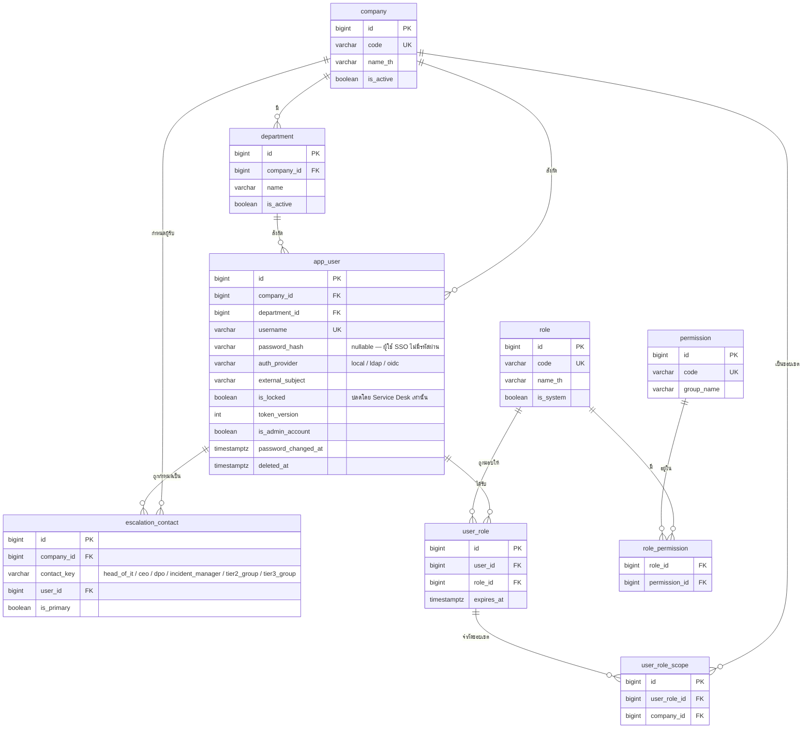
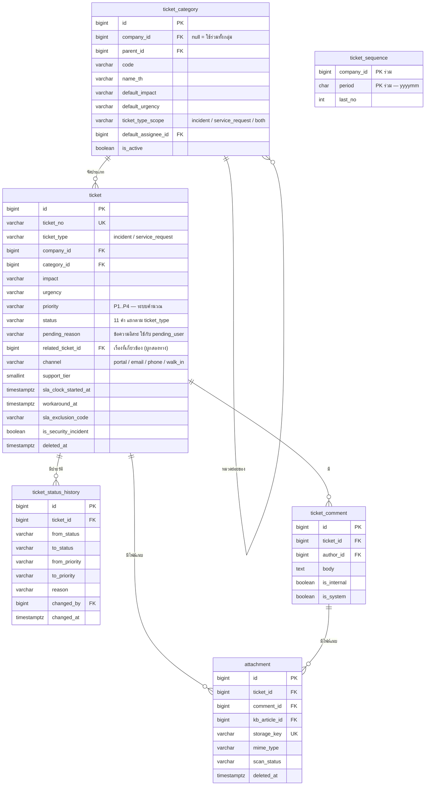
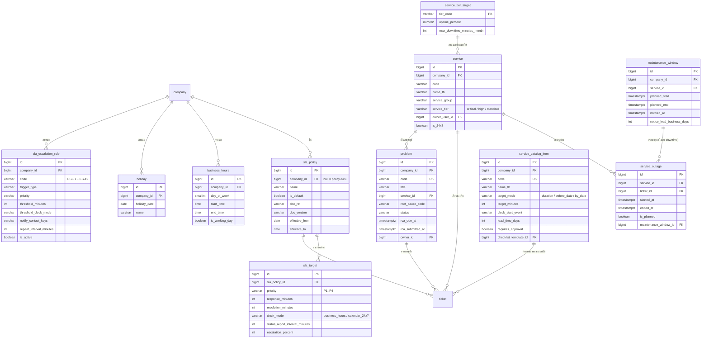
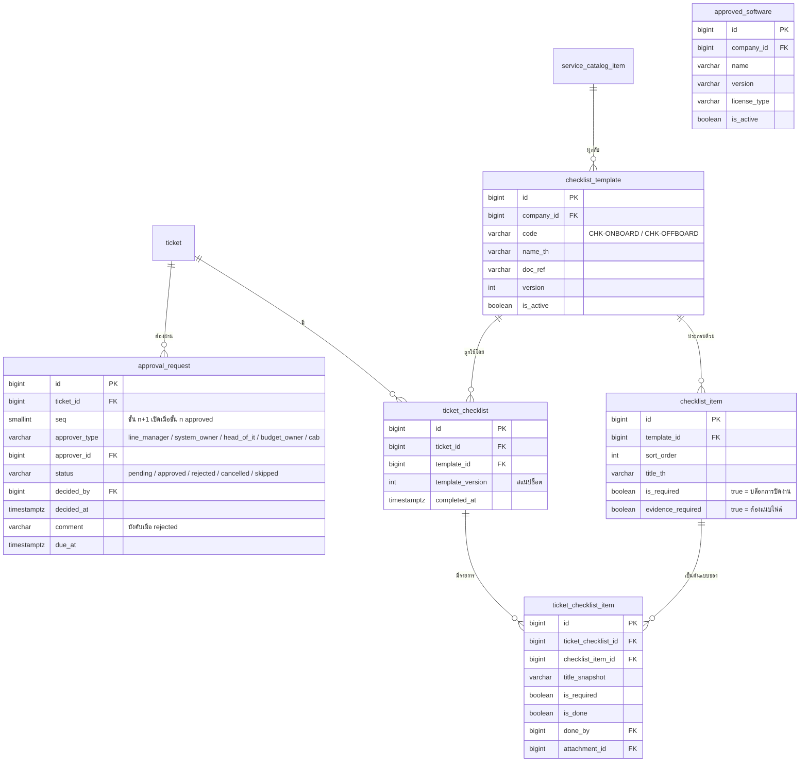
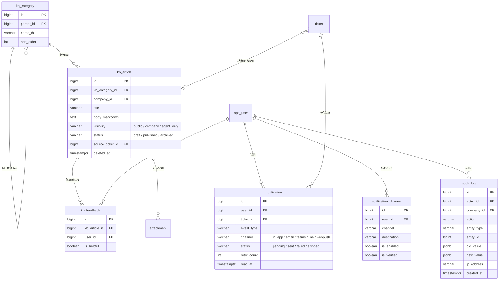
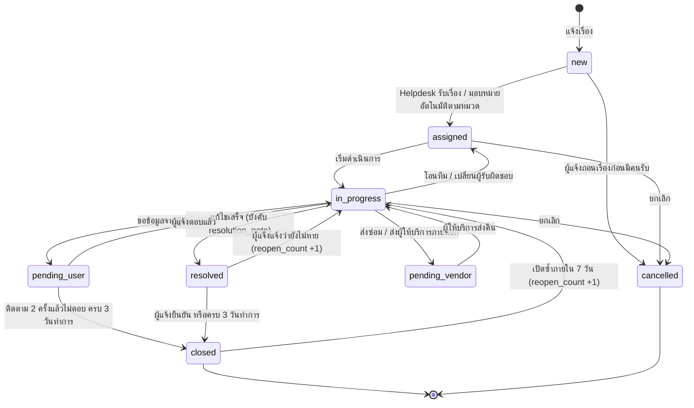
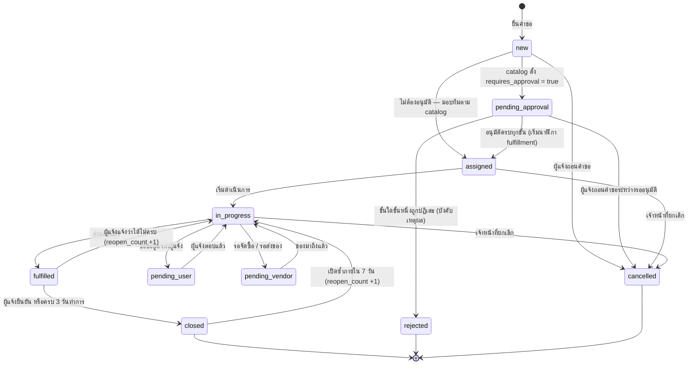

# Data Model — AIDC Helpdesk

| หัวข้อ | รายละเอียด |
|---|---|
| รหัสเอกสาร | DM-001 |
| เวอร์ชัน | **2.0** (ปรับให้ตรงเอกสารควบคุมจริง) |
| วันที่ | 2026-08-31 |
| ฐานข้อมูล | PostgreSQL 16 |
| เอกสารควบคุมที่ยึดถือ | **AIDC-IT-SLA-001 v1.1** · **AIDC-IT-SOP-001 v1.1** |
| ที่มาของการแก้ | [`05-sla-policy-alignment.md`](./05-sla-policy-alignment.md) (G-01…G-20) · [`06-sop-workflow-mapping.md`](./06-sop-workflow-mapping.md) |
| เอกสารอ้างอิง | `01-srs.md`, `03-api-spec.md`, `04-rbac-sla.md`, `07-adr-002-tech-stack.md` |
| จำนวนตาราง | **38** (จาก 22 ในเวอร์ชัน 1.0) |
| สถานะ | **ปิด schema แล้ว** — การเปลี่ยนแปลงหลังจากนี้ต้องผ่านการทบทวนร่วม SA + BE + FE |

---

## 0. สรุปการเปลี่ยนแปลงจากเวอร์ชัน 1.0

> เวอร์ชัน 1.0 เขียนขึ้น **ก่อน** ได้รับ AIDC-IT-SLA-001 v1.1 และ AIDC-IT-SOP-001 v1.1
> ทุกรายการด้านล่างคือการแก้ให้ตรงเอกสารควบคุม ไม่ใช่การเพิ่มขอบเขตตามใจ

| # | สิ่งที่เปลี่ยน | ที่มา |
|---|---|---|
| 1 | `ticket.priority` `critical/high/medium/low` → **`P1/P2/P3/P4`** และ**ระบบคำนวณจาก `impact × urgency`** ไม่ให้ผู้แจ้งเลือกเอง | G-02, G-17 |
| 2 | เวลาทำการ จ–ส 08:00–17:00 → **จ–ศ 08:30–17:30** (เสาร์ไม่ใช่วันทำการ) | G-01 |
| 3 | เพิ่ม `sla_target.clock_mode` — **P1 นับต่อเนื่อง 24×7** ส่วน P2–P4 นับเวลาทำการ | G-05 |
| 4 | ค่า SLA ใหม่: P1 15/240 · P2 30/480 · **P3 120/1080** · P4 240/2700 | G-03, G-04 |
| 5 | ~~`pending_user` แยก **`pending_reason`** 3 แบบ~~ → **v3: แยกเป็นสถานะจริง** `pending_user` · `pending_vendor` · `pending_approval` (ดู §6) | G-06 |
| 6 | เพิ่ม **workaround** — หยุดนับ resolution ของ incident และบังคับเปิด `problem` | G-07 |
| 7 | เปลี่ยน priority กลางทาง → นับใหม่จาก **`priority_changed_at`** ไม่ใช่ `created_at` | G-08 |
| 8 | ยกเลิก "`pending_user` 5 วันทำการ → `resolved` อัตโนมัติ" แทนด้วย **ติดตาม 2 ครั้ง แล้วปิดเมื่อครบ 3 วันทำการ** | G-09 |
| 9 | เพิ่ม **`support_tier` 1/2/3** + ตาราง `escalation_contact` และ `sla_escalation_rule` | G-11 |
| 10 | เพิ่ม **รอบรายงานสถานะ** (P1 ทุก 1 ชม. · P2 ทุก 4 ชม.ทำการ) | G-12 |
| 11 | เพิ่มโดเมน **Availability** — `service`, `service_tier_target`, `service_outage`, `maintenance_window` | G-13, G-20 |
| 12 | เพิ่ม **`ticket_type`** (`incident` / `service_request`) + `service_catalog_item` | G-14, SOP-01 |
| 13 | `ticket.source` → **`channel`** 4 ค่า (`portal`/`email`/`phone`/`walk_in`) — **ไม่มี LINE** | G-15 |
| 14 | เพิ่ม **`problem`** สำหรับ RCA และ KPI Repeat Incident | G-18 |
| 15 | เพิ่ม **`approval_request`** — SOP-03/06 บังคับอนุมัติก่อนเริ่มนับเวลา | SOP-03, SOP-06 |
| 16 | เพิ่ม **checklist 4 ตาราง** — SOP-04/05 บังคับแนบหลักฐานก่อนปิดงาน | SOP-04, SOP-05 |
| 17 | เพิ่ม **`approved_software`** — SOP-06 ต้องเช็กบัญชีซอฟต์แวร์อนุมัติ | SOP-06, นโยบาย 3.5 |
| 18 | นโยบายรหัสผ่าน **≥ 12 ตัวอักษร** และ **ล็อกบัญชีต้องให้ Service Desk ปลดเท่านั้น** (`is_locked`) | นโยบาย 3.2 |
| 19 | เพิ่มฟิลด์ **PDPA / เหตุความปลอดภัย** — `is_security_incident`, `dpo_notified_at`, `regulator_notify_due_at` | SOP-10, นโยบาย 3.8 |
| 20 | เพิ่มตารางที่ BE ขอ: **`ticket_sequence`** (B-03) และ **`kb_feedback`** (B-05) | `10-…` §10 |
| 21 | `app_user` รองรับ SSO ตั้งแต่แรก: `auth_provider`, `external_subject`, `password_hash` เป็น nullable, `token_version` | B-01, B-02 |
| 22 | Token เก็บใน **httpOnly cookie** ที่ FastAPI ตั้งเอง (ไม่ใช่ `localStorage`) | ADR-002 D-01 |

---

## 1. หลักการออกแบบ

| หลักการ | รายละเอียด |
|---|---|
| Primary key | `BIGSERIAL` ทุกตาราง — อ่านง่าย ดีบักง่าย ดัชนีเล็กกว่า UUID |
| รหัสที่เปิดเผยภายนอก | `ticket.ticket_no`, `problem.code`, `attachment.storage_key` (UUID) เท่านั้น |
| เวลา | `TIMESTAMPTZ` เก็บ UTC ทั้งหมด แปลงเป็น `Asia/Bangkok` ที่ชั้นแสดงผล |
| Multi-tenant | **Shared database + shared schema** มีคอลัมน์ `company_id` และบังคับ scoping ที่ชั้น query ของ backend เสมอ — **ไม่ใช้ PostgreSQL RLS** เพราะมีทางเข้าถึงข้อมูลทางเดียว (frontend ไม่มี DB credential ตาม ADR-002 §2.1) |
| Soft delete | `ticket`, `kb_article`, `app_user`, `attachment` (คอลัมน์ `deleted_at`) ตารางอื่นใช้ `is_active` |
| **Snapshot pattern** | ค่าที่ผูกกับข้อตกลง ณ เวลาที่สร้าง ต้องคัดลอกมาเก็บ ไม่อ้างอิงเป็น FK อย่างเดียว — `ticket.sla_policy_id`, `ticket_checklist.template_version`, `ticket_checklist_item.title_snapshot` |
| **Document traceability** | ตารางที่มีค่ามาจากเอกสารควบคุมต้องมี `doc_ref` + `doc_version` + `effective_from/to` เพราะ SLA ทบทวนทุก 12 เดือนและต้องตรวจย้อนได้ว่าค่านี้มาจากเอกสารฉบับใด |
| Enum | `VARCHAR` + `CHECK constraint` (ไม่ใช้ PostgreSQL ENUM type เพราะแก้ค่าภายหลังยาก) |
| Naming | ตาราง/คอลัมน์เป็น `snake_case` เอกพจน์ |
| Append-only | `audit_log` ห้าม UPDATE/DELETE จากชั้น application และ **ห้าม purge ก่อน 90 วัน** (นโยบาย 3.3) |

---

## 2. ER Diagram

> 38 ตารางอ่านในภาพเดียวไม่ไหว จึงแยกเป็น 5 โดเมน — ความสัมพันธ์ข้ามโดเมนระบุด้วยหมายเหตุใต้ภาพ

### 2.1 องค์กร สิทธิ์ และการยกระดับ (9 ตาราง)



### 2.2 Ticket แกนกลาง (6 ตาราง)



> ความสัมพันธ์ข้ามโดเมนของ `ticket`: `requester_id` / `created_by` / `assignee_id` / `incident_commander_id` → `app_user` · `department_id` → `department` · `sla_policy_id` → `sla_policy` · `service_id` → `service` · `problem_id` → `problem` · `catalog_item_id` → `service_catalog_item` · `resolved_by_kb_id` → `kb_article`

### 2.3 SLA บริการ และความพร้อมใช้งาน (11 ตาราง)



### 2.4 กระบวนการตาม SOP — อนุมัติและ checklist (6 ตาราง)



### 2.5 ความรู้ การแจ้งเตือน และร่องรอย (6 ตาราง)



> ใช้ชื่อตาราง `app_user` แทน `user` เพราะ `user` เป็นคำสงวนของ PostgreSQL — ในเอกสาร API และ SRS เรียกว่า "user" ตามความหมายเชิงธุรกิจ

---

## 3. ตาราง `ticket` — ฉบับเต็ม

จัดกลุ่มคอลัมน์เพื่อให้อ่านได้ · **ตัวหนา = เพิ่มหรือแก้ในเวอร์ชัน 2.0**

### 3.1 ข้อมูลพื้นฐาน

| field | type | null | default | คำอธิบาย |
|---|---|---|---|---|
| `id` | bigserial | N | auto | PK |
| `ticket_no` | varchar(30) | N | — | UNIQUE เช่น `AIDC-LOG-202608-0042` |
| **`ticket_type`** | varchar(20) | N | `'incident'` | `incident` / `service_request` — Tier 1 บังคับเลือก (SOP-01 ข้อ 2) |
| `company_id` | bigint | N | — | บริษัทเจ้าของเรื่อง (ใช้ scoping) |
| `department_id` | bigint | Y | null | แผนกที่แจ้ง |
| `category_id` | bigint | N | — | หมวดหมู่ (ระดับย่อยถ้ามี) |
| **`catalog_item_id`** | bigint | Y | null | FK → `service_catalog_item` — **บังคับเมื่อ `ticket_type='service_request'`** |
| **`service_id`** | bigint | Y | null | FK → `service` — จำเป็นต่อ KPI Uptime และ Repeat Incident |
| **`problem_id`** | bigint | Y | null | FK → `problem` |
| `requester_id` | bigint | N | — | ผู้ร้องขอ (เจ้าของปัญหา) |
| `created_by` | bigint | N | — | ผู้บันทึกเข้าระบบ (อาจเป็น agent แทนผู้ร้องขอ) |
| `assignee_id` | bigint | Y | null | ผู้รับผิดชอบปัจจุบัน |
| `subject` | varchar(255) | N | — | หัวข้อ |
| `description` | text | N | — | รายละเอียด |
| **`channel`** | varchar(20) | N | `'portal'` | **แทน `source` เดิม** — `portal` / `email` / `phone` / `walk_in` (SLA 3.2) |
| **`source_device`** | varchar(20) | Y | null | `web` / `mobile_web` — ข้อมูลเชิงเทคนิค แยกจากช่องทางตามเอกสาร |
| **`call_answered_at`** | timestamptz | Y | null | ใช้กับ `channel='phone'` เพื่อรายงานเป้า "รับสายภายใน 3 นาที" |
| **`asset_tag`** | varchar(50) | Y | null | หมายเลขทรัพย์สิน (ข้อความอิสระ — สะพานชั่วคราวก่อนมี Asset module) |

### 3.2 ระดับความสำคัญ

| field | type | null | default | คำอธิบาย |
|---|---|---|---|---|
| **`impact`** | varchar(20) | N | `'individual'` | `org_wide` / `department` / `individual` |
| **`urgency`** | varchar(20) | N | `'medium'` | `high` / `medium` / `low` |
| **`priority`** | varchar(10) | N | `'P3'` | **`P1`/`P2`/`P3`/`P4` — ระบบคำนวณจากเมทริกซ์** agent ปรับได้พร้อมเหตุผลบังคับ |
| **`priority_changed_at`** | timestamptz | Y | null | เวลาที่ปรับระดับล่าสุด — **เป็นจุดเริ่มนับ SLA ใหม่** (SLA 5.4) |
| **`priority_review_requested_at`** | timestamptz | Y | null | ผู้แจ้งขอทบทวนระดับ (ES-08) |
| **`priority_review_reason`** | varchar(500) | Y | null | เหตุผลทางธุรกิจ — บังคับเมื่อขอทบทวน |

**เมทริกซ์ที่ระบบใช้คำนวณ** (SLA ข้อ 4)

| impact ↓ / urgency → | `high` | `medium` | `low` |
|---|---|---|---|
| `org_wide` | **P1** | **P2** | **P3** |
| `department` | **P2** | **P3** | **P3** |
| `individual` | **P3** | **P3** | **P4** |

### 3.3 สถานะและการหยุดนับเวลา

| field | type | null | default | คำอธิบาย |
|---|---|---|---|---|
| `status` | varchar(20) | N | `'new'` | **11 ค่า** แยกตาม `ticket_type` — ดูหัวข้อ 6 |
| **`pending_reason`** | varchar(20) | Y | null | **ข้อความอิสระ ไม่ใช่ enum แล้ว** (v3) — ใช้กับ `pending_user` เท่านั้น และไม่บังคับ · เดิมเป็น `user`/`vendor`/`approval` ซึ่งสองค่าหลังกลายเป็นสถานะจริงแล้ว · **แถวเก่ายังมีค่าเดิมค้างอยู่ ไม่ได้ล้างทิ้ง** เพื่อให้อ่านประวัติย้อนหลังได้ |
| `pending_started_at` | timestamptz | Y | null | เวลาที่เข้าสถานะ **พักแบบใดก็ได้** ครั้งล่าสุด (`pending_approval` / `pending_user` / `resolved` / `fulfilled`) — v2 ตั้งให้เฉพาะ `pending_user` |
| **`pending_notified_at`** | timestamptz | Y | null | ต้องแจ้งผู้รับบริการก่อนเข้า `pending_vendor` (SLA 5.4) — เดิมผูกกับ `reason='vendor'` |
| **`related_ticket_id`** | bigint | Y | null | FK → `ticket` (ON DELETE SET NULL) · เรื่องอีกใบที่เกี่ยวข้อง เช่น incident เครื่องพัง ↔ service_request ขอเครื่องทดแทน · **ผูกสองทางเสมอ** · เฟส 1 ผูกได้ใบเดียว |
| `pending_duration_minutes` | int | N | 0 | เวลาสะสมที่หยุดนับ (นาทีทำการ) |
| **`followup_count`** | int | N | 0 | จำนวนครั้งที่ระบบส่งติดตาม (ต้องครบ 2 ก่อนปิดอัตโนมัติ) |
| **`last_followup_at`** | timestamptz | Y | null | |
| **`support_tier`** | smallint | N | 1 | 1 / 2 / 3 (SLA 6.1) |
| **`tier_changed_at`** | timestamptz | Y | null | |
| **`vendor_ref`** | varchar(100) | Y | null | **บังคับเมื่อ `support_tier=3`** และเป็นงานของผู้ให้บริการภายนอก |
| **`assignee_change_count`** | int | N | 0 | counter สำหรับ KPI FCR (นับจาก history ช้าเกินไป) |

### 3.4 SLA และการวัดผล

| field | type | null | default | คำอธิบาย |
|---|---|---|---|---|
| `sla_policy_id` | bigint | Y | null | policy ที่ใช้ตอนสร้าง (**สแนปช็อต** — US-11 AC-1) |
| **`sla_clock_started_at`** | timestamptz | Y | null | จุดเริ่มนับจริงตาม `clock_start_event` (ต่างจาก `created_at` สำหรับคำขอที่ต้องอนุมัติก่อน) |
| `response_due_at` | timestamptz | Y | null | |
| `resolution_due_at` | timestamptz | Y | null | |
| `first_response_at` | timestamptz | Y | null | **คอมเมนต์สาธารณะครั้งแรกจาก agent** — การ assign ไม่นับ |
| **`target_date`** | date | Y | null | ใช้กับคำขอเชิงวันที่ (onboarding / offboarding) |
| **`next_status_report_due_at`** | timestamptz | Y | null | รอบรายงานสถานะ (P1 ทุก 1 ชม. · P2 ทุก 4 ชม.ทำการ) |
| **`workaround_at`** | timestamptz | Y | null | **หยุดนับ resolution ของ incident ทันที** (SLA 5.4) |
| **`workaround_note`** | text | Y | null | |
| `resolved_at` | timestamptz | Y | null | |
| `resolution_note` | text | Y | null | บังคับกรอกก่อนเข้า `resolved` |
| `closed_at` | timestamptz | Y | null | |
| `closed_by` | bigint | Y | null | null + `closed_at` ไม่ null = ระบบปิดอัตโนมัติ |
| `is_response_breached` | boolean | N | false | |
| `is_resolution_breached` | boolean | N | false | |
| `escalation_notified_at` | timestamptz | Y | null | กันการแจ้งเตือน 75% ซ้ำ |
| **`sla_exclusion_code`** | varchar(30) | Y | null | ข้อยกเว้นตาม SLA ข้อ 9 — **ตัดออกจากตัวหารของ KPI และไม่ตั้งธง breach** |
| **`sla_exclusion_note`** | varchar(500) | Y | null | |
| `reopen_count` | int | N | 0 | |
| `resolved_by_kb_id` | bigint | Y | null | FK → `kb_article` (FR-55) |

**ค่าที่อนุญาตของ `sla_exclusion_code`:** `planned_maintenance` · `force_majeure` · `vendor_delay` · `user_installed` · `waiting_requester` · `agreed_special_terms`

### 3.5 เหตุขัดข้องร้ายแรงและความปลอดภัย

| field | type | null | default | คำอธิบาย |
|---|---|---|---|---|
| **`is_major_incident`** | boolean | N | false | ตั้งอัตโนมัติเมื่อเป็น P1 (ES-01) |
| **`incident_commander_id`** | bigint | Y | null | FK → `app_user` (SOP-02 ข้อ 2) |
| **`is_security_incident`** | boolean | N | false | **จำกัดการมองเห็นเป็นพิเศษ** — ดูหัวข้อ 7.3 |
| **`personal_data_affected`** | boolean | N | false | |
| **`dpo_notified_at`** | timestamptz | Y | null | SOP-10 ข้อ 4 |
| **`regulator_notify_due_at`** | timestamptz | Y | null | = เวลาที่ประเมินว่ากระทบข้อมูลส่วนบุคคล **+ 72 ชม.** (PDPA) |
| **`is_immediate_suspend`** | boolean | N | false | ใช้กับ offboarding กรณีเลิกจ้างฉับพลัน (SOP-05) |
| **`restore_point_date`** | date | Y | null | ใช้กับคำขอกู้คืนข้อมูล (SOP-07) |

### 3.6 CSAT และคอลัมน์มาตรฐาน

| field | type | null | default | คำอธิบาย |
|---|---|---|---|---|
| `satisfaction_score` | smallint | Y | null | 1–5 |
| **`csat_sent_at`** | timestamptz | Y | null | **จำเป็นต่อการรายงาน Response Rate** (SLA ภาคผนวก ก.3 บังคับรายงานคู่กับ CSAT) |
| **`csat_responded_at`** | timestamptz | Y | null | |
| `deleted_at` | timestamptz | Y | null | soft delete |
| `created_at` / `updated_at` | timestamptz | N | now() | |

### 3.7 Index ที่ต้องมี

| index | คอลัมน์ | เหตุผล |
|---|---|---|
| `idx_ticket_company_status` | (`company_id`, `status`, `created_at DESC`) | query หลักของทุกหน้ารายการ |
| `idx_ticket_assignee` | (`assignee_id`, `status`) | หน้าคิวงานของฉัน |
| `idx_ticket_requester` | (`requester_id`, `created_at DESC`) | หน้าเรื่องของฉัน |
| `idx_ticket_due` | (`resolution_due_at`) WHERE `status NOT IN ('resolved','closed','cancelled')` | งานสแกน SLA |
| **`idx_ticket_status_report`** | (`next_status_report_due_at`) WHERE `next_status_report_due_at IS NOT NULL` | งาน `status_report_reminder` |
| **`idx_ticket_tier`** | (`support_tier`, `created_at`) WHERE `status NOT IN ('resolved','closed','cancelled')` | ES-04 Tier 1 เกิน 2 ชม.ทำการ |
| **`idx_ticket_problem`** | (`problem_id`, `created_at DESC`) | KPI Repeat Incident |
| `idx_ticket_search` | GIN trigram บน `subject` | ค้นหาภาษาไทย |

---

## 4. ตารางเดิมที่มีการเปลี่ยนแปลง

### 4.1 `app_user`

| field | การเปลี่ยนแปลง | เหตุผล |
|---|---|---|
| `password_hash` | varchar(255) → **nullable** | ผู้ใช้ SSO ในเฟส 2 ไม่มีรหัสผ่าน (B-01) |
| **`auth_provider`** | varchar(20) N default `'local'` | `local` / `ldap` / `oidc` |
| **`external_subject`** | varchar(255) Y | UNIQUE ร่วมกับ `auth_provider` |
| **`token_version`** | int N default 0 | เพิกถอน token ทั้งบัญชีทันทีเมื่อปิดบัญชี/เปลี่ยน role (B-02) |
| **`is_locked`** | boolean N default false | **แทน `locked_until`** — นโยบาย 3.2 บังคับว่าปลดล็อกต้องยืนยันตัวตนกับ Service Desk **ปลดเองตามเวลาไม่ได้** |
| `locked_until` | **ลบทิ้ง** | ขัดนโยบาย 3.2 |
| **`is_admin_account`** | boolean N default false | บัญชีผู้ดูแลต้องแยกจากบัญชีใช้งานประจำวัน |
| **`password_changed_at`** | timestamptz Y | บังคับเปลี่ยนทุก 90 วันสำหรับบัญชี admin |
| `line_user_id` | คงไว้ | ใช้กับ**การแจ้งเตือนขาออก**เท่านั้น ไม่ใช่ช่องทางรับแจ้ง |
| **`manager_id`** (v3) | bigint Y · FK → `app_user` | หัวหน้าสายงาน ใช้หาผู้อนุมัติขั้น `line_manager` อัตโนมัติ · **ไม่ใช้หัวหน้าแผนกของ `department_id` แทน** เพราะแผนกเป็นหน่วยจัดกลุ่มเพื่อรายงาน ไม่ใช่สายบังคับบัญชา — มีคนที่สังกัดแผนกหนึ่งแต่รายงานตรงกับคนอีกแผนก |

> **นโยบายรหัสผ่านใหม่:** ≥ **12 ตัวอักษร** ประกอบด้วยพิมพ์ใหญ่ พิมพ์เล็ก ตัวเลข อักขระพิเศษ (นโยบาย 3.2) — เดิม `01-srs.md` NFR-10 เขียน ≥ 8 ต้องแก้ตาม

### 4.2 `user_role`

| field | การเปลี่ยนแปลง | เหตุผล |
|---|---|---|
| **`expires_at`** | timestamptz Y | สิทธิ์ชั่วคราวต้องมีกำหนดสิ้นสุด (นโยบาย 3.3) — เฟส 1 ใช้**รายงานเตือน** เฟส 2 เพิกถอนอัตโนมัติ |

### 4.3 `sla_policy` / `sla_target`

| ตาราง | การเปลี่ยนแปลง |
|---|---|
| `sla_policy` | เพิ่ม **`doc_ref`** varchar(40) · **`doc_version`** varchar(10) · **`effective_from`** date · **`effective_to`** date (null = ยังบังคับใช้) |
| `sla_target` | `priority` เปลี่ยนค่าเป็น `P1..P4` · เพิ่ม **`clock_mode`** varchar(20) N default `'business_hours'` · เพิ่ม **`status_report_interval_minutes`** int Y (null = รายงานเมื่อสถานะเปลี่ยน) |

> **ห้าม UPDATE แถว `sla_policy` เมื่อเอกสารขึ้นเวอร์ชันใหม่** — ให้ตั้ง `effective_to` ของแถวเดิมแล้ว INSERT แถวใหม่ (`ticket.sla_policy_id` เป็นสแนปช็อตอยู่แล้ว จึงไม่กระทบ ticket เก่า)

### 4.4 `business_hours`

| field | เดิม | ใหม่ |
|---|---|---|
| `start_time` default | `'08:00'` | **`'08:30'`** |
| `end_time` default | `'17:00'` | **`'17:30'`** |
| เสาร์ (`day_of_week=6`) | `is_working_day=true` | **`false`** |

### 4.5 `ticket_category`

| field | การเปลี่ยนแปลง |
|---|---|
| `default_priority` | **ลบทิ้ง** — แทนด้วย **`default_impact`** varchar(20) และ **`default_urgency`** varchar(20) เพราะระบบคำนวณ priority เอง |
| **`ticket_type_scope`** (v3) | varchar(20) N default `'both'` · `incident` / `service_request` / `both` · ตอบโจทย์ "ช่องที่ 1 และ 2 ในฟอร์มเปิด ticket ต้องกรองหมวดหมู่" — ผู้แจ้งเลือกชนิดของเรื่องก่อน แล้วรายการหมวดหมู่เหลือเฉพาะที่ใช้ได้จริง |

**กติกาที่ใช้จัดขอบเขต** (ยึดตามที่ SA กำหนด)

- `incident` = สัญญาณว่าของที่ควรใช้ได้ กลับใช้ไม่ได้ — พัง / ขึ้น error / ต่อไม่ติด / ช้า / ล่ม / ไวรัส / เหตุความปลอดภัย
- `service_request` = ขอให้ไอทีทำ จัดหา หรือเปลี่ยนอะไรบางอย่าง โดยไม่มีอะไรเสีย
- `both` = กำกวมจริง — ทุกแถวที่เป็น `both` เพราะกำกวม มีคอมเมนต์กำกับไว้ใน seed ให้ SA ทบทวน

> **⚠️ หมวดหลักที่มีลูกทั้งสองชนิดต้องอยู่ที่ `both` เสมอ**
> หน้าจอกรองที่ระดับ **หมวดย่อย** ไม่ใช่ซ่อนหมวดหลักทิ้ง มิฉะนั้นผู้แจ้งจะหา
> หมวดย่อยที่มีอยู่จริงไม่เจอ เพราะพ่อของมันหายไปตั้งแต่ช่องแรกของฟอร์ม

**การแยก `EMAIL_PASSWORD`** — กฎเฉพาะจาก SA: *"ลืมรหัสผ่าน = ขอ service, แต่บัญชีถูกล็อกเพราะระบบ error = incident"*

| code | ชื่อ | ขอบเขต |
|---|---|---|
| `EMAIL_PASSWORD` *(รหัสเดิม)* | ລືມລະຫັດຜ່ານ | `service_request` |
| `EMAIL_ACCOUNT_LOCKED` *(ใหม่)* | ບັນຊີຖືກລັອກຍ້ອນລະບົບຜິດພາດ | `incident` |

> ⚠️ `EMAIL_PASSWORD` **คงรหัสเดิม** ไว้กับครึ่ง "ลืมรหัสผ่าน" โดยตั้งใจ —
> ticket เก่าทุกใบชี้มาที่รหัสนี้ ถ้าย้ายไปให้ครึ่ง incident ประวัติทั้งหมด
> จะเปลี่ยนความหมายย้อนหลังโดยไม่มีใครสั่ง

### 4.6 `attachment`

| field | การเปลี่ยนแปลง | เหตุผล |
|---|---|---|
| **`scan_status`** | varchar(20) N default `'skipped'` | `pending` / `clean` / `infected` / `skipped` — รองรับ virus scan เฟส 2 (B-04) |
| **`deleted_at`** | timestamptz Y | soft delete + quarantine |
| CHECK "ต้องมี ticket/comment/kb อย่างน้อยหนึ่ง" | **ผ่อนให้ orphan ได้ชั่วคราว** | `POST /attachments` อัปโหลดก่อนสร้าง ticket (B-08) — งาน `cleanup_orphan_attachments` ลบไฟล์ที่ไม่ผูกกับอะไรเกิน 24 ชม. |

### 4.7 `notification` / `notification_channel`

| การเปลี่ยนแปลง | เหตุผล |
|---|---|
| CHECK ของ `channel` ขยายเป็น `in_app`, `email`, **`teams`**, `line`, **`webpush`** | LINE Notify ปิดบริการแล้ว ต้องเปิดทางให้สลับช่องทาง (B-06, P-02) |
| เพิ่ม **partial UNIQUE index** `(user_id, ticket_id, event_type, channel)` WHERE `created_at::date = CURRENT_DATE` | กัน Celery retry สร้างแถวซ้ำ (S-04) |
| `event_type` เพิ่มค่า | `sla_warning`, `sla_breached`, `status_report_due`, `approval_requested`, `approval_decided`, `followup`, `major_incident`, `security_incident`, `rca_due` |

---

## 5. ตารางใหม่ 16 ตาราง

### 5.1 `ticket_sequence` — ออกเลข ticket แบบไม่ชนกัน (B-03)

| field | type | null | คำอธิบาย |
|---|---|---|---|
| `company_id` | bigint | N | PK ร่วม |
| `period` | char(6) | N | PK ร่วม — `yyyymm` |
| `last_no` | int | N | เลขล่าสุดที่ออกไป |

> ออกเลขด้วย `SELECT … FOR UPDATE` ในทรานแซกชันเดียวกับการ insert ticket — **ห้ามใช้ `COUNT(*)+1`**

### 5.2 `kb_feedback` — กันโหวตซ้ำ (B-05)

| field | type | null | คำอธิบาย |
|---|---|---|---|
| `id` | bigserial | N | PK |
| `kb_article_id` | bigint | N | FK |
| `user_id` | bigint | N | FK |
| `is_helpful` | boolean | N | |
| `note` | varchar(500) | Y | เหตุผลเมื่อกด "ไม่มีประโยชน์" |
| `created_at` | timestamptz | N | |

UNIQUE (`kb_article_id`, `user_id`) → โหวตซ้ำตอบ `409` (US-13 AC-3)

### 5.3 `escalation_contact` — ผูกตำแหน่งในองค์กรกับบัญชีจริง

| field | type | null | default | คำอธิบาย |
|---|---|---|---|---|
| `id` | bigserial | N | auto | PK |
| `company_id` | bigint | Y | null | null = ระดับกลุ่ม |
| `contact_key` | varchar(30) | N | — | `head_of_it` / `ceo` / `dpo` / `incident_manager` / `tier2_group` / `tier3_group` |
| `user_id` | bigint | N | — | FK → `app_user` |
| `is_primary` | boolean | N | true | รองรับผู้รับสำรอง |
| `is_active` | boolean | N | true | |

UNIQUE (`company_id`, `contact_key`, `user_id`)

> **ไม่เพิ่มเป็น role ใหม่** เพราะเป็นตำแหน่งในองค์กร ไม่ใช่ชุดสิทธิ์ — เพิ่มเป็น role จะทำให้ permission matrix บวมโดยไม่จำเป็น

### 5.4 `sla_escalation_rule` — กฎ escalation ที่ตั้งค่าได้

| field | type | null | default | คำอธิบาย |
|---|---|---|---|---|
| `id` | bigserial | N | auto | PK |
| `company_id` | bigint | Y | null | null = ใช้ทั้งกลุ่ม |
| `code` | varchar(20) | N | — | `ES-01` … `ES-12` |
| `trigger_type` | varchar(30) | N | — | `on_priority` / `time_in_tier` / `after_due` / `interval_report` / `manual_request` / `rca_overdue` / `repeat_incident` |
| `priority` | varchar(10) | Y | null | จำกัดเฉพาะระดับ |
| `threshold_minutes` | int | Y | null | เกณฑ์เวลา |
| `threshold_clock_mode` | varchar(20) | N | `'business_hours'` | ตีความ `threshold_minutes` |
| `notify_contact_keys` | varchar(200) | N | — | รายการ `contact_key` คั่นด้วย `,` |
| `notify_roles` | varchar(200) | Y | null | role ในระบบที่ต้องแจ้งเพิ่ม |
| `repeat_interval_minutes` | int | Y | null | null = แจ้งครั้งเดียว |
| `notify_outside_business_hours` | boolean | N | false | **true เฉพาะ ES-01/ES-02/ES-03** |
| `is_active` | boolean | N | true | |

UNIQUE (`company_id`, `code`)

> ทำเป็นตารางเพราะเอกสาร SLA **ทบทวนทุก 12 เดือน** — hard-code ไว้จะต้อง deploy ใหม่ทุกครั้งที่เกณฑ์เปลี่ยน

### 5.5 `service` — ทะเบียนระบบงาน

| field | type | null | default | คำอธิบาย |
|---|---|---|---|---|
| `id` | bigserial | N | auto | PK |
| `company_id` | bigint | Y | null | null = บริการร่วมทั้งกลุ่ม |
| `code` | varchar(40) | N | — | UNIQUE ต่อบริษัท |
| `name_th` | varchar(150) | N | — | |
| `service_group` | varchar(30) | N | — | `core_business` / `infrastructure` / `communication` / `file_storage` / `endpoint` / `service_request` |
| `service_tier` | varchar(20) | N | `'standard'` | `critical` / `high` / `standard` |
| `owner_user_id` | bigint | Y | null | System Owner — ใช้เป็นผู้อนุมัติขั้นที่ 2 ของ SOP-03 |
| `is_24x7` | boolean | N | false | true = ตัวหารของ Uptime คือ 43,200 นาที/เดือน |
| `is_active` | boolean | N | true | |

### 5.6 `service_tier_target`

| field | type | null | คำอธิบาย |
|---|---|---|---|
| `tier_code` | varchar(20) | N | PK — `critical` / `high` / `standard` |
| `uptime_percent` | numeric(5,3) | N | `99.900` / `99.500` / `99.000` |
| `max_downtime_minutes_month` | int | N | `43` / `216` / `432` |

### 5.7 `service_outage` — ตัวตั้งของสูตร Uptime

| field | type | null | default | คำอธิบาย |
|---|---|---|---|---|
| `id` | bigserial | N | auto | PK |
| `service_id` | bigint | N | — | FK → `service` |
| `ticket_id` | bigint | Y | null | ticket ที่เกี่ยวข้อง (ปกติคือ P1/P2) |
| `started_at` | timestamptz | N | — | |
| `ended_at` | timestamptz | Y | null | null = ยังขัดข้องอยู่ |
| `is_planned` | boolean | N | false | true = **ไม่นับเป็น Downtime** (SLA 5.2, 9) |
| `maintenance_window_id` | bigint | Y | null | FK |
| `cause` | varchar(500) | Y | null | |
| `recorded_by` | bigint | Y | null | null = ระบบ Monitoring (เฟส 2) |

> **เฟส 1 บันทึกด้วยมือ** — ได้ KPI-6 ครบตามสูตรของเอกสารโดยไม่ต้องเชื่อมระบบ Monitoring

### 5.8 `maintenance_window`

| field | type | null | default | คำอธิบาย |
|---|---|---|---|---|
| `id` | bigserial | N | auto | PK |
| `company_id` | bigint | Y | null | |
| `service_id` | bigint | Y | null | null = กระทบหลายระบบ |
| `planned_start` / `planned_end` | timestamptz | N | — | มาตรฐาน: เสาร์ 20:00–24:00 |
| `notified_at` | timestamptz | Y | null | **ระบบบล็อกการยืนยันถ้าแจ้งล่วงหน้า < 3 วันทำการ** |
| `notice_lead_business_days` | int | N | 3 | |
| `description` | varchar(500) | Y | null | |
| `created_by` | bigint | N | — | |

### 5.9 `problem` — RCA และเหตุซ้ำ

| field | type | null | default | คำอธิบาย |
|---|---|---|---|---|
| `id` | bigserial | N | auto | PK |
| `company_id` | bigint | N | — | |
| `code` | varchar(30) | N | — | UNIQUE เช่น `PRB-202608-0007` |
| `title` | varchar(255) | N | — | |
| `service_id` | bigint | Y | null | FK → `service` |
| `root_cause_code` | varchar(40) | Y | null | ใช้จับ "สาเหตุเดิมซ้ำภายใน 90 วัน" |
| `root_cause_note` | text | Y | null | |
| `status` | varchar(20) | N | `'open'` | `open` / `rca_pending` / `fixed` / `closed` |
| `opened_at` | timestamptz | N | now() | |
| `rca_due_at` | timestamptz | Y | null | = `opened_at` + **5 วันทำการ** สำหรับเหตุ P1 (SLA 7.2) |
| `rca_submitted_at` | timestamptz | Y | null | |
| `owner_id` | bigint | Y | null | |
| `closed_at` | timestamptz | Y | null | |

### 5.10 `service_catalog_item` — เป้าหมายเวลาของคำขอบริการ

| field | type | null | default | คำอธิบาย |
|---|---|---|---|---|
| `id` | bigserial | N | auto | PK |
| `company_id` | bigint | Y | null | null = ใช้ร่วมทั้งกลุ่ม |
| `code` | varchar(40) | N | — | UNIQUE |
| `name_th` | varchar(150) | N | — | |
| `category_id` | bigint | Y | null | FK → `ticket_category` |
| `default_impact` / `default_urgency` | varchar(20) | N | — | ใช้คำนวณ priority เริ่มต้น |
| `target_mode` | varchar(30) | N | `'duration'` | `duration` / `before_date` / `by_date` |
| `target_minutes` | int | Y | null | **นาทีทำการ** |
| `clock_start_event` | varchar(30) | N | `'on_create'` | `on_create` / `after_identity_verified` / `after_approval` / `after_budget_approval` |
| `lead_time_days` | int | Y | null | เวลาแจ้งล่วงหน้าขั้นต่ำ |
| `lead_time_unit` | varchar(10) | Y | null | `calendar` / `business` |
| `requires_approval` | boolean | N | false | |
| `approval_chain` | varchar(200) | Y | null | ลำดับ `approver_type` คั่นด้วย `,` เช่น `line_manager,system_owner` |
| `checklist_template_id` | bigint | Y | null | FK → `checklist_template` |
| `is_active` | boolean | N | true | |

> **กติกาการเลือกเป้าหมาย:** `ticket_type='service_request'` และมี `catalog_item_id` → ใช้ `target_minutes` · ถ้าไม่มีรายการที่ตรง → fallback ไป `sla_target` ของ priority
> **`response_due_at` ใช้ `sla_target` ตาม priority เสมอ** เพราะ SLA 5.3 กำหนดเฉพาะเวลาดำเนินการ ไม่ได้ยกเว้นเวลาตอบรับ

### 5.11 `approval_request`

| field | type | null | default | คำอธิบาย |
|---|---|---|---|---|
| `id` | bigserial | N | auto | PK |
| `ticket_id` | bigint | N | — | FK → `ticket` |
| `seq` | smallint | N | 1 | ขั้น `n+1` เปิดใช้เมื่อขั้น `n` เป็น `approved` |
| `approver_type` | varchar(30) | N | — | `line_manager` / `system_owner` / `head_of_it` / `budget_owner` / `cab` |
| `approver_id` | bigint | Y | null | null = ยังหาผู้อนุมัติไม่ได้ (ต้องแจ้ง `company_admin`) |
| `status` | varchar(20) | N | `'pending'` | `pending` / `approved` / `rejected` / `cancelled` / `skipped` |
| `decided_by` | bigint | Y | null | |
| `decided_at` | timestamptz | Y | null | |
| `comment` | varchar(500) | Y | null | **บังคับเมื่อ `rejected`** |
| `requested_at` | timestamptz | N | now() | |
| `due_at` | timestamptz | Y | null | ใช้เตือนผู้อนุมัติที่ค้าง |
| `attachment_id` | bigint | Y | null | หลักฐานการอนุมัติ (SOP-03 ข้อ 4) |
| `access_expires_at` | timestamptz | Y | null | สิทธิ์ชั่วคราวมีกำหนดสิ้นสุด (SOP-03 ข้อ 6) |

UNIQUE (`ticket_id`, `seq`) · INDEX (`approver_id`, `status`)

**กฎที่ backend ต้องบังคับ**
1. สร้าง ticket ที่ `catalog_item.requires_approval = true` → สร้างแถวตาม `approval_chain` เรียง `seq` 1..N **ในทรานแซกชันเดียวกับ ticket** (ถ้าแยก จะได้คำขอที่ค้างรออนุมัติโดยไม่มีใบให้ใครกด)
2. ขณะมีแถว `pending` → ticket อยู่ **`pending_approval`** → **หยุดนับ SLA**
   *(v2 เคยใช้ `pending_user` + `pending_reason='approval'` — เลิกแล้ว)*
3. อนุมัติครบทุกขั้น → ticket ไป **`assigned`** และตั้ง `ticket.sla_clock_started_at = now()`
   แล้วคำนวณ `resolution_due_at` ใหม่จากจุดนั้น ด้วย `service_catalog_item.target_minutes`
   · **ล้าง `pending_duration_minutes` เป็น 0** มิฉะนั้นกำหนดจะถูกเลื่อนออกสองเท่าของเวลาที่รอจริง
4. ขั้นใดเป็น `rejected` → ticket ไป **`rejected`** (ไม่ใช่ `cancelled`) พร้อมเหตุผลจาก `comment`
   *สองคำนี้ต่างกันที่ "ใครเป็นคนหยุดเรื่อง" ซึ่งเป็นคำถามแรกที่ผู้ตรวจถาม —
   `cancelled` = ผู้แจ้งถอนเอง · `rejected` = มีผู้มีอำนาจพิจารณาแล้วไม่อนุมัติ*
5. **ห้ามผู้ขออนุมัติคำขอของตนเอง** (`approver_id ≠ ticket.requester_id`)
6. permission ใหม่: `approval.decide` (มอบให้ผู้ที่เป็น approver ของแถวนั้นเท่านั้น ไม่ผูกกับ role), `approval.read`
7. **ทุกการเปลี่ยนสถานะจากการอนุมัติต้องยิงสัญญาณเดียวกับ `POST /tickets/{id}/status`**
   (แจ้งหน้าจอที่เปิดอยู่ + ข้อความเข้าห้องแชทที่ผูกไว้) — การเขียนฐานข้อมูลสำเร็จ
   โดยไม่บอกใครเลยคือบั๊กที่ไม่มีเทสต์ไหนจับได้ เพราะข้อมูลถูกต้องครบทุกตาราง

**การหาตัวผู้อนุมัติจาก `approver_type`**

| ค่า | ระบบหาเองได้ไหม | หาจากไหน |
|---|---|---|
| `line_manager` | ✅ | **`app_user.manager_id`** ของผู้แจ้ง (คอลัมน์ใหม่ v3) · ข้ามถ้าหัวหน้าถูกปิดบัญชีไปแล้ว |
| `head_of_it` | ✅ | `escalation_contact` ที่ `contact_key='head_of_it'` — ของบริษัทก่อน ถ้าไม่มีใช้ของส่วนกลาง |
| `system_owner` · `budget_owner` · `tier2_review` · `cab` | ❌ | `approver_id` เป็น **NULL** — `company_admin` ต้องมากำหนดคนเอง |

> ⚠️ การเดาคนให้สี่ชนิดหลังอันตรายกว่าการปล่อยว่าง เพราะมันคือการมอบอำนาจ
> อนุมัติงบหรืออนุมัติสิทธิ์ให้คนที่องค์กรไม่ได้แต่งตั้ง
>
> ⚠️ ค่าใน `approval_chain` ที่ไม่อยู่ใน `APPROVER_TYPE` จะถูก **ตัดทิ้ง** ไม่ใช่ทำให้
> ทั้งคำขอล้ม (CHECK `ck_approval_approver_type_valid` จะปฏิเสธแถวนั้นอยู่แล้ว
> และความผิดอยู่ที่ข้อมูลตั้งค่า ไม่ใช่ที่ผู้ใช้) — ถ้าตัดจนไม่เหลือขั้นเลย
> ระบบเดินหน้าแบบ "ไม่ต้องอนุมัติ" พร้อมเขียน log เตือนผู้ดูแล

### 5.12–5.15 Checklist (4 ตาราง)

**`checklist_template`**

| field | type | null | default | คำอธิบาย |
|---|---|---|---|---|
| `id` | bigserial | N | auto | PK |
| `company_id` | bigint | Y | null | |
| `code` | varchar(40) | N | — | `CHK-ONBOARD` / `CHK-OFFBOARD` (UNIQUE ต่อบริษัท) |
| `name_th` | varchar(150) | N | — | |
| `doc_ref` | varchar(40) | Y | null | เช่น `AIDC-IT-SOP-001 ก.1` |
| `version` | int | N | 1 | เพิ่มทีละ 1 เมื่อแก้รายการ |
| `is_active` | boolean | N | true | |

**`checklist_item`**

| field | type | null | default | คำอธิบาย |
|---|---|---|---|---|
| `id` | bigserial | N | auto | PK |
| `template_id` | bigint | N | — | FK (ON DELETE CASCADE) |
| `sort_order` | int | N | 0 | |
| `title_th` | varchar(255) | N | — | |
| `description` | varchar(500) | Y | null | |
| `is_required` | boolean | N | true | **true = บล็อกการปิดงาน** |
| `evidence_required` | boolean | N | false | true = ต้องแนบไฟล์หลักฐาน |
| `default_role_code` | varchar(30) | Y | null | |
| `is_active` | boolean | N | true | |

UNIQUE (`template_id`, `sort_order`)

**`ticket_checklist`**

| field | type | null | default | คำอธิบาย |
|---|---|---|---|---|
| `id` | bigserial | N | auto | PK |
| `ticket_id` | bigint | N | — | FK |
| `template_id` | bigint | N | — | FK |
| `template_version` | int | N | — | **สแนปช็อต** — แก้ template ภายหลังไม่กระทบ ticket เก่า |
| `completed_at` | timestamptz | Y | null | ตั้งอัตโนมัติเมื่อข้อ required ครบ |

UNIQUE (`ticket_id`, `template_id`)

**`ticket_checklist_item`**

| field | type | null | default | คำอธิบาย |
|---|---|---|---|---|
| `id` | bigserial | N | auto | PK |
| `ticket_checklist_id` | bigint | N | — | FK (ON DELETE CASCADE) |
| `checklist_item_id` | bigint | Y | null | FK (null ได้ถ้าต้นทางถูกลบ) |
| `title_snapshot` | varchar(255) | N | — | ข้อความ ณ เวลาที่สร้าง |
| `is_required` / `evidence_required` | boolean | N | — | สแนปช็อต |
| `is_done` | boolean | N | false | |
| `done_by` | bigint | Y | null | |
| `done_at` | timestamptz | Y | null | |
| `note` | varchar(500) | Y | null | |
| `attachment_id` | bigint | Y | null | **บังคับเมื่อ `evidence_required`** |

**กฎที่ backend ต้องบังคับ**
1. สร้าง ticket ที่ `catalog_item.checklist_template_id` ไม่ null → สร้าง `ticket_checklist` + item ทั้งชุดอัตโนมัติ
2. `in_progress → resolved` ถูกปฏิเสธด้วย `409` ถ้ายังมี item ที่ `is_required AND NOT is_done` (ต้องระบุข้อที่ยังไม่ครบในข้อความ)
3. item ที่ `evidence_required` ต้องมี `attachment_id` ก่อนติ๊กเสร็จ
4. การติ๊ก/ยกเลิกติ๊กทุกครั้งบันทึกลง `audit_log`

### 5.16 `approved_software` — บัญชีซอฟต์แวร์อนุมัติ (SOP-06)

| field | type | null | default | คำอธิบาย |
|---|---|---|---|---|
| `id` | bigserial | N | auto | PK |
| `company_id` | bigint | Y | null | null = ใช้ร่วมทั้งกลุ่ม |
| `name` | varchar(150) | N | — | |
| `version` | varchar(50) | Y | null | |
| `license_type` | varchar(50) | Y | null | `free` / `perpetual` / `subscription` / `oem` |
| `note` | varchar(500) | Y | null | |
| `is_active` | boolean | N | true | |

> เฟส 1 เป็น **master data อ่านอย่างเดียว** — ให้ระบบเช็กอัตโนมัติว่าคำขอติดตั้งเข้าข่าย `SR-SW-INSTALL` (2 วันทำการ) หรือ `SR-SW-NONSTD` (ต้องอนุมัติ)

---

## 6. State Machine ของ Ticket (เวอร์ชัน 3 — แยกตาม `ticket_type`)

> **เปลี่ยนจากเวอร์ชัน 2 อย่างไร**
>
> เวอร์ชัน 2 ใช้เครื่องสถานะ **เดียว** สำหรับทั้งสองชนิด แล้วยัด "รออนุมัติ" กับ
> "รอผู้ขาย" ลงไปใน `pending_user` + `pending_reason` ผลที่ตามมาสองข้อ
>
> 1. คำถามอย่าง *"คำขอบริการกี่ใบค้างรออนุมัติอยู่"* ตอบด้วย `WHERE status=…`
>    ไม่ได้ ต้องรู้ด้วยว่าต้องอ่านคอลัมน์ที่สองประกอบ
> 2. ไม่มีอะไรกัน **เหตุขัดข้อง** ไม่ให้ถูกตั้งเป็น "รออนุมัติ" ซึ่งไม่มีความหมาย
>
> เวอร์ชัน 3 แยกเป็นสองตาราง และ `pending_approval` / `pending_vendor` /
> `fulfilled` / `rejected` กลายเป็นสถานะจริง
>
> **แหล่งความจริงของโค้ด:** `src/domain/ticket/ticket.entity.ts`
> (`INCIDENT_TRANSITIONS` และ `SERVICE_REQUEST_TRANSITIONS`) ลอกจากหัวข้อนี้
> ตรง ๆ ทุกเส้น — แก้ที่นี่แล้วต้องแก้ที่นั่นเสมอ

### 6.1 ค่าสถานะทั้งหมด (11 ค่า)

| สถานะ | ใช้กับ | นาฬิกา SLA |
|---|---|---|
| `new` | ทั้งสอง | เดิน |
| `pending_approval` | **คำขอบริการเท่านั้น** | **หยุด** |
| `rejected` | **คำขอบริการเท่านั้น** | ปลายทาง |
| `assigned` | ทั้งสอง | เดิน |
| `in_progress` | ทั้งสอง | เดิน |
| `pending_user` | ทั้งสอง | **หยุด** |
| `pending_vendor` | ทั้งสอง | **เดิน** (ดูหมายเหตุ) |
| `resolved` | **เหตุขัดข้องเท่านั้น** | **หยุด** |
| `fulfilled` | **คำขอบริการเท่านั้น** | **หยุด** |
| `closed` | ทั้งสอง | ปลายทาง |
| `cancelled` | ทั้งสอง | ปลายทาง |

> **⚠️ `pending_vendor` ไม่หยุดนาฬิกา โดยตั้งใจ**
>
> ต่างจาก `pending_user` เพราะการเลือกผู้ขายและการเร่งงานผู้ขายเป็นความรับผิดชอบ
> ของทีมไอที ส่วนการรอผู้แจ้งตอบเป็นสิ่งที่ทีมทำอะไรไม่ได้เลย
> เป็นสวิตช์นโยบายที่เปลี่ยนได้ในอนาคต — ถ้าจะเปลี่ยน ให้ย้ายค่าเข้า
> `PAUSED_STATUSES` ใน `src/common/constants.ts` **ที่เดียว**
>
> **⚠️ `resolved` กับ `fulfilled` คู่ขนานกัน** — เป็น "งานเสร็จ" ของคนละสาย
> ทั้งคู่เขียน `resolved_at` คอลัมน์เดียวกัน เพราะ KPI-1 วัดจากคอลัมน์นั้น
> ถ้า `fulfilled` ไม่เขียน คำขอบริการทุกใบจะถูกนับว่าไม่ทัน SLA ตลอดกาล

### 6.2 เครื่องสถานะของ **เหตุขัดข้อง** (`ticket_type = 'incident'`)



> **🟡 รอ SA ยืนยัน — `pending_user → closed`**
>
> เส้นนี้ **ไม่มี** ในแผนภาพรอบล่าสุดที่ SA ส่งมา แต่คงไว้โดยตั้งใจ เพราะเป็น
> กฎควบคุมที่ SLA 5.4 + SOP-01 ข้อ 9 บังคับ (G-09) และมีอยู่ในระบบก่อนการแก้
> ครั้งนี้ การลบทิ้งเงียบ ๆ = ปิดกลไกควบคุมโดยไม่มีใครสั่ง

### 6.3 เครื่องสถานะของ **คำขอบริการ** (`ticket_type = 'service_request'`)



> **✅ ยืนยันโดย SA (2026-09-18) — ยกเลิกคำขอที่มีคนรับแล้วได้**
>
> แผนภาพรอบแรกให้ `cancelled` ออกจาก `new` และ `pending_approval` เท่านั้น ทำให้
> คำขอที่มีคนรับแล้วยกเลิกไม่ได้เลยจนกว่าจะถึง `fulfilled` — SA ยืนยันว่าเป็น
> ช่องที่แผนภาพตกหล่นจริง จึงเพิ่มเส้น `assigned → cancelled` และ
> `in_progress → cancelled` ให้เหมือนสายเหตุขัดข้องทุกประการ สิทธิ์ยกเลิกที่จุดนี้
> ยังเป็นของเจ้าหน้าที่เท่านั้น (`ticket.change_status` + `ticket.cancel`) — ผู้แจ้ง
> เองยังยกเลิกได้แค่ก่อนมีคนรับ (`new` / `pending_approval`) เหมือนเดิม

### 6.4 ตารางการเปลี่ยนสถานะ

| จาก | ไป | ชนิด | ใครทำได้ | เงื่อนไขและผลข้างเคียง |
|---|---|---|---|---|
| — | `new` | ทั้งสอง | end_user, agent+ | คำนวณ `priority` จาก `impact × urgency` · สร้าง `ticket_checklist` ถ้า catalog กำหนด · **ถ้าผู้แจ้งไม่ใช่บัญชีพนักงานในเครือ บังคับ `ticket_type = 'service_request'`** (ดู 6.6) |
| `new` | `pending_approval` | SR | ระบบ | เมื่อ `service_catalog_item.requires_approval = true` · สร้าง `approval_request` เรียงลำดับ 1..N ตาม `approval_chain` · ตั้ง `pending_started_at` · **นาฬิกา fulfillment ยังไม่เริ่ม** (`sla_clock_started_at` = NULL) เมื่อ `clock_start_event` เป็น `after_approval` / `after_budget_approval` |
| `new` | `assigned` | ทั้งสอง | agent+ | ตั้ง `assignee_id`, `assignee_change_count` +1 · **ไม่** ตั้ง `first_response_at` (ดู 6.5) |
| `pending_approval` | `assigned` | SR | ระบบ (หลังอนุมัติครบ) | ตั้ง `sla_clock_started_at = now()` แล้วคำนวณ `resolution_due_at` ใหม่จากจุดนี้ ด้วย `service_catalog_item.target_minutes` · ล้าง `pending_duration_minutes` เป็น 0 |
| `pending_approval` | `rejected` | SR | ระบบ (เมื่อขั้นใดเป็น `rejected`) | **บังคับเหตุผล** จาก `approval_request.comment` (มี CHECK บังคับที่ระดับ DB) · ปลายทาง |
| `pending_approval` | `cancelled` | SR | requester, agent+ | ผู้แจ้งถอนคำขอเองระหว่างรออนุมัติ |
| `assigned` | `in_progress` | ทั้งสอง | assignee, agent+ | |
| `in_progress` | `assigned` | **INC** | agent+ | โอนทีม / เปลี่ยนผู้รับผิดชอบ — สถานะถอยเพราะคนใหม่ยังไม่เริ่มลงมือ |
| `in_progress` | `pending_user` | ทั้งสอง | assignee, agent+ | **บังคับ `reason` ≥ 10 ตัวอักษร** · ต้องมีคอมเมนต์สาธารณะระบุสิ่งที่รอ · ตั้ง `pending_started_at` · **หยุดนับ SLA** |
| `in_progress` | `pending_vendor` | ทั้งสอง | assignee, agent+ | **บังคับ `reason`** · ต้องแจ้งผู้รับบริการ (ตั้ง `pending_notified_at`) · **นาฬิกายังเดิน** |
| `in_progress` | `resolved` | **INC** | assignee, agent+ | **บังคับ `resolution_note` ≥ 15 ตัวอักษร** · **บล็อกถ้า checklist ข้อ required ยังไม่ครบ** (409) · ตั้ง `resolved_at` |
| `in_progress` | `fulfilled` | **SR** | assignee, agent+ | **บล็อกถ้า checklist ข้อ required ยังไม่ครบ** (409) · ตั้ง `resolved_at` · `resolution_note` รับได้แต่**ไม่บังคับ** |
| `pending_user` | `in_progress` | ทั้งสอง | ระบบ / agent+ | บวก `pending_duration_minutes` (นาทีทำการ) · เลื่อน `resolution_due_at` เท่าเวลาที่หยุด |
| `pending_vendor` | `in_progress` | ทั้งสอง | agent+ | **ไม่** บวกเวลาคืน — นาฬิกาไม่เคยหยุด |
| `pending_user` | `closed` | **INC** | ระบบ | **ต้องมี `followup_count >= 2`** และครบ 3 วันทำการ (G-09) · บวกเวลาที่รอเข้า `pending_duration_minutes` |
| `resolved`/`fulfilled` | `closed` | INC / SR | requester / ระบบ (3 วันทำการ) / agent+ | ตั้ง `closed_at`, `closed_by` (**null = ระบบปิดอัตโนมัติ**) · **ไม่** บวกเวลาที่ค้างอยู่เข้า `pending_duration_minutes` (ดู 6.5) |
| `resolved`/`fulfilled` | `in_progress` | INC / SR | requester, agent+ | `reopen_count` +1 · ล้าง `resolved_at` · บวกเวลาที่ค้างเข้า `pending_duration_minutes` แล้วเลื่อน due ออก (**สูตรเดียวกับ pause** — ปิดประเด็น S-03) |
| `closed` | `in_progress` | ทั้งสอง | requester, agent+ | ภายใน 7 วันหลัง `closed_at` · `reopen_count` +1 |
| `new` | `cancelled` | ทั้งสอง | requester, agent+ | ถอนเรื่องก่อนมีคนรับ · บังคับเหตุผล ≥ 5 ตัวอักษร |
| `assigned`/`in_progress` | `cancelled` | ทั้งสอง | agent+ เท่านั้น | เจ้าหน้าที่ยกเลิกหลังมีคนรับแล้ว (ผู้แจ้งเองทำไม่ได้ที่จุดนี้) · บังคับเหตุผล ≥ 5 ตัวอักษร — ฝั่ง SR เพิ่มเข้ามาเมื่อ 2026-09-18 ตามที่ SA ยืนยันว่าแผนภาพเดิมตกหล่น (§6.3) |

> ทุกการเปลี่ยนสถานะบันทึกลง `ticket_status_history` เสมอ — การเปลี่ยนที่ไม่อยู่ในตารางนี้ต้องตอบ `409 TICKET_INVALID_TRANSITION`
>
> CHECK `ck_ticket_status_matches_type` บังคับข้อ "ชนิด" ถึงระดับฐานข้อมูล — สคริปต์นำเข้าข้อมูลและ `UPDATE` จากคอนโซลก็ข้ามไม่ได้

### 6.5 การคืนเวลาที่หยุดนับ — พักสองแบบไม่เหมือนกัน

`pending_duration_minutes` สะสมเวลาที่นาฬิกาหยุด แต่ **กติกาการบวกต่างกันตามเหตุของการพัก**

| กลุ่ม | สถานะ | คืนเวลาเมื่อไร | ทำไม |
|---|---|---|---|
| **รอคนอื่น** | `pending_approval`, `pending_user` | **ออกทางไหนก็คืน** รวมทั้งไป `closed` | เวลาช่วงนั้นไม่ใช่ของทีมไอทีเลย และ KPI-3 (FCR) ใช้ `pending_duration_minutes = 0` แทนความหมาย *"ไม่เคยต้องรอใคร"* — ถ้าไม่บวกตอนปิด เรื่องที่ปิดเพราะผู้แจ้งเงียบจะถูกนับเป็นแก้จบในครั้งเดียว |
| **งานเสร็จรอยืนยัน** | `resolved`, `fulfilled` | **เฉพาะตอนถูกเปิดคืน** | ถ้าเรื่องปิดตามปกติ เวลาช่วงนี้ไม่เคยมีความหมาย เพราะตัววัด SLA คือ `resolved_at` ไม่ใช่ `closed_at` — และถ้าบวกตอนปิด ทุกใบที่ปิดจะมีค่า > 0 แล้ว **KPI-3 จะร่วงเป็น 0% ทั้งกระดาน** |

> `first_response_at` ถูกตั้งจาก **คอมเมนต์สาธารณะครั้งแรกของเจ้าหน้าที่เท่านั้น**
> การมอบหมาย (`new → assigned`) **ไม่** นับเป็นการตอบรับ ตาม SLA 5.1 —
> เว้นแต่ผู้มอบหมายพิมพ์ข้อความถึงผู้แจ้งมาพร้อมกัน

### 6.6 เหตุขัดข้องเป็นของพนักงานในเครือเท่านั้น

Incident แปลว่า *"บริการที่ AIDC ให้พนักงานของตัวเองใช้อยู่ ใช้ไม่ได้"* ซึ่งวัดกับ SLA
ภายในและนับเข้า KPI ความพร้อมใช้ของระบบงาน ผู้เข้าชมเว็บภายนอก (AIDC Support Hub)
ไม่ได้อยู่ในขอบเขตนั้น เรื่องของเขาคือ *"ขอให้ช่วยอะไรบางอย่าง"* = คำขอบริการเสมอ

- บังคับที่ `src/domain/ticket/ticket-type-policy.ts` ซึ่ง **ทั้งสองทางเข้าเรียกตัวเดียวกัน**
  (`POST /tickets` และ `POST /support-chat/{id}/ticket`)
- **ดัดค่า ไม่ใช่ปฏิเสธคำขอ** — ผู้เข้าชมไม่ได้เป็นคนเลือกชนิดของเรื่อง
  เจ้าหน้าที่ที่กดยกระดับแชทเป็นคนเลือก (หรือปล่อยว่างแล้วได้ค่า default ติดมา)
- ตัดสินจาก `support_chat.requester_id IS NULL` **ไม่ใช่** จาก `ticket.requester_id`
  เพราะเรื่องจาก widget ที่จับคู่บัญชีไม่ได้จะใส่ *เจ้าหน้าที่ที่กด* เป็นผู้แจ้ง
  ซึ่งเป็นการลงบัญชี ไม่ใช่ข้อเท็จจริงว่าคนถามเป็นพนักงาน
- เมื่อดัดแล้วไม่มี `catalog_item_id` ระบบเติมรายการ **`SR-OTHER`** ให้อัตโนมัติ
  มิฉะนั้น CHECK `ck_ticket_service_request_needs_catalog` (G-14) จะปฏิเสธการบันทึก

### 6.2 เหตุการณ์ที่ไม่ใช่การเปลี่ยนสถานะแต่กระทบ SLA

| เหตุการณ์ | ผล |
|---|---|
| **บันทึก workaround** (`workaround_at`) | **หยุดนับ resolution ของ incident ทันที** · บังคับเปิด `problem` และผูก `problem_id` · ticket ยังอยู่ `in_progress` ได้ |
| **เปลี่ยน priority** | ตั้ง `priority_changed_at = now()` · คำนวณ `response_due_at`/`resolution_due_at` **ใหม่จากจุดนี้** ด้วย target ของระดับใหม่ · บังคับเหตุผลใน history |
| **ตั้ง `sla_exclusion_code`** | ข้ามการประเมิน breach และตัดออกจากตัวหาร KPI |
| **ยกระดับเป็น P1** | ตั้ง `is_major_incident = true` · แจ้ง `head_of_it` + On-call ทันทีแม้นอกเวลาทำการ (ES-01) |
| **ตั้ง `is_security_incident`** | แจ้ง `head_of_it` + `ceo` + `dpo` ภายใน 30 นาที · จำกัดการมองเห็น (หัวข้อ 7.3) · ถ้า `personal_data_affected` ตั้ง `regulator_notify_due_at = now() + 72 ชม.` |

---

## 7. กฎการมองเห็นข้อมูล (Row-Level Scoping)

> บังคับที่ชั้น repository ผ่าน dependency ตัวเดียว (`get_scope(current_user)`) — ห้ามเขียน filter เองแยกราย endpoint
> **frontend ไม่มีสิทธิ์ต่อฐานข้อมูล** (ADR-002) จึงมีทางเข้าถึงข้อมูลทางเดียวและไม่ต้องใช้ PostgreSQL RLS

### 7.1 ตาราง `ticket`

| role | เงื่อนไข WHERE ที่ระบบเติมให้อัตโนมัติ |
|---|---|
| `end_user` | `requester_id = :me OR created_by = :me` |
| `agent` / `company_admin` / `manager_viewer` | `company_id IN (:scoped_company_ids)` |
| `super_admin` | ไม่มีเงื่อนไขเพิ่ม |

ทุก role เติม `AND deleted_at IS NULL` ยกเว้น super_admin ที่เรียกดูรายการที่ถูกลบโดยเจตนา

### 7.2 ตารางอื่น

| ตาราง | end_user | agent / company_admin / manager_viewer | super_admin |
|---|---|---|---|
| `ticket_comment` | เฉพาะ ticket ที่เห็น **และ** `is_internal = false` | ทุกคอมเมนต์ของ ticket ที่เห็น | ทั้งหมด |
| `attachment` / `ticket_status_history` | เฉพาะที่ผูกกับ ticket ที่เห็น | เฉพาะ ticket ในขอบเขต | ทั้งหมด |
| **`approval_request`** | เฉพาะ ticket ของตน (ไม่เห็น `comment` ของขั้นที่ยัง `pending`) | เฉพาะ ticket ในขอบเขต **+ แถวที่ตนเป็น `approver_id` ทุกบริษัท** | ทั้งหมด |
| **`ticket_checklist*`** | **ไม่เห็น** (เป็นงานภายในของทีม IT) | เฉพาะ ticket ในขอบเขต | ทั้งหมด |
| **`problem`** | ไม่เห็น | เฉพาะบริษัทในขอบเขต | ทั้งหมด |
| **`service` / `service_outage` / `maintenance_window`** | อ่านชื่อบริการที่ตนใช้ได้ | เฉพาะบริษัทในขอบเขต | อ่าน/เขียนทั้งหมด |
| `app_user` | โปรไฟล์ตนเอง + ชื่อผู้รับผิดชอบใน ticket ของตน | ผู้ใช้ใน `scoped_company_ids` | ทั้งหมด |
| `department` / `ticket_category` / **`service_catalog_item`** / **`approved_software`** | ของบริษัทตน + ที่ใช้ร่วมทั้งกลุ่ม | ของบริษัทในขอบเขต + ที่ใช้ร่วม | ทั้งหมด |
| `kb_article` | `status='published'` และ (`visibility='public'` หรือ (`visibility='company'` และ `company_id` = บริษัทตน)) | เพิ่ม `agent_only` และ `draft` ของตนเอง (company_admin เห็น draft ทั้งบริษัท) | ทั้งหมด |
| `notification` / `notification_channel` | `user_id = :me` | `user_id = :me` | `user_id = :me` |
| **`escalation_contact`** / **`sla_escalation_rule`** | ไม่เห็น | อ่านได้ (เพื่อรู้ว่าเรื่องจะถูกยกระดับไปหาใคร) | อ่าน/เขียนทั้งหมด |
| `audit_log` | ไม่มีสิทธิ์ | company_admin เห็นเฉพาะ log ที่ `company_id` ของตน · agent/manager_viewer ไม่มีสิทธิ์ | ทั้งหมด |
| `sla_policy` / `sla_target` / `business_hours` / `holiday` | อ่านค่าที่ใช้กับตนได้ (scoped ตามบริษัท — B-10) | อ่านของบริษัทในขอบเขต | อ่าน/เขียนทั้งหมด |

### 7.3 ข้อยกเว้น — ticket ที่เป็นเหตุความปลอดภัย

`ticket.is_security_incident = true` **ไม่ใช้ scoping ปกติ** (SOP-10 ข้อ 2 กำหนดให้จำกัดการมองเห็นเฉพาะผู้เกี่ยวข้อง)

เห็นได้เฉพาะ: `requester_id` · `assignee_id` · `incident_commander_id` · ผู้ที่อยู่ใน `escalation_contact` ที่ `contact_key IN ('head_of_it','ceo','dpo')` ของบริษัทนั้นหรือระดับกลุ่ม · `super_admin`

> **company_admin และ agent คนอื่นในบริษัทเดียวกันไม่เห็น** — เป็นข้อยกเว้นเดียวในระบบที่ขอบเขตแคบกว่าบริษัท และต้องมีเทสต์เฉพาะ

### 7.4 นิยาม `scoped_company_ids`

```
scoped_company_ids(user) =
    ถ้ามี role super_admin        → ทุก company.id
    มิฉะนั้น                      → UNION ของ user_role_scope.company_id ของทุก user_role
                                     ที่ผู้ใช้มี และยังไม่หมดอายุ (expires_at IS NULL OR expires_at > now())
                                    ถ้าว่าง → { user.company_id }
```

---

## 8. ข้อมูลตั้งต้น (Seed Data)

### 8.1 บริษัท (คงเดิม)

| id | code | name_th | name_en |
|---|---|---|---|
| 1 | `AIDC-HQ` | เอไอดีซี สำนักงานใหญ่ | AIDC HQ |
| 2 | `AIDC-CON` | เอไอดีซี คอนสตรัคชั่น | AIDC Construction |
| 3 | `COSI` | โคซี่ | COSI |
| 4 | `AIDC-HM` | เฮฟวี่ แมชชีน | Heavy Machine |
| 5 | `AIDC-TECH` | เอไอดีซี เทค | AIDC Tech |
| 6 | `AIDC-TRD` | เอไอดีซี เทรดดิ้ง | AIDC Trading |
| 7 | `AIDC-LOG` | เอไอดีซี โลจิสติกส์ | AIDC Logistic |

### 8.2 `sla_policy`

| id | company_id | name | is_default | doc_ref | doc_version | effective_from |
|---|---|---|---|---|---|---|
| 1 | `NULL` | มาตรฐานกลางกลุ่ม AIDC (อ้างอิง AIDC-IT-SLA-001 v1.1) | true | `AIDC-IT-SLA-001` | `1.1` | `2026-08-01` |
| 2 | `5` (AIDC-TECH) | AIDC Tech — AIDC-IT-SLA-001 v1.1 | true | `AIDC-IT-SLA-001` | `1.1` | `2026-08-01` |

> แถว id=2 มีอำนาจตามเอกสารจริง · แถว id=1 คัดลอกค่าเดียวกันเป็น fallback ของอีก 6 บริษัท — **[ต้องยืนยันกับ PM] Q-01**

### 8.3 `sla_target` (ใช้กับ policy 1 และ 2 เหมือนกัน)

| priority | response_minutes | resolution_minutes | clock_mode | status_report_interval | escalation_percent |
|---|---|---|---|---|---|
| `P1` | **15** | **240** | `calendar_24x7` | **60** | 75 |
| `P2` | **30** | **480** | `business_hours` | **240** | 75 |
| `P3` | **120** | **1080** | `business_hours` | `NULL` | 75 |
| `P4` | **240** | **2700** | `business_hours` | `NULL` | 75 |

> `escalation_percent = 75` เป็นกลไกของทีมเอง ไม่ได้มาจากเอกสารควบคุม — คงไว้ได้เพราะไม่ขัดกัน

### 8.4 `business_hours` (`company_id = NULL` และ `company_id = 5`)

| day_of_week | วัน | is_working_day | start_time | end_time |
|---|---|---|---|---|
| 0 | อาทิตย์ | **false** | — | — |
| 1–5 | จันทร์–ศุกร์ | true | **08:30** | **17:30** |
| 6 | เสาร์ | **false** | — | — |

1 วันทำการ = **540 นาที** (ปิดประเด็น S-02 ของ Backend)

### 8.5 `holiday`

🔴 **[บล็อก go-live] ต้องขอปฏิทินวันหยุดบริษัทฉบับทางการ** — เอกสาร SLA ระบุเพียง "ยกเว้นวันหยุดบริษัท" โดยไม่แนบปฏิทิน และยังไม่ยืนยันว่าเป็นวันหยุดไทยหรือ สปป.ลาว (โดเมนอีเมลในเอกสารคือ `.com.la`) — ไม่มีปฏิทิน = `resolution_due_at` ผิดทุก ticket ที่คร่อมวันหยุด (Q-03)

### 8.6 `service_tier_target`

| tier_code | uptime_percent | max_downtime_minutes_month |
|---|---|---|
| `critical` | 99.900 | 43 |
| `high` | 99.500 | 216 |
| `standard` | 99.000 | 432 |

### 8.7 `service` — กลุ่มบริการตาม SLA ข้อ 2

| service_group | ตัวอย่างบริการ | service_tier | is_24x7 |
|---|---|---|---|
| `core_business` | ระบบ ERP, ระบบงานขายและบริการลูกค้า, ฐานข้อมูลหลัก | `critical` | true |
| `infrastructure` | เครือข่ายสำนักงาน (LAN), อินเทอร์เน็ตองค์กร, ระบบยืนยันตัวตน | `critical` | true |
| `communication` | อีเมล, ระบบประชุมออนไลน์, แชทองค์กร, Wi-Fi, VPN | `high` | false |
| `file_storage` | File Server / Cloud Storage | `high` | false |
| `endpoint` | คอมพิวเตอร์, โน้ตบุ๊ก, เครื่องพิมพ์, อุปกรณ์ต่อพ่วง | `standard` | false |
| `service_request` | ขอสิทธิ์, ติดตั้งซอฟต์แวร์, ขอ/ยืมอุปกรณ์, ขอคำปรึกษา | `standard` | false |

🟠 **[ต้องยืนยันกับ PM] Q-05** — ต้องขอ **ทะเบียนระบบงาน** จริงพร้อมรายชื่อ System Owner มา seed ตาราง `service` มิฉะนั้นคำนวณ KPI-6 (Uptime) ไม่ได้ และ SOP-03 ไม่มีผู้อนุมัติขั้นที่ 2

### 8.8 `service_catalog_item` — ตาม SLA 5.3

| code | name_th | target_mode | target_minutes | เทียบเป็น | clock_start_event | approval_chain |
|---|---|---|---|---|---|---|
| `SR-PWD-RESET` | รีเซ็ตรหัสผ่าน / ปลดล็อกบัญชี | `duration` | **30** | 30 นาทีทำการ | `after_identity_verified` | — |
| `SR-SW-INSTALL` | ติดตั้งซอฟต์แวร์ในบัญชีมาตรฐาน | `duration` | **1080** | 2 วันทำการ | `on_create` | — |
| `SR-SW-NONSTD` | ขอซอฟต์แวร์นอกบัญชีมาตรฐาน | `duration` | 🟡 **[รอ PM]** | ไม่ระบุในเอกสาร | `after_approval` | `tier2_review,head_of_it` |
| `SR-ACCESS` | ขอสิทธิ์เข้าถึงระบบ | `duration` | **540** | 1 วันทำการ | `after_approval` | `line_manager,system_owner` |
| `SR-ONBOARD` | เตรียมระบบพนักงานใหม่ | `before_date` | — | พร้อมก่อนวันเริ่มงาน 1 วัน | `on_create` | 🟡 **[รอ PM]** |
| `SR-OFFBOARD` | เพิกถอนระบบพนักงานพ้นสภาพ | `by_date` | — | ภายในวันสุดท้ายของการทำงาน | `on_create` | — |
| `SR-EQUIP` | จัดหาอุปกรณ์ใหม่ตามมาตรฐาน | `duration` | **5400** | 10 วันทำการ | `after_budget_approval` | `budget_owner` |
| `SR-RESTORE` | ขอกู้คืนข้อมูลจาก Backup | `duration` | 🟡 **[รอ PM]** | ไม่ระบุในเอกสาร | `after_approval` | `line_manager` |
| `SR-POLICY-EXC` | ขอยกเว้นนโยบาย | `duration` | 🟡 **[รอ PM]** | ไม่ระบุในเอกสาร | `after_approval` | `head_of_it` |
| `SR-ADVISORY` | ขอคำปรึกษา / สอบถามการใช้งาน | `duration` | 2700 | 5 วันทำการ (= P4) | `on_create` | — |

`SR-ONBOARD`: `lead_time_days = 7` (`calendar`, แนะนำ 14) · `checklist_template_id` → `CHK-ONBOARD`
`SR-OFFBOARD`: `lead_time_days = 3` (`business`) · `checklist_template_id` → `CHK-OFFBOARD`

### 8.9 `checklist_template` + `checklist_item`

**`CHK-ONBOARD`** — ภาคผนวก ก.1 (`doc_ref = AIDC-IT-SOP-001 ก.1`)

| # | title_th | is_required | evidence_required |
|---|---|---|---|
| 1 | สร้างบัญชีผู้ใช้และอีเมล พร้อมกำหนดสิทธิ์ตามตำแหน่ง | ✔ | — |
| 2 | เตรียมเครื่องคอมพิวเตอร์และติดตั้งซอฟต์แวร์มาตรฐาน | ✔ | — |
| 3 | ลงทะเบียนทรัพย์สินและจัดทำใบส่งมอบอุปกรณ์ | ✔ | **✔** |
| 4 | เปิดใช้ MFA และทดสอบการเข้าระบบทั้งหมด | ✔ | — |
| 5 | แนะนำนโยบายไอทีและช่องทางติดต่อ Service Desk พร้อมลงนามรับทราบ | ✔ | **✔** |

**`CHK-OFFBOARD`** — ภาคผนวก ก.2 (`doc_ref = AIDC-IT-SOP-001 ก.2`)

| # | title_th | is_required | evidence_required |
|---|---|---|---|
| 1 | ระงับบัญชีผู้ใช้ อีเมล VPN และสิทธิ์ทุกระบบภายในวันสุดท้าย | ✔ | — |
| 2 | รับคืนอุปกรณ์ครบถ้วนตามทะเบียนทรัพย์สิน และตรวจสภาพ | ✔ | **✔** |
| 3 | โอนย้ายข้อมูลงานให้หัวหน้าหน่วยงานตามที่อนุมัติ | ✔ | — |
| 4 | เพิกถอนสิทธิ์ระบบภายนอก (SaaS/Cloud) และปรับทะเบียน License | ✔ | — |
| 5 | ลบข้อมูลบริษัทจากอุปกรณ์ BYOD และปิดบัญชีถาวรภายใน 30 วัน | ✔ | — |

### 8.10 `sla_escalation_rule`

| code | trigger_type | priority | threshold | clock_mode | notify_contact_keys | repeat | นอกเวลาทำการ |
|---|---|---|---|---|---|---|---|
| `ES-01` | `on_priority` | `P1` | 0 | — | `head_of_it,incident_manager,tier2_group` | — | **✔** |
| `ES-02` | `after_due` | `P1` | 240 | `calendar` | `ceo,head_of_it` | 60 | **✔** |
| `ES-03` | `on_security_incident` | — | 30 | `calendar` | `head_of_it,ceo,dpo` | — | **✔** |
| `ES-04` | `time_in_tier` | — | 120 | `business_hours` | `tier2_group` | — | — |
| `ES-05` | `on_tier3` | — | 0 | — | `tier3_group,head_of_it` | — | — |
| `ES-06` | `after_due` | — | 0 | — | `head_of_it` | 1440 | — |
| `ES-07` | `manual_request` | — | — | — | `head_of_it` | — | — |
| `ES-08` | `manual_request` | — | — | — | — | — | — |
| `ES-09` | `interval_report` | `P1` | 60 | `calendar` | `incident_manager` | 60 | **✔** |
| `ES-09b` | `interval_report` | `P2` | 240 | `business_hours` | — | 240 | — |
| `ES-10` | `rca_overdue` | — | 2700 | `business_hours` | `head_of_it` | — | — |
| `ES-11` | `repeat_incident` | `P1` | 129600 | `calendar` | `head_of_it,ceo` | — | — |
| `ES-12` | `percent_elapsed` | — | 75% | — | — | — | — |

🔴 **[บล็อก go-live] Q-07** — ต้องรู้ว่าใครเป็น `head_of_it` / `ceo` / `dpo` แล้ว seed `escalation_contact` มิฉะนั้นกฎ ES-01, ES-02, ES-03, ES-06, ES-07, ES-10, ES-11 ส่งแจ้งเตือนไม่ได้เลย

### 8.11 `maintenance_window`

| company_id | recurrence | start | end | notice_lead_business_days |
|---|---|---|---|---|
| 5 | ทุกวันเสาร์ | `20:00` | `24:00` | **3** |

### 8.12 หมวดหมู่ปัญหา — ค่าเริ่มต้นใหม่

`ticket_category.default_priority` ถูกแทนด้วย `default_impact` + `default_urgency` — ตัวอย่างการแมป

| หมวดย่อย | default_impact | default_urgency | → priority ที่ระบบคำนวณ |
|---|---|---|---|
| ไวรัส/มัลแวร์ | `org_wide` | `high` | **P1** |
| ระบบ ERP / e-Tax / WMS / TMS ล่ม | `org_wide` | `high` | **P1** |
| อินเทอร์เน็ตใช้ไม่ได้ (ทั้งชั้น/ทั้งแผนก) | `department` | `high` | **P2** |
| VPN เชื่อมต่อไม่ได้ | `department` | `high` | **P2** |
| คอมพิวเตอร์/โน้ตบุ๊กเสีย | `individual` | `high` | **P3** |
| เครื่องพิมพ์/สแกนเนอร์ | `individual` | `medium` | **P3** |
| ลืมรหัสผ่าน / บัญชีถูกล็อก | `individual` | `high` | **P3** *(แต่ใช้ catalog `SR-PWD-RESET` = 30 นาที)* |
| ติดตั้ง/ถอนโปรแกรม · ขอสิทธิ์ · สอบถามการใช้งาน | `individual` | `low` | **P4** |
| **สงสัยรหัสผ่านรั่วไหล** *(หมวดใหม่ตามนโยบาย 3.2)* | `org_wide` | `high` | **P1** + ตั้ง `is_security_incident` อัตโนมัติ |

> รายการเต็มของหมวดหมู่กลาง 6 หมวด + หมวดเฉพาะบริษัท 5 บริษัท ยกมาจากเวอร์ชัน 1.0 §6.4–6.5 ทั้งหมด เปลี่ยนเฉพาะคอลัมน์ค่าเริ่มต้น

---

## 9. ลำดับ Migration และหมายเหตุการพัฒนา

### 9.1 ลำดับ migration (Alembic)

| # | ไฟล์ | เนื้อหา |
|---|---|---|
| 0001 | `initial_org_and_auth` | `company`, `department`, `app_user`, `role`, `permission`, `role_permission`, `user_role`, `user_role_scope`, `escalation_contact` |
| 0002 | `sla_and_calendar` | `sla_policy`, `sla_target`, `business_hours`, `holiday`, `sla_escalation_rule` |
| 0003 | `service_registry` | `service`, `service_tier_target`, `service_outage`, `maintenance_window`, `problem` |
| 0004 | `catalog_and_process` | `service_catalog_item`, `approval_request`, `checklist_template`, `checklist_item`, `approved_software` |
| 0005 | `ticket_core` | `ticket_category`, `ticket`, `ticket_sequence`, `ticket_status_history`, `ticket_comment`, `ticket_checklist`, `ticket_checklist_item` |
| 0006 | `attachment_kb_notification_audit` | `attachment`, `kb_category`, `kb_article`, `kb_feedback`, `notification`, `notification_channel`, `audit_log` |
| 0007 | `search_indexes` | extension `pg_trgm` + `unaccent` · GIN trigram บน `ticket.subject`, `kb_article.title/summary` |
| 0008 | `perf_indexes` | index ตาม §3.7 + partial unique ของ `notification` (ใช้ `CREATE INDEX CONCURRENTLY` เมื่อมีข้อมูลจริงแล้ว) |

ทุก migration ต้องมี `upgrade` **และ** `downgrade` (NFR-24) และห้าม import `app.*`

### 9.2 ลำดับ seed (ต้องเรียงตาม FK)

```text
1.  permission            49 แถว   (43 เดิม + approval.decide, approval.read,
                                     ticket.request_priority_review, ticket.declare_major_incident,
                                     ticket.set_workaround, service.manage, problem.manage,
                                     escalation.manage — ดู 04-rbac-sla.md §7 ฉบับปรับปรุง)
2.  role                  5 แถว
3.  role_permission       ตาม permission matrix
4.  company               7 แถว
5.  service_tier_target   3 แถว
6.  business_hours        7 แถว × (NULL + company 5)
7.  holiday               🔴 รอปฏิทินทางการ
8.  sla_policy            2 แถว
9.  sla_target            4 แถว × 2 policy
10. sla_escalation_rule   13 แถว
11. service               🟠 รอทะเบียนระบบงาน
12. checklist_template    2 แถว + checklist_item 10 แถว
13. service_catalog_item  10 แถว
14. approved_software     🟠 รอบัญชีจากฝ่าย IT
15. ticket_category       หมวดกลาง 6 + หมวดย่อย ~23 + หมวดเฉพาะบริษัท
16. kb_category           6 หมวด
17. app_user              super_admin 1 บัญชี (รหัสจาก env, must_change_password = true)
18. user_role             ผูก super_admin
19. escalation_contact    🔴 รอรายชื่อผู้บริหาร
20. department            รอไฟล์ Excel จริงจาก PM
```

### 9.3 หมายเหตุการนำไปพัฒนา

| ประเด็น | แนวทาง |
|---|---|
| ออกเลข `ticket_no` | `ticket_sequence` + `SELECT … FOR UPDATE` ในทรานแซกชันเดียวกับ insert |
| การคำนวณ SLA | ฟังก์ชันเดียว `add_business_minutes(start, minutes, company_id)` + สาขา `calendar_24x7` สำหรับ P1 · ชุดทดสอบ 23 เคสต้อง**คำนวณค่าคาดหวังใหม่ทั้งหมด** เพราะเสาร์ไม่ใช่วันทำการแล้ว |
| Timezone | คำนวณ business hours ใน `Asia/Bangkok` แล้วแปลงกลับ UTC ก่อนบันทึกเสมอ |
| ตารางที่โตเร็ว | `audit_log`, `notification` — partition รายปีเมื่อเกิน 5 ล้านแถว (ยังไม่ต้องทำในเฟส 1) |
| การลบบริษัท | ห้ามลบ ใช้ `is_active = false` |
| นับ `pending_user` เกิน 3 ครั้ง | นับจาก `ticket_status_history` ตอนทำรายงาน ไม่ต้องเพิ่ม counter (S-07) |
| **ค่าที่คำนวณตอนอ่าน ไม่เก็บใน DB** | `sla_status` (`on_track`/`at_risk`/`breached`/`paused`) · `priority` จาก matrix (เก็บผลลัพธ์แต่คำนวณอัตโนมัติ) |

---

## 10. ประเด็นที่ยังต้องยืนยันกับ PM

| # | ประเด็น | ผลถ้าไม่มีคำตอบ | ระดับ |
|---|---|---|---|
| Q-01 | อีก 6 บริษัทใช้ SLA ชุดเดียวกับ AIDC Tech หรือไม่ | ใช้ policy กลางที่คัดลอกค่ามา ซึ่งอาจไม่มีผลผูกพันจริง | 🟠 |
| Q-02 | อีก 6 บริษัทมีเวลาทำการเหมือน จ–ศ 08:30–17:30 หรือไม่ (ไซต์ก่อสร้าง/คลังอาจทำเสาร์) | due date ของ ticket ข้ามบริษัทคำนวณผิด | 🟠 |
| Q-03 | **ปฏิทินวันหยุดฉบับทางการ — ไทยหรือ สปป.ลาว** | `resolution_due_at` ผิดทุก ticket ที่คร่อมวันหยุด | 🔴 **บล็อก go-live** |
| Q-04 | มีทีม On-call 24×7 จริงหรือไม่ (P1 นับต่อเนื่อง) | P1 ที่เกิดคืนวันศุกร์จะ breach แน่นอน | 🟠 |
| Q-05 | ทะเบียนระบบงาน + รายชื่อ System Owner | คำนวณ KPI-6 ไม่ได้ · SOP-03 ไม่มีผู้อนุมัติขั้น 2 | 🟠 |
| Q-06 | เอกสาร AIDC-IT-WF-001 (ตารางอำนาจอนุมัติ onboarding) | seed `approval_chain` ของ `SR-ONBOARD` ไม่ได้ | 🟡 |
| Q-07 | **ใครเป็น `head_of_it` / `ceo` / `dpo`** | กฎ escalation 7 ข้อส่งแจ้งเตือนไม่ได้ | 🔴 **บล็อก go-live** |
| Q-08 | เป้าหมายเวลาของ `SR-SW-NONSTD`, `SR-RESTORE`, `SR-POLICY-EXC` | ใช้ค่า P4 (5 วันทำการ) ไปก่อน — **ต้องบันทึกว่าเป็นการตัดสินใจของ PM** | 🟡 |
| Q-09 | **MFA** — AIDC Helpdesk นับเป็นระบบงานหลักตามนโยบาย 3.2 หรือไม่ | ถ้าใช่ ต้องเพิ่ม TOTP เข้า MVP (+3–5 วัน) และเพิ่มฟิลด์ใน `app_user` | 🟠 |
| Q-10 | **นโยบายเก็บรักษาข้อมูล (retention)** — PDPA 3.8 บังคับ "ลบเมื่อพ้นระยะเวลาเก็บรักษา" แต่ `01-srs.md` A-09 บอก "เก็บตลอดอายุระบบ" | ขัดนโยบายองค์กรโดยตรง | 🟠 |
| Q-11 | เก็บประวัติรหัสผ่านกี่ชุด (นโยบาย 3.2 ห้ามใช้ซ้ำ แต่ไม่ระบุจำนวน) | ใช้ 5 ชุดตามค่ามาตรฐานทั่วไป | 🟡 |
