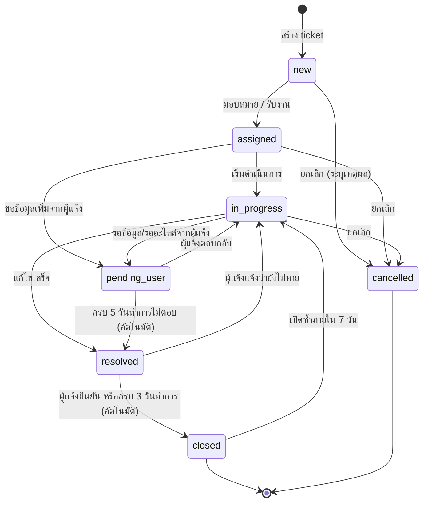

# Data Model — AIDC Helpdesk

| หัวข้อ | รายละเอียด |
|---|---|
| รหัสเอกสาร | DM-001 |
| เวอร์ชัน | 1.0 |
| ฐานข้อมูล | PostgreSQL 16 |
| เอกสารอ้างอิง | `01-srs.md`, `03-api-spec.md`, `04-rbac-sla.md` |

---

## 1. หลักการออกแบบ

| หลักการ | รายละเอียด |
|---|---|
| Primary key | `BIGSERIAL` (bigint auto increment) ทุกตาราง — อ่านง่าย ดีบักง่าย ดัชนีเล็กกว่า UUID |
| รหัสที่เปิดเผยภายนอก | `ticket.ticket_no` (มนุษย์อ่านได้), `attachment.storage_key` (UUID) เท่านั้น |
| เวลา | `TIMESTAMPTZ` เก็บเป็น UTC ทั้งหมด แปลงเป็น `Asia/Bangkok` ที่ชั้นแสดงผล |
| Multi-tenant | **Shared database + shared schema** โดยมีคอลัมน์ `company_id` ในตารางที่เป็นข้อมูลของบริษัท และบังคับ scoping ที่ชั้น query ของ backend เสมอ (ไม่ใช้ Postgres RLS ในเฟส 1 เพื่อลดความซับซ้อนในการดีบัก) |
| Soft delete | ใช้เฉพาะ `ticket`, `kb_article`, `user` (คอลัมน์ `deleted_at`) ตารางอื่นลบจริงหรือใช้ `is_active` |
| คอลัมน์มาตรฐาน | `created_at`, `updated_at` มีทุกตาราง; `created_by`, `updated_by` มีในตารางที่มีการแก้ไขโดยผู้ใช้ |
| Enum | ใช้ `VARCHAR` + `CHECK constraint` (ไม่ใช้ PostgreSQL ENUM type เพราะแก้ค่าภายหลังยาก) |
| Naming | ตาราง/คอลัมน์เป็น `snake_case` เอกพจน์ |

---

## 2. ER Diagram

```mermaid
erDiagram
    company ||--o{ department : "มี"
    company ||--o{ app_user : "สังกัด"
    company ||--o{ ticket : "เป็นเจ้าของ"
    company ||--o{ ticket_category : "กำหนดเฉพาะ"
    company ||--o{ sla_policy : "ใช้"
    company ||--o{ business_hours : "กำหนด"
    company ||--o{ holiday : "กำหนด"
    company ||--o{ kb_article : "จำกัดการเข้าถึง"

    department ||--o{ app_user : "สังกัด"
    department ||--o{ ticket : "แจ้งจาก"

    app_user ||--o{ user_role : "ได้รับ"
    role ||--o{ user_role : "ถูกมอบให้"
    role ||--o{ role_permission : "มี"
    permission ||--o{ role_permission : "อยู่ใน"
    user_role ||--o{ user_role_scope : "จำกัดขอบเขต"
    company ||--o{ user_role_scope : "เป็นขอบเขต"

    app_user ||--o{ ticket : "แจ้ง"
    app_user ||--o{ ticket_comment : "เขียน"
    app_user ||--o{ attachment : "อัปโหลด"
    app_user ||--o{ notification : "ได้รับ"
    app_user ||--o{ notification_channel : "ผูกช่องทาง"
    app_user ||--o{ audit_log : "กระทำ"
    app_user ||--o{ kb_article : "เขียน"

    ticket_category ||--o{ ticket_category : "หมวดย่อยของ"
    ticket_category ||--o{ ticket : "จัดประเภท"

    ticket ||--o{ ticket_comment : "มี"
    ticket ||--o{ ticket_status_history : "มีประวัติ"
    ticket ||--o{ attachment : "มีไฟล์แนบ"
    ticket ||--o{ notification : "ทำให้เกิด"
    ticket }o--o| kb_article : "แก้ด้วยบทความ"
    ticket_comment ||--o{ attachment : "มีไฟล์แนบ"

    sla_policy ||--o{ sla_target : "ประกอบด้วย"
    sla_policy ||--o{ ticket : "ผูกกับ"

    kb_category ||--o{ kb_article : "จัดหมวด"
    kb_category ||--o{ kb_category : "หมวดย่อยของ"

    company {
        bigint id PK
        varchar code UK "รหัสบริษัท เช่น AIDC-LOG"
        varchar name_th
        varchar name_en
        boolean is_active
        timestamptz created_at
    }
    department {
        bigint id PK
        bigint company_id FK
        varchar name
        boolean is_active
    }
    app_user {
        bigint id PK
        bigint company_id FK
        bigint department_id FK
        varchar username UK
        varchar email
        varchar password_hash
        varchar full_name
        varchar phone
        varchar line_user_id
        boolean is_active
        boolean must_change_password
        timestamptz deleted_at
    }
    role {
        bigint id PK
        varchar code UK "end_user agent company_admin super_admin manager_viewer"
        varchar name_th
        boolean is_system
    }
    permission {
        bigint id PK
        varchar code UK "เช่น ticket.assign"
        varchar group_name
    }
    role_permission {
        bigint role_id FK "PK ร่วม"
        bigint permission_id FK "PK ร่วม"
    }
    user_role {
        bigint id PK
        bigint user_id FK
        bigint role_id FK
        timestamptz granted_at
    }
    user_role_scope {
        bigint id PK
        bigint user_role_id FK
        bigint company_id FK
    }
    ticket_category {
        bigint id PK
        bigint company_id FK "null = ใช้ร่วมทั้งกลุ่ม"
        bigint parent_id FK
        varchar code
        varchar name_th
        bigint default_assignee_id FK
        varchar default_priority
        int sort_order
        boolean is_active
    }
    ticket {
        bigint id PK
        varchar ticket_no UK
        bigint company_id FK
        bigint department_id FK
        bigint category_id FK
        bigint requester_id FK
        bigint assignee_id FK
        varchar subject
        text description
        varchar status
        varchar priority
        varchar source
        bigint sla_policy_id FK
        timestamptz response_due_at
        timestamptz resolution_due_at
        timestamptz first_response_at
        timestamptz resolved_at
        timestamptz closed_at
        int pending_duration_minutes
        boolean is_response_breached
        boolean is_resolution_breached
        int reopen_count
        bigint resolved_by_kb_id FK
        timestamptz deleted_at
    }
    ticket_status_history {
        bigint id PK
        bigint ticket_id FK
        varchar from_status
        varchar to_status
        bigint from_assignee_id FK
        bigint to_assignee_id FK
        varchar reason
        bigint changed_by FK
        timestamptz changed_at
    }
    ticket_comment {
        bigint id PK
        bigint ticket_id FK
        bigint author_id FK
        text body
        boolean is_internal
        boolean is_system
        timestamptz created_at
    }
    attachment {
        bigint id PK
        bigint ticket_id FK
        bigint comment_id FK
        bigint kb_article_id FK
        varchar storage_key UK
        varchar file_name
        varchar mime_type
        bigint file_size
        bigint uploaded_by FK
    }
    sla_policy {
        bigint id PK
        bigint company_id FK "null = policy กลาง"
        varchar name
        boolean is_default
        boolean is_active
    }
    sla_target {
        bigint id PK
        bigint sla_policy_id FK
        varchar priority
        int response_minutes
        int resolution_minutes
        int escalation_percent
    }
    business_hours {
        bigint id PK
        bigint company_id FK "null = ใช้ร่วมทั้งกลุ่ม"
        int day_of_week
        time start_time
        time end_time
        boolean is_working_day
    }
    holiday {
        bigint id PK
        bigint company_id FK "null = ใช้ร่วมทั้งกลุ่ม"
        date holiday_date
        varchar name
    }
    kb_category {
        bigint id PK
        bigint parent_id FK
        varchar name_th
        int sort_order
    }
    kb_article {
        bigint id PK
        bigint kb_category_id FK
        bigint company_id FK "null = ทุกบริษัท"
        varchar title
        text body_markdown
        varchar visibility
        varchar status
        bigint author_id FK
        int view_count
        int helpful_count
        int not_helpful_count
        timestamptz published_at
        timestamptz deleted_at
    }
    notification {
        bigint id PK
        bigint user_id FK
        bigint ticket_id FK
        varchar event_type
        varchar channel
        varchar title
        text body
        varchar status
        int retry_count
        timestamptz read_at
        timestamptz sent_at
    }
    notification_channel {
        bigint id PK
        bigint user_id FK
        varchar channel
        varchar destination
        boolean is_enabled
        boolean is_verified
    }
    audit_log {
        bigint id PK
        bigint actor_id FK
        bigint company_id FK
        varchar action
        varchar entity_type
        bigint entity_id
        jsonb old_value
        jsonb new_value
        varchar ip_address
        timestamptz created_at
    }
```



> **หมายเหตุ:** ใช้ชื่อตาราง `app_user` แทน `user` เพราะ `user` เป็นคำสงวนของ PostgreSQL — ในเอกสาร API และ SRS เรียกว่า "user" ตามความหมายเชิงธุรกิจ

---

## 3. รายละเอียดตาราง

### 3.1 `company` — บริษัทในกลุ่ม

| field | type | null | default | คำอธิบาย |
|---|---|---|---|---|
| `id` | bigserial | N | auto | PK |
| `code` | varchar(20) | N | — | รหัสบริษัท ใช้ประกอบเลข ticket (UNIQUE) |
| `name_th` | varchar(150) | N | — | ชื่อภาษาไทย |
| `name_en` | varchar(150) | Y | null | ชื่อภาษาอังกฤษ |
| `logo_path` | varchar(255) | Y | null | โลโก้สำหรับหัวรายงาน |
| `contact_email` | varchar(150) | Y | null | อีเมลติดต่อของฝ่าย IT บริษัทนั้น |
| `is_active` | boolean | N | true | ปิดใช้งานบริษัทได้โดยไม่ลบข้อมูล |
| `created_at` / `updated_at` | timestamptz | N | now() | |

### 3.2 `department` — แผนก

| field | type | null | default | คำอธิบาย |
|---|---|---|---|---|
| `id` | bigserial | N | auto | PK |
| `company_id` | bigint | N | — | FK → company |
| `name` | varchar(150) | N | — | ชื่อแผนก |
| `is_active` | boolean | N | true | |
| `created_at` / `updated_at` | timestamptz | N | now() | |

UNIQUE (`company_id`, `name`)

### 3.3 `app_user` — ผู้ใช้

| field | type | null | default | คำอธิบาย |
|---|---|---|---|---|
| `id` | bigserial | N | auto | PK |
| `company_id` | bigint | N | — | บริษัทต้นสังกัด (บริษัทหลัก) |
| `department_id` | bigint | Y | null | FK → department |
| `username` | varchar(50) | N | — | UNIQUE ใช้ล็อกอิน |
| `email` | varchar(150) | Y | null | ใช้แจ้งเตือน |
| `password_hash` | varchar(255) | N | — | Argon2id |
| `full_name` | varchar(150) | N | — | ชื่อ-นามสกุล |
| `employee_code` | varchar(50) | Y | null | รหัสพนักงาน |
| `phone` | varchar(30) | Y | null | |
| `line_user_id` | varchar(100) | Y | null | ใช้ส่ง LINE (ได้จากการผูกบัญชี) |
| `job_title` | varchar(100) | Y | null | ตำแหน่ง |
| `is_active` | boolean | N | true | ปิดใช้งาน = ล็อกอินไม่ได้ |
| `must_change_password` | boolean | N | true | บังคับเปลี่ยนรหัสครั้งแรก |
| `failed_login_count` | int | N | 0 | นับรหัสผิด |
| `locked_until` | timestamptz | Y | null | เวลาที่ปลดล็อกบัญชี |
| `last_login_at` | timestamptz | Y | null | |
| `deleted_at` | timestamptz | Y | null | soft delete |
| `created_at` / `updated_at` | timestamptz | N | now() | |

INDEX: `idx_user_company` (`company_id`, `is_active`)

### 3.4 `role` / `permission` / `role_permission` / `user_role` / `user_role_scope`

**`role`**

| field | type | null | default | คำอธิบาย |
|---|---|---|---|---|
| `id` | bigserial | N | auto | PK |
| `code` | varchar(30) | N | — | UNIQUE: `end_user`, `agent`, `company_admin`, `super_admin`, `manager_viewer` |
| `name_th` | varchar(100) | N | — | ชื่อแสดงผล |
| `description` | varchar(255) | Y | null | |
| `is_system` | boolean | N | true | role ระบบ ลบไม่ได้ |

**`permission`**

| field | type | null | default | คำอธิบาย |
|---|---|---|---|---|
| `id` | bigserial | N | auto | PK |
| `code` | varchar(60) | N | — | UNIQUE เช่น `ticket.create`, `ticket.assign`, `report.export` |
| `group_name` | varchar(40) | N | — | กลุ่มสำหรับแสดงผล เช่น `ticket`, `admin` |
| `description` | varchar(255) | Y | null | |

**`role_permission`** — PK รวม (`role_id`, `permission_id`)

**`user_role`**

| field | type | null | default | คำอธิบาย |
|---|---|---|---|---|
| `id` | bigserial | N | auto | PK |
| `user_id` | bigint | N | — | FK → app_user |
| `role_id` | bigint | N | — | FK → role |
| `granted_by` | bigint | Y | null | ผู้มอบสิทธิ์ |
| `granted_at` | timestamptz | N | now() | |

UNIQUE (`user_id`, `role_id`)

**`user_role_scope`** — ขอบเขตบริษัทของ role นั้น (ใช้กับ `agent`, `company_admin`, `manager_viewer`)

| field | type | null | default | คำอธิบาย |
|---|---|---|---|---|
| `id` | bigserial | N | auto | PK |
| `user_role_id` | bigint | N | — | FK → user_role (ON DELETE CASCADE) |
| `company_id` | bigint | N | — | บริษัทที่ role นี้ครอบคลุม |

UNIQUE (`user_role_id`, `company_id`)
> ถ้าไม่มีแถวใน `user_role_scope` เลย → ขอบเขตเป็นบริษัทต้นสังกัดของผู้ใช้ (`app_user.company_id`)
> `super_admin` ไม่ต้องมี scope (เห็นทุกบริษัทเสมอ)

### 3.5 `ticket_category` — หมวดหมู่ปัญหา (2 ระดับ)

| field | type | null | default | คำอธิบาย |
|---|---|---|---|---|
| `id` | bigserial | N | auto | PK |
| `company_id` | bigint | Y | null | null = หมวดหมู่ใช้ร่วมทั้งกลุ่ม |
| `parent_id` | bigint | Y | null | null = หมวดหลัก |
| `code` | varchar(40) | N | — | รหัสอ้างอิง |
| `name_th` | varchar(150) | N | — | ชื่อหมวดหมู่ |
| `default_assignee_id` | bigint | Y | null | ผู้รับผิดชอบเริ่มต้น |
| `default_priority` | varchar(10) | N | `'medium'` | ความเร่งด่วนเริ่มต้น |
| `sort_order` | int | N | 0 | ลำดับแสดงผล |
| `is_active` | boolean | N | true | |

> จำกัดความลึกไว้ที่ 2 ระดับ (บังคับที่ชั้น application: หมวดที่มี `parent_id` ห้ามเป็น parent ของหมวดอื่น)

### 3.6 `ticket` — ตารางหลัก

| field | type | null | default | คำอธิบาย |
|---|---|---|---|---|
| `id` | bigserial | N | auto | PK |
| `ticket_no` | varchar(30) | N | — | UNIQUE เช่น `AIDC-LOG-202608-0042` |
| `company_id` | bigint | N | — | บริษัทเจ้าของเรื่อง (ใช้ scoping) |
| `department_id` | bigint | Y | null | แผนกที่แจ้ง |
| `category_id` | bigint | N | — | หมวดหมู่ (ระดับย่อยถ้ามี) |
| `requester_id` | bigint | N | — | ผู้ร้องขอ (เจ้าของปัญหา) |
| `created_by` | bigint | N | — | ผู้บันทึกเข้าระบบ (อาจเป็น agent แทนผู้ร้องขอ) |
| `assignee_id` | bigint | Y | null | ผู้รับผิดชอบปัจจุบัน |
| `subject` | varchar(255) | N | — | หัวข้อ |
| `description` | text | N | — | รายละเอียด |
| `status` | varchar(20) | N | `'new'` | ดูหัวข้อ 4 |
| `priority` | varchar(10) | N | `'medium'` | `critical` / `high` / `medium` / `low` |
| `source` | varchar(20) | N | `'web'` | `web` / `mobile_web` / `phone` / `email` / `line` |
| `sla_policy_id` | bigint | Y | null | policy ที่ใช้ตอนสร้าง (สแนปช็อต) |
| `response_due_at` | timestamptz | Y | null | กำหนดตอบรับ |
| `resolution_due_at` | timestamptz | Y | null | กำหนดแก้ไขเสร็จ |
| `first_response_at` | timestamptz | Y | null | เวลาตอบกลับสาธารณะครั้งแรก |
| `pending_started_at` | timestamptz | Y | null | เวลาที่เข้าสถานะ `pending_user` ครั้งล่าสุด |
| `pending_duration_minutes` | int | N | 0 | เวลาสะสมที่หยุดนับ SLA (นาทีทำการ) |
| `resolved_at` | timestamptz | Y | null | |
| `closed_at` | timestamptz | Y | null | |
| `closed_by` | bigint | Y | null | null + `closed_at` ไม่ null = ระบบปิดอัตโนมัติ |
| `is_response_breached` | boolean | N | false | เกิน SLA ตอบรับ |
| `is_resolution_breached` | boolean | N | false | เกิน SLA แก้ไข |
| `escalation_notified_at` | timestamptz | Y | null | กันการแจ้งเตือน 75% ซ้ำ |
| `reopen_count` | int | N | 0 | จำนวนครั้งที่เปิดซ้ำ |
| `resolution_note` | text | Y | null | สรุปวิธีแก้ |
| `resolved_by_kb_id` | bigint | Y | null | FK → kb_article ที่ใช้แก้ปัญหา |
| `satisfaction_score` | smallint | Y | null | 1–5 ผู้แจ้งให้คะแนนตอนปิด |
| `deleted_at` | timestamptz | Y | null | soft delete |
| `created_at` / `updated_at` | timestamptz | N | now() | |

**Index ที่ต้องมี**

| index | คอลัมน์ | เหตุผล |
|---|---|---|
| `idx_ticket_company_status` | (`company_id`, `status`, `created_at DESC`) | query หลักของทุกหน้ารายการ |
| `idx_ticket_assignee` | (`assignee_id`, `status`) | หน้างานของฉัน |
| `idx_ticket_requester` | (`requester_id`, `created_at DESC`) | หน้าเรื่องของฉัน |
| `idx_ticket_due` | (`resolution_due_at`) WHERE `status NOT IN ('resolved','closed','cancelled')` | งานสแกน SLA |
| `idx_ticket_search` | GIN บน `to_tsvector` ของ subject + trigram | ค้นหา |

### 3.7 `ticket_status_history`

| field | type | null | default | คำอธิบาย |
|---|---|---|---|---|
| `id` | bigserial | N | auto | PK |
| `ticket_id` | bigint | N | — | FK |
| `from_status` | varchar(20) | Y | null | null = ตอนสร้าง |
| `to_status` | varchar(20) | N | — | |
| `from_assignee_id` | bigint | Y | null | |
| `to_assignee_id` | bigint | Y | null | |
| `from_priority` | varchar(10) | Y | null | |
| `to_priority` | varchar(10) | Y | null | |
| `reason` | varchar(500) | Y | null | เหตุผล (บังคับกรณี cancel / reopen / เปลี่ยน priority) |
| `changed_by` | bigint | Y | null | null = ระบบ |
| `changed_at` | timestamptz | N | now() | |

### 3.8 `ticket_comment`

| field | type | null | default | คำอธิบาย |
|---|---|---|---|---|
| `id` | bigserial | N | auto | PK |
| `ticket_id` | bigint | N | — | FK |
| `author_id` | bigint | Y | null | null = คอมเมนต์ของระบบ |
| `body` | text | N | — | เนื้อหา (plain text + line break) |
| `is_internal` | boolean | N | false | true = เห็นเฉพาะ agent ขึ้นไป |
| `is_system` | boolean | N | false | ข้อความอัตโนมัติ เช่น "ระบบปิดอัตโนมัติ" |
| `created_at` / `updated_at` | timestamptz | N | now() | |

> แก้ไขคอมเมนต์ได้ภายใน 15 นาทีหลังสร้าง หลังจากนั้นล็อก (บังคับที่ชั้น application)

### 3.9 `attachment`

| field | type | null | default | คำอธิบาย |
|---|---|---|---|---|
| `id` | bigserial | N | auto | PK |
| `ticket_id` | bigint | Y | null | แนบกับ ticket |
| `comment_id` | bigint | Y | null | แนบกับคอมเมนต์ |
| `kb_article_id` | bigint | Y | null | แนบกับบทความ KB |
| `storage_key` | varchar(255) | N | — | UNIQUE — path สัมพัทธ์ `{company_id}/{yyyy}/{mm}/{uuid}.{ext}` |
| `file_name` | varchar(255) | N | — | ชื่อไฟล์ตามที่ผู้ใช้อัปโหลด |
| `mime_type` | varchar(100) | N | — | ตรวจจากเนื้อไฟล์จริง ไม่เชื่อ header |
| `file_size` | bigint | N | — | ไบต์ (≤ 20,971,520) |
| `uploaded_by` | bigint | N | — | FK → app_user |
| `created_at` | timestamptz | N | now() | |

CHECK: ต้องมี `ticket_id` หรือ `comment_id` หรือ `kb_article_id` อย่างน้อยหนึ่งค่า

### 3.10 `sla_policy` และ `sla_target`

**`sla_policy`**

| field | type | null | default | คำอธิบาย |
|---|---|---|---|---|
| `id` | bigserial | N | auto | PK |
| `company_id` | bigint | Y | null | null = policy กลาง ใช้เมื่อบริษัทไม่มี policy ของตน |
| `name` | varchar(100) | N | — | |
| `is_default` | boolean | N | false | policy เริ่มต้นของขอบเขตนั้น |
| `is_active` | boolean | N | true | |

**`sla_target`**

| field | type | null | default | คำอธิบาย |
|---|---|---|---|---|
| `id` | bigserial | N | auto | PK |
| `sla_policy_id` | bigint | N | — | FK |
| `priority` | varchar(10) | N | — | `critical`/`high`/`medium`/`low` |
| `response_minutes` | int | N | — | นาที**ทำการ**สำหรับตอบรับ |
| `resolution_minutes` | int | N | — | นาที**ทำการ**สำหรับแก้ไขเสร็จ |
| `escalation_percent` | int | N | 75 | แจ้งเตือนเมื่อใช้เวลาไปกี่ % |

UNIQUE (`sla_policy_id`, `priority`)

### 3.11 `business_hours` และ `holiday`

**`business_hours`**

| field | type | null | default | คำอธิบาย |
|---|---|---|---|---|
| `id` | bigserial | N | auto | PK |
| `company_id` | bigint | Y | null | null = ใช้ร่วมทั้งกลุ่ม |
| `day_of_week` | smallint | N | — | 0=อาทิตย์ … 6=เสาร์ |
| `start_time` | time | N | `'08:00'` | |
| `end_time` | time | N | `'17:00'` | |
| `is_working_day` | boolean | N | true | false = ไม่นับเวลาวันนั้น |

UNIQUE (`company_id`, `day_of_week`)

**`holiday`**

| field | type | null | default | คำอธิบาย |
|---|---|---|---|---|
| `id` | bigserial | N | auto | PK |
| `company_id` | bigint | Y | null | null = วันหยุดทั้งกลุ่ม |
| `holiday_date` | date | N | — | |
| `name` | varchar(150) | N | — | ชื่อวันหยุด |

UNIQUE (`company_id`, `holiday_date`)

### 3.12 `kb_category` และ `kb_article`

**`kb_category`**

| field | type | null | default | คำอธิบาย |
|---|---|---|---|---|
| `id` | bigserial | N | auto | PK |
| `parent_id` | bigint | Y | null | หมวดย่อย |
| `name_th` | varchar(150) | N | — | |
| `sort_order` | int | N | 0 | |
| `is_active` | boolean | N | true | |

**`kb_article`**

| field | type | null | default | คำอธิบาย |
|---|---|---|---|---|
| `id` | bigserial | N | auto | PK |
| `kb_category_id` | bigint | N | — | FK |
| `company_id` | bigint | Y | null | null = ทุกบริษัทเห็น |
| `title` | varchar(255) | N | — | |
| `summary` | varchar(500) | Y | null | ใช้แสดงในผลค้นหา |
| `body_markdown` | text | N | — | เนื้อหา Markdown |
| `visibility` | varchar(20) | N | `'public'` | `public` (ทุกคนในขอบเขต) / `company` / `agent_only` |
| `status` | varchar(20) | N | `'draft'` | `draft` / `published` / `archived` |
| `tags` | varchar(255) | Y | null | คั่นด้วยจุลภาค ใช้ช่วยค้นหา |
| `author_id` | bigint | N | — | ผู้เขียน |
| `view_count` | int | N | 0 | |
| `helpful_count` | int | N | 0 | |
| `not_helpful_count` | int | N | 0 | |
| `source_ticket_id` | bigint | Y | null | สร้างมาจาก ticket ใด |
| `published_at` | timestamptz | Y | null | |
| `deleted_at` | timestamptz | Y | null | |
| `created_at` / `updated_at` | timestamptz | N | now() | |

INDEX: GIN trigram บน `title` + `summary` (ค้นหาภาษาไทย)

### 3.13 `notification` และ `notification_channel`

**`notification`** — บันทึกการแจ้งเตือน 1 แถวต่อ 1 ช่องทาง

| field | type | null | default | คำอธิบาย |
|---|---|---|---|---|
| `id` | bigserial | N | auto | PK |
| `user_id` | bigint | N | — | ผู้รับ |
| `ticket_id` | bigint | Y | null | เรื่องที่เกี่ยวข้อง |
| `event_type` | varchar(40) | N | — | `ticket_created`, `ticket_assigned`, `comment_added`, `status_changed`, `sla_warning`, `sla_breached`, `ticket_resolved`, `ticket_closed` |
| `channel` | varchar(20) | N | — | `in_app` / `email` / `line` |
| `title` | varchar(255) | N | — | |
| `body` | text | N | — | |
| `status` | varchar(20) | N | `'pending'` | `pending` / `sent` / `failed` / `skipped` |
| `retry_count` | int | N | 0 | สูงสุด 3 |
| `error_message` | varchar(500) | Y | null | |
| `sent_at` | timestamptz | Y | null | |
| `read_at` | timestamptz | Y | null | ใช้กับ `in_app` |
| `created_at` | timestamptz | N | now() | |

INDEX: (`user_id`, `channel`, `read_at`) สำหรับนับที่ยังไม่อ่าน

**`notification_channel`** — การตั้งค่าช่องทางของผู้ใช้

| field | type | null | default | คำอธิบาย |
|---|---|---|---|---|
| `id` | bigserial | N | auto | PK |
| `user_id` | bigint | N | — | FK |
| `channel` | varchar(20) | N | — | `in_app` / `email` / `line` |
| `destination` | varchar(255) | Y | null | อีเมล หรือ LINE token/user id |
| `is_enabled` | boolean | N | true | |
| `is_verified` | boolean | N | false | LINE ต้องผูกสำเร็จก่อนจึงส่งได้ |

UNIQUE (`user_id`, `channel`)

### 3.14 `audit_log`

| field | type | null | default | คำอธิบาย |
|---|---|---|---|---|
| `id` | bigserial | N | auto | PK |
| `actor_id` | bigint | Y | null | null = ระบบ |
| `company_id` | bigint | Y | null | บริษัทของข้อมูลที่ถูกกระทำ |
| `action` | varchar(40) | N | — | `login`, `login_failed`, `create`, `update`, `delete`, `assign`, `status_change`, `permission_change`, `export`, `download` |
| `entity_type` | varchar(40) | N | — | `ticket`, `app_user`, `kb_article`, `sla_policy`, ... |
| `entity_id` | bigint | Y | null | |
| `old_value` | jsonb | Y | null | เฉพาะฟิลด์ที่เปลี่ยน (ห้ามเก็บ password/token) |
| `new_value` | jsonb | Y | null | |
| `ip_address` | varchar(45) | Y | null | รองรับ IPv6 |
| `user_agent` | varchar(255) | Y | null | |
| `created_at` | timestamptz | N | now() | |

INDEX: (`created_at DESC`), (`actor_id`, `created_at DESC`), (`entity_type`, `entity_id`)
เป็นตาราง **append-only** — ไม่มี UPDATE/DELETE จากชั้น application

---

## 4. State Machine ของ Ticket



### 4.1 ตารางการเปลี่ยนสถานะ

| จาก | ไป | ใครทำได้ | เงื่อนไข / ผลข้างเคียง |
|---|---|---|---|
| — | `new` | end_user, agent+ | สร้าง ticket, คำนวณ `response_due_at` / `resolution_due_at` |
| `new` | `assigned` | agent+ | ตั้ง `assignee_id`, แจ้งเตือนผู้รับผิดชอบ |
| `assigned` | `in_progress` | assignee, agent+ | — |
| `assigned`/`in_progress` | `pending_user` | assignee, agent+ | ต้องมีคอมเมนต์สาธารณะระบุสิ่งที่รอ, ตั้ง `pending_started_at`, **หยุดนับ SLA** |
| `pending_user` | `in_progress` | ระบบ (เมื่อผู้แจ้งคอมเมนต์) / agent+ | บวก `pending_duration_minutes`, เลื่อน `resolution_due_at` ออกไปเท่าเวลาที่หยุด |
| `pending_user` | `resolved` | ระบบ | ครบ 5 วันทำการไม่มีการตอบ + คอมเมนต์ระบบ |
| `in_progress` | `resolved` | assignee, agent+ | ต้องกรอก `resolution_note`, ตั้ง `resolved_at`, ตรวจ resolution breach |
| `resolved` | `closed` | requester / ระบบ (3 วันทำการ) / agent+ | ตั้ง `closed_at`, `closed_by` |
| `resolved` | `in_progress` | requester, agent+ | เคลียร์ `resolved_at`, คำนวณ due ใหม่จากเวลาที่กลับมา |
| `closed` | `in_progress` | requester, agent+ | ภายใน 7 วันหลัง `closed_at`, `reopen_count` +1 |
| `new`/`assigned`/`in_progress` | `cancelled` | requester (เฉพาะของตนและยังไม่ assign), agent+ | ต้องระบุเหตุผล, ยกเลิกการนับ SLA |

> ทุกการเปลี่ยนสถานะบันทึกลง `ticket_status_history` เสมอ — การเปลี่ยนที่ไม่อยู่ในตารางนี้ ระบบต้องตอบ `409 INVALID_STATE_TRANSITION`

---

## 5. กฎการมองเห็นข้อมูล (Row-Level Scoping)

> บังคับที่ชั้น repository ของ backend ผ่าน dependency ตัวเดียว (`get_scope(current_user)`) ที่ทุก query ต้องเรียกใช้ — ห้ามเขียน filter เองแยกราย endpoint

### 5.1 ตาราง `ticket`

| role | เงื่อนไข WHERE ที่ระบบเติมให้อัตโนมัติ |
|---|---|
| `end_user` | `requester_id = :me OR created_by = :me` |
| `agent` | `company_id IN (:scoped_company_ids)` |
| `company_admin` | `company_id IN (:scoped_company_ids)` |
| `manager_viewer` | `company_id IN (:scoped_company_ids)` (อ่านอย่างเดียว) |
| `super_admin` | ไม่มีเงื่อนไขเพิ่ม |

ทุก role: เติม `AND deleted_at IS NULL` ยกเว้น super_admin ที่เรียกดูรายการที่ถูกลบโดยเจตนา

### 5.2 ตารางอื่น

| ตาราง | end_user | agent / company_admin / manager_viewer | super_admin |
|---|---|---|---|
| `ticket_comment` | เฉพาะ ticket ที่เห็น **และ** `is_internal = false` | ทุกคอมเมนต์ของ ticket ที่เห็น | ทั้งหมด |
| `attachment` | เฉพาะที่ผูกกับ ticket/คอมเมนต์ที่เห็น | เฉพาะ ticket ในขอบเขต | ทั้งหมด |
| `ticket_status_history` | เฉพาะ ticket ที่เห็น | เฉพาะ ticket ในขอบเขต | ทั้งหมด |
| `app_user` | เห็นเฉพาะโปรไฟล์ตนเอง + ชื่อผู้รับผิดชอบใน ticket ของตน | ผู้ใช้ใน `scoped_company_ids` | ทั้งหมด |
| `department` / `ticket_category` | ของบริษัทตน + ที่ใช้ร่วมทั้งกลุ่ม | ของบริษัทในขอบเขต + ที่ใช้ร่วม | ทั้งหมด |
| `kb_article` | `status='published'` และ (`visibility='public'` หรือ (`visibility='company'` และ `company_id` = บริษัทตน)) | เพิ่ม `visibility='agent_only'` และเห็น `draft` ของตนเอง (company_admin เห็น draft ทั้งบริษัท) | ทั้งหมด |
| `notification` | `user_id = :me` | `user_id = :me` | `user_id = :me` |
| `audit_log` | ไม่มีสิทธิ์ | ไม่มีสิทธิ์ (company_admin เห็นเฉพาะ log ที่ `company_id` ของตน — ดู `04-rbac-sla.md`) | ทั้งหมด |
| `sla_policy` / `business_hours` / `holiday` | อ่านค่าที่ใช้กับตนได้ | อ่านของบริษัทในขอบเขต | อ่าน/เขียนทั้งหมด |

### 5.3 นิยาม `scoped_company_ids`

```
scoped_company_ids(user) =
    ถ้ามี role super_admin        → ทุก company.id
    มิฉะนั้น                      → UNION ของ user_role_scope.company_id ของทุก user_role ที่ผู้ใช้มี
                                    ถ้าว่าง → { user.company_id }
```

---

## 6. ข้อมูลตั้งต้น (Seed Data)

### 6.1 บริษัท

| id | code | name_th | name_en |
|---|---|---|---|
| 1 | `AIDC-HQ` | เอไอดีซี สำนักงานใหญ่ | AIDC HQ |
| 2 | `AIDC-CON` | เอไอดีซี คอนสตรัคชั่น | AIDC Construction |
| 3 | `COSI` | โคซี่ | COSI |
| 4 | `AIDC-HM` | เฮฟวี่ แมชชีน | Heavy Machine |
| 5 | `AIDC-TECH` | เอไอดีซี เทค | AIDC Tech |
| 6 | `AIDC-TRD` | เอไอดีซี เทรดดิ้ง | AIDC Trading |
| 7 | `AIDC-LOG` | เอไอดีซี โลจิสติกส์ | AIDC Logistic |

### 6.2 Role

| code | name_th | หมายเหตุ |
|---|---|---|
| `end_user` | ผู้แจ้ง | role เริ่มต้นของผู้ใช้ใหม่ทุกคน |
| `agent` | เจ้าหน้าที่ support | |
| `company_admin` | ผู้ดูแลระดับบริษัท | |
| `manager_viewer` | ผู้บริหาร (ดูอย่างเดียว) | |
| `super_admin` | ผู้ดูแลระบบ | สร้าง 1 บัญชีตอนติดตั้ง |

### 6.3 ระดับความเร่งด่วน (priority)

| ค่า | ชื่อไทย | สี | นิยามย่อ |
|---|---|---|---|
| `critical` | วิกฤต | แดง | ธุรกิจหยุดชะงัก / กระทบหลายคนหรือรายได้โดยตรง |
| `high` | สูง | ส้ม | ทำงานไม่ได้แต่มีทางเลี่ยงชั่วคราว / กระทบทั้งแผนก |
| `medium` | ปานกลาง | เหลือง | ทำงานได้แต่ติดขัด / กระทบรายบุคคล |
| `low` | ต่ำ | เขียว | คำขอทั่วไป ไม่เร่งด่วน |

> เกณฑ์จัดระดับพร้อมตัวอย่างรายบริษัท ดู `04-rbac-sla.md` หัวข้อ 6

### 6.4 หมวดหมู่ปัญหา — ใช้ร่วมทั้งกลุ่ม (`company_id = NULL`)

| หมวดหลัก | หมวดย่อย | default_priority |
|---|---|---|
| **ฮาร์ดแวร์** (`HW`) | คอมพิวเตอร์/โน้ตบุ๊กเสีย | high |
| | เครื่องพิมพ์/สแกนเนอร์ | medium |
| | อุปกรณ์ต่อพ่วง (เมาส์ คีย์บอร์ด จอ) | low |
| | โทรศัพท์/แท็บเล็ตของบริษัท | medium |
| **ซอฟต์แวร์** (`SW`) | ติดตั้ง/ถอนโปรแกรม | low |
| | Microsoft Office / อีเมล | medium |
| | โปรแกรมค้าง/ใช้งานไม่ได้ | high |
| | ไวรัส/มัลแวร์ | critical |
| **เครือข่าย** (`NET`) | อินเทอร์เน็ตใช้ไม่ได้ | high |
| | Wi-Fi สัญญาณอ่อน | medium |
| | VPN เชื่อมต่อไม่ได้ | high |
| | ระบบโทรศัพท์ภายใน | medium |
| **บัญชีผู้ใช้และสิทธิ์** (`ACC`) | ลืมรหัสผ่าน / บัญชีถูกล็อก | high |
| | ขอเปิดบัญชีผู้ใช้ใหม่ | medium |
| | ขอสิทธิ์เข้าถึงระบบ/โฟลเดอร์ | medium |
| **ระบบงานส่วนกลาง** (`SYS`) | ระบบ ERP | high |
| | ระบบบัญชี/การเงิน | high |
| | ระบบ HR / ลงเวลา | medium |
| | ระบบเอกสาร/ไฟล์เซิร์ฟเวอร์ | medium |
| **อื่น ๆ** (`OTH`) | สอบถามการใช้งาน | low |
| | คำขออื่น ๆ | low |

### 6.5 หมวดหมู่เฉพาะบริษัท

**AIDC Construction (`company_id = 2`) — งานก่อสร้าง**

| หมวดหลัก | หมวดย่อย | default_priority |
|---|---|---|
| ระบบหน้างาน (`CON`) | ระบบรายงานความคืบหน้าหน้างาน (site report) | high |
| | กล้อง CCTV หน้าไซต์งาน | medium |
| | เน็ต/สัญญาณที่ไซต์งาน (4G router) | high |
| | โปรแกรมเขียนแบบ (AutoCAD/Revit) | high |
| | เครื่องพิมพ์แบบ (plotter) | medium |
| | แท็บเล็ตตรวจงาน/เก็บรูปหน้างาน | medium |

**COSI (`company_id = 3`) — ที่ปรึกษา/ออกแบบ**

| หมวดหลัก | หมวดย่อย | default_priority |
|---|---|---|
| งานออกแบบ (`DSG`) | ซอฟต์แวร์ออกแบบ/License หมดอายุ | high |
| | เวิร์กสเตชันประสิทธิภาพตก / render ไม่ผ่าน | high |
| | พื้นที่จัดเก็บไฟล์โครงการเต็ม | medium |
| | ไฟล์โครงการเสียหาย / ขอกู้คืนจาก backup | critical |

**Heavy Machine (`company_id = 4`) — เครื่องจักรหนัก**

| หมวดหลัก | หมวดย่อย | default_priority |
|---|---|---|
| ระบบบริการ (`HMS`) | ระบบจัดการงานซ่อม/ใบสั่งงาน (job order) | critical |
| | ระบบสต็อกอะไหล่ | high |
| | เครื่องมือวินิจฉัยเครื่องจักร (diagnostic tool) | high |
| | แท็บเล็ตช่างบริการนอกสถานที่ | high |
| | ระบบติดตามพิกัดเครื่องจักร (GPS/telematics) | medium |

**AIDC Trading (`company_id = 6`) — เทรดดิ้ง**

| หมวดหลัก | หมวดย่อย | default_priority |
|---|---|---|
| ระบบการค้า (`TRD`) | ระบบใบเสนอราคา/ใบสั่งขาย | critical |
| | ระบบเชื่อมต่อคู่ค้า/ลูกค้า (EDI/API) | high |
| | ระบบออกใบกำกับภาษี e-Tax | critical |
| | ระบบสต็อกสินค้า | high |
| | อีเมลลูกค้าเข้าไม่ได้/ตีกลับ | high |

**AIDC Logistic (`company_id = 7`) — ขนส่ง/คลังสินค้า**

| หมวดหลัก | หมวดย่อย | default_priority |
|---|---|---|
| ระบบขนส่ง (`LOG`) | ระบบ TMS (จัดรถ/วางแผนเส้นทาง) | critical |
| | ระบบ WMS (คลังสินค้า) | critical |
| | เครื่องยิงบาร์โค้ด/เครื่องพิมพ์ฉลาก | high |
| | GPS ติดรถ / ระบบติดตามรถ | high |
| | แอปคนขับ / มือถือประจำรถ | high |
| | ระบบชั่งน้ำหนัก/ไม้กั้นทางเข้าคลัง | high |

> **AIDC HQ (1)** และ **AIDC Tech (5)** ใช้หมวดหมู่กลางเป็นหลัก — AIDC Tech เพิ่ม `ระบบภายในที่พัฒนาเอง` (default `high`) และ `เซิร์ฟเวอร์/ระบบหลังบ้าน` (default `critical`)

### 6.6 SLA Policy เริ่มต้น (policy กลาง `company_id = NULL`)

| priority | response_minutes | resolution_minutes | escalation_percent |
|---|---|---|---|
| `critical` | 30 | 240 | 75 |
| `high` | 60 | 480 | 75 |
| `medium` | 240 | 1440 | 75 |
| `low` | 480 | 2700 | 75 |

> ตัวเลขเป็น**นาทีทำการ** (1 วันทำการ = 540 นาที) — คำอธิบายและที่มา ดู `04-rbac-sla.md`

### 6.7 Business Hours เริ่มต้น (`company_id = NULL`)

| day_of_week | วัน | is_working_day | start_time | end_time |
|---|---|---|---|---|
| 0 | อาทิตย์ | false | — | — |
| 1 | จันทร์ | true | 08:00 | 17:00 |
| 2 | อังคาร | true | 08:00 | 17:00 |
| 3 | พุธ | true | 08:00 | 17:00 |
| 4 | พฤหัสบดี | true | 08:00 | 17:00 |
| 5 | ศุกร์ | true | 08:00 | 17:00 |
| 6 | เสาร์ | true | 08:00 | 17:00 |

### 6.8 หมวดหมู่ KB เริ่มต้น

| หมวด | ตัวอย่างบทความที่ควรมีตั้งแต่วันแรก |
|---|---|
| เริ่มต้นใช้งาน | วิธีแจ้งปัญหาผ่านมือถือ, ความหมายของแต่ละสถานะ |
| บัญชีและรหัสผ่าน | รีเซ็ตรหัสผ่านด้วยตนเอง, บัญชีถูกล็อกทำอย่างไร |
| เครื่องพิมพ์ | เพิ่มเครื่องพิมพ์, แก้ปัญหาพิมพ์ไม่ออก |
| เครือข่าย | เชื่อม Wi-Fi สำนักงาน, ตั้งค่า VPN |
| อีเมลและ Office | ตั้งค่าอีเมลบนมือถือ, กู้ไฟล์ที่เผลอปิด |
| ระบบงานเฉพาะบริษัท | (visibility = `company`) |

### 6.9 วันหยุด
นำเข้าวันหยุดนักขัตฤกษ์ไทยของปีปัจจุบันและปีถัดไปเป็น `company_id = NULL`
**[ต้องยืนยันกับ PM]** วันหยุดตามประเพณีที่แต่ละบริษัทกำหนดเอง (ถ้ามี) ให้เพิ่มเป็นรายบริษัท

---

## 7. หมายเหตุการนำไปพัฒนา

| ประเด็น | แนวทาง |
|---|---|
| การออกเลข `ticket_no` | ใช้ตาราง sequence ต่อ (`company_id`, `yyyymm`) พร้อม `SELECT ... FOR UPDATE` — ไม่ใช้ `COUNT(*)+1` (race condition) |
| การคำนวณ SLA | ทำเป็นฟังก์ชันเดียว `add_business_minutes(start, minutes, company_id)` ที่ backend พร้อม unit test ครอบเคสข้ามคืน/ข้ามวันหยุด/นอกเวลาทำการ |
| Timezone | คำนวณ business hours ในโซน `Asia/Bangkok` แล้วแปลงกลับ UTC ก่อนบันทึกเสมอ |
| ตารางที่โตเร็ว | `audit_log`, `notification` — ทำ partition รายปีเมื่อเกิน 5 ล้านแถว (ยังไม่ต้องทำในเฟส 1) |
| การลบบริษัท | ห้ามลบ ใช้ `is_active = false` เท่านั้น |
