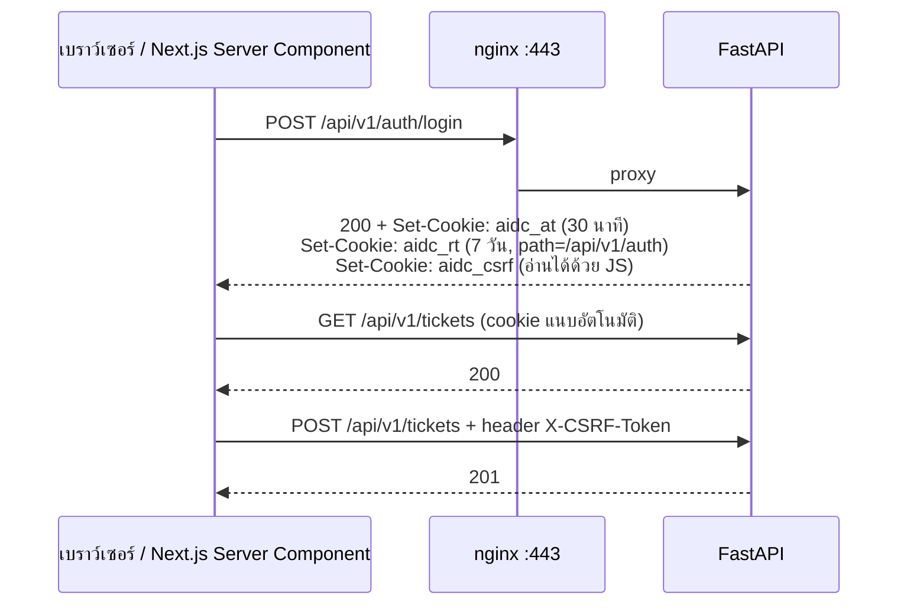

# API Specification — AIDC Helpdesk

| หัวข้อ | รายละเอียด |
|---|---|
| รหัสเอกสาร | API-001 |
| เวอร์ชัน | **2.0** |
| Base path | `/api/v1` |
| รูปแบบข้อมูล | `application/json; charset=utf-8` (ยกเว้นอัปโหลดไฟล์ใช้ `multipart/form-data`) |
| แหล่งความจริง | OpenAPI 3.1 ที่ FastAPI สร้างอัตโนมัติ (`/api/v1/openapi.json`) — เอกสารนี้คือข้อตกลงที่ต้องตรงกับ schema เสมอ |
| เอกสารอ้างอิง | `02-data-model.md` **v2.0**, `04-rbac-sla.md` v2.0, `07-adr-002-tech-stack.md` |
| จำนวน endpoint | **118** (จาก 84 ในเวอร์ชัน 1.0) |

---

## 0. สรุปการเปลี่ยนแปลงจากเวอร์ชัน 1.0

| # | สิ่งที่เปลี่ยน | ที่มา |
|---|---|---|
| 1 | **Auth เปลี่ยนจาก Bearer + `localStorage` → httpOnly cookie + CSRF token** | ADR-002 D-01 · ปิดช่อง FE-01 |
| 2 | `priority` เปลี่ยนค่าเป็น **`P1`/`P2`/`P3`/`P4`** และ**ผู้แจ้งส่ง `impact` + `urgency` แทน** | G-02, G-17 |
| 3 | `source` → **`channel`** (`portal`/`email`/`phone`/`walk_in`) + `source_device` | G-15 |
| 4 | เพิ่ม **`ticket_type`** และ `catalog_item_id` | G-14 |
| 5 | `POST /tickets/{id}/status` รับ **`pending_reason`** และบังคับตามเหตุผล | G-06 |
| 6 | เพิ่ม **`can: {}`** ในทุก ticket response — backend คำนวณสิทธิ์ระดับ ticket ให้ | **FE-02** |
| 7 | `GET /auth/me` เพิ่ม **`must_change_password`** | **FE-03** |
| 8 | `POST /tickets/{id}/status` รับ **`satisfaction_score`** และ **`resolved_by_kb_id`** | **FE-04, FE-05** |
| 9 | เพิ่ม **`POST /tickets/bulk`** | **FE-06** |
| 10 | list item เพิ่ม `department`, `reopen_count`, `is_resolution_breached`, `ticket_type`, `support_tier` | **FE-09** |
| 11 | `download_url` ของ export job เป็น **signed URL** เปิดตรงได้ | **FE-11** |
| 12 | เพิ่มกลุ่ม endpoint ใหม่ 6 กลุ่ม: **Approval · Checklist · Problem · Service · Catalog · Escalation** | SOP-03…10, SLA 5.2/6/7 |

---

## 1. หลักการทั่วไป

### 1.1 การยืนยันตัวตน — **cookie-based** (เปลี่ยนจากเวอร์ชัน 1.0)



| หัวข้อ | ข้อกำหนด |
|---|---|
| Access token | cookie `aidc_at` · `HttpOnly; Secure; SameSite=Strict; Path=/api/v1` · อายุ 30 นาที |
| Refresh token | cookie `aidc_rt` · `HttpOnly; Secure; SameSite=Strict; Path=/api/v1/auth` · อายุ 7 วัน · หมุนทุกครั้งที่ refresh และใส่ `jti` เดิมลง denylist |
| CSRF token | cookie `aidc_csrf` · **ไม่ใช่** HttpOnly (JS ต้องอ่านได้) · ทุก `POST`/`PUT`/`PATCH`/`DELETE` ต้องส่ง header **`X-CSRF-Token`** ให้ตรง มิฉะนั้น `403 CSRF_FAILED` |
| ทำไมต้องมี CSRF | `SameSite=Strict` กันได้เกือบหมด แต่ไม่ครอบคลุมทุกเบราว์เซอร์เก่า — double-submit cookie เป็นการป้องกันชั้นที่สอง |
| JWT payload | `sub`, `username`, `company_id`, `roles[]`, `scoped_company_ids[]`, `token_version`, `exp`, `jti`, `typ` |
| **เพิกถอนทั้งบัญชี** | `app_user.token_version` — ไม่ตรงกับใน token → `401 INVALID_TOKEN` ทันที (ใช้ตอนปิดบัญชี/เปลี่ยน role) |
| Server Component ของ Next.js | อ่าน cookie ที่รับมาแล้วส่งต่อใน header `Cookie` ไปยัง FastAPI ในเน็ตเวิร์กภายใน |
| เหตุผลที่ไม่ใช้ `Authorization: Bearer` แล้ว | token ที่ JavaScript อ่านได้ = XSS หนึ่งจุดเสีย token ทั้งก้อน (FE-01) |

> ทุก endpoint ยกเว้น `/auth/login`, `/auth/refresh`, `/health`, `/notifications/{channel}/callback` ต้องมี cookie ที่ยังไม่หมดอายุ

### 1.2 รูปแบบ Response สำเร็จ

คืน object ของทรัพยากรตรง ๆ · รายการแบ่งหน้าใช้รูปแบบเดียวทั้งระบบ

```json
{ "items": [ ... ], "page": 1, "page_size": 20, "total": 137, "total_pages": 7 }
```

### 1.3 รูปแบบ Error มาตรฐาน (คงเดิม)

```json
{
  "error": {
    "code": "VALIDATION_ERROR",
    "message": "ข้อมูลไม่ถูกต้อง",
    "details": [{ "field": "subject", "message": "กรุณาระบุหัวข้อ" }],
    "request_id": "01J9X2K7M4N8Q3"
  }
}
```

### 1.4 Pagination / Filter / Sorting (คงเดิม)

| พารามิเตอร์ | ค่าเริ่มต้น | หมายเหตุ |
|---|---|---|
| `page` / `page_size` | 1 / 20 | สูงสุด 100 |
| `sort` | `-created_at` | นำหน้าด้วย `-` = มากไปน้อย |
| `q` | — | คำค้นแบบข้อความอิสระ |

- ค่าหลายค่าใช้จุลภาค · ช่วงวันที่ใช้ `_from` / `_to` เป็น ISO 8601
- ค่าที่ไม่รู้จัก → `400 INVALID_PARAMETER`
- **ข้อยกเว้น:** `company_id` ที่อยู่นอกขอบเขตสิทธิ์ถูกตัดออกเงียบ ๆ (US-07 AC-2)

### 1.5 กติกาอื่น

| หัวข้อ | ข้อกำหนด |
|---|---|
| เวลา | ISO 8601 พร้อม timezone · ส่งเข้ารับได้ทั้ง UTC และ +07:00 |
| Idempotency | `POST /tickets` รับ header `Idempotency-Key` |
| Rate limit | header `X-RateLimit-Remaining` · เกินโควตา → `429` |
| Request ID | ทุก response มี `X-Request-Id` |
| Versioning | breaking change ต้องขึ้น `/api/v2` |
| Soft delete | `DELETE` = soft delete ตอบ `204` |

### 1.6 ค่า enum ที่ใช้ทั้งระบบ

| ฟิลด์ | ค่าที่อนุญาต |
|---|---|
| `ticket_type` | `incident` · `service_request` |
| `impact` | `org_wide` · `department` · `individual` |
| `urgency` | `high` · `medium` · `low` |
| `priority` | **`P1` · `P2` · `P3` · `P4`** (อ่านอย่างเดียวจากมุมผู้แจ้ง — ระบบคำนวณ) |
| `status` | `new` · `assigned` · `in_progress` · `pending_user` · `resolved` · `closed` · `cancelled` |
| `pending_reason` | `user` · `vendor` · `approval` |
| `channel` | `portal` · `email` · `phone` · `walk_in` |
| `source_device` | `web` · `mobile_web` |
| `sla_status` | `on_track` · `at_risk` · `breached` · `paused` |
| `support_tier` | `1` · `2` · `3` |
| `clock_mode` | `business_hours` · `calendar_24x7` |
| `sla_exclusion_code` | `planned_maintenance` · `force_majeure` · `vendor_delay` · `user_installed` · `waiting_requester` · `agreed_special_terms` |
| `service_tier` | `critical` · `high` · `standard` |
| `approval_status` | `pending` · `approved` · `rejected` · `cancelled` · `skipped` |

---

## 2. ตาราง Endpoint

> คอลัมน์ "สิทธิ์" อ้างอิงรหัส permission ใน `04-rbac-sla.md` · `own` = เฉพาะข้อมูลของตนเอง
> API ตรวจที่ระดับ **permission** ไม่ใช่ชื่อ role และตรวจ **ขอบเขตบริษัท** ซ้ำอีกชั้นเสมอ

### 2.1 Auth (6)

| Method | Path | สิทธิ์ | Request | Response | Status |
|---|---|---|---|---|---|
| POST | `/auth/login` | สาธารณะ | `username`, `password` | `user` + ตั้ง 3 cookie | 200 / 401 / 423 / 429 |
| POST | `/auth/refresh` | cookie `aidc_rt` | — | ตั้ง cookie ใหม่ | 200 / 401 |
| POST | `/auth/logout` | ล็อกอินแล้ว | — | ลบ cookie + denylist | 204 |
| GET | `/auth/me` | ล็อกอินแล้ว | — | โปรไฟล์ + `roles[]` + `permissions[]` + `scoped_companies[]` + **`must_change_password`** | 200 |
| POST | `/auth/change-password` | ล็อกอินแล้ว | `current_password`, `new_password` (≥ 12 ตัว) | — | 204 / 422 |
| GET | `/health` | สาธารณะ | — | `status`, `db`, `redis`, `disk`, `last_sla_scan_at`, `version` | 200 / 503 |

### 2.2 Users (9)

| Method | Path | สิทธิ์ | หมายเหตุ |
|---|---|---|---|
| GET | `/users` | `user.read` | filter: `company_id`, `role`, `is_active`, `is_locked`, `q` |
| POST | `/users` | `user.create` | |
| GET | `/users/{id}` | `user.read` หรือ own | |
| PATCH | `/users/{id}` | `user.update` หรือ own (บางฟิลด์) | |
| DELETE | `/users/{id}` | `user.delete` | `409` ถ้ามี ticket ค้าง (ต้องส่ง `reassign_to`) |
| POST | `/users/{id}/reset-password` | `user.reset_password` | คืน `temporary_password` |
| **POST** | **`/users/{id}/unlock`** | `user.reset_password` | **ปลดล็อกบัญชี — ทำได้เฉพาะทางนี้ ไม่ปลดเองตามเวลา** (นโยบาย 3.2) |
| PUT | `/users/{id}/roles` | `user.assign_role` | `roles[]` + `scoped_company_ids[]` + `expires_at?` |
| POST | `/users/import` | `user.create` | multipart `.xlsx`/`.csv` → `created`, `updated`, `errors[]` |

### 2.3 Companies / Departments (7) — คงเดิม

`GET /companies` · `POST /companies` · `GET /companies/{id}` · `PATCH /companies/{id}` · `GET /companies/{id}/departments` · `POST /departments` · `PATCH /departments/{id}`

### 2.4 Tickets (18)

| Method | Path | สิทธิ์ | หมายเหตุ |
|---|---|---|---|
| GET | `/tickets` | `ticket.read` (scoped) | filter: `status`, `priority`, `ticket_type`, `impact`, `urgency`, `company_id`, `department_id`, `category_id`, `service_id`, `assignee_id`, `requester_id`, `support_tier`, `sla_status`, `channel`, `has_exclusion`, `created_from/to`, `q`, `sort`, `page` |
| POST | `/tickets` | `ticket.create` | ดูตัวอย่าง 3.2 |
| GET | `/tickets/{id}` | `ticket.read` (scoped) | ticket เต็ม + `sla` + `can` + `approvals` + `checklists` |
| PATCH | `/tickets/{id}` | `ticket.update` | `subject`, `description`, `category_id`, `department_id`, `service_id`, `asset_tag` |
| POST | `/tickets/{id}/status` | `ticket.change_status` / `ticket.close_own` / `ticket.reopen` / `ticket.cancel` | ดูตัวอย่าง 3.4 |
| POST | `/tickets/{id}/assign` | `ticket.assign` | `assignee_id` (null = ยกเลิกมอบหมาย) |
| POST | `/tickets/{id}/claim` | `ticket.assign_self` | `409 ALREADY_ASSIGNED` |
| POST | `/tickets/{id}/priority` | `ticket.change_priority` | `impact`, `urgency` **หรือ** `priority` โดยตรง + `reason` (บังคับ) → คืน due ใหม่ที่คำนวณจาก `priority_changed_at` |
| **POST** | **`/tickets/{id}/priority-review`** | `ticket.request_priority_review` | ผู้แจ้งขอทบทวนระดับ + `reason` (บังคับ) — **ไม่เปลี่ยน priority ทันที** (ES-08) |
| **POST** | **`/tickets/{id}/workaround`** | `ticket.set_workaround` | `note` (บังคับ), `problem_id?` — **หยุดนับ resolution** และบังคับผูก `problem` |
| **POST** | **`/tickets/{id}/tier`** | `ticket.change_status` | `support_tier` (2/3), `summary` (บังคับ — สรุปสิ่งที่ตรวจแล้ว ตาม SOP-01 ข้อ 5), `vendor_ref?` (บังคับเมื่อ tier 3) |
| **POST** | **`/tickets/{id}/major-incident`** | `ticket.declare_major_incident` | `incident_commander_id?` → ตั้ง `is_major_incident` + ES-01 |
| **POST** | **`/tickets/{id}/security-incident`** | `ticket.declare_major_incident` | `personal_data_affected` → ES-03 + นาฬิกา 72 ชม. + จำกัดการมองเห็น |
| **POST** | **`/tickets/{id}/sla-exclusion`** | `sla.manage` | `code`, `note` (บังคับ) — ตัดออกจาก KPI |
| GET | `/tickets/{id}/history` | `ticket.read` (scoped) | |
| DELETE | `/tickets/{id}` | `ticket.delete` | soft delete |
| **POST** | **`/tickets/bulk`** | ตาม action | `ticket_ids[]` (≤ 20), `action` (`claim`/`assign`/`change_status`/`change_priority`), payload → คืนผล**รายใบ** (FE-06) |
| GET | `/tickets/export` | `report.export` | filter เหมือน list + `format=xlsx\|pdf` → ไฟล์ หรือ `202 {job_id}` |

**ค่า `sla_status`:** `on_track` (เหลือ > 20%) · `at_risk` (เหลือ ≤ 20%) · `breached` · `paused` (`pending_user` ทุก reason)

### 2.5 Comments (3) · Attachments (3) — คงเดิม

| Method | Path | หมายเหตุ |
|---|---|---|
| GET | `/tickets/{id}/comments` | กรอง `is_internal` ตาม permission อัตโนมัติ |
| POST | `/tickets/{id}/comments` | `body`, `is_internal`, `attachment_ids[]` · `403` ถ้า end_user ส่ง `is_internal=true` |
| PATCH | `/comments/{id}` | ผู้เขียนเอง ภายใน 15 นาที · `409 EDIT_WINDOW_EXPIRED` |
| POST | `/attachments` | multipart · ≤ 20 MB/ไฟล์ · ≤ 5 ไฟล์/คำขอ · ตรวจ MIME จากเนื้อไฟล์จริง |
| GET | `/attachments/{id}/download` | `302` → signed URL อายุ 15 นาที · `403` ถ้า `scan_status='infected'` |
| DELETE | `/attachments/{id}` | ผู้อัปโหลด หรือ `ticket.update` |

### 2.6 Categories (5) — คงเดิม แต่เปลี่ยนฟิลด์

`POST`/`PATCH /categories` รับ **`default_impact`** + **`default_urgency`** แทน `default_priority`
`GET /categories?tree=true` คืน `{ "items": [ { ...category, "children": [...] } ] }` (ปิดประเด็น FE-08)

### 2.7 Approval (4) 🆕

| Method | Path | สิทธิ์ | หมายเหตุ |
|---|---|---|---|
| GET | `/tickets/{id}/approvals` | `approval.read` หรือเจ้าของ ticket | ลำดับขั้นทั้งหมด + สถานะ |
| GET | `/approvals/pending` | ล็อกอินแล้ว | **คำขอที่รอฉันอนุมัติ** ข้ามบริษัท (ผู้อนุมัติอาจอยู่คนละบริษัทกับ ticket) |
| POST | `/approvals/{id}/decide` | `approval.decide` (เฉพาะ approver ของแถวนั้น) | `decision` (`approved`/`rejected`), `comment` (**บังคับเมื่อ rejected**), `attachment_id?`, `access_expires_at?` |
| POST | `/tickets/{id}/approvals/reassign` | `company_admin` ขึ้นไป | ใช้เมื่อ `approver_id` เป็น null หรือผู้อนุมัติไม่อยู่ |

**กฎ:** ขั้น `n+1` เปิดใช้เมื่อขั้น `n` เป็น `approved` · ปฏิเสธขั้นใด → ticket ไป `cancelled` · **ห้ามอนุมัติคำขอของตนเอง** (`422`)

### 2.8 Checklist (3) 🆕

| Method | Path | สิทธิ์ | หมายเหตุ |
|---|---|---|---|
| GET | `/tickets/{id}/checklists` | `ticket.read` (agent ขึ้นไป) | รายการพร้อมสถานะแต่ละข้อ |
| PATCH | `/checklist-items/{id}` | `ticket.update` (scoped) | `is_done`, `note`, `attachment_id` · **`422` ถ้า `evidence_required` แต่ไม่มี `attachment_id`** |
| GET | `/admin/checklist-templates` | `category.manage` | template + item ทั้งหมด |

### 2.9 SLA / Business hours / Holiday / Escalation (16)

| Method | Path | สิทธิ์ | หมายเหตุ |
|---|---|---|---|
| GET | `/sla/policies` | `sla.read` | + `doc_ref`, `doc_version`, `effective_from/to` |
| POST | `/sla/policies` | `sla.manage` | **สร้างแถวใหม่เสมอเมื่อเอกสารขึ้นเวอร์ชัน** ห้ามแก้แถวเดิม |
| GET | `/sla/policies/{id}` | `sla.read` | + targets |
| PATCH | `/sla/policies/{id}` | `sla.manage` | `name`, `is_default`, `is_active`, `effective_to` |
| PUT | `/sla/policies/{id}/targets` | `sla.manage` | `targets[]` ครบ 4 priority + `clock_mode` + `status_report_interval_minutes` |
| GET / PUT | `/business-hours` | `sla.read` / `business_hours.manage` | 7 แถว ต่อบริษัท |
| GET / POST / DELETE | `/holidays` | `sla.read` / `business_hours.manage` | filter `company_id`, `year` |
| **POST** | **`/holidays/import`** | `business_hours.manage` | นำเข้าปฏิทินทั้งปีจาก `.csv` |
| **GET / PUT** | **`/sla/escalation-rules`** | `sla.read` / `escalation.manage` | ES-01…ES-12 |
| **GET / PUT / DELETE** | **`/escalation-contacts`** | `escalation.manage` | ผูก `contact_key` กับบัญชีจริง |

### 2.10 Service / Outage / Maintenance (10) 🆕

| Method | Path | สิทธิ์ | หมายเหตุ |
|---|---|---|---|
| GET / POST | `/services` | `sla.read` / `service.manage` | ทะเบียนระบบงาน + `service_tier` + `owner_user_id` |
| GET / PATCH / DELETE | `/services/{id}` | `service.manage` | |
| GET / POST | `/service-outages` | `service.manage` | บันทึกเหตุขัดข้องด้วยมือ (เฟส 1) |
| PATCH | `/service-outages/{id}` | `service.manage` | ปิดเหตุ (`ended_at`) |
| GET / POST | `/maintenance-windows` | `service.manage` | **`422` ถ้าแจ้งล่วงหน้า < 3 วันทำการ** |
| GET | `/service-tier-targets` | `sla.read` | 3 แถว |

### 2.11 Problem (5) 🆕

| Method | Path | สิทธิ์ | หมายเหตุ |
|---|---|---|---|
| GET | `/problems` | `problem.manage` | filter `status`, `service_id`, `rca_overdue=true` |
| POST | `/problems` | `problem.manage` | ตั้ง `rca_due_at` = +5 วันทำการ อัตโนมัติเมื่อมาจากเหตุ P1 |
| GET / PATCH | `/problems/{id}` | `problem.manage` | `root_cause_code`, `root_cause_note`, `rca_submitted_at` |
| POST | `/problems/{id}/link-ticket` | `problem.manage` | ผูก/ถอด ticket |

### 2.12 Service Catalog + Approved Software (6) 🆕

| Method | Path | สิทธิ์ | หมายเหตุ |
|---|---|---|---|
| GET | `/catalog-items` | ล็อกอินแล้ว | รายการคำขอบริการที่เปิดให้ขอ + เป้าหมายเวลา |
| POST / PATCH / DELETE | `/catalog-items` | `category.manage` | |
| GET | `/approved-software` | ล็อกอินแล้ว | `q` — ใช้เช็กในฟอร์มคำขอติดตั้ง |
| PUT | `/approved-software` | `system.manage` | นำเข้าทั้งบัญชี |

### 2.13 Knowledge Base (10) — คงเดิม

`GET/POST /kb/articles` · `GET/PATCH/DELETE /kb/articles/{id}` · `POST /kb/articles/{id}/publish` · `/archive` · `/feedback` · `GET/POST /kb/categories`

`POST /kb/articles/{id}/feedback` รับ `is_helpful`, `note?` → `409` เมื่อโหวตซ้ำ (มีตาราง `kb_feedback` แล้ว)

### 2.14 Dashboard / Reports (11)

| Method | Path | สิทธิ์ | หมายเหตุ |
|---|---|---|---|
| GET | `/dashboard/summary` | `dashboard.view` | การ์ดสรุป + สัดส่วนตามสถานะ/priority/ประเภท |
| GET | `/dashboard/by-company` · `/by-category` · `/by-assignee` · `/trend` | `dashboard.view` | |
| GET | `/reports/sla-compliance` | `report.view` | KPI-1 แยกบริษัท × priority |
| **GET** | **`/reports/kpi`** | `report.view` | **KPI-1…KPI-7 ครบชุดเทียบเป้าหมาย** (SLA 7.1) |
| **GET** | **`/reports/aged-backlog`** | `report.view` | **รายสัปดาห์** — ticket ที่ยังเปิดและเกินกำหนด |
| **GET** | **`/reports/uptime`** | `report.view` | KPI-6 คำนวณจาก `service_outage` + `maintenance_window` |
| **GET** | **`/reports/rca-status`** | `report.view` | Problem ที่ RCA ค้างเกิน 5 วันทำการ |
| GET | `/reports/{report_name}/export` | `report.export` | `format=xlsx\|pdf` → ไฟล์ หรือ `202 {job_id}` |

### 2.15 Notifications (8) — คงเดิม แต่ขยายช่องทาง

`GET /notifications` · `/unread-count` · `POST /{id}/read` · `/read-all` · `GET/PUT /notifications/channels`
**`POST /notifications/channels/{channel}/bind-url`** และ **`/callback`** — เปลี่ยนจากชื่อที่ผูกกับ LINE เป็นแบบทั่วไป (P-04)

`channel` ที่รองรับ: `in_app` · `email` · `teams` · `line` · `webpush`

### 2.16 Admin / System (6) — คงเดิม

`GET /admin/audit-logs` · `/roles` · `PUT /roles/{id}/permissions` · `GET /admin/permissions` · `/jobs/{job_id}` · `/system-info`

### 2.17 สรุปจำนวน endpoint

| กลุ่ม | v1.0 | **v2.0** |
|---|---|---|
| Auth | 6 | 6 |
| Users | 8 | **9** |
| Companies / Departments | 7 | 7 |
| Tickets | 11 | **18** |
| Comments / Attachments | 6 | 6 |
| Categories | 5 | 5 |
| **Approval** | — | **4** |
| **Checklist** | — | **3** |
| SLA / BH / Holiday / Escalation | 10 | **16** |
| **Service / Outage / Maintenance** | — | **10** |
| **Problem** | — | **5** |
| **Catalog / Approved software** | — | **6** |
| Knowledge Base | 10 | 10 |
| Dashboard / Reports | 7 | **11** |
| Notifications | 8 | 8 |
| Admin / System | 6 | 6 |
| **รวม** | **84** | **118** |

---

## 3. ตัวอย่าง JSON ของ Endpoint สำคัญ

### 3.1 เข้าสู่ระบบ — `POST /api/v1/auth/login`

**Request**
```json
{ "username": "somchai.k", "password": "Str0ng-P@ssw0rd!" }
```

**Response 200** — token อยู่ใน cookie ไม่อยู่ใน body

```http
HTTP/1.1 200 OK
Set-Cookie: aidc_at=eyJ...; HttpOnly; Secure; SameSite=Strict; Path=/api/v1; Max-Age=1800
Set-Cookie: aidc_rt=eyJ...; HttpOnly; Secure; SameSite=Strict; Path=/api/v1/auth; Max-Age=604800
Set-Cookie: aidc_csrf=8f3a...; Secure; SameSite=Strict; Path=/; Max-Age=604800
```
```json
{
  "must_change_password": false,
  "user": {
    "id": 145,
    "username": "somchai.k",
    "full_name": "สมชาย กิตติวัฒน์",
    "company": { "id": 7, "code": "AIDC-LOG", "name_th": "เอไอดีซี โลจิสติกส์" },
    "department": { "id": 22, "name": "คลังสินค้า" },
    "roles": ["agent"],
    "scoped_companies": [{ "id": 7, "code": "AIDC-LOG" }, { "id": 2, "code": "AIDC-CON" }],
    "permissions": ["ticket.read", "ticket.create", "ticket.assign", "ticket.comment",
                    "ticket.change_status", "ticket.set_workaround", "kb.create"]
  }
}
```

**Response 423** (บัญชีถูกล็อก — **ปลดเองตามเวลาไม่ได้**)
```json
{
  "error": {
    "code": "ACCOUNT_LOCKED",
    "message": "บัญชีถูกล็อกจากการกรอกรหัสผ่านผิดเกินกำหนด กรุณาติดต่อ Service Desk เพื่อยืนยันตัวตนและปลดล็อก",
    "request_id": "01J9X2K7M4N8Q4"
  }
}
```

### 3.2 สร้าง Ticket — `POST /api/v1/tickets`

**Request** — ผู้แจ้งส่ง `impact` + `urgency` **ไม่ส่ง `priority`**

```json
{
  "ticket_type": "incident",
  "subject": "เครื่องยิงบาร์โค้ดคลัง 2 อ่านไม่ติด",
  "description": "เครื่องยิงบาร์โค้ด 3 ตัวที่โซนรับสินค้าคลัง 2 อ่านไม่ติดตั้งแต่เช้า มีรถรอคิวอยู่ 4 คัน",
  "category_id": 78,
  "impact": "department",
  "urgency": "high",
  "company_id": 7,
  "department_id": 22,
  "service_id": 14,
  "requester_id": 145,
  "channel": "portal",
  "source_device": "mobile_web",
  "asset_tag": "SCN-LOG-0031",
  "attachment_ids": [9012, 9013]
}
```

| ฟิลด์ | บังคับ | หมายเหตุ |
|---|---|---|
| `subject`, `description`, `category_id`, `impact`, `urgency` | ✔ | 5 ฟิลด์บังคับ (NFR-33 ยังนับเป็น "4 ช่องที่ผู้ใช้ต้องคิด" เพราะ impact/urgency เป็นคำถาม 2 ข้อที่มีคำตอบให้เลือก) |
| `ticket_type` | — | ค่าเริ่มต้น `incident` · Tier 1 ปรับได้ |
| `catalog_item_id` | ✔ เมื่อ `ticket_type='service_request'` | |
| `priority` | ✘ | **ส่งมาไม่ได้** — ระบบคำนวณจาก `impact × urgency` (`422` ถ้าส่งมา) |
| `company_id` / `requester_id` | — | ค่าเริ่มต้น = ของผู้เรียก · ระบุคนอื่นได้เฉพาะ `ticket.create_for_other` |

**Response 201**
```json
{
  "id": 1042,
  "ticket_no": "AIDC-LOG-202608-0042",
  "ticket_type": "incident",
  "subject": "เครื่องยิงบาร์โค้ดคลัง 2 อ่านไม่ติด",
  "status": "new",
  "impact": "department",
  "urgency": "high",
  "priority": "P2",
  "priority_source": "matrix",
  "channel": "portal",
  "source_device": "mobile_web",
  "support_tier": 1,
  "company": { "id": 7, "code": "AIDC-LOG", "name_th": "เอไอดีซี โลจิสติกส์" },
  "department": { "id": 22, "name": "คลังสินค้า" },
  "category": { "id": 78, "code": "LOG", "name_th": "เครื่องยิงบาร์โค้ด/เครื่องพิมพ์ฉลาก", "parent_name_th": "ระบบขนส่ง" },
  "service": { "id": 14, "code": "WMS", "name_th": "ระบบคลังสินค้า", "service_tier": "critical" },
  "requester": { "id": 145, "full_name": "สมชาย กิตติวัฒน์" },
  "assignee": null,
  "sla": {
    "policy_id": 2,
    "doc_ref": "AIDC-IT-SLA-001",
    "doc_version": "1.1",
    "clock_mode": "business_hours",
    "clock_started_at": "2026-08-31T09:15:00+07:00",
    "response_due_at": "2026-08-31T09:45:00+07:00",
    "resolution_due_at": "2026-08-31T17:15:00+07:00",
    "first_response_at": null,
    "status": "on_track",
    "remaining_minutes": 480,
    "remaining_unit": "business_minutes",
    "next_status_report_due_at": "2026-08-31T13:15:00+07:00",
    "is_response_breached": false,
    "is_resolution_breached": false,
    "paused_at": null,
    "pending_reason": null,
    "pending_duration_minutes": 0,
    "workaround_at": null,
    "exclusion_code": null
  },
  "approvals": [],
  "checklists": [],
  "can": {
    "update": true, "assign": false, "claim": false, "change_status": false,
    "change_priority": false, "request_priority_review": true,
    "comment": true, "comment_internal": false, "attach": true,
    "close": false, "reopen": false, "cancel": true,
    "set_workaround": false, "change_tier": false, "delete": false
  },
  "attachments": [
    { "id": 9012, "file_name": "scanner-error.jpg", "file_size": 1843200, "mime_type": "image/jpeg", "scan_status": "skipped" }
  ],
  "reopen_count": 0,
  "created_at": "2026-08-31T09:15:00+07:00",
  "updated_at": "2026-08-31T09:15:00+07:00"
}
```

> **บล็อก `can`** คือสิ่งที่ FE ขอมา (FE-02) — backend คำนวณเงื่อนไข **O** (เฉพาะของตน) และ **S** (เฉพาะบริษัทตน) ในเมทริกซ์ RBAC ให้แล้ว frontend จึงไม่ต้องเขียนกฎซ้ำและปุ่มจะไม่โผล่ผิด

### 3.3 รายการ Ticket — `GET /api/v1/tickets`

```
GET /api/v1/tickets?status=new,assigned,in_progress&priority=P1,P2&company_id=7
    &sla_status=at_risk,breached&ticket_type=incident&created_from=2026-08-01
    &sort=-priority,resolution_due_at&page=1&page_size=20
```

```json
{
  "items": [
    {
      "id": 1042,
      "ticket_no": "AIDC-LOG-202608-0042",
      "ticket_type": "incident",
      "subject": "เครื่องยิงบาร์โค้ดคลัง 2 อ่านไม่ติด",
      "status": "in_progress",
      "pending_reason": null,
      "priority": "P2",
      "support_tier": 1,
      "company": { "id": 7, "code": "AIDC-LOG" },
      "department": { "id": 22, "name": "คลังสินค้า" },
      "category": { "id": 78, "name_th": "เครื่องยิงบาร์โค้ด/เครื่องพิมพ์ฉลาก" },
      "requester": { "id": 145, "full_name": "สมชาย กิตติวัฒน์" },
      "assignee": { "id": 88, "full_name": "ปิยะ ศรีสุข" },
      "sla": {
        "resolution_due_at": "2026-08-31T17:15:00+07:00",
        "status": "at_risk",
        "remaining_minutes": 42,
        "remaining_unit": "business_minutes",
        "is_resolution_breached": false
      },
      "reopen_count": 0,
      "comment_count": 3,
      "attachment_count": 2,
      "created_at": "2026-08-31T09:15:00+07:00",
      "updated_at": "2026-08-31T11:02:00+07:00"
    }
  ],
  "page": 1, "page_size": 20, "total": 7, "total_pages": 1
}
```

> `department`, `reopen_count`, `is_resolution_breached`, `ticket_type`, `support_tier` เพิ่มตาม **FE-09**
> `remaining_unit` บอกชัดว่าเป็น **นาทีทำการ** — frontend จึงไม่ทำ countdown (FE-07)

### 3.4 เปลี่ยนสถานะ — `POST /api/v1/tickets/1042/status`

**เข้าสู่ `pending_user`**
```json
{
  "to_status": "pending_user",
  "pending_reason": "vendor",
  "reason": "รออะไหล่หัวอ่านจากผู้จำหน่าย กำหนดส่ง 3 ก.ย.",
  "comment": "แจ้งให้ทราบว่าสั่งอะไหล่แล้วครับ คาดว่าได้รับวันที่ 3 ก.ย. จะรีบเข้าเปลี่ยนให้ทันที",
  "vendor_ref": "PO-2026-0891"
}
```

| ฟิลด์ | บังคับเมื่อ |
|---|---|
| `to_status` | เสมอ |
| `pending_reason` | `to_status = pending_user` |
| `comment` | `pending_reason` เป็น `user` หรือ `vendor` — **`vendor` ต้องมีคอมเมนต์สาธารณะแจ้งผู้รับบริการก่อนจึงหยุดนับเวลาได้** (SLA 5.4) |
| `reason` | `cancelled`, `pending_user`, reopen |
| `resolution_note` | `resolved` |
| `satisfaction_score` (1–5) | — · รับได้เมื่อ `to_status = closed` โดยผู้แจ้ง (**FE-04**) |
| `resolved_by_kb_id` | — · รับได้เมื่อ `to_status = resolved` (**FE-05**) |

**Response 200**
```json
{
  "id": 1042,
  "status": "pending_user",
  "pending_reason": "vendor",
  "sla": {
    "status": "paused",
    "paused_at": "2026-08-31T11:30:00+07:00",
    "pending_notified_at": "2026-08-31T11:30:00+07:00",
    "pending_duration_minutes": 0,
    "resolution_due_at": "2026-08-31T17:15:00+07:00"
  },
  "updated_at": "2026-08-31T11:30:00+07:00"
}
```

**Response 409** — checklist ยังไม่ครบ
```json
{
  "error": {
    "code": "CHECKLIST_INCOMPLETE",
    "message": "ยังปิดงานไม่ได้ — มีรายการที่ต้องทำให้ครบก่อน 2 ข้อ",
    "details": [
      { "field": "checklist_item.3", "message": "ลงทะเบียนทรัพย์สินและจัดทำใบส่งมอบอุปกรณ์ (ต้องแนบหลักฐาน)" },
      { "field": "checklist_item.5", "message": "แนะนำนโยบายไอทีและช่องทางติดต่อ Service Desk พร้อมลงนามรับทราบ (ต้องแนบหลักฐาน)" }
    ],
    "request_id": "01J9X2K7M4N8Q9"
  }
}
```

### 3.5 เปลี่ยนความสำคัญ — `POST /api/v1/tickets/1042/priority`

```json
{ "impact": "org_wide", "urgency": "high", "reason": "กระทบทั้งคลัง รับสินค้าไม่ได้เลยตั้งแต่ 11:00" }
```

**Response 200** — **due คำนวณใหม่จากเวลาที่ปรับ ไม่ใช่จาก `created_at`** (SLA 5.4)

```json
{
  "id": 1042,
  "priority": "P1",
  "priority_changed_at": "2026-08-31T11:40:00+07:00",
  "is_major_incident": true,
  "sla": {
    "clock_mode": "calendar_24x7",
    "response_due_at": "2026-08-31T11:55:00+07:00",
    "resolution_due_at": "2026-08-31T15:40:00+07:00",
    "next_status_report_due_at": "2026-08-31T12:40:00+07:00",
    "status": "on_track",
    "remaining_minutes": 240,
    "remaining_unit": "calendar_minutes"
  },
  "notifications_sent": ["head_of_it", "incident_manager", "tier2_group", "on_call"]
}
```

### 3.6 คำขอที่รอฉันอนุมัติ — `GET /api/v1/approvals/pending`

```json
{
  "items": [
    {
      "id": 331,
      "seq": 2,
      "approver_type": "system_owner",
      "status": "pending",
      "requested_at": "2026-08-30T14:20:00+07:00",
      "due_at": "2026-09-01T14:20:00+07:00",
      "ticket": {
        "id": 1031,
        "ticket_no": "AIDC-LOG-202608-0031",
        "subject": "ขอสิทธิ์เข้าถึงโฟลเดอร์งบประมาณ 2570",
        "ticket_type": "service_request",
        "catalog_item": { "code": "SR-ACCESS", "name_th": "ขอสิทธิ์เข้าถึงระบบ" },
        "requester": { "id": 210, "full_name": "กมลชนก เจริญวัฒน์" },
        "company": { "id": 7, "code": "AIDC-LOG" }
      },
      "previous_steps": [
        { "seq": 1, "approver_type": "line_manager", "status": "approved",
          "decided_by": { "id": 88, "full_name": "ปิยะ ศรีสุข" },
          "decided_at": "2026-08-30T16:05:00+07:00" }
      ],
      "note": "นาฬิกา SLA ของคำขอนี้จะเริ่มนับหลังอนุมัติครบทุกขั้น"
    }
  ],
  "page": 1, "page_size": 20, "total": 1, "total_pages": 1
}
```

### 3.7 รายงาน KPI — `GET /api/v1/reports/kpi?month=2026-08`

```json
{
  "month": "2026-08",
  "scope": { "companies": [{ "id": 7, "code": "AIDC-LOG" }] },
  "kpis": [
    { "code": "KPI-1", "name": "SLA Compliance", "value": 88.7, "unit": "percent",
      "target": 95, "operator": "gte", "passed": false,
      "numerator": 149, "denominator": 168, "excluded": 6 },
    { "code": "KPI-2", "name": "First Response Time", "value": 24, "unit": "minutes",
      "target": 30, "operator": "lte", "passed": true,
      "by_priority": { "P1": 11, "P2": 22, "P3": 68, "P4": 141 } },
    { "code": "KPI-3", "name": "First Contact Resolution", "value": 61.2, "unit": "percent",
      "target": 70, "operator": "gte", "passed": false },
    { "code": "KPI-4", "name": "CSAT", "value": 4.4, "unit": "score",
      "target": 4.2, "operator": "gte", "passed": true,
      "response_rate": 38.6, "sent": 168, "responded": 65 },
    { "code": "KPI-5", "name": "Aged Backlog", "value": 6.1, "unit": "percent",
      "target": 5, "operator": "lte", "passed": false, "frequency": "weekly" },
    { "code": "KPI-6", "name": "Uptime ระบบ Critical", "value": 99.94, "unit": "percent",
      "target": 99.9, "operator": "gte", "passed": true,
      "unplanned_downtime_minutes": 26, "agreed_minutes": 43200 },
    { "code": "KPI-7", "name": "Repeat Incident", "value": 8.3, "unit": "percent",
      "target": 10, "operator": "lte", "passed": true, "frequency": "quarterly" }
  ],
  "sip_required": true,
  "sip_reason": "KPI-1, KPI-3, KPI-5 ต่ำกว่าเป้าหมาย — SLA 7.3 บังคับให้จัดทำ Service Improvement Plan"
}
```

> **KPI-2 แยกราย priority เสมอ** เพราะ P1 นับนาทีปฏิทินส่วน P2–P4 นับนาทีทำการ การเฉลี่ยรวมกันไม่มีความหมายเชิงสถิติ (ประเด็นที่ยกไว้ใน `05-…` KPI-2)

---

## 4. เหตุการณ์ที่ทำให้เกิดการแจ้งเตือน

| เหตุ | `event_type` | ผู้รับ |
|---|---|---|
| `POST /tickets` | `ticket_created` | ผู้แจ้ง (ยืนยัน) + agent/company_admin ของบริษัทนั้น |
| `POST /tickets/{id}/assign` · `/claim` | `ticket_assigned` | ผู้รับผิดชอบใหม่ |
| `POST /tickets/{id}/comments` (`is_internal=false`) | `comment_added` | ผู้แจ้ง + ผู้รับผิดชอบ (ยกเว้นผู้เขียนเอง) |
| `POST /tickets/{id}/status` | `status_changed` | ผู้แจ้ง + ผู้รับผิดชอบ |
| **สร้าง/ยกระดับเป็น P1** | **`major_incident`** | `head_of_it` + `incident_manager` + `tier2_group` + On-call — **ส่งนอกเวลาทำการด้วย** |
| **ตั้ง `is_security_incident`** | **`security_incident`** | `head_of_it` + `ceo` + `dpo` **ภายใน 30 นาที** |
| **สร้าง `approval_request`** | **`approval_requested`** | ผู้อนุมัติของขั้นนั้น |
| **อนุมัติ/ปฏิเสธ** | **`approval_decided`** | ผู้แจ้ง + ผู้รับผิดชอบ |
| **ถึงรอบรายงานสถานะ** | **`status_report_due`** | ผู้รับผิดชอบ (+ `incident_manager` สำหรับ P1) |
| **งานติดตามผู้แจ้ง** | **`followup`** | ผู้แจ้ง (ครั้งที่ 1 และ 2 ห่างกัน 1 วันทำการ) |
| งานเบื้องหลังทุก 5 นาที | `sla_warning` / `sla_breached` | ผู้รับผิดชอบ (+ `head_of_it` + `company_admin` เมื่อ breach) |
| **RCA เกินกำหนด** | **`rca_due`** | เจ้าของ Problem + `head_of_it` |
| สถานะเป็น `resolved` / `closed` | `ticket_resolved` / `ticket_closed` | ผู้แจ้ง (+ ผู้รับผิดชอบ) |

**กติกากันการรบกวน:** แจ้งครั้งเดียวต่อ ticket ต่อกฎ ยกเว้น ES-02/ES-09 (P1 ทุกชั่วโมง) และ ES-06 (วันละครั้ง) · **ไม่ส่งนอกเวลาทำการยกเว้น P1 และเหตุความปลอดภัย** · ระงับการแจ้งเตือนขณะอยู่ `pending_user` ทุก reason

---

## 5. งานเบื้องหลัง (Background Jobs)

| งาน | ความถี่ | หน้าที่ |
|---|---|---|
| `scan_sla` | ทุก 5 นาที | ตั้งธง breach + แจ้ง `sla_warning`/`sla_breached` · **ประเมิน P1 ตลอด 24 ชม.** · ข้าม ticket ที่มี `sla_exclusion_code` หรือ `workaround_at` |
| **`status_report_reminder`** | ทุก 15 นาที | เตือนเมื่อเลย `next_status_report_due_at` |
| **`escalate_tier1_overdue`** | ทุก 15 นาที | ES-04 — Tier 1 เกิน 2 ชม.ทำการ (ตั้งธง ไม่เปลี่ยน tier เอง) |
| `auto_close_resolved` | ทุกวัน 06:00 | `resolved` ครบ 3 วันทำการ → `closed` + ส่ง CSAT |
| **`followup_pending`** | ทุกวัน 09:00 | ส่งติดตามครั้งที่ 1 และ 2 (ห่างกัน 1 วันทำการ) |
| **`auto_close_unresponsive`** | ทุกวัน 06:00 | ปิดเมื่อ `followup_count >= 2` และครบ 3 วันทำการ **(แทน `auto_resolve_pending` เดิมที่ขัดเอกสาร)** |
| **`rca_due_reminder`** | ทุกวัน 09:00 | Problem ที่ `rca_due_at` ใกล้ถึง/เลยแล้ว |
| **`access_expiry_report`** | ทุกวัน 09:00 | `user_role.expires_at` และ `approval_request.access_expires_at` ที่ใกล้หมดอายุ |
| `send_notification` | ต่อเนื่อง (queue) | retry 3 ครั้ง (1, 5, 15 นาที) |
| `export_job` | ตามคำขอ | สร้างไฟล์ > 5,000 แถว |
| `cleanup_orphan_attachments` | ทุกวัน 03:00 | ลบไฟล์ที่ไม่ผูกกับอะไรเกิน 24 ชม. |
| `cleanup_exports` | ทุกวัน 03:00 | ลบไฟล์ export เกิน 24 ชม. |
| `db_backup` | ทุกวัน 01:00 | `pg_dump` ตามนโยบาย |

> **งานที่ยกเลิก:** `auto_resolve_pending` (`pending_user` 5 วันทำการ → `resolved`) — ขัด SLA 5.4 ที่บังคับให้ติดตาม 2 ครั้งก่อนปิด (G-09)

---

## 6. รหัสข้อผิดพลาดมาตรฐาน

| HTTP | `code` | ข้อความที่แสดงผู้ใช้ | เมื่อใด |
|---|---|---|---|
| 400 | `INVALID_PARAMETER` | พารามิเตอร์ไม่ถูกต้อง | query/path ผิดรูปแบบหรือไม่รู้จัก |
| 400 | `BAD_REQUEST` | คำขอไม่ถูกต้อง | JSON เสียหาย |
| 401 | `UNAUTHENTICATED` | กรุณาเข้าสู่ระบบใหม่ | ไม่มี cookie |
| 401 | `INVALID_CREDENTIALS` | ชื่อผู้ใช้หรือรหัสผ่านไม่ถูกต้อง | ล็อกอินผิด |
| 401 | `TOKEN_EXPIRED` | เซสชันหมดอายุ กรุณาเข้าสู่ระบบใหม่ | access token หมดอายุ (client เรียก `/auth/refresh` อัตโนมัติ 1 ครั้ง) |
| 401 | `INVALID_TOKEN` | โทเคนไม่ถูกต้อง | เสียหาย / ถูกเพิกถอน / `token_version` ไม่ตรง |
| 403 | `FORBIDDEN` | คุณไม่มีสิทธิ์ดำเนินการนี้ | ไม่มี permission |
| 403 | `OUT_OF_SCOPE` | ข้อมูลนี้อยู่นอกขอบเขตสิทธิ์ของคุณ | เข้าถึงข้ามบริษัท |
| 403 | `PASSWORD_CHANGE_REQUIRED` | กรุณาเปลี่ยนรหัสผ่านก่อนใช้งาน | `must_change_password = true` |
| **403** | **`CSRF_FAILED`** | คำขอไม่ผ่านการตรวจสอบความปลอดภัย กรุณารีเฟรชหน้าแล้วลองใหม่ | header `X-CSRF-Token` ไม่ตรง cookie |
| 404 | `NOT_FOUND` | ไม่พบข้อมูลที่ต้องการ | ไม่พบ / ถูก soft delete / อยู่นอกขอบเขต |
| 409 | `CONFLICT` | ข้อมูลขัดแย้งกับสถานะปัจจุบัน | กรณีทั่วไป |
| 409 | `DUPLICATE_ENTRY` | ข้อมูลนี้มีอยู่แล้วในระบบ | ละเมิด UNIQUE |
| 409 | `INVALID_STATE_TRANSITION` | ไม่สามารถเปลี่ยนสถานะได้ | ไม่อยู่ใน state machine |
| 409 | `ALREADY_ASSIGNED` | มีผู้รับผิดชอบเรื่องนี้แล้ว | `claim` ซ้ำ |
| 409 | `EDIT_WINDOW_EXPIRED` | หมดเวลาแก้ไขข้อความแล้ว | แก้คอมเมนต์เกิน 15 นาที |
| 409 | `RESOURCE_IN_USE` | ไม่สามารถลบได้เพราะมีการใช้งานอยู่ | ลบ category/user ที่ถูกอ้างอิง |
| **409** | **`CHECKLIST_INCOMPLETE`** | ยังปิดงานไม่ได้ — มีรายการที่ต้องทำให้ครบก่อน | `resolved` ขณะ checklist required ยังไม่ครบ |
| **409** | **`APPROVAL_PENDING`** | คำขอนี้ยังรอการอนุมัติอยู่ | เปลี่ยนสถานะขณะมี approval ค้าง |
| **409** | **`WORKAROUND_REQUIRES_PROBLEM`** | ต้องเปิดรายการปัญหา (Problem) เพื่อติดตามการแก้ถาวรก่อน | บันทึก workaround โดยไม่ผูก `problem_id` |
| **409** | **`NOTICE_PERIOD_TOO_SHORT`** | ต้องแจ้งล่วงหน้าอย่างน้อย 3 วันทำการ | ยืนยัน maintenance window เร็วเกินไป |
| 413 | `FILE_TOO_LARGE` | ไฟล์ใหญ่เกิน 20 MB | |
| 415 | `UNSUPPORTED_FILE_TYPE` | ไม่รองรับไฟล์ประเภทนี้ | |
| **415** | **`FILE_INFECTED`** | ไฟล์นี้ถูกตรวจพบว่าไม่ปลอดภัย | `scan_status='infected'` (เฟส 2) |
| 422 | `VALIDATION_ERROR` | ข้อมูลไม่ถูกต้อง | มี `details[]` เสมอ |
| **422** | **`SELF_APPROVAL_FORBIDDEN`** | ไม่สามารถอนุมัติคำขอของตนเองได้ | `approver_id = requester_id` |
| **422** | **`EVIDENCE_REQUIRED`** | รายการนี้ต้องแนบหลักฐานก่อนติ๊กว่าเสร็จ | checklist item ที่ `evidence_required` |
| 423 | `ACCOUNT_LOCKED` | บัญชีถูกล็อก กรุณาติดต่อ Service Desk เพื่อปลดล็อก | ผิด 5 ครั้งติด — **ปลดเองตามเวลาไม่ได้** |
| 423 | `ACCOUNT_DISABLED` | บัญชีนี้ถูกปิดใช้งาน | `is_active = false` |
| 429 | `RATE_LIMITED` | มีคำขอมากเกินไป กรุณารอสักครู่ | |
| 500 | `INTERNAL_ERROR` | ระบบขัดข้อง กรุณาแจ้งผู้ดูแลระบบ | แนบ `request_id` เสมอ |
| 503 | `SERVICE_UNAVAILABLE` | ระบบอยู่ระหว่างปรับปรุง | |

**กติกาสำหรับ Frontend**

1. `TOKEN_EXPIRED` → เรียก `/auth/refresh` อัตโนมัติหนึ่งครั้ง แล้วลองคำขอเดิมซ้ำ ถ้ายังล้มเหลวจึงพากลับหน้าล็อกอิน
2. `CSRF_FAILED` → รีโหลดหน้าเพื่อรับ cookie ใหม่ (ไม่ต้องล็อกเอาต์)
3. `VALIDATION_ERROR` → แสดง `details[].message` ที่ฟิลด์ที่เกี่ยวข้อง
4. `CHECKLIST_INCOMPLETE` → แสดงรายการที่ขาดจาก `details[]` แล้วเลื่อนไปที่ checklist
5. `INTERNAL_ERROR` → แสดง `message` พร้อม `request_id` ให้ผู้ใช้แจ้งผู้ดูแล
6. รหัสอื่นทั้งหมด → แสดง `error.message` ได้ตรง ๆ (เป็นภาษาไทยที่แสดงผู้ใช้ได้แล้ว)
7. **ห้ามคำนวณ SLA/สถานะ/สิทธิ์ใหม่ฝั่ง client** — ใช้ `sla` และ `can` จาก response เสมอ
