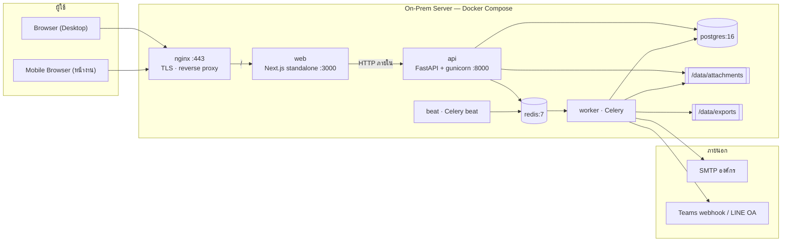

# ADR-002: Technology Stack — Next.js (เว็บ) + FastAPI (API)

| หัวข้อ | รายละเอียด |
|---|---|
| รหัสเอกสาร | ADR-002 |
| สถานะ | **Accepted** — ตัดสินโดย PM |
| วันที่ | 2026-08-31 |
| แทนที่ | **ADR-001** (`00-tech-stack-decision.md`) — ตัวเลือก A: FastAPI + React SPA |
| เอกสารที่ได้รับผลกระทบ | `10-…` (บางส่วน), `13-…` (compose), `20-…` และ `23-…` (**ต้องเขียนใหม่**), `12-…` (ยังใช้ได้) |

---

## 1. สิ่งที่เปลี่ยนจาก ADR-001

ADR-001 เลือก **FastAPI + React SPA (Vite)** และให้เหตุผลไว้ครบถ้วน การตัดสินใจใหม่นี้
**ไม่ได้ปฏิเสธเหตุผลเดิม** — ฝั่ง backend ยังเหมือนเดิมทุกประการ สิ่งที่เปลี่ยนคือ
**ชั้นเว็บเปลี่ยนจาก React SPA เป็น Next.js 15** และเพิ่มบทบาท BFF เข้ามา

| ประเด็นใน ADR-001 | ยังจริงอยู่ไหม |
|---|---|
| ต้องมีสัญญากลาง (OpenAPI) ให้ FE/BE ทำงานขนานได้ | ✅ จริง และยังใช้กลไกเดิมทุกอย่าง |
| On-prem ต้อง self-host ได้ทั้งหมด | ✅ จริง — Next.js `output: 'standalone'` รันเป็น Node process เดียวหลัง nginx |
| AI เฟส 2 ต้องอยู่ในระบบนิเวศ Python | ✅ จริง — FastAPI ยังอยู่ จึงไม่ต้องสร้าง service ภาษาที่สอง |
| Next.js ให้ประโยชน์ไม่เต็มบน on-prem (ISR/edge ใช้ไม่ได้) | ⚠️ จริง แต่**ประโยชน์ที่เราต้องการไม่ใช่ ISR** — เราต้องการ SSR สำหรับ first paint บนมือถือ 4G และ server-side session ซึ่งทั้งสองอย่างทำงานเต็มที่บน Node ธรรมดา |
| Next.js fullstack ทำให้ FE/BE ชนไฟล์เดียวกัน | ❌ ไม่เกิดในรูปแบบนี้ — business logic อยู่ที่ FastAPI ทั้งหมด Next.js เป็นชั้นแสดงผลล้วน |

---

## 2. Stack ที่กำหนด

### 2.1 Web (Next.js)

| ส่วนประกอบ | เวอร์ชัน | หมายเหตุ |
|---|---|---|
| Next.js | 15.x (App Router) | `output: 'standalone'` |
| React / TypeScript | 19.x / 5.6.x | `strict`, `noUncheckedIndexedAccess`, `exactOptionalPropertyTypes` |
| **Tailwind CSS** | **3.4.x** | คู่กับ shadcn/ui — ประเมิน Tailwind 4 อีกครั้งหลัง go-live ไม่ใช่ระหว่างพัฒนา |
| shadcn/ui + Radix + lucide-react | copy-in | คัดลอกโค้ดเข้าโปรเจกต์ ไม่ใช่ dependency |
| TanStack Query | 5.x | ใช้เฉพาะหน้าที่ต้อง poll (คิว agent, กระดิ่งแจ้งเตือน, job export) — หน้าอื่นอ่านผ่าน Server Component |
| TanStack Table | 8.x | ตารางคิวงาน (headless) |
| react-hook-form + zod | 7.53 / 3.23 | schema เดียวใช้ทั้ง client และ Route Handler |
| Recharts | 2.12.x | โหลด lazy เฉพาะ route dashboard/reports |
| date-fns + date-fns-tz | 3.6 / 3.2 | locale `th`, timezone `Asia/Bangkok` |
| openapi-typescript | 7.x | gen type จาก `/api/v1/openapi.json` ของ FastAPI |
| MSW | 2.x | dev + test เท่านั้น |

> ### 🔒 กฎเหล็กของโปรเจกต์ frontend
>
> **ไม่มี `DATABASE_URL` · ไม่มี ORM · ไม่มี Prisma · ไม่มี SQL** — โปรเจกต์ `frontend/` ต่อกับ backend ผ่าน HTTP ที่ `/api/v1` เท่านั้น
> บังคับด้วย CI: build ต้องล้มถ้าพบคำว่า `postgres://`, `prisma`, `pg`, `DATABASE_URL` ใน `frontend/`

> **ไม่ใช้ Auth.js / NextAuth** — FastAPI เป็นเจ้าของการยืนยันตัวตนอยู่แล้ว (JWT + refresh rotation + denylist + lockout ตาม `10-…` §7) การเพิ่ม Auth.js จะได้ระบบ auth สองชุดที่ต้องทำให้ตรงกันตลอดเวลา

### 2.1.1 Prisma — พิจารณาแล้วไม่ใช้

| ทางเลือกที่พิจารณา | เหตุผลที่ไม่เลือก |
|---|---|
| Prisma เป็นเจ้าของ schema แทน Alembic | Prisma Migrate ไม่มี down migration — ขัด **NFR-24** ที่บังคับว่าทุก migration ต้องมี `upgrade` และ `downgrade` |
| Prisma + Alembic บนฐานข้อมูลเดียวกัน | เครื่องมือสองตัวมีสิทธิ์แก้ตารางเดียวกัน = schema drift ทันทีที่ฝั่งใดฝั่งหนึ่งรัน migration |
| Next.js อ่าน DB ตรงผ่าน Prisma | ทำให้มีทางเข้าถึงข้อมูล 2 ทาง ต้องบังคับ row-level scoping ซ้ำอีกชุดใน TypeScript (หรือเปิด PostgreSQL RLS ซึ่ง `02-data-model.md` §1 ตัดออกไปแล้ว) — ขัดกับ **TR-01** ที่จัด "ข้อมูลรั่วข้ามบริษัท" เป็นความเสี่ยงสูงสุดที่ย้อนกลับไม่ได้ และขัดกับหลักการแยก frontend/backend |

> เครื่องมือดูฐานข้อมูลตอน dev ให้ใช้ **pgAdmin หรือ DBeaver** ต่อกับ `postgres` ใน compose โดยตรง — ไม่ต้องมี dependency ในโค้ด

### 2.2 API + Worker (คงตาม ADR-001 §5.1 ทั้งหมด)

Python 3.12 · FastAPI 0.115 · SQLAlchemy 2.0 · Alembic 1.13 · Pydantic 2.9 · psycopg 3.2 ·
PyJWT 2.9 · passlib[argon2] · Celery 5.4 · redis-py 5.1 · openpyxl 3.1 · **WeasyPrint 62** · pytest + httpx

### 2.3 ฐานข้อมูลและโครงสร้างพื้นฐาน

PostgreSQL 16 (`pg_trgm` + `unaccent`) · Redis 7.4 · Nginx 1.27 · Docker Compose v2
ทรัพยากรขั้นต่ำ **4 vCPU / 8 GB RAM / 200 GB SSD** (เท่าเดิม)

### 2.4 การแยก frontend / backend

สองโปรเจกต์อิสระ มี CI ของตัวเอง build/test/deploy แยกกันได้ — **จุดเชื่อมเดียวคือ `openapi.json`**

```text
aidc-helpdesk/
├── frontend/                  ← Next.js 15 · TypeScript · Tailwind · shadcn/ui
│   ├── package.json              → container `web`
│   ├── src/app/                  ไม่มี DATABASE_URL · ไม่มี ORM
│   ├── src/features/             โครงตาม 20-frontend-architecture.md
│   └── src/types/api.ts          ← gen ด้วย openapi-typescript (ห้ามแก้มือ)
│
├── backend/                   ← FastAPI · SQLAlchemy 2 · Alembic · Pydantic v2 · Celery
│   ├── pyproject.toml            → container `api` + `worker` + `beat`
│   ├── app/                      โครงตาม 10-backend-architecture.md §1
│   ├── migrations/               เจ้าของ schema ของ PostgreSQL แต่ผู้เดียว
│   └── openapi.json              ← commit ไว้ เป็นสัญญาที่ frontend อ้างอิง
│
├── docs/
└── deploy/                    ← docker-compose.yml · nginx/ · certs/ · scripts/
```

| กติกา | วิธีบังคับ |
|---|---|
| `openapi.json` ที่ commit ต้องตรงกับโค้ด backend เสมอ | CI ของ backend รัน `dump_openapi` แล้ว `git diff --exit-code` |
| `src/types/api.ts` ต้องตรงกับ `openapi.json` | CI ของ frontend รัน `gen:api` แล้ว `git diff --exit-code` |
| การเปลี่ยน API แบบทำลายความเข้ากันได้ | ต้องขึ้น `/api/v2` (ตาม `03-api-spec.md` §1.5) ไม่ใช่แก้ของเดิม |
| frontend เริ่มงานได้ก่อน backend เสร็จ | MSW handler เขียนจาก type ที่ gen แล้ว — schema เปลี่ยน handler compile ไม่ผ่านทันที |

---

## 3. เหตุผลที่ชุดนี้ดีกว่าทั้งสองทางเลือกเดิม

| ปัญหา | React SPA (ADR-001) | Next.js fullstack ล้วน | **ชุดที่เลือก** |
|---|---|---|---|
| **Token เก็บที่ไหน** | `localStorage` — XSS หนึ่งจุด token หลุดทั้งก้อน (FE-01 ที่ FE ยกเป็นความเสี่ยงอันดับหนึ่ง) | แก้ได้ | **แก้ได้** — JWT อยู่ใน httpOnly cookie ที่ JavaScript แตะไม่ถึง |
| **First paint บนมือถือ 4G** | ต้องคุม bundle ≤ 300 KB และยังต้องรอ JS ก่อนเห็นอะไร | ดี | **ดี** — SSR ส่ง HTML ที่อ่านได้มาก่อน |
| **งานเบื้องหลัง** (SLA scan, retry, auto-close) | Celery — ออกแบบเสร็จแล้ว | ต้องหา BullMQ มาแทน | **Celery เดิม** — `11-…` และ `12-…` ใช้ได้ตรง |
| **SLA engine** | `business_time.py` ผ่านเทสต์ 35 assertion แล้ว | ต้องพอร์ตเป็น TS ทั้งชุด (~4 วัน + ความเสี่ยงบั๊กใหม่) | **ไม่ต้องพอร์ต** |
| **PDF ภาษาไทย** | WeasyPrint + libthai — แผนพร้อม | ต้องใช้ Chromium (+400 MB) หรือเสี่ยงสระลอย | **WeasyPrint เดิม** |
| **AI เฟส 2** | อยู่ในโปรเจกต์เดิม | ต้องแยก Python service = ดูแล 2 stack | **อยู่ในโปรเจกต์เดิม** |

---

## 4. ข้อเสียที่ยอมรับ

| ข้อเสีย | วิธีบรรเทา |
|---|---|
| **3 runtime** (Node + FastAPI + Celery) → compose มี 7 service | ทุกตัวเป็น container ที่ `restart: unless-stopped` + healthcheck; runbook ต้องระบุลำดับ start ให้ชัด |
| ดูแล 2 ภาษา (Python + TypeScript) | ข้อนี้มีอยู่แล้วใน ADR-001 และถูกยอมรับไปแล้ว — จำกัด TS ไว้ที่ชั้นแสดงผลเท่านั้น |
| Next.js App Router เปลี่ยน pattern บ่อย (ข้อกังวลเดิมของ ADR-001) | pin เวอร์ชันย่อย · ไม่ใช้ฟีเจอร์ที่ยัง experimental · ผูก upgrade เข้ากับหน้าต่างบำรุงรักษาเท่านั้น |
| เพิ่มระยะทางเครือข่าย 1 hop สำหรับคำขอฝั่ง client | เป็นเน็ตเวิร์กภายใน compose (< 1 ms) — ไม่มีนัยที่ระดับโหลดนี้ |
| Server Component ทำให้ debug ยากกว่า SPA ตอนเริ่มต้น | กติกาชัด: หน้าไหนต้อง interactive ให้เป็น Client Component ทั้งหน้า ไม่ผสมครึ่ง ๆ |

---

## 5. สถาปัตยกรรมการ Deploy



| service | image / build | หมายเหตุ |
|---|---|---|
| `nginx` | nginx:1.27-alpine | TLS, `client_max_body_size 110m`, `X-Accel-Redirect` สำหรับไฟล์แนบ |
| `web` | build `./web` | `node server.js` (standalone) — ไม่ต้องมี `node_modules` ใน image สุดท้าย |
| `api` | build `./backend` | `gunicorn -k uvicorn.workers.UvicornWorker -w 4` |
| `worker` | image เดียวกับ `api` | `celery worker -c 2 --max-tasks-per-child=200` |
| `beat` | image เดียวกับ `api` | `celery beat` |
| `postgres` / `redis` | alpine | ไม่เปิดพอร์ตออกนอก network `backend` |

> รายละเอียด compose / Dockerfile / nginx / backup — ปรับจาก `13-deployment.md` โดยเพิ่ม service `web` และคง service อื่นไว้เหมือนเดิมทั้งหมด

---

## 6. หน้าที่ของแต่ละชั้น (บังคับด้วย lint + code review)

```text
Server Component  ──▶  fetch /api/v1 (ส่ง cookie ต่อ)  ──┐
                                                          ├──▶  FastAPI  ──▶  service  ──▶  ScopedRepository  ──▶  DB
Client Component  ──▶  fetch /api/v1 (เบราว์เซอร์แนบ cookie เอง)  ──┘
```

nginx เสิร์ฟ Next.js ที่ `/` และ FastAPI ที่ `/api/v1` จึงเป็น **origin เดียวกัน** — cookie ถูกแนบอัตโนมัติทั้งจากเบราว์เซอร์และจาก Server Component ที่ส่ง header ต่อ

| ชั้น | รับผิดชอบ | ห้ามทำ |
|---|---|---|
| `frontend/src/app/**` | แสดงผล, ประกอบหน้า, จัดการฟอร์ม | **ห้ามมี business rule** · ห้ามคำนวณ SLA/สถานะเอง · ห้ามแตะฐานข้อมูล |
| `frontend/src/lib/api.ts` | จุดเดียวที่ยิง HTTP ไป backend + แปลง error เป็น `ApiError` | ห้ามตัดสินใจเชิงธุรกิจ |
| `backend/app/**` | ตาม `10-backend-architecture.md` §1.1 ไม่มีการเปลี่ยนแปลง | — |

**กติกาสำคัญที่สุด:** ถ้าจะเพิ่ม logic ใหม่ ให้ถามก่อนว่า “ผู้ใช้ที่เรียก API ตรงโดยไม่ผ่านเว็บ ต้องได้ผลเดียวกันไหม” — ถ้าใช่ logic นั้นอยู่ที่ FastAPI เสมอ

---

## 7. เอกสารเดิมที่ได้รับผลกระทบ

| เอกสาร | สถานะ |
|---|---|
| `03-api-spec.md` (84 endpoint) | ✅ **ใช้ได้ทั้งฉบับ** |
| `10-backend-architecture.md` | ✅ ใช้ได้ — ยกเว้น §7.1 เรื่องที่เก็บ token ที่เปลี่ยนเป็น httpOnly cookie ฝั่ง Next.js |
| `11-sla-engine.md` | ✅ ใช้ได้ — แก้เฉพาะค่าคาดหวังของเทสต์ตามปฏิทินใหม่ (เสาร์ไม่ใช่วันทำการ) |
| `12-backend-implementation-plan.md` | ✅ ใช้ได้ |
| `13-deployment.md` | 🔧 เพิ่ม service `web` + Dockerfile ของ Next.js |
| `20-frontend-architecture.md` | 🔴 **เขียนใหม่** — เดิมเขียนสำหรับ Vite SPA + React Router + axios interceptor |
| `21-ui-ux-design.md` | ✅ ใช้ได้ (ดู ADR-003) |
| `22-component-spec.md` | 🔧 ปรับ — component ยังใช้ได้ แต่ต้องระบุว่าตัวไหนเป็น Server / Client Component |
| `23-frontend-implementation-plan.md` | 🔴 **เขียนใหม่** ตามแผน Phase ใหม่ |

---

## 8. เรื่องที่ยังต้องตัดสิน

| # | ประเด็น | สถานะ |
|---|---|---|
| **D-01** | เบราว์เซอร์เรียก API อย่างไร | ✅ **ปิดแล้ว** — ยิง `/api/v1` ที่ nginx ตรง โดย **FastAPI เป็นผู้ตั้ง `httpOnly; Secure; SameSite=Strict` cookie** ทั้ง access และ refresh token ที่ `/auth/login` · ไม่มี Bearer token อยู่ใน JavaScript เลย → ปิดช่อง **FE-01** ที่ทีม FE ยกเป็นความเสี่ยงอันดับหนึ่ง · Next.js ไม่ต้องทำ proxy จึงยังแยกจาก backend สนิท · ต้องเพิ่ม **CSRF token header สำหรับ method ที่เปลี่ยนข้อมูล** เพราะเปลี่ยนมาใช้ cookie · งานฝั่ง backend ~1 วัน · **กระทบ `03-api-spec.md` §1.1** ที่เดิมเขียนว่าเก็บใน `localStorage` — ต้องแก้ใน Phase 0 |
| **D-02** | `beat` แยก container หรือ `worker -B` | **แยก** ตาม `13-…` เดิม — ปลอดภัยกว่าเมื่อเพิ่ม worker ในอนาคต |
| **D-03** | Prisma | ✅ **ปิดแล้ว** — ไม่ใช้ (ดู §2.1.1) |

---

## 9. เกณฑ์ทบทวน ADR นี้

ทบทวนเมื่อเกิดข้อใดข้อหนึ่ง: ผู้ใช้ทะลุ 5,000 คน · ticket เกิน 100,000 ใบ/ปี ·
ต้องรองรับบริษัทนอกกลุ่ม AIDC · ต้องการ availability > 99.9% ·
หรือ Next.js ออกเวอร์ชันหลักที่บังคับเปลี่ยน pattern ของ App Router
