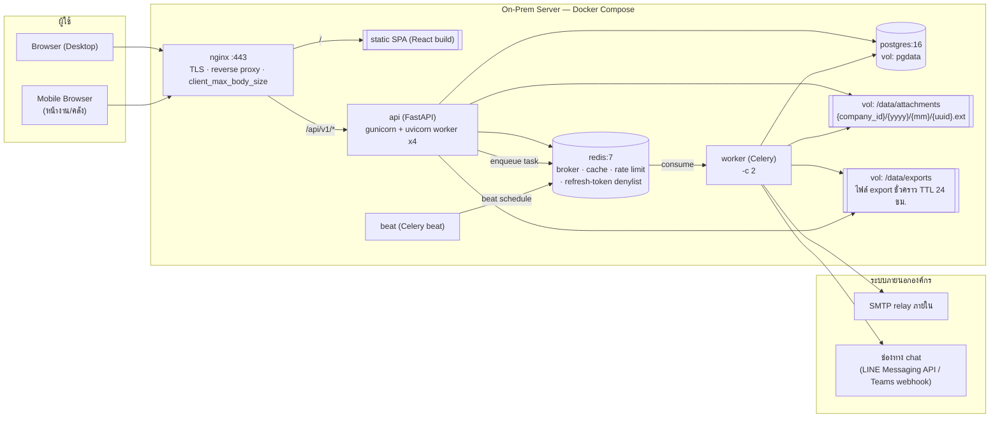
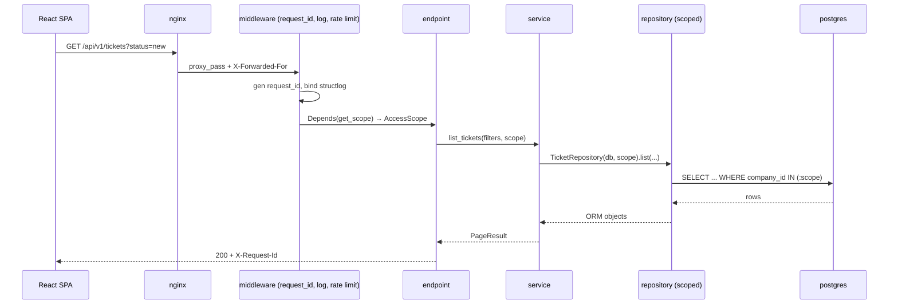

# Backend Architecture — AIDC Helpdesk

| หัวข้อ | รายละเอียด |
|---|---|
| รหัสเอกสาร | BE-001 |
| เวอร์ชัน | 1.0 |
| ผู้จัดทำ | Senior Backend |
| สแตก | FastAPI 0.115 (Python 3.12) + PostgreSQL 16 + Redis 7.4 + Celery 5.4 |
| เอกสารอ้างอิง | `00-tech-stack-decision.md`, `01-srs.md`, `02-data-model.md`, `03-api-spec.md`, `04-rbac-sla.md` |
| เอกสารต่อเนื่อง | `11-sla-engine.md`, `12-backend-implementation-plan.md`, `13-deployment.md` |

> เอกสารนี้ยึดตาม data model และ API contract ของ SA ทุกจุด — ข้อที่ทำจริงไม่ได้หรือขัดแย้งรวมไว้ที่หัวข้อ 10

---

## 1. โครงสร้างโฟลเดอร์

```text
backend/
├── Dockerfile                     # multi-stage (ดู 13-deployment.md)
├── pyproject.toml                 # dependency + tool config (ruff, pytest, mypy)
├── alembic.ini
├── .env.example
├── app/
│   ├── main.py                    # สร้าง FastAPI app, ติดตั้ง middleware + router + exception handler
│   ├── core/                      # โครงพื้นฐานที่ไม่ผูกกับโดเมน
│   │   ├── config.py              # Settings (pydantic-settings) อ่านจาก env เท่านั้น
│   │   ├── logging.py             # structlog + request_id contextvar
│   │   ├── errors.py              # AppError + exception handler กลาง (รูปแบบ error ตาม API spec)
│   │   ├── security.py            # hash password, encode/decode JWT, jti
│   │   ├── scope.py               # AccessScope + ตรรกะ permission/company scope
│   │   ├── deps.py                # FastAPI dependency: get_db, get_current_user, get_scope, require_perm
│   │   ├── pagination.py          # PageParams + PageResult (รูปแบบเดียวทั้งระบบ)
│   │   ├── rate_limit.py          # ตัวนับบน Redis (login / api ทั่วไป)
│   │   └── constants.py           # ค่าคงที่ enum: STATUS, PRIORITY, EVENT_TYPE, CHANNEL
│   ├── db/
│   │   ├── base.py                # DeclarativeBase + naming convention ของ constraint
│   │   ├── session.py             # async engine + sessionmaker + get_session()
│   │   └── seed/                  # สคริปต์ seed (permission, role, company, category, sla, holiday)
│   ├── models/                    # SQLAlchemy 2.0 ORM — 1 ไฟล์ต่อกลุ่มตาราง
│   │   ├── company.py             # company, department
│   │   ├── user.py                # app_user, role, permission, role_permission, user_role, user_role_scope
│   │   ├── ticket.py              # ticket, ticket_status_history, ticket_comment, ticket_category
│   │   ├── attachment.py
│   │   ├── sla.py                 # sla_policy, sla_target, business_hours, holiday
│   │   ├── kb.py                  # kb_category, kb_article, kb_feedback
│   │   ├── notification.py        # notification, notification_channel
│   │   └── audit.py               # audit_log
│   ├── schemas/                   # Pydantic v2 — สัญญากับ frontend (แหล่งกำเนิด OpenAPI)
│   │   ├── common.py              # ErrorBody, Page[T], RefCompany, RefUser
│   │   ├── auth.py  user.py  ticket.py  comment.py  attachment.py
│   │   ├── category.py  sla.py  kb.py  notification.py  dashboard.py  admin.py
│   ├── repositories/              # ชั้นเดียวที่ประกอบ SQL/ORM query — บังคับ company scope ที่นี่
│   │   ├── base.py                # ScopedRepository (บังคับรับ AccessScope ตอนสร้าง)
│   │   ├── ticket_repo.py  comment_repo.py  user_repo.py  category_repo.py
│   │   ├── sla_repo.py  kb_repo.py  notification_repo.py  audit_repo.py
│   │   └── stats_repo.py          # query รวมยอดสำหรับ dashboard/report
│   ├── services/                  # business logic ทั้งหมด — ไม่มี HTTP, ไม่มี SQL ดิบ
│   │   ├── auth_service.py        # login, refresh, revoke, change password, lockout
│   │   ├── ticket_service.py      # สร้าง/แก้/assign/claim/priority + orchestration
│   │   ├── state_machine.py       # ตารางการเปลี่ยนสถานะ + ผลข้างเคียง
│   │   ├── ticket_no.py           # ออกเลข ticket ด้วย sequence table + FOR UPDATE
│   │   ├── sla/
│   │   │   ├── business_time.py   # เอนจินเวลาทำการ (ดู 11-sla-engine.md)
│   │   │   ├── calendar_loader.py # โหลด business_hours + holiday → BusinessCalendar (cache Redis)
│   │   │   └── sla_service.py     # compute due, pause/resume, evaluate breach
│   │   ├── attachment_service.py  # ตรวจไฟล์ เก็บไฟล์ ออก signed URL
│   │   ├── kb_service.py  user_service.py  category_service.py
│   │   ├── dashboard_service.py  report_service.py
│   │   ├── notify_service.py      # สร้างแถว notification ตาม event + preference
│   │   └── audit_service.py
│   ├── api/
│   │   ├── deps.py                # dependency เฉพาะชั้น API (parse filter, idempotency key)
│   │   └── v1/
│   │       ├── router.py          # รวม router ย่อยทั้งหมดใต้ /api/v1
│   │       └── endpoints/
│   │           ├── auth.py  users.py  companies.py  tickets.py  comments.py
│   │           ├── attachments.py  categories.py  sla.py  kb.py
│   │           ├── dashboard.py  reports.py  notifications.py  admin.py  health.py
│   ├── notifications/             # adapter รายช่องทาง (เสียบเพิ่มได้ ดู 12-…-plan.md)
│   │   ├── base.py                # NotificationChannel protocol
│   │   ├── in_app.py  email.py  line_messaging.py  teams_webhook.py
│   │   └── registry.py            # map ชื่อ channel → adapter
│   ├── exports/
│   │   ├── excel.py               # openpyxl writer แบบ stream
│   │   ├── pdf.py                 # WeasyPrint + ฟอนต์ไทย
│   │   └── templates/             # Jinja2 HTML สำหรับ PDF
│   └── workers/
│       ├── celery_app.py          # Celery instance + beat schedule
│       └── tasks/
│           ├── sla_tasks.py       # scan_sla, auto_close_resolved, auto_resolve_pending
│           ├── notify_tasks.py    # send_notification (retry backoff)
│           └── export_tasks.py    # export_job
├── migrations/                    # Alembic
│   ├── env.py
│   └── versions/
└── tests/
    ├── conftest.py                # fixture: db แยก, client, factory ผู้ใช้ทุก role
    ├── unit/                      # ไม่มี I/O — sla, state_machine, scope, security
    ├── integration/               # แตะ DB จริง — repository + service
    ├── api/                       # ยิงผ่าน httpx.AsyncClient — contract + RBAC
    └── factories.py
```

### 1.1 หน้าที่ของแต่ละชั้น

| ชั้น | รับผิดชอบ | ห้ามทำ |
|---|---|---|
| `api/v1/endpoints` | แปลง HTTP ↔ schema, เรียก dependency ตรวจสิทธิ์, เลือก status code | ห้าม import `models.*`, ห้ามเขียน `select()`, ห้ามมี if ของ business rule |
| `schemas` | validate input, กำหนดรูปร่าง output, เป็นแหล่งกำเนิด OpenAPI | ห้ามมี logic ที่ต้องอ่าน DB |
| `services` | business rule ทั้งหมด, transaction boundary, สั่ง repository หลายตัวประกอบกัน | ห้ามรู้จัก `Request`/`HTTPException` (โยน `AppError` แทน) |
| `repositories` | ประกอบ query, **บังคับ company scope**, คืน ORM object หรือ row | ห้ามตัดสินใจเชิงธุรกิจ, ห้ามส่ง notification |
| `models` | โครงสร้างตาราง + relationship + constraint | ห้ามมี query helper ที่ข้าม scope |
| `core` | config, logging, error, security, scope, dependency | ห้าม import จาก `services`/`repositories` |
| `workers` | ตารางงานเบื้องหลัง เรียก service เดิมซ้ำ | ห้ามมี business logic ของตัวเอง |
| `migrations` | เปลี่ยนโครงสร้างฐานข้อมูล (มี `upgrade` + `downgrade` เสมอ) | ห้าม import โค้ด `app.*` (migration ต้องยืนได้ด้วยตัวเอง) |
| `tests` | unit / integration / api contract | — |

### 1.2 กฎการพึ่งพา (Dependency Rule)

```text
api  ──▶  services  ──▶  repositories  ──▶  models  ──▶  db
 │           │                │
 └──▶ schemas ◀──────────────┘        core  ──▶ (ทุกชั้นเรียกใช้ได้ แต่ core ไม่เรียกใครกลับ)
workers ──▶ services (ทางเดียว)
```

| # | กฎ | วิธีบังคับให้จริง |
|---|---|---|
| R-1 | ลูกศรพุ่งลงทางเดียว ห้ามย้อนกลับ | ruff `flake8-tidy-imports` `banned-api` + ทดสอบ import graph ใน CI |
| R-2 | router ห้ามแตะ ORM/SQL ตรง ๆ | CI grep: ไฟล์ใต้ `api/` ห้ามมีคำว่า `from app.models` หรือ `select(` |
| R-3 | ทุก query ที่แตะตารางที่มี `company_id` ต้องผ่าน `ScopedRepository` | `ScopedRepository.__init__` บังคับรับ `AccessScope`; ทดสอบ `tests/unit/test_no_unscoped_query.py` |
| R-4 | service ห้ามโยน `HTTPException` | ruff ban import `fastapi` ในโฟลเดอร์ `services/` |
| R-5 | transaction เปิด-ปิดที่ service ชั้นบนสุดเท่านั้น 1 request = 1 transaction | `get_db()` เป็น dependency เดียวที่ commit |
| R-6 | worker เรียก service ตัวเดียวกับ API | ห้ามเขียน logic ซ้ำใน `workers/tasks` (review checklist) |

---

## 2. Diagram สถาปัตยกรรม



**เส้นทางคำขอ 1 request**



---

## 3. Config และ Secret

### 3.1 หลักการ

| กฎ | รายละเอียด |
|---|---|
| แหล่งเดียว | ค่าทั้งหมดมาจาก environment variable เท่านั้น อ่านผ่าน `Settings` ตัวเดียว |
| ห้าม commit | `.env` อยู่ใน `.gitignore`; repo มีเฉพาะ `.env.example` ที่ไม่มีค่าจริง |
| fail fast | ค่าที่ขาดหรือผิดชนิดต้องทำให้แอปไม่ start (pydantic validation) ไม่ใช่พังตอน runtime |
| ไม่มี default ที่อันตราย | `SECRET_KEY` ไม่มีค่า default; ถ้า `ENV=production` และ key สั้นกว่า 32 ตัว → ปฏิเสธการ start |
| หมุน secret | เปลี่ยน `SECRET_KEY` = ทุก token เป็นโมฆะ (ยอมรับได้ ทำในหน้าต่างบำรุงรักษา) |

### 3.2 `app/core/config.py`

```python
from functools import lru_cache
from typing import Literal

from pydantic import Field, PostgresDsn, RedisDsn, field_validator
from pydantic_settings import BaseSettings, SettingsConfigDict


class Settings(BaseSettings):
    model_config = SettingsConfigDict(
        env_file=".env", env_file_encoding="utf-8", extra="ignore"
    )

    # --- ทั่วไป ---
    ENV: Literal["local", "staging", "production"] = "local"
    APP_VERSION: str = "0.1.0"
    API_PREFIX: str = "/api/v1"
    TIMEZONE: str = "Asia/Bangkok"
    LOG_LEVEL: str = "INFO"

    # --- ฐานข้อมูล / คิว ---
    DATABASE_URL: PostgresDsn
    DB_POOL_SIZE: int = 10
    DB_MAX_OVERFLOW: int = 5
    REDIS_URL: RedisDsn

    # --- ความปลอดภัย ---
    SECRET_KEY: str = Field(min_length=32)
    JWT_ALGORITHM: str = "HS256"
    ACCESS_TOKEN_MINUTES: int = 30
    REFRESH_TOKEN_DAYS: int = 7
    LOGIN_MAX_FAILED: int = 5
    LOGIN_LOCK_MINUTES: int = 15
    RATE_LIMIT_LOGIN_PER_MIN: int = 10
    RATE_LIMIT_API_PER_MIN: int = 120
    CORS_ORIGINS: list[str] = []

    # --- ไฟล์แนบ / export ---
    ATTACHMENT_DIR: str = "/data/attachments"
    EXPORT_DIR: str = "/data/exports"
    MAX_UPLOAD_MB: int = 20
    MAX_FILES_PER_REQUEST: int = 5

    # --- แจ้งเตือน ---
    SMTP_HOST: str | None = None
    SMTP_PORT: int = 25
    SMTP_USER: str | None = None
    SMTP_PASSWORD: str | None = None
    SMTP_FROM: str = "helpdesk@aidc.co.th"
    NOTIFY_CHANNELS: list[str] = ["in_app", "email"]
    LINE_CHANNEL_ACCESS_TOKEN: str | None = None
    LINE_CHANNEL_SECRET: str | None = None
    TEAMS_WEBHOOK_URL: str | None = None

    PUBLIC_BASE_URL: str = "https://helpdesk.aidc.local"

    @field_validator("SECRET_KEY")
    @classmethod
    def _no_placeholder(cls, v: str) -> str:
        if v.lower().startswith(("change", "secret", "placeholder")):
            raise ValueError("SECRET_KEY ยังเป็นค่าตัวอย่าง กรุณาสร้างค่าจริง")
        return v


@lru_cache
def get_settings() -> Settings:
    return Settings()  # type: ignore[call-arg]


settings = get_settings()
```

> `.env.example` ฉบับเต็มอยู่ใน `13-deployment.md` หัวข้อ 3

---

## 4. Logging

### 4.1 ข้อกำหนด

| ข้อ | ค่า |
|---|---|
| รูปแบบ | JSON บรรทัดเดียวต่อ event (structlog) — NFR-26 |
| ฟิลด์บังคับ | `ts`, `level`, `event`, `request_id`, `user_id`, `company_id`, `path`, `method`, `status`, `duration_ms` |
| `request_id` | สร้างที่ middleware (ULID) หรือรับต่อจาก header `X-Request-Id` ถ้ามี; ตอบกลับทุก response |
| ห้ามบันทึก | password, token, `Authorization` header, เนื้อไฟล์แนบ — NFR-19 |
| ระดับ | `INFO` = 1 บรรทัดต่อ request, `WARNING` = 4xx ที่ผิดปกติ, `ERROR` = 5xx + stack trace |
| ปลายทาง | stdout เท่านั้น ให้ Docker json-file driver หมุนไฟล์ (ดู `13-deployment.md`) |

### 4.2 Middleware

```python
import time
import uuid

import structlog
from starlette.middleware.base import BaseHTTPMiddleware

request_id_var = structlog.contextvars

class RequestContextMiddleware(BaseHTTPMiddleware):
    async def dispatch(self, request, call_next):
        rid = request.headers.get("X-Request-Id") or uuid.uuid4().hex[:26].upper()
        structlog.contextvars.clear_contextvars()
        structlog.contextvars.bind_contextvars(
            request_id=rid,
            path=request.url.path,
            method=request.method,
        )
        request.state.request_id = rid
        started = time.perf_counter()
        try:
            response = await call_next(request)
        except Exception:
            structlog.get_logger().exception("unhandled_error")
            raise
        duration_ms = int((time.perf_counter() - started) * 1000)
        response.headers["X-Request-Id"] = rid
        structlog.get_logger().info(
            "http_request", status=response.status_code, duration_ms=duration_ms
        )
        return response
```

> `user_id` / `company_id` ถูก bind เพิ่มใน `get_current_user()` หลังถอด JWT สำเร็จ
> Celery task bind `request_id` จาก argument ที่ producer ส่งมา เพื่อให้สืบย้อนจาก API ถึง worker ได้

---

## 5. Error Handling กลาง

รูปแบบ response ต้องตรงกับ `03-api-spec.md` หัวข้อ 1.3 และ 6 ทุกกรณี — ทำเป็น handler กลางตัวเดียว ห้าม endpoint ประกอบ error body เอง

```python
from dataclasses import dataclass, field

from fastapi import FastAPI, Request
from fastapi.exceptions import RequestValidationError
from fastapi.responses import JSONResponse
from sqlalchemy.exc import IntegrityError


@dataclass
class AppError(Exception):
    """ข้อผิดพลาดเชิงธุรกิจ — service โยนตัวนี้เท่านั้น ไม่โยน HTTPException"""

    code: str                 # เช่น INVALID_STATE_TRANSITION
    message: str              # ข้อความภาษาไทยที่แสดงผู้ใช้ได้ทันที
    http_status: int = 400
    details: list[dict] = field(default_factory=list)


# ตาราง error ที่ใช้บ่อย — คีย์ตรงกับ 03-api-spec.md หัวข้อ 6
ERRORS = {
    "FORBIDDEN": (403, "คุณไม่มีสิทธิ์ดำเนินการนี้"),
    "OUT_OF_SCOPE": (403, "ข้อมูลนี้อยู่นอกขอบเขตสิทธิ์ของคุณ"),
    "NOT_FOUND": (404, "ไม่พบข้อมูลที่ต้องการ"),
    "INVALID_STATE_TRANSITION": (409, "ไม่สามารถเปลี่ยนสถานะได้"),
    "ALREADY_ASSIGNED": (409, "มีผู้รับผิดชอบเรื่องนี้แล้ว"),
    "EDIT_WINDOW_EXPIRED": (409, "หมดเวลาแก้ไขข้อความแล้ว"),
    "DUPLICATE_ENTRY": (409, "ข้อมูลนี้มีอยู่แล้วในระบบ"),
    "RESOURCE_IN_USE": (409, "ไม่สามารถลบได้เพราะมีการใช้งานอยู่"),
    "FILE_TOO_LARGE": (413, "ไฟล์ใหญ่เกิน 20 MB"),
    "UNSUPPORTED_FILE_TYPE": (415, "ไม่รองรับไฟล์ประเภทนี้"),
    "ACCOUNT_LOCKED": (423, "บัญชีถูกล็อกชั่วคราว"),
    "RATE_LIMITED": (429, "มีคำขอมากเกินไป กรุณารอสักครู่"),
}


def err(code: str, message: str | None = None, details: list[dict] | None = None):
    status_code, default_msg = ERRORS[code]
    return AppError(code, message or default_msg, status_code, details or [])


def _body(request: Request, code: str, message: str, details: list[dict]):
    payload = {"error": {"code": code, "message": message,
                         "request_id": getattr(request.state, "request_id", None)}}
    if details:
        payload["error"]["details"] = details
    return payload


def install_handlers(app: FastAPI) -> None:
    @app.exception_handler(AppError)
    async def _app_error(request: Request, exc: AppError):
        return JSONResponse(
            status_code=exc.http_status,
            content=_body(request, exc.code, exc.message, exc.details),
        )

    @app.exception_handler(RequestValidationError)
    async def _validation(request: Request, exc: RequestValidationError):
        details = [
            {"field": ".".join(str(p) for p in e["loc"][1:]), "message": e["msg"]}
            for e in exc.errors()
        ]
        return JSONResponse(
            status_code=422,
            content=_body(request, "VALIDATION_ERROR", "ข้อมูลไม่ถูกต้อง", details),
        )

    @app.exception_handler(IntegrityError)
    async def _integrity(request: Request, exc: IntegrityError):
        return JSONResponse(
            status_code=409,
            content=_body(request, "DUPLICATE_ENTRY", "ข้อมูลนี้มีอยู่แล้วในระบบ", []),
        )

    @app.exception_handler(Exception)
    async def _unexpected(request: Request, exc: Exception):
        # stack trace ไป log เท่านั้น ห้ามส่งออกไปหา client
        return JSONResponse(
            status_code=500,
            content=_body(request, "INTERNAL_ERROR",
                          "ระบบขัดข้อง กรุณาแจ้งผู้ดูแลระบบ", []),
        )
```

| กติกา | เหตุผล |
|---|---|
| ไม่พบข้อมูล **หรือ** อยู่นอกขอบเขต → ตอบ `404 NOT_FOUND` เหมือนกัน | ป้องกันการเดาว่า ticket id นั้นมีอยู่จริงในบริษัทอื่น (`OUT_OF_SCOPE` ใช้เฉพาะกรณีที่ผู้ใช้ระบุ company_id ตรง ๆ) |
| ทุก 5xx บันทึก `request_id` + stack trace | ผู้ใช้แจ้ง `request_id` ให้ผู้ดูแลค้นใน log ได้ทันที |
| ไม่ให้ FastAPI คืน `{"detail": ...}` ดั้งเดิม | FE พึ่งรูปแบบ `error.code` ตัวเดียว |

---

## 6. Multi-tenant Scoping (หัวใจของความปลอดภัย)

### 6.1 กลไก

| ขั้น | สิ่งที่เกิดขึ้น |
|---|---|
| 1 | `get_current_user` ถอด JWT → โหลด `app_user` + roles + permissions + `user_role_scope` (cache ใน Redis 60 วินาที คีย์ `perm:{user_id}:{ver}`) |
| 2 | `get_scope` สร้าง `AccessScope` = `{user_id, home_company_id, company_ids, permissions, is_super_admin}` |
| 3 | `require_perm("ticket.read")` ตรวจ **permission** (ไม่ตรวจชื่อ role ตาม `03-api-spec.md` หัวข้อ 2) |
| 4 | endpoint สร้าง repository ผ่าน dependency ที่ **บังคับ** ส่ง `AccessScope` เข้าไป |
| 5 | `ScopedRepository._apply_scope()` เติม `WHERE company_id IN (...)` ให้ทุก query โดยอัตโนมัติ |
| 6 | ถ้า client ส่ง `?company_id=` ที่อยู่นอกขอบเขต → **ตัดทิ้งเงียบ ๆ** (US-07 AC-2) ไม่ตอบ error |

> ไม่ใช้ PostgreSQL RLS ในเฟส 1 ตามที่ SA กำหนด — ชดเชยด้วยการทำให้ "การเขียน query ที่ไม่มี scope" เป็นเรื่องที่ทำได้ยากในเชิงโครงสร้าง: repository ไม่มี constructor ที่ไม่รับ `AccessScope`

### 6.2 `app/core/scope.py`

```python
from __future__ import annotations

from dataclasses import dataclass
from typing import Sequence


@dataclass(frozen=True)
class AccessScope:
    """ขอบเขตการมองเห็นข้อมูลของผู้เรียก 1 request (immutable โดยเจตนา)"""

    user_id: int
    home_company_id: int
    company_ids: frozenset[int]     # ผลรวม user_role_scope; ว่าง = {home_company_id}
    permissions: frozenset[str]
    is_super_admin: bool

    def has(self, *codes: str) -> bool:
        return self.is_super_admin or any(c in self.permissions for c in codes)

    def require(self, *codes: str) -> None:
        if not self.has(*codes):
            raise err("FORBIDDEN")

    def visible_company_ids(self, requested: Sequence[int] | None) -> frozenset[int]:
        """ตัด company_id ที่อยู่นอกขอบเขตทิ้งเงียบ ๆ ตาม US-07 AC-2"""
        if self.is_super_admin:
            return frozenset(requested) if requested else frozenset()
        if not requested:
            return self.company_ids
        return self.company_ids & frozenset(requested)
```

### 6.3 `app/repositories/base.py` + `ticket_repo.py`

```python
from sqlalchemy import Select, select
from sqlalchemy.ext.asyncio import AsyncSession

from app.core.scope import AccessScope
from app.models.ticket import Ticket


class ScopedRepository:
    """repository ทุกตัวที่แตะตารางซึ่งมี company_id ต้องสืบทอดคลาสนี้

    การบังคับให้ __init__ รับ AccessScope ทำให้ "ลืมใส่ scope" กลายเป็น
    TypeError ตั้งแต่ตอนเขียนโค้ด ไม่ใช่ช่องโหว่ที่ค้นพบตอน production
    """

    def __init__(self, db: AsyncSession, scope: AccessScope) -> None:
        self.db = db
        self.scope = scope


class TicketRepository(ScopedRepository):
    def _apply_scope(self, stmt: Select) -> Select:
        s = self.scope
        if s.is_super_admin:
            return stmt
        if s.has("ticket.read"):
            # agent / company_admin / manager_viewer → ตามขอบเขตบริษัท
            return stmt.where(Ticket.company_id.in_(s.company_ids))
        # end_user → เฉพาะเรื่องของตน (02-data-model.md 5.1)
        return stmt.where(
            (Ticket.requester_id == s.user_id) | (Ticket.created_by == s.user_id)
        )

    def _base_stmt(self) -> Select:
        return self._apply_scope(select(Ticket).where(Ticket.deleted_at.is_(None)))

    async def get(self, ticket_id: int) -> Ticket | None:
        stmt = self._base_stmt().where(Ticket.id == ticket_id)
        return (await self.db.execute(stmt)).scalar_one_or_none()

    async def list(
        self,
        *,
        company_ids: list[int] | None = None,
        statuses: list[str] | None = None,
        limit: int = 20,
        offset: int = 0,
    ):
        stmt = self._base_stmt()
        allowed = self.scope.visible_company_ids(company_ids)
        if allowed:
            stmt = stmt.where(Ticket.company_id.in_(allowed))
        if statuses:
            stmt = stmt.where(Ticket.status.in_(statuses))
        stmt = stmt.order_by(Ticket.created_at.desc()).limit(limit).offset(offset)
        return (await self.db.execute(stmt)).scalars().all()
```

### 6.4 `app/core/deps.py` — dependency ที่ inject current_user + scope

```python
from fastapi import Depends, Request
from sqlalchemy.ext.asyncio import AsyncSession

from app.core.scope import AccessScope
from app.db.session import get_session
from app.repositories.ticket_repo import TicketRepository


async def get_db() -> AsyncSession:
    async with get_session() as session:
        yield session


async def get_current_user(request: Request, db: AsyncSession = Depends(get_db)):
    token = _bearer_token(request)               # ไม่มี → 401 UNAUTHENTICATED
    payload = decode_access_token(token)         # หมดอายุ → 401 TOKEN_EXPIRED
    if await is_revoked(payload["jti"]):         # ตรวจ denylist บน Redis
        raise err("INVALID_TOKEN")
    user = await load_user_with_roles(db, int(payload["sub"]))
    if user is None or not user.is_active or user.deleted_at:
        raise err("ACCOUNT_DISABLED")
    structlog.contextvars.bind_contextvars(
        user_id=user.id, company_id=user.company_id
    )
    return user


async def get_scope(user=Depends(get_current_user)) -> AccessScope:
    role_codes = {ur.role.code for ur in user.user_roles}
    is_super = "super_admin" in role_codes
    scoped = {s.company_id for ur in user.user_roles for s in ur.scopes}
    return AccessScope(
        user_id=user.id,
        home_company_id=user.company_id,
        company_ids=frozenset(scoped or {user.company_id}),
        permissions=frozenset(
            p.code for ur in user.user_roles for p in ur.role.permissions
        ),
        is_super_admin=is_super,
    )


def require_perm(*codes: str):
    """ใช้เป็น dependency ของ endpoint: Depends(require_perm('ticket.assign'))"""

    async def _dep(scope: AccessScope = Depends(get_scope)) -> AccessScope:
        scope.require(*codes)
        return scope

    return _dep


async def get_ticket_repo(
    db: AsyncSession = Depends(get_db),
    scope: AccessScope = Depends(get_scope),
) -> TicketRepository:
    return TicketRepository(db, scope)
```

**ตัวอย่างการใช้ที่ endpoint (router ไม่แตะ ORM เลย)**

```python
@router.get("/tickets", response_model=Page[TicketListItem])
async def list_tickets(
    filters: TicketFilter = Depends(),
    page: PageParams = Depends(),
    scope: AccessScope = Depends(require_perm("ticket.read")),
    service: TicketService = Depends(get_ticket_service),
):
    return await service.list_tickets(filters, page, scope)
```

### 6.5 การเขียน test กันข้อมูลรั่วข้ามบริษัท

โครงหลักคือ **fixture ที่สร้างผู้ใช้ครบทุก role × 2 บริษัท แล้ววนยิงทุก endpoint** ไม่ใช่เขียนเทสต์ทีละ endpoint ด้วยมือ

| ระดับ | สิ่งที่ทดสอบ | ไฟล์ |
|---|---|---|
| Unit | `AccessScope.visible_company_ids()` ตัด id นอกขอบเขตถูกต้องทุก role | `tests/unit/test_scope.py` |
| Integration | repository ทุกตัว: seed ข้อมูล 2 บริษัท แล้วยืนยันว่า query คืนของบริษัทตนเท่านั้น | `tests/integration/test_repo_scope.py` |
| API (สำคัญที่สุด) | ตาราง endpoint × role ยิงจริง ตรวจ status + ตรวจว่า body ไม่มี id ของบริษัทอื่น | `tests/api/test_cross_tenant.py` |
| Static | ไม่มีไฟล์ใต้ `api/` ที่ import `app.models` หรือเรียก `select(` | `tests/unit/test_layering.py` |

```python
# tests/api/test_cross_tenant.py
import pytest

READ_ENDPOINTS = [
    "/api/v1/tickets/{ticket_id}",
    "/api/v1/tickets/{ticket_id}/comments",
    "/api/v1/tickets/{ticket_id}/history",
]


@pytest.mark.asyncio
@pytest.mark.parametrize("role", ["end_user", "agent", "company_admin",
                                  "manager_viewer"])
@pytest.mark.parametrize("path", READ_ENDPOINTS)
async def test_cannot_read_other_company_ticket(client, seed, role, path):
    """ผู้ใช้ของบริษัท A ต้องไม่เห็น ticket ของบริษัท B ไม่ว่า role ใด"""
    actor = seed.user(company=seed.company_a, role=role)
    victim_ticket = seed.ticket(company=seed.company_b)

    res = await client.get(
        path.format(ticket_id=victim_ticket.id), headers=seed.auth(actor)
    )

    # ต้องเป็น 404 (ไม่ใช่ 403) เพื่อไม่ยืนยันว่า id นี้มีอยู่จริง
    assert res.status_code == 404
    assert str(victim_ticket.ticket_no) not in res.text


@pytest.mark.asyncio
async def test_company_id_filter_outside_scope_is_ignored(client, seed):
    """US-07 AC-2: ส่ง company_id ของบริษัทอื่น → เพิกเฉย ไม่ error"""
    admin_a = seed.user(company=seed.company_a, role="company_admin")
    seed.ticket(company=seed.company_b, subject="ห้ามหลุด")

    res = await client.get(
        f"/api/v1/tickets?company_id={seed.company_b.id}", headers=seed.auth(admin_a)
    )

    assert res.status_code == 200
    assert res.json()["total"] == 0
    assert "ห้ามหลุด" not in res.text


@pytest.mark.asyncio
async def test_end_user_cannot_see_internal_comment(client, seed):
    """US-02 AC-3: คอมเมนต์ภายในต้องไม่โผล่ใน API response ของผู้แจ้ง"""
    t = seed.ticket(company=seed.company_a)
    seed.comment(t, body="ลูกค้าเข้าใจผิดเอง", is_internal=True)
    res = await client.get(
        f"/api/v1/tickets/{t.id}/comments", headers=seed.auth(t.requester)
    )
    assert res.status_code == 200
    assert "ลูกค้าเข้าใจผิดเอง" not in res.text
```

> **กติกา CI:** ทุก endpoint ใหม่ที่คืนข้อมูลรายบริษัทต้องเพิ่ม path เข้า `READ_ENDPOINTS` — เป็นข้อบังคับใน PR checklist

---

## 7. Authentication

### 7.1 ภาพรวม

| หัวข้อ | ค่าที่ใช้ | อ้างอิง |
|---|---|---|
| Password hash | Argon2id ผ่าน `passlib[argon2]` (`time_cost=2, memory_cost=64 MiB, parallelism=2`) | NFR-10 |
| นโยบายรหัสผ่าน | ≥ 8 ตัว มีตัวอักษร + ตัวเลข; ตรวจที่ `schemas` ให้ error เป็น `VALIDATION_ERROR` | NFR-10 |
| Access token | JWT HS256 อายุ 30 นาที · claims: `sub, username, company_id, roles[], scoped_company_ids[], exp, jti, typ="access"` | API 1.1 |
| Refresh token | JWT อายุ 7 วัน `typ="refresh"` เก็บเฉพาะ `sub` + `jti` (ไม่ใส่ role — กัน token เก่าถือสิทธิ์เก่า) | FR-01 |
| Rotation | ทุกครั้งที่ `/auth/refresh` ออก refresh ใหม่และใส่ jti เดิมลง denylist (กัน replay) | — |
| Revoke | Redis `SETEX revoked:jti:{jti} <ttl เท่าอายุที่เหลือ> 1` — logout, refresh rotation, เปลี่ยนรหัสผ่าน, ปิดบัญชี | NFR-11 |
| Revoke ทั้งบัญชี | `app_user.token_version` (เพิ่มคอลัมน์ — ดูหัวข้อ 10 ประเด็น B-02) หรือคีย์ `revoke_all:{user_id}:{ts}` |
| Lockout | ผิด 5 ครั้งติด → `locked_until = now + 15 นาที`, ตอบ `423 ACCOUNT_LOCKED`; นับด้วยคอลัมน์ `failed_login_count` ใน DB (ไม่ใช้ Redis เพื่อให้รอดการรีสตาร์ต) | FR-04 |
| Rate limit login | 10 ครั้ง/นาที/IP บน Redis (`INCR` + `EXPIRE` แบบ fixed window) — **แยกจาก lockout รายบัญชี** เพราะกันคนละภัย (credential stuffing กระจาย IP vs เดารหัสบัญชีเดียว) | NFR-17 |
| Rate limit API | 120 req/นาที/user; ตอบ header `X-RateLimit-Remaining` ทุก response | NFR-17 |
| must_change_password | ทุก endpoint ยกเว้น `/auth/me`, `/auth/change-password`, `/auth/logout` ตอบ `403 PASSWORD_CHANGE_REQUIRED` | FR-03, US-18 |

### 7.2 ลำดับการตรวจตอน login (ลำดับสำคัญ)

```text
1. rate limit ต่อ IP        → เกิน   : 429 RATE_LIMITED
2. หา user จาก username     → ไม่พบ  : verify hash หลอก (กัน timing attack) แล้ว 401 INVALID_CREDENTIALS
3. locked_until > now       → ล็อกอยู่: 423 ACCOUNT_LOCKED (+ locked_until ใน details)
4. is_active / deleted_at   → ปิดอยู่ : 423 ACCOUNT_DISABLED
5. verify password          → ผิด   : failed_login_count += 1 (ครบ 5 → ตั้ง locked_until) + audit login_failed + 401
6. สำเร็จ                    → reset failed_login_count, last_login_at, ออก token, audit login
```

> ขั้นที่ 2 ต้องเรียก `pwd_context.dummy_verify()` เสมอเมื่อไม่พบผู้ใช้ เพื่อให้เวลาตอบเท่ากันทั้งกรณีมี/ไม่มีบัญชี

### 7.3 `app/core/security.py` (ย่อ)

```python
from datetime import datetime, timedelta, timezone
import uuid

import jwt
from passlib.context import CryptContext

from app.core.config import settings

pwd_context = CryptContext(
    schemes=["argon2"],
    deprecated="auto",
    argon2__time_cost=2,
    argon2__memory_cost=65536,
    argon2__parallelism=2,
)


def hash_password(raw: str) -> str:
    return pwd_context.hash(raw)


def verify_password(raw: str, hashed: str) -> bool:
    return pwd_context.verify(raw, hashed)


def _encode(payload: dict, ttl: timedelta, typ: str) -> tuple[str, str]:
    now = datetime.now(timezone.utc)
    jti = uuid.uuid4().hex
    body = {**payload, "typ": typ, "jti": jti,
            "iat": now, "exp": now + ttl}
    return jwt.encode(body, settings.SECRET_KEY, settings.JWT_ALGORITHM), jti


def create_access_token(user, scope) -> tuple[str, str]:
    return _encode(
        {
            "sub": str(user.id),
            "username": user.username,
            "company_id": user.company_id,
            "roles": sorted(scope.role_codes),
            "scoped_company_ids": sorted(scope.company_ids),
        },
        timedelta(minutes=settings.ACCESS_TOKEN_MINUTES),
        "access",
    )


def create_refresh_token(user_id: int) -> tuple[str, str]:
    return _encode({"sub": str(user_id)},
                   timedelta(days=settings.REFRESH_TOKEN_DAYS), "refresh")
```

### 7.4 จุดต่อขยาย SSO (FR-07 — ออกแบบเผื่อ ไม่ทำในเฟส 1)

```python
from typing import Protocol


class AuthProvider(Protocol):
    """ชั้นแยกระหว่าง 'ใครคือผู้ใช้คนนี้' กับ 'ผู้ใช้คนนี้ทำอะไรได้'"""

    name: str

    async def authenticate(self, credentials: dict) -> "ExternalIdentity | None":
        """คืน identity ภายนอก (subject, email, display_name, groups[]) หรือ None"""


class LocalPasswordProvider:  # เฟส 1
    name = "local"


class LdapProvider:          # เฟส 2 — ไม่แตะ business logic
    name = "ldap"


class OidcProvider:          # เฟส 2 — Azure AD / Entra ID
    name = "oidc"
```

| สิ่งที่ต้องเตรียมไว้ตั้งแต่เฟส 1 | เหตุผล |
|---|---|
| `auth_service.login()` เรียก provider แล้วรับ `ExternalIdentity` → map เป็น `app_user` ด้วย `username` | เปลี่ยน provider โดยไม่แตะการออก token / RBAC |
| เพิ่มคอลัมน์ `app_user.auth_provider` (default `'local'`) และ `external_subject` (nullable, unique ร่วมกับ provider) | เฟส 2 ไม่ต้องทำ migration ที่กระทบข้อมูลเดิม — ดูประเด็น B-01 |
| `password_hash` เป็น nullable ไม่ได้ในเฟส 1 (ตาม data model) | ผู้ใช้ SSO ในอนาคตจะไม่มีรหัสผ่าน → ต้องแก้เป็น nullable ในเฟส 2 |
| RBAC ผูกกับ `user_role` ในฐานข้อมูลของเรา ไม่ผูกกับ group ของ AD | ป้องกันการต้องรื้อ RBAC เมื่อโครงสร้าง AD เปลี่ยน |

---

## 8. ไฟล์แนบ (Attachment)

### 8.1 การจัดเก็บ

| หัวข้อ | ค่า |
|---|---|
| ที่เก็บ | filesystem บน volume `/data/attachments` (ตาม ADR-001 — ไม่ใช้ MinIO/S3 ในเฟส 1) |
| โครงสร้าง path | `{company_id}/{yyyy}/{mm}/{uuid4}.{ext}` เก็บใน `attachment.storage_key` |
| ชื่อไฟล์เดิม | เก็บใน `attachment.file_name` เท่านั้น **ไม่เคย**ใช้ประกอบ path จริง |
| สิทธิ์ไฟล์ | เขียนด้วย mode `0640`, โฟลเดอร์ `0750`, owner = user ที่รัน container (uid 1000) |
| ขนาดสูงสุด | 20 MB/ไฟล์, 5 ไฟล์/คำขอ (FR-12); nginx `client_max_body_size 25m` เป็นด่านแรก |
| ชนิดที่อนุญาต | `jpg jpeg png gif webp pdf doc docx xls xlsx csv txt zip mp4` |
| การตรวจชนิด | อ่าน magic bytes ด้วย `python-magic` แล้วเทียบกับ allowlist **และ** เทียบกับนามสกุล — ไม่เชื่อ `Content-Type` จาก client (NFR-15) |
| การดาวน์โหลด | `GET /attachments/{id}/download` ตรวจสิทธิ์ผ่าน ticket ที่ผูกอยู่ → `302` ไป signed URL อายุ 15 นาที (NFR-16) |
| signed URL | HMAC-SHA256 ของ `storage_key + exp + user_id` ด้วย `SECRET_KEY`; nginx ส่งไฟล์ผ่าน `X-Accel-Redirect` ไปที่ `internal location` เพื่อไม่ให้ Python เสิร์ฟไฟล์ใหญ่เอง |
| การลบ | soft: ลบแถวใน DB + ย้ายไฟล์ไป `/data/attachments/_trash/` (ลบจริงด้วย cron 30 วัน) |

### 8.2 การกัน path traversal

```python
import os
import re
import uuid
from pathlib import Path

from app.core.config import settings

ALLOWED_EXT = {"jpg", "jpeg", "png", "gif", "webp", "pdf", "doc", "docx",
               "xls", "xlsx", "csv", "txt", "zip", "mp4"}
ALLOWED_MIME = {
    "image/jpeg", "image/png", "image/gif", "image/webp", "application/pdf",
    "application/msword",
    "application/vnd.openxmlformats-officedocument.wordprocessingml.document",
    "application/vnd.ms-excel",
    "application/vnd.openxmlformats-officedocument.spreadsheetml.sheet",
    "text/csv", "text/plain", "application/zip", "video/mp4",
}
_SAFE_KEY = re.compile(r"^\d+/\d{4}/\d{2}/[0-9a-f]{32}\.[a-z0-9]{1,5}$")


def build_storage_key(company_id: int, original_name: str, when) -> str:
    """สร้าง path ที่ระบบเป็นคนกำหนดทั้งหมด — ชื่อไฟล์ผู้ใช้ไม่มีผลต่อ path"""
    ext = Path(original_name).suffix.lower().lstrip(".")
    if ext not in ALLOWED_EXT:
        raise err("UNSUPPORTED_FILE_TYPE")
    return f"{company_id}/{when:%Y}/{when:%m}/{uuid.uuid4().hex}.{ext}"


def resolve_path(storage_key: str) -> Path:
    """แปลง storage_key เป็น path จริง พร้อมยืนยันว่ายังอยู่ใต้ ATTACHMENT_DIR

    ป้องกัน 3 ชั้น: (1) regex ยอมรับเฉพาะรูปแบบที่ระบบสร้างเอง
    (2) resolve symlink/.. ให้เป็น absolute (3) เทียบ prefix ด้วย is_relative_to
    """
    if not _SAFE_KEY.match(storage_key):
        raise err("NOT_FOUND")
    root = Path(settings.ATTACHMENT_DIR).resolve()
    target = (root / storage_key).resolve()
    if not target.is_relative_to(root):
        raise err("NOT_FOUND")
    return target


async def save_upload(upload, company_id: int, when) -> tuple[str, int, str]:
    """เขียนไฟล์แบบ stream พร้อมตัดทันทีเมื่อเกินขนาดที่อนุญาต"""
    limit = settings.MAX_UPLOAD_MB * 1024 * 1024
    key = build_storage_key(company_id, upload.filename, when)
    path = resolve_path(key)
    path.parent.mkdir(parents=True, exist_ok=True)
    size = 0
    head = b""
    with open(path, "wb", opener=lambda p, f: os.open(p, f, 0o640)) as fh:
        while chunk := await upload.read(1024 * 1024):
            size += len(chunk)
            if size > limit:
                fh.close()
                path.unlink(missing_ok=True)
                raise err("FILE_TOO_LARGE")
            if not head:
                head = chunk[:2048]
            fh.write(chunk)
    mime = detect_mime(head)              # python-magic จาก magic bytes จริง
    if mime not in ALLOWED_MIME:
        path.unlink(missing_ok=True)
        raise err("UNSUPPORTED_FILE_TYPE")
    return key, size, mime
```

| ภัย | มาตรการ |
|---|---|
| Path traversal (`../../etc/passwd` ในชื่อไฟล์) | ชื่อไฟล์ผู้ใช้ไม่ถูกใช้สร้าง path เลย + regex + `is_relative_to` |
| อัปโหลดไฟล์ปลอมนามสกุล (`.jpg` ที่เป็น PHP/EXE) | ตรวจ magic bytes + เสิร์ฟผ่าน `X-Accel-Redirect` ด้วย `Content-Disposition: attachment` เสมอ ไม่มีการ execute |
| Stored XSS จาก SVG/HTML | ไม่มี `svg`/`html` ใน allowlist + header `X-Content-Type-Options: nosniff` |
| Zip bomb | เฟส 1 ไม่แตกไฟล์ zip ฝั่ง server เลย (เก็บดิบอย่างเดียว) → ไม่มีความเสี่ยง |
| ดาวน์โหลดข้ามบริษัท | ตรวจสิทธิ์ผ่าน ticket/บทความที่ผูกอยู่ทุกครั้งก่อนออก signed URL |
| Disk เต็ม | health check เตือนเมื่อ `/data` เหลือ < 15% + รายงานใน `/admin/system-info` |

### 8.3 Virus scan (เฟส 2)

| ประเด็น | แนวทางที่เสนอ |
|---|---|
| เครื่องมือ | ClamAV เป็น container แยก (`clamav/clamav:latest`) คุยผ่าน INSTREAM socket ที่พอร์ต 3310 |
| จุดที่แทรก | Celery task `scan_attachment` หลังอัปโหลดสำเร็จ (async ไม่บล็อกผู้ใช้) |
| สถานะไฟล์ | เพิ่มคอลัมน์ `attachment.scan_status` (`pending` / `clean` / `infected` / `skipped`) — ต้องขอ SA เพิ่ม ดูประเด็น B-04 |
| พฤติกรรม | ระหว่าง `pending` ดาวน์โหลดได้ (ปริมาณงานภายในองค์กร ความเสี่ยงต่ำ); `infected` → บล็อกดาวน์โหลด + แจ้ง company_admin + ย้ายเข้า quarantine |
| ต้นทุน | ClamAV กิน RAM ~1.5 GB — **ต้องเพิ่ม RAM เซิร์ฟเวอร์เป็น 12 GB ถ้าเปิดใช้** เป็นเหตุผลที่เลื่อนไปเฟส 2 |
| ทางเลือกที่ถูกกว่า | ให้ endpoint AV ขององค์กร (ถ้ามี) สแกน volume `/data/attachments` แบบ on-access แทน — ไม่ต้องแก้โค้ดเลย **[ต้องถาม PM ว่ามีระบบ AV ที่สแกน share ได้อยู่แล้วหรือไม่]** |

---

## 9. เรื่องอื่นที่กระทบสถาปัตยกรรม

| หัวข้อ | แนวทาง |
|---|---|
| ออกเลข `ticket_no` | ตาราง `ticket_sequence(company_id, period CHAR(6), last_no INT)` + `SELECT ... FOR UPDATE` ในทรานแซกชันเดียวกับการ insert ticket (ตาม `02-data-model.md` หัวข้อ 7) — เป็นตารางใหม่ที่ SA ยังไม่ได้ระบุ ดูประเด็น B-03 |
| Idempotency | `POST /tickets` ที่มี header `Idempotency-Key` → Redis `SETNX idem:{user_id}:{key}` TTL 24 ชม. เก็บ `ticket_id` ที่สร้าง; ยิงซ้ำคืน ticket เดิม 201 |
| Transaction | 1 request = 1 transaction; งานที่ช้า (ส่ง notification, สร้าง export) ต้อง enqueue **หลัง commit** ด้วย `after_commit` hook ไม่ใช่ระหว่าง transaction |
| Cache | Redis เฉพาะ 3 อย่าง: permission ของ user (60 วิ), `BusinessCalendar` ต่อบริษัท (10 นาที, invalidate เมื่อแก้ business_hours/holiday), unread notification count (30 วิ) |
| N+1 query | ทุก list endpoint ใช้ `selectinload` สำหรับ relation ที่ serialize ออกไป; มีเทสต์นับจำนวน query (`test_query_count.py`) กันการถดถอย |
| Audit log | เขียนผ่าน `audit_service.record()` ที่ service ชั้นบน ไม่ใช้ ORM event listener (ทำให้เห็นชัดว่า action ไหนถูกบันทึก และคุม `company_id` ได้ถูก) |
| Health check | `/api/v1/health` ตรวจ DB (`SELECT 1`), Redis (`PING`), disk `/data` — คืน `503` เมื่อ DB ล้ม เพื่อให้ nginx/monitoring จับได้ |
| OpenAPI ต้องไม่ล้า | CI รัน `python -m app.tools.dump_openapi` แล้ว `git diff --exit-code openapi.json` (ADR-001 หัวข้อ 7) |

---

## 10. ประเด็นที่ต้องคุยกับ SA

> ทั้งหมดเป็นจุดที่ทำตามเอกสารตรง ๆ ไม่ได้ หรือขาดรายละเอียดที่จำเป็นต่อการเขียนโค้ด — **ยังไม่ได้เปลี่ยนอะไรเอง**

| # | ประเด็น | ผลกระทบ | สิ่งที่ขอให้ตัดสิน |
|---|---|---|---|
| B-01 | `app_user` ไม่มี `auth_provider` / `external_subject` และ `password_hash` เป็น NOT NULL | FR-07 บอกให้ "ออกแบบเผื่อ SSO" แต่โครงสร้างปัจจุบันบังคับให้ผู้ใช้ SSO ต้องมีรหัสผ่าน → เฟส 2 ต้อง migration ที่กระทบทุกแถว | ขอเพิ่ม 2 คอลัมน์ตั้งแต่เฟส 1 (ค่า default `'local'` / NULL) และผ่อน `password_hash` เป็น nullable |
| B-02 | ไม่มีกลไก "เพิกถอน token ทั้งบัญชี" | เมื่อ admin ปิดบัญชีหรือเปลี่ยน role ผู้ใช้ยังถือ access token เดิมได้อีก ≤ 30 นาที | ขอเพิ่ม `app_user.token_version INT NOT NULL DEFAULT 0` แล้วใส่ใน JWT claim (ทางเลือกอื่น: ลดอายุ access token เหลือ 10 นาที) |
| B-03 | `02-data-model.md` หัวข้อ 7 อ้างถึง "ตาราง sequence" สำหรับ `ticket_no` แต่ไม่มีในรายการตาราง | เขียน migration ไม่ได้ถ้าไม่รู้ชื่อ/คอลัมน์ | ขอบรรจุ `ticket_sequence(company_id, period, last_no)` เป็นตารางที่ 21 อย่างเป็นทางการ |
| B-04 | ไม่มีฟิลด์รองรับ virus scan และ soft delete ของ `attachment` | เฟส 2 เพิ่มทีหลังได้ แต่ถ้าจะทำ quarantine ต้องมีสถานะ | ขอเพิ่ม `scan_status` + `deleted_at` ใน `attachment` (หรือยืนยันว่าเฟส 1 ไม่ทำ แล้วเลื่อนทั้งก้อน) |
| B-05 | `kb.feedback` มี endpoint และมีเงื่อนไข "โหวตซ้ำ → 409" แต่ไม่มีตารางเก็บว่าใครโหวตแล้ว | ทำ US-13 AC-3 ไม่ได้ (มีแค่ `helpful_count`) | ขอเพิ่มตาราง `kb_feedback(kb_article_id, user_id, is_helpful, created_at)` UNIQUE (article, user) |
| B-06 | `notification_channel.channel` จำกัดที่ `in_app/email/line` และ `notification.channel` เช่นกัน | ถ้าเปลี่ยนไปใช้ Teams webhook หรือเพิ่มช่องทางอื่นในอนาคตต้องแก้ CHECK constraint | ขอให้ CHECK เป็นรายการที่ขยายได้ หรือใช้ตาราง lookup — ดู `12-…-plan.md` หัวข้อ 6 |
| B-07 | ตาราง `ticket` ไม่มี `pending_entry_count` แต่ `04-rbac-sla.md` 4.1 กำหนดว่า "เข้า pending_user เกิน 3 ครั้ง → ทำเครื่องหมายในรายงาน" | ต้องนับด้วย `COUNT(*)` จาก `ticket_status_history` ทุกครั้ง (ยอมรับได้ที่ปริมาณนี้) หรือเก็บ counter | ยืนยันว่าให้นับจาก history ได้ (BE เสนอแบบนี้ ไม่ต้องเพิ่มคอลัมน์) |
| B-08 | `attachment` มี FK ทั้ง `ticket_id`/`comment_id`/`kb_article_id` แต่ API `POST /attachments` อัปโหลด**ก่อน**สร้าง ticket | ตอนอัปโหลดยังไม่มี `ticket_id` → CHECK "ต้องมีอย่างน้อยหนึ่งค่า" จะล้มเหลว | เสนอ: ผ่อน CHECK ให้ยอม orphan ได้ชั่วคราว + job ลบไฟล์ orphan ที่เกิน 24 ชม. — ขอ SA ยืนยัน |
| B-09 | `manager_viewer` มี `report.export` แต่ `04-rbac-sla.md` 2.1 ให้ `ticket.read` เป็น **S** และ US-09 AC-3 บอกว่า "API ที่เกี่ยวข้องตอบ 403" | ต้องรู้ชัดว่า manager_viewer เรียก `GET /tickets/{id}` ได้หรือไม่ | ยืนยันว่า **อ่านได้** แต่ทุก endpoint ที่เปลี่ยนสถานะ/คอมเมนต์ตอบ 403 (BE จะทำตามนี้ถ้าไม่มีคำตอบ) |
| B-10 | `sla.read` เปิดให้ทุก role รวม `end_user` | `GET /sla/policies?company_id=` ของบริษัทอื่นจะเปิดเผยว่ามีบริษัทใดในระบบ | เสนอให้ `sla.read` ยัง scope ตามบริษัทเหมือน endpoint อื่น |
| B-11 | `00-tech-stack-decision.md` 6.1 กำหนด nginx `client_max_body_size 25m` แต่ FR-12 ให้แนบได้ 5 ไฟล์ × 20 MB ในคำขอเดียว | ถ้าตั้ง 25m จริง การอัปโหลดหลายไฟล์พร้อมกันจะถูก nginx ตัดที่ 413 ก่อนถึงแอป | BE ตั้งเป็น `110m` ที่ nginx (5×20 MB + overhead) และคุมขนาด**ต่อไฟล์**ที่ชั้นแอปแทน — ขอ SA แก้ ADR ให้ตรงกัน (ดู `13-deployment.md` หัวข้อ 4) |
