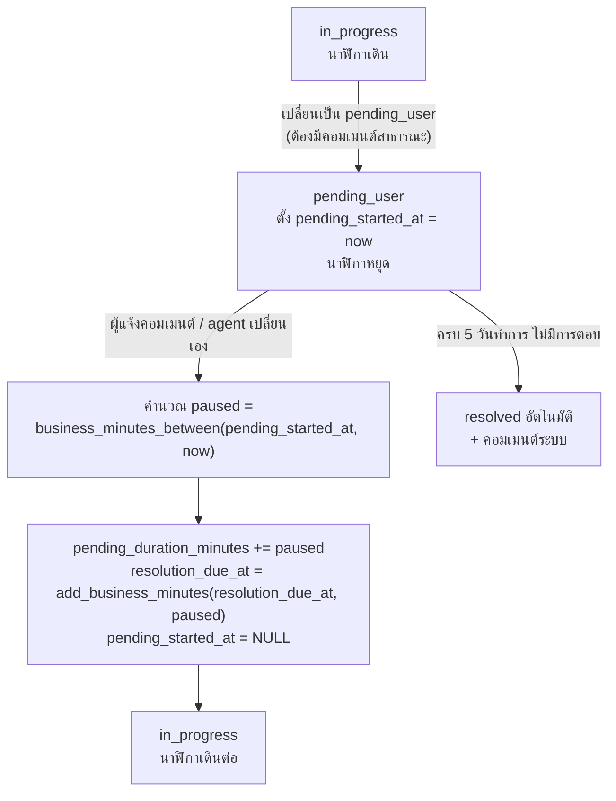

# SLA Engine — AIDC Helpdesk

| หัวข้อ | รายละเอียด |
|---|---|
| รหัสเอกสาร | BE-002 |
| เวอร์ชัน | 1.0 |
| ผู้จัดทำ | Senior Backend |
| ที่อยู่โค้ด | `backend/app/services/sla/business_time.py` และ `sla_service.py` |
| เอกสารอ้างอิง | `02-data-model.md` (3.6, 3.10, 3.11, 7), `04-rbac-sla.md` (3, 4), `01-srs.md` (FR-30…FR-36, US-05, US-11, US-12, US-17) |
| สถานะการทดสอบ | **ผ่าน 35/35 assertion (23 test function)** — ดูหัวข้อ 4 |

---

## 1. อัลกอริทึม

### 1.1 นิยามและข้อมูลนำเข้า

| สิ่งที่ต้องรู้ | มาจากไหน |
|---|---|
| เวลาทำการรายวัน | `business_hours` ของบริษัท ถ้าไม่มี → แถวที่ `company_id IS NULL` (จ.–ส. 08:00–17:00) |
| วันหยุด | `holiday` ของบริษัท **รวมกับ** `holiday` ที่ `company_id IS NULL` |
| target นาที | `sla_target.response_minutes` / `resolution_minutes` ของ policy ที่ผูกกับ ticket (`ticket.sla_policy_id` = สแนปช็อตตอนสร้าง — US-11 AC-1) |
| เวลาที่หยุดนับ | `ticket.pending_duration_minutes` + ช่วงที่กำลัง pending อยู่ (`pending_started_at`) |
| เขตเวลา | คำนวณใน `Asia/Bangkok` เสมอ แล้วเก็บ UTC ลง DB (NFR-34) |

### 1.2 หลักการของ `add_business_minutes`

```text
1. ถ้า start อยู่นอกเวลาทำการ  → เลื่อนไปที่ "เวลาเปิดทำการถัดไป" ก่อนเริ่มนับ
2. วนทีละวันจากวันนั้นไปข้างหน้า
   ก. วันนั้นเป็นวันหยุด/ไม่ใช่วันทำการ → ข้าม
   ข. คำนวณช่วงที่ใช้ได้ = [max(cursor, เวลาเปิด), เวลาปิด)
   ค. ถ้านาทีที่เหลือ <= ช่วงที่ใช้ได้ → คืน (จุดเริ่มช่วง + นาทีที่เหลือ)  → จบ
   ง. มิฉะนั้น หักช่วงนั้นออกจากนาทีที่เหลือ แล้วเลื่อน cursor ไป 00:00 ของวันถัดไป
3. ป้องกันลูปไม่รู้จบด้วยเพดาน 3,650 วัน (config ผิด = ไม่มีวันทำการเลย → โยน CalendarError)
```

**ข้อตกลงที่ต้องระบุให้ชัด (edge case ที่คนมักตีความต่างกัน)**

| กรณี | ผลลัพธ์ที่เลือก | เหตุผล |
|---|---|---|
| นาทีที่เหลือ = เวลาที่เหลือของวันพอดี | คืน **17:00 ของวันนั้น** ไม่ใช่ 08:00 วันถัดไป | ตรงกับตัวอย่าง #5 ของ SA (จ. 07:00 + 2,700 นาที = ศ. 17:00) และผู้ใช้เข้าใจง่ายกว่า |
| บวก 0 นาทีนอกเวลาทำการ | คืนเวลาเปิดทำการถัดไป | ทำให้ `add(t, 0)` = "จุดเริ่มนับจริง" ใช้ซ้ำได้ในหลายที่ |
| `start` เป็น naive datetime | โยน `ValueError` | กันบั๊ก timezone เงียบ ๆ ที่หายากที่สุดในระบบแบบนี้ |
| ช่วง `[start, end)` | end ไม่ถูกนับรวม | ทำให้ `between(a,b) + between(b,c) == between(a,c)` เสมอ |

### 1.3 การหยุดนับเมื่อ `pending_user`



| กติกา | การนำไปทำจริง |
|---|---|
| หยุดเฉพาะ `pending_user` | `state_machine` เป็นที่เดียวที่ตั้ง/ล้าง `pending_started_at` |
| response SLA ไม่หยุด | `compute_due_at()` บวก `paused_minutes` เข้าเฉพาะ resolution เท่านั้น |
| เลื่อน due ทีละรอบ = คำนวณใหม่ทั้งก้อน | พิสูจน์ด้วยเทสต์ T-16e (คุณสมบัติ associative ของ `add_business_minutes`) |
| นับได้หลายรอบ | สะสมใน `pending_duration_minutes` ไม่มีเพดานจำนวนครั้ง; ครั้งที่ ≥ 4 ถูกทำเครื่องหมายในรายงาน (นับจาก `ticket_status_history`) |

---

## 2. โค้ดจริง — `app/services/sla/business_time.py`

> โมดูลนี้ **ไม่ import SQLAlchemy / FastAPI / Redis** โดยเจตนา ทำให้ทดสอบได้เร็วมากโดยไม่ต้องมี DB
> ชั้น `calendar_loader.py` เป็นผู้แปลงแถวจาก `business_hours` + `holiday` เป็น `BusinessCalendar`

```python
"""Business-time engine สำหรับคำนวณ SLA ของ AIDC Helpdesk.

กติกาที่ยึดตาม 04-rbac-sla.md:
- นับเฉพาะ "นาทีทำการ" (business minutes) ในเขตเวลา Asia/Bangkok
- ค่าเริ่มต้น จ.-ส. 08:00-17:00 (540 นาที/วัน) อาทิตย์และวันหยุดไม่นับ
- เวลาใน DB เก็บเป็น UTC เสมอ ฟังก์ชันทั้งหมดรับ/คืน datetime ที่มี tzinfo
"""

from __future__ import annotations

from dataclasses import dataclass, field
from datetime import date, datetime, time, timedelta
from typing import Dict, FrozenSet, Optional, Tuple
from zoneinfo import ZoneInfo

BKK = ZoneInfo("Asia/Bangkok")
UTC = ZoneInfo("UTC")

# กันลูปไม่รู้จบกรณีปฏิทินไม่มีวันทำการเลย (เช่น config ผิด)
_MAX_DAYS_SCAN = 3650


class CalendarError(RuntimeError):
    """ปฏิทินทำงานผิดปกติ เช่น ไม่มีวันทำการเลยในช่วง 10 ปี"""


@dataclass(frozen=True)
class WorkingWindow:
    """ช่วงเวลาทำการของหนึ่งวัน (เวลาท้องถิ่น)"""

    start: time
    end: time

    def __post_init__(self) -> None:
        if self.start >= self.end:
            raise ValueError("start_time ต้องน้อยกว่า end_time")

    @property
    def minutes(self) -> int:
        """จำนวนนาทีทำการทั้งวัน"""
        return (self.end.hour * 60 + self.end.minute) - (
            self.start.hour * 60 + self.start.minute
        )


@dataclass(frozen=True)
class BusinessCalendar:
    """ปฏิทินเวลาทำการของบริษัทหนึ่ง

    Attributes:
        windows: dict key = day_of_week ตามรูปแบบของตาราง `business_hours`
                 (0=อาทิตย์ ... 6=เสาร์) วันที่ไม่มี key = ไม่ใช่วันทำการ
        holidays: เซตของวันหยุด (วันที่ตามเวลาท้องถิ่น) รวมวันหยุดกลาง + ของบริษัท
        tz: เขตเวลาที่ใช้ตีความเวลาทำการ (ระบบนี้ใช้ Asia/Bangkok เท่านั้น)
    """

    windows: Dict[int, WorkingWindow]
    holidays: FrozenSet[date] = field(default_factory=frozenset)
    tz: ZoneInfo = BKK

    @staticmethod
    def _dow(d: date) -> int:
        """แปลง date เป็น day_of_week แบบ DB (0=อาทิตย์ ... 6=เสาร์)"""
        return d.isoweekday() % 7

    def window_of(self, d: date) -> Optional[Tuple[datetime, datetime]]:
        """คืนช่วงเวลาทำการของวันนั้นเป็น aware datetime หรือ None ถ้าไม่ใช่วันทำการ"""
        if d in self.holidays:
            return None
        w = self.windows.get(self._dow(d))
        if w is None:
            return None
        return (
            datetime.combine(d, w.start, tzinfo=self.tz),
            datetime.combine(d, w.end, tzinfo=self.tz),
        )

    def is_working_time(self, dt: datetime) -> bool:
        """เวลานี้อยู่ในเวลาทำการหรือไม่"""
        local = _to_local(dt, self.tz)
        win = self.window_of(local.date())
        return win is not None and win[0] <= local < win[1]

    def day_minutes(self, d: date) -> int:
        """จำนวนนาทีทำการของวันนั้น (0 ถ้าไม่ใช่วันทำการ)"""
        win = self.window_of(d)
        if win is None:
            return 0
        return int((win[1] - win[0]).total_seconds() // 60)


# ---------- ปฏิทินเริ่มต้นตาม seed data (02-data-model.md 6.7) ----------

DEFAULT_WINDOWS: Dict[int, WorkingWindow] = {
    1: WorkingWindow(time(8, 0), time(17, 0)),  # จันทร์
    2: WorkingWindow(time(8, 0), time(17, 0)),  # อังคาร
    3: WorkingWindow(time(8, 0), time(17, 0)),  # พุธ
    4: WorkingWindow(time(8, 0), time(17, 0)),  # พฤหัสบดี
    5: WorkingWindow(time(8, 0), time(17, 0)),  # ศุกร์
    6: WorkingWindow(time(8, 0), time(17, 0)),  # เสาร์
}


def default_calendar(holidays: Optional[FrozenSet[date]] = None) -> BusinessCalendar:
    """ปฏิทินกลางของกลุ่ม AIDC: จ.-ส. 08:00-17:00 อาทิตย์หยุด"""
    return BusinessCalendar(
        windows=dict(DEFAULT_WINDOWS),
        holidays=holidays or frozenset(),
    )


def _to_local(dt: datetime, tz: ZoneInfo) -> datetime:
    """แปลงเป็นเวลาท้องถิ่น; ปฏิเสธ datetime ที่ไม่มี tzinfo เพื่อกันบั๊กเงียบ"""
    if dt.tzinfo is None:
        raise ValueError("ต้องส่ง datetime ที่มี tzinfo เสมอ (naive datetime ไม่รับ)")
    return dt.astimezone(tz)


# ============================================================
# ฟังก์ชันหลัก
# ============================================================


def next_working_instant(start: datetime, cal: BusinessCalendar) -> datetime:
    """หาช่วงเวลาทำการแรกที่ >= start

    ถ้า start อยู่ในเวลาทำการอยู่แล้วจะคืน start เดิม
    ถ้าอยู่นอกเวลาทำการจะคืนเวลาเปิดทำการถัดไป

    Args:
        start: เวลาเริ่ม (aware datetime)
        cal: ปฏิทินเวลาทำการของบริษัท
    Returns:
        aware datetime ในเขตเวลาของปฏิทิน
    """
    cursor = _to_local(start, cal.tz)
    for _ in range(_MAX_DAYS_SCAN):
        win = cal.window_of(cursor.date())
        if win is not None:
            win_start, win_end = win
            if cursor < win_start:
                return win_start
            if cursor < win_end:
                return cursor
        cursor = datetime.combine(
            cursor.date() + timedelta(days=1), time(0, 0), tzinfo=cal.tz
        )
    raise CalendarError("ไม่พบวันทำการภายใน 10 ปีข้างหน้า - ตรวจสอบ business_hours/holiday")


def add_business_minutes(
    start: datetime, minutes: int, cal: BusinessCalendar
) -> datetime:
    """บวก "นาทีทำการ" เข้ากับเวลาเริ่ม แล้วคืนเวลาสิ้นสุด

    ใช้คำนวณ `response_due_at` / `resolution_due_at` ของ ticket

    กติกา:
    - ถ้า `start` อยู่นอกเวลาทำการ จะเลื่อนไปเริ่มนับที่เวลาเปิดทำการถัดไปก่อน
    - ข้ามวันอาทิตย์และวันหยุดตามปฏิทินอัตโนมัติ
    - ถ้านาทีที่เหลือพอดีกับเวลาที่เหลือของวัน ผลลัพธ์จะเป็นเวลาปิดทำการของวันนั้น
      (เช่น 17:00) ไม่ใช่ 08:00 ของวันถัดไป

    Args:
        start: เวลาเริ่มนับ (aware datetime)
        minutes: จำนวนนาทีทำการที่ต้องบวก (>= 0)
        cal: ปฏิทินเวลาทำการของบริษัท
    Returns:
        aware datetime (เขตเวลาของปฏิทิน) ที่ครบกำหนด
    Raises:
        ValueError: เมื่อ minutes ติดลบ หรือ start เป็น naive datetime
    """
    if minutes < 0:
        raise ValueError("minutes ต้องไม่ติดลบ")

    cursor = next_working_instant(start, cal)
    remaining = int(minutes)
    if remaining == 0:
        return cursor

    for _ in range(_MAX_DAYS_SCAN):
        win = cal.window_of(cursor.date())
        if win is not None:
            win_start, win_end = win
            seg_start = max(cursor, win_start)
            if seg_start < win_end:
                avail = int((win_end - seg_start).total_seconds() // 60)
                if remaining <= avail:
                    return seg_start + timedelta(minutes=remaining)
                remaining -= avail
        cursor = datetime.combine(
            cursor.date() + timedelta(days=1), time(0, 0), tzinfo=cal.tz
        )
    raise CalendarError("คำนวณไม่จบภายใน 10 ปี - ตรวจสอบ business_hours/holiday")


def business_minutes_between(
    start: datetime, end: datetime, cal: BusinessCalendar
) -> int:
    """นับจำนวนนาทีทำการในช่วง [start, end)

    ใช้สำหรับ: เวลาที่ใช้ไปจริง, เวลาที่หยุดนับตอน `pending_user`,
    และค่าเฉลี่ยเวลาแก้ไขในรายงาน

    Args:
        start: เวลาเริ่ม (aware)
        end: เวลาสิ้นสุด (aware)
        cal: ปฏิทินเวลาทำการ
    Returns:
        จำนวนนาทีทำการ (int, >= 0); ถ้า end <= start จะคืน 0
    """
    s = _to_local(start, cal.tz)
    e = _to_local(end, cal.tz)
    if e <= s:
        return 0

    total = 0
    cursor_date = s.date()
    last_date = e.date()
    guard = 0
    while cursor_date <= last_date:
        guard += 1
        if guard > _MAX_DAYS_SCAN:
            raise CalendarError("ช่วงเวลาที่ขอกว้างเกิน 10 ปี")
        win = cal.window_of(cursor_date)
        if win is not None:
            win_start, win_end = win
            seg_start = max(s, win_start)
            seg_end = min(e, win_end)
            if seg_end > seg_start:
                total += int((seg_end - seg_start).total_seconds() // 60)
        cursor_date += timedelta(days=1)
    return total


def compute_due_at(
    created_at: datetime,
    response_minutes: int,
    resolution_minutes: int,
    cal: BusinessCalendar,
    paused_minutes: int = 0,
) -> Tuple[datetime, datetime]:
    """คำนวณกำหนดตอบรับและกำหนดแก้ไขเสร็จของ ticket

    ใช้ตอนสร้าง ticket และตอนเปลี่ยน priority (คำนวณใหม่จาก `created_at` เดิมเสมอ
    ตาม 04-rbac-sla.md 4.2)

    Args:
        created_at: เวลาที่สร้าง ticket (aware)
        response_minutes: SLA ตอบรับ (นาทีทำการ) จาก `sla_target.response_minutes`
        resolution_minutes: SLA แก้ไขเสร็จ (นาทีทำการ) จาก `sla_target.resolution_minutes`
        cal: ปฏิทินเวลาทำการของบริษัทเจ้าของ ticket
        paused_minutes: เวลาสะสมที่หยุดนับ (`ticket.pending_duration_minutes`)
                        บวกเข้าเฉพาะ resolution เท่านั้น - response SLA ไม่หยุดนับ
    Returns:
        (response_due_at, resolution_due_at) เป็น aware datetime
    """
    response_due = add_business_minutes(created_at, response_minutes, cal)
    resolution_due = add_business_minutes(
        created_at, resolution_minutes + max(0, paused_minutes), cal
    )
    return response_due, resolution_due


def elapsed_working_minutes(
    created_at: datetime,
    now: datetime,
    cal: BusinessCalendar,
    paused_minutes: int = 0,
    pending_started_at: Optional[datetime] = None,
) -> int:
    """นาทีทำการที่ "เดินไปแล้ว" ของ ticket หนึ่งใบ (หักเวลาที่หยุดนับออก)

    ใช้คำนวณ `sla_status` และเปอร์เซ็นต์ที่ใช้ไปสำหรับ escalation 75%

    Args:
        created_at: เวลาสร้าง ticket
        now: เวลาปัจจุบัน (หรือ `resolved_at` เมื่อคิดย้อนหลัง)
        cal: ปฏิทินเวลาทำการ
        paused_minutes: `ticket.pending_duration_minutes` ที่สะสมไว้แล้ว
        pending_started_at: ถ้า ticket กำลังอยู่สถานะ `pending_user`
                            ให้ส่งค่า `ticket.pending_started_at` มาด้วย
                            ระบบจะหักช่วงที่กำลังหยุดอยู่ออกให้ด้วย
    Returns:
        จำนวนนาทีทำการที่ใช้ไปจริง (>= 0)
    """
    gross = business_minutes_between(created_at, now, cal)
    paused = max(0, paused_minutes)
    if pending_started_at is not None:
        paused += business_minutes_between(pending_started_at, now, cal)
    return max(0, gross - paused)


# ============================================================
# ฟังก์ชันประกอบสำหรับชั้น service
# ============================================================


def sla_status(
    *,
    status: str,
    created_at: datetime,
    resolution_due_at: Optional[datetime],
    now: datetime,
    cal: BusinessCalendar,
    resolution_minutes: int,
    paused_minutes: int = 0,
    pending_started_at: Optional[datetime] = None,
) -> str:
    """คำนวณสถานะ SLA ที่แสดงบน UI - `on_track` / `at_risk` / `breached` / `paused`

    ไม่เก็บลงฐานข้อมูล คำนวณตอนอ่านข้อมูลเสมอ (04-rbac-sla.md 4.2)
    """
    if status == "pending_user":
        return "paused"
    if status in ("resolved", "closed", "cancelled") or resolution_due_at is None:
        return "on_track"
    if now > resolution_due_at:
        return "breached"
    used = elapsed_working_minutes(
        created_at, now, cal, paused_minutes, pending_started_at
    )
    budget = resolution_minutes + max(0, paused_minutes)
    if budget <= 0:
        return "on_track"
    remaining_ratio = 1.0 - (used / budget)
    return "at_risk" if remaining_ratio <= 0.20 else "on_track"


def resume_from_pending(
    *,
    pending_started_at: datetime,
    resumed_at: datetime,
    current_resolution_due_at: datetime,
    current_paused_minutes: int,
    cal: BusinessCalendar,
) -> Tuple[int, datetime]:
    """คำนวณค่าใหม่เมื่อ ticket ออกจากสถานะ `pending_user`

    Returns:
        (pending_duration_minutes ใหม่, resolution_due_at ใหม่)
    """
    paused = business_minutes_between(pending_started_at, resumed_at, cal)
    new_total = current_paused_minutes + paused
    new_due = add_business_minutes(current_resolution_due_at, paused, cal)
    return new_total, new_due
```

### 2.1 `calendar_loader.py` — เชื่อมกับฐานข้อมูล

```python
CALENDAR_CACHE_TTL = 600  # 10 นาที


async def load_calendar(db, redis, company_id: int) -> BusinessCalendar:
    """โหลดปฏิทินของบริษัท (business_hours + holiday) พร้อม cache บน Redis

    ลำดับความสำคัญ: แถวของบริษัทเอง > แถว company_id IS NULL
    วันหยุดใช้ "ผลรวม" ของทั้งสองระดับ (วันหยุดกลาง + วันหยุดเฉพาะบริษัท)
    """
    key = f"cal:{company_id}"
    if (cached := await redis.get(key)) is not None:
        return _decode(cached)

    rows = await db.execute(
        select(BusinessHours).where(
            BusinessHours.company_id.in_([company_id, None])
        )
    )
    windows: dict[int, WorkingWindow] = {}
    for row in sorted(rows.scalars(), key=lambda r: r.company_id is not None):
        # แถวของบริษัทมาทีหลัง จึงเขียนทับแถวกลาง
        if row.is_working_day:
            windows[row.day_of_week] = WorkingWindow(row.start_time, row.end_time)
        else:
            windows.pop(row.day_of_week, None)

    hol = await db.execute(
        select(Holiday.holiday_date).where(Holiday.company_id.in_([company_id, None]))
    )
    cal = BusinessCalendar(windows=windows, holidays=frozenset(hol.scalars()))
    await redis.setex(key, CALENDAR_CACHE_TTL, _encode(cal))
    return cal


async def invalidate_calendar(redis, company_id: int | None) -> None:
    """เรียกทุกครั้งที่แก้ business_hours หรือ holiday

    company_id = None (แก้ค่ากลาง) → ล้าง cache ของทุกบริษัท
    """
    if company_id is None:
        await redis.delete(*[f"cal:{cid}" for cid in ALL_COMPANY_IDS])
    else:
        await redis.delete(f"cal:{company_id}")
```

---

## 3. ฟิลด์ SLA ใน `ticket` (ตรงกับ `02-data-model.md` 3.6)

| field | ชนิด | ใครเขียน | เมื่อไร |
|---|---|---|---|
| `sla_policy_id` | bigint | `ticket_service.create()` | ตอนสร้าง — สแนปช็อต policy (US-11 AC-1: แก้ SLA แล้วไม่กระทบ ticket เดิม) |
| `response_due_at` | timestamptz | `compute_due_at()` | ตอนสร้าง และตอนเปลี่ยน priority |
| `resolution_due_at` | timestamptz | `compute_due_at()` / `resume_from_pending()` | ตอนสร้าง, เปลี่ยน priority, ออกจาก `pending_user`, กลับจาก `resolved`→`in_progress` |
| `first_response_at` | timestamptz | `comment_service` | คอมเมนต์**สาธารณะ**ครั้งแรกจากผู้ที่ไม่ใช่ requester (การ assign ไม่นับ) |
| `pending_started_at` | timestamptz | `state_machine` | เข้าสถานะ `pending_user`; ตั้งเป็น NULL เมื่อออก |
| `pending_duration_minutes` | int | `resume_from_pending()` | สะสมทุกครั้งที่ออกจาก `pending_user` |
| `resolved_at` | timestamptz | `state_machine` | เข้าสถานะ `resolved` (เคลียร์เมื่อกลับไป `in_progress`) |
| `closed_at` / `closed_by` | timestamptz / bigint | `state_machine` / `auto_close_resolved` | `closed_by = NULL` = ระบบปิดอัตโนมัติ |
| `is_response_breached` | boolean | `scan_sla` และตอนตั้ง `first_response_at` | true เมื่อ `first_response_at > response_due_at` หรือยังไม่ตอบและเลย due |
| `is_resolution_breached` | boolean | `scan_sla` และตอน `resolved` | true เมื่อ `resolved_at > resolution_due_at` หรือยังไม่เสร็จและเลย due |
| `escalation_notified_at` | timestamptz | `scan_sla` | กันแจ้งเตือน 75% ซ้ำ (แจ้งครั้งเดียวต่อ ticket) |

> **ไม่มีคอลัมน์ `sla_status` ในฐานข้อมูล** — คำนวณตอนอ่านด้วย `sla_status()` ตามที่ SA กำหนด (04-rbac-sla.md 4.2)
> **หมายเหตุ:** `03-api-spec.md` 3.4 ใช้ชื่อ `paused_at` ในผลลัพธ์ JSON ขณะที่ data model ใช้ `pending_started_at` — BE จะ map `pending_started_at → sla.paused_at` ที่ชั้น schema (ดูประเด็น S-01)

### 3.1 ลำดับการทำงานตอนเปลี่ยน priority (US-17)

```python
async def change_priority(self, ticket, new_priority: str, reason: str, actor):
    cal = await load_calendar(self.db, self.redis, ticket.company_id)
    target = await self.sla_repo.target(ticket.sla_policy_id, new_priority)
    # คำนวณใหม่จาก created_at เดิมเสมอ + คง pending ที่สะสมไว้
    resp_due, reso_due = compute_due_at(
        ticket.created_at, target.response_minutes, target.resolution_minutes,
        cal, paused_minutes=ticket.pending_duration_minutes,
    )
    ticket.priority = new_priority
    ticket.response_due_at, ticket.resolution_due_at = resp_due, reso_due
    now = utcnow()
    # ถ้ายกระดับแล้วเกินกำหนดทันที ให้ทำเครื่องหมาย breach และบันทึกเหตุผล
    if ticket.first_response_at is None and now > resp_due:
        ticket.is_response_breached = True
    if ticket.resolved_at is None and now > reso_due:
        ticket.is_resolution_breached = True
    await self.history.record(ticket, from_priority=..., to_priority=new_priority,
                              reason=reason, changed_by=actor.id)
```

---

## 4. ผลการทดสอบจริง

รันด้วย `python3 tests/unit/test_business_time.py` (ตัว runner ในไฟล์เดียวกัน) และ `pytest tests/unit -q`
**ผลลัพธ์: 35 assertion / 23 test function / ล้มเหลว 0**

> วันที่อ้างอิงในตาราง: 2026-08-31 = จันทร์, 2026-09-04 = ศุกร์, 2026-09-05 = เสาร์, 2026-09-06 = อาทิตย์

| # | สิ่งที่ทดสอบ | อินพุต | ผลที่คาดหวัง | ผลจริง | สถานะ |
|---|---|---|---|---|---|
| T-01 | นับต่อเนื่องในวันเดียว | จ. 31/08 09:00 + 240 (critical) | จ. 13:00 | `2026-08-31T13:00+07:00` | PASS |
| T-02 | ข้ามวัน ศุกร์→เสาร์ | ศ. 04/09 16:00 + 480 (high) | ส. 15:00 | `2026-09-05T15:00+07:00` | PASS |
| T-03 | ข้ามวันอาทิตย์ | ส. 05/09 16:30 + 480 | จ. 15:30 | `2026-09-07T15:30+07:00` | PASS |
| T-04 | เริ่มวันอาทิตย์ (นอกวันทำการ) | อา. 06/09 10:00 + 1440 (medium) | พ. 14:00 | `2026-09-09T14:00+07:00` | PASS |
| T-05 | เริ่มก่อนเวลาเปิด | จ. 31/08 07:00 + 2700 (low) | ศ. 17:00 | `2026-09-04T17:00+07:00` | PASS |
| T-06 | เริ่มหลังเวลาปิด | จ. 31/08 19:00 + 240 | อ. 12:00 | `2026-09-01T12:00+07:00` | PASS |
| T-07 | ข้ามวันหยุดนักขัตฤกษ์ 2 วันติด | อ. 11/08 16:00 + 120 (หยุด 12–13/08) | ศ. 14/08 09:00 | `2026-08-14T09:00+07:00` | PASS |
| T-08 | นาทีลงตัวพอดีเวลาปิด | จ. 08:00 + 540 | จ. 17:00 (ไม่ใช่ อ. 08:00) | `2026-08-31T17:00+07:00` | PASS |
| T-09 | บวก 0 นาทีนอกเวลาทำการ | อา. 06/09 10:00 + 0 | จ. 08:00 | `2026-09-07T08:00+07:00` | PASS |
| T-10 | นับนาทีทำการคร่อมหัว-ท้ายวัน | จ. 07:00 → จ. 18:00 | 540 | `540` | PASS |
| T-11 | นับนาทีทำการข้ามวันอาทิตย์ | ส. 16:30 → จ. 09:00 | 90 (30 + 60) | `90` | PASS |
| T-12 | `end <= start` | จ. 09:00 → ส. 09:00 (ย้อน) | 0 (ไม่ติดลบ) | `0` | PASS |
| T-13 | คุณสมบัติผกผัน add/between | ส. 29/08 16:45 + 1000 แล้วนับกลับ | 1000 | `1000` | PASS |
| T-14 | `compute_due_at` critical (30/240) | จ. 09:15 | resp จ. 09:45 / reso จ. 13:15 | ตรงทั้งคู่ | PASS |
| T-15 | pause เลื่อนเฉพาะ resolution | จ. 09:00 medium + paused 540 | resp ไม่ขยับ / reso พฤ. 03/09 15:00 | ตรงทั้งคู่ | PASS |
| T-16 | **pause/resume 2 รอบ** | pause อ.09:00→พ.09:00 แล้ว พฤ.10:00→ศ.10:00 | สะสม 1080 นาที, due ศ. 04/09 15:00 | ตรงทุกข้อ (5 assertion) | PASS |
| T-16e | เลื่อนทีละรอบ = คำนวณใหม่ทั้งก้อน | เทียบ 2 วิธี | เท่ากัน | `2026-09-04T15:00+07:00` | PASS |
| T-17 | **เปลี่ยน priority กลางคัน** | medium → critical, created จ. 09:00 | due ใหม่ จ. 13:00 (จาก created เดิม) และ breach ทันทีถ้าเลย 13:00 | ตรงทั้ง 3 assertion | PASS |
| T-18 | `elapsed` หักเวลา pause | จ.09:00→พ.09:00, paused 540 | ดิบ 1080 / สุทธิ 540 | `1080` / `540` | PASS |
| T-19 | `elapsed` ระหว่างกำลัง pending | pending ตั้งแต่ จ. 15:00 ถึง อ. 09:00 | 360 | `360` | PASS |
| T-20 | สถานะ SLA บน UI ครบ 4 ค่า | in_progress ที่เวลาต่าง ๆ + pending_user | on_track / at_risk / breached / paused | ตรงทั้ง 4 | PASS |
| T-21 | รับ input เป็น UTC | `2026-08-31T02:00Z` + 240 | จ. 13:00 +07:00 | `2026-08-31T13:00+07:00` | PASS |
| T-22 | ปฏิทินเฉพาะบริษัท (จ.–ศ. 09:00–18:00) | ศ. 17:00 + 120 | จ. 10:00 | `2026-09-07T10:00+07:00` | PASS |
| T-23 | ปฏิเสธ naive datetime | `datetime(2026,8,31,9,0)` | โยน `ValueError` | โยนจริง | PASS |

### 4.1 ผลลัพธ์ดิบจากการรัน

```text
เคส     ผล    คำอธิบาย                                     ค่าที่ได้
--------------------------------------------------------------------------------
T-01    PASS  นับต่อเนื่องในวันเดียว                       2026-08-31T13:00:00+07:00
T-02    PASS  ข้ามวัน ศุกร์->เสาร์                         2026-09-05T15:00:00+07:00
T-03    PASS  ข้ามวันอาทิตย์                               2026-09-07T15:30:00+07:00
T-04    PASS  เริ่มวันอาทิตย์ (นอกวันทำการ)                2026-09-09T14:00:00+07:00
T-05    PASS  เริ่มก่อนเวลาเปิดทำการ                       2026-09-04T17:00:00+07:00
T-06    PASS  เริ่มหลังเวลาปิดทำการ                        2026-09-01T12:00:00+07:00
T-07    PASS  ข้ามวันหยุดนักขัตฤกษ์ 2 วัน                  2026-08-14T09:00:00+07:00
T-08    PASS  นาทีลงตัวพอดีเวลาปิด                         2026-08-31T17:00:00+07:00
T-09    PASS  บวก 0 นาที นอกเวลาทำการ                      2026-09-07T08:00:00+07:00
T-10    PASS  นับนาทีทำการในวันเดียว (คร่อมหัวท้าย)        540
T-11    PASS  นับนาทีทำการข้ามวันอาทิตย์                   90
T-12    PASS  end <= start คืน 0                           0
T-13    PASS  add/between ผกผันกัน                         1000
T-14a   PASS  response_due_at critical                     2026-08-31T09:45:00+07:00
T-14b   PASS  resolution_due_at critical                   2026-08-31T13:15:00+07:00
T-15a   PASS  response ไม่ขยับเมื่อ pause                  2026-08-31T13:00:00+07:00
T-15b   PASS  resolution เลื่อนไป 1 วันทำการ               2026-09-03T15:00:00+07:00
T-16a   PASS  pause รอบ 1 สะสม 540 นาที                    540
T-16b   PASS  due หลัง resume รอบ 1                        2026-09-03T15:00:00+07:00
T-16c   PASS  pause สะสม 2 รอบ = 1080 นาที                 1080
T-16d   PASS  due หลัง resume รอบ 2                        2026-09-04T15:00:00+07:00
T-16e   PASS  เลื่อนทีละรอบ == คำนวณใหม่ทั้งก้อน           2026-09-04T15:00:00+07:00
T-17a   PASS  due เดิม (medium)                            2026-09-02T15:00:00+07:00
T-17b   PASS  due ใหม่ (critical) จาก created_at เดิม      2026-08-31T13:00:00+07:00
T-17c   PASS  เปลี่ยนแล้วเกินกำหนดทันที                    True
T-18a   PASS  elapsed ดิบ                                  1080
T-18b   PASS  elapsed หัก pause 540                        540
T-19    PASS  elapsed ระหว่างกำลัง pending                 360
T-20a   PASS  on_track                                     on_track
T-20b   PASS  at_risk (เหลือ <= 20%)                       at_risk
T-20c   PASS  breached                                     breached
T-20d   PASS  paused                                       paused
T-21    PASS  รับ UTC แล้วคำนวณในโซนไทย                    2026-08-31T13:00:00+07:00
T-22    PASS  ปฏิทินเฉพาะบริษัท จ.-ศ. 09:00-18:00          2026-09-07T10:00:00+07:00
T-23    PASS  ปฏิเสธ naive datetime                        True
--------------------------------------------------------------------------------
รวม 35 assertion / 23 test function / ล้มเหลว 0
```

### 4.2 การเทียบกับตารางตัวอย่างของ SA

| ตัวอย่างใน `04-rbac-sla.md` 3.3 | เคสที่ตรงกัน | ผล |
|---|---|---|
| #1 จ. 09:00 critical → จ. 13:00 | T-01 | ตรง |
| #2 ศ. 16:00 high → ส. 15:00 | T-02 | ตรง |
| #3 ส. 16:30 high → จ. 15:30 (= US-11 AC-3) | T-03 | ตรง |
| #4 อา. 10:00 medium → พ. 14:00 | T-04 | ตรง |
| #5 จ. 07:00 low → ศ. 17:00 | T-05 | ตรง |
| #6 pause 540 นาที → เลื่อน due 1 วันทำการ | T-15, T-16 | ตรง |

---

## 5. งาน Scheduled

### 5.1 ตารางงาน

| task | ความถี่ (cron) | หน้าที่ | เวลาที่คาดว่าใช้ |
|---|---|---|---|
| `scan_sla` | ทุก 5 นาที `*/5 * * * *` | หา ticket ใกล้ breach / breach แล้ว → ตั้งธง + สร้าง notification | < 2 วิ ที่ 30,000 ticket/ปี |
| `auto_close_resolved` | ทุกวัน 06:00 | `resolved` ครบ 3 วันทำการ → `closed`, `closed_by = NULL` | < 5 วิ |
| `auto_resolve_pending` | ทุกวัน 06:00 | `pending_user` ครบ 5 วันทำการ → `resolved` + คอมเมนต์ระบบ | < 5 วิ |
| `escalate_stale_breach` | ทุกวัน 09:00 | L3 (เกินกำหนด ≥ 1 วันทำการ) แจ้ง super_admin วันละครั้ง | < 5 วิ |
| `cleanup_orphan_attachments` | ทุกวัน 03:00 | ลบไฟล์ที่อัปโหลดแล้วไม่ผูกกับอะไรเกิน 24 ชม. | < 10 วิ |

### 5.2 `scan_sla` — ตรรกะ

```python
@celery_app.task(name="sla.scan", bind=True, acks_late=True,
                 max_retries=2, soft_time_limit=120)
def scan_sla(self) -> dict:
    """สแกน ticket ที่ยังเปิดอยู่ เพื่อตั้งธง breach และแจ้งเตือน escalation

    ข้ามทุก ticket ที่สถานะ pending_user (04-rbac-sla.md 4.2)
    idempotent: การรันซ้ำในนาทีเดียวกันไม่สร้าง notification ซ้ำ
    """
    lock = redis.lock("lock:scan_sla", timeout=240, blocking_timeout=0)
    if not lock.acquire(blocking=False):
        log.info("scan_sla_skipped", reason="another run in progress")
        return {"skipped": True}
    try:
        now = utcnow()
        stats = {"warned": 0, "response_breached": 0, "resolution_breached": 0}
        # ใช้ index idx_ticket_due; batch ละ 500 กัน memory พุ่ง
        for batch in iter_open_tickets(batch_size=500):
            for t in batch:
                if t.status == "pending_user":
                    continue
                cal = calendar_of(t.company_id)          # cache ต่อ company
                target = target_of(t.sla_policy_id, t.priority)

                # 1) response breach
                if t.first_response_at is None and now > t.response_due_at \
                        and not t.is_response_breached:
                    t.is_response_breached = True
                    stats["response_breached"] += 1
                    notify(t, "sla_breached", audience=["assignee", "company_admin"])

                # 2) resolution breach
                if now > t.resolution_due_at and not t.is_resolution_breached:
                    t.is_resolution_breached = True
                    stats["resolution_breached"] += 1
                    notify(t, "sla_breached", audience=["assignee", "company_admin"])

                # 3) เตือนล่วงหน้า 75% — แจ้งครั้งเดียวต่อ ticket
                elif t.escalation_notified_at is None:
                    used = elapsed_working_minutes(
                        t.created_at, now, cal, t.pending_duration_minutes
                    )
                    budget = target.resolution_minutes + t.pending_duration_minutes
                    if budget and used * 100 >= budget * target.escalation_percent:
                        t.escalation_notified_at = now
                        stats["warned"] += 1
                        notify(t, "sla_warning", audience=["assignee"])
            db.commit()
        return stats
    finally:
        lock.release()
```

**คิวรีที่ใช้ดึงงาน (ใช้ `idx_ticket_due`)**

```sql
SELECT id, company_id, status, priority, created_at, sla_policy_id,
       response_due_at, resolution_due_at, first_response_at,
       pending_duration_minutes, is_response_breached, is_resolution_breached,
       escalation_notified_at, assignee_id
FROM ticket
WHERE deleted_at IS NULL
  AND status NOT IN ('resolved', 'closed', 'cancelled', 'pending_user')
  AND (
        resolution_due_at <= now() + interval '1 day'   -- ใกล้ครบหรือเกินแล้ว
        OR (first_response_at IS NULL AND response_due_at <= now())
      )
ORDER BY id
LIMIT 500 OFFSET :offset;
```

### 5.3 การกัน job ซ้ำ และ idempotency

| ความเสี่ยง | มาตรการ |
|---|---|
| beat ยิงซ้อนขณะรอบก่อนยังไม่จบ | Redis lock `lock:scan_sla` แบบ non-blocking (`timeout=240` > ความถี่ 300 วิ) — รอบใหม่ข้ามไปเลย ไม่รอ |
| worker หลายตัวรับ task เดียวกัน | lock ตัวเดียวกันครอบทั้งหมด + `acks_late=True` เพื่อให้ task ที่ตายกลางคันถูกส่งใหม่ |
| แจ้งเตือน 75% ซ้ำ | ธง `escalation_notified_at` ในแถว ticket (ไม่ใช่ใน Redis) — รอด restart, รอด flush cache |
| แจ้ง breach ซ้ำ | ธง `is_response_breached` / `is_resolution_breached` เป็นเงื่อนไขก่อนแจ้ง |
| L3 ต้องแจ้งวันละครั้ง (ไม่ใช่ครั้งเดียว) | คีย์ Redis `escl3:{ticket_id}:{yyyy-mm-dd}` TTL 36 ชม. + งานรันวันละครั้งอยู่แล้ว |
| notification ซ้ำจาก retry ของ Celery | `notification` มี UNIQUE partial index `(user_id, ticket_id, event_type, channel)` เมื่อ `created_at::date = today` — **ต้องขอ SA เพิ่ม index นี้** (ดูประเด็น S-04) |
| beat ตายเงียบ | metric `last_scan_sla_at` ใน Redis; `/api/v1/health` รายงานว่าเกิน 15 นาทีไม่มีการสแกน = `degraded` |
| นาฬิกาเครื่องเพี้ยน | container ทุกตัวใช้ UTC และ sync NTP กับ host (ดู `13-deployment.md`) |

### 5.4 `auto_close_resolved` / `auto_resolve_pending`

```python
@celery_app.task(name="sla.auto_close_resolved")
def auto_close_resolved() -> int:
    """ปิด ticket ที่ resolved ครบ 3 วันทำการ (FR-19, D-08)

    ใช้ business_minutes_between เทียบกับ 3 x 540 = 1,620 นาทีทำการ
    ไม่ใช่ 3 วันตามปฏิทิน เพื่อไม่ให้วันหยุดยาวกินโควตาของผู้แจ้ง
    """
    closed = 0
    for t in resolved_tickets_older_than_hint(days=3):
        cal = calendar_of(t.company_id)
        if business_minutes_between(t.resolved_at, utcnow(), cal) >= 3 * 540:
            state_machine.transition(t, "closed", actor=None,
                                     reason="ระบบปิดอัตโนมัติ (ไม่มีการตอบกลับ)")
            closed += 1
    db.commit()
    return closed
```

> เกณฑ์ "5 วันทำการ" ของ `auto_resolve_pending` ใช้วิธีเดียวกัน (`5 * 540 = 2,700` นาทีทำการ นับจาก `pending_started_at`)

---

## 6. ประเด็นที่ต้องคุยกับ SA

| # | ประเด็น | รายละเอียด | ข้อเสนอของ BE |
|---|---|---|---|
| S-01 | ชื่อฟิลด์ไม่ตรงกัน | `03-api-spec.md` 3.4 คืน `sla.paused_at` และ `sla.pending_duration_minutes` แต่ data model ใช้ `pending_started_at` | คง DB ตามเดิม แล้ว map ที่ชั้น schema — ขอ SA ยืนยันว่าชื่อใน JSON คือ `paused_at` |
| S-02 | "1 วันทำการ" ในกฎ escalation L3 | `04-rbac-sla.md` 4.3 บอก "เกินกำหนดมาแล้ว ≥ 1 วันทำการ" — ต้องรู้ว่า 1 วันทำการ = 540 นาทีทำการ ใช่หรือไม่ | BE ใช้ 540 นาทีทำการ (ไม่ใช่ 24 ชม.ปฏิทิน) — ขอยืนยัน |
| S-03 | `resolved → in_progress` (ผู้แจ้งบอกยังไม่หาย) | data model 4.1 บอก "คำนวณ due ใหม่จากเวลาที่กลับมา" ซึ่งขัดกับหลัก "คำนวณจาก created_at เสมอ" ที่ใช้กับ priority | เสนอให้ปฏิบัติเหมือน reopen: บวกเวลาที่อยู่ในสถานะ `resolved` เข้า `pending_duration_minutes` แล้วเลื่อน due ออก — ทำให้มีสูตรเดียวทั้งระบบ |
| S-04 | ไม่มี unique constraint กัน notification ซ้ำ | Celery retry อาจสร้างแถวซ้ำ | ขอเพิ่ม partial unique index บน `notification` ตามหัวข้อ 5.3 |
| S-05 | `escalation_percent` เก็บที่ `sla_target` รายบริษัทได้ แต่ UI/API `PUT /sla/policies/{id}/targets` รับครบ 4 priority | ถ้า company_admin แก้ไม่ได้ (D-04) ก็ไม่มีใครแก้ค่านี้นอกจาก super_admin — สอดคล้องกันดี | ไม่มีปัญหา แค่ยืนยัน |
| S-06 | ticket ที่สร้างก่อนมี `sla_target` ของ priority นั้น | ถ้า policy ขาด target ของ priority ใด `compute_due_at` จะทำงานไม่ได้ | เสนอ: `PUT targets` บังคับครบ 4 priority (มีอยู่แล้วใน API spec) + migration ตรวจสอบตอน seed + fallback ไป policy กลางถ้าหาไม่เจอ |
| S-07 | นับ `pending_user` เกิน 3 ครั้ง | ไม่มีคอลัมน์ counter | นับจาก `ticket_status_history` ตอนทำรายงาน (ปริมาณน้อย ไม่กระทบ performance) |
