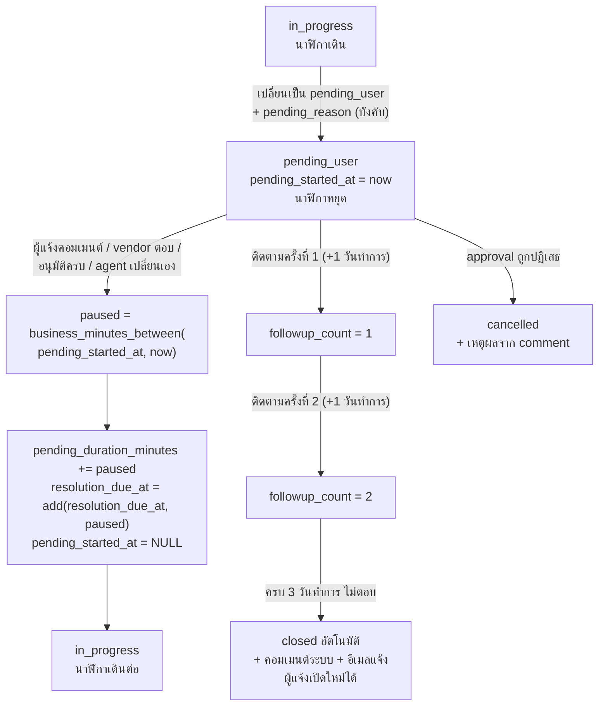

# SLA Engine — AIDC Helpdesk

| หัวข้อ | รายละเอียด |
|---|---|
| รหัสเอกสาร | BE-002 |
| เวอร์ชัน | **2.0** |
| ผู้จัดทำ | Senior Backend |
| ที่อยู่โค้ด | `backend/app/services/sla/business_time.py` และ `sla_service.py` |
| เอกสารอ้างอิง | `02-data-model.md` **v2.0** · `04-rbac-sla.md` **v2.0** §3–4 · `05-sla-policy-alignment.md` |
| สถานะการทดสอบ | **ต้องรันใหม่ทั้งชุด** — ค่าคาดหวังเดิม 23 เคสใช้ไม่ได้แล้วเพราะเสาร์ไม่ใช่วันทำการ (ดูหัวข้อ 5) |

---

## 0. สรุปการเปลี่ยนแปลงจากเวอร์ชัน 1.0

| # | สิ่งที่เปลี่ยน | ผลต่อโค้ด |
|---|---|---|
| 1 | ปฏิทินเริ่มต้น **จ.–ส. 08:00–17:00 → จ.–ศ. 08:30–17:30** | `DEFAULT_WINDOWS` · **ทุกค่าคาดหวังของเทสต์เปลี่ยนหมด** |
| 2 | เพิ่ม **2 โหมดนาฬิกา** — `business_hours` / `calendar_24x7` (P1) | `compute_due_at()` แตกสาขา · `sla_status()` · `scan_sla` |
| 3 | เปลี่ยน priority → คำนวณใหม่จาก **`priority_changed_at`** ไม่ใช่ `created_at` | `change_priority()` — **แก้ตรงข้ามกับ v1.0** |
| 4 | เพิ่ม **workaround** — หยุดนาฬิกา resolution ของ incident | `sla_status()` ใช้ `min(now, workaround_at)` |
| 5 | เพิ่ม **`sla_exclusion_code`** — ข้ามการประเมิน breach และ KPI | `scan_sla` |
| 6 | เพิ่ม **`sla_clock_started_at`** — คำขอที่ต้องอนุมัติเริ่มนับหลังอนุมัติครบ | `start_clock_after_approval()` |
| 7 | เพิ่ม **รอบรายงานสถานะ** | งานใหม่ `status_report_reminder` |
| 8 | เปลี่ยนกลไกปิดเมื่อผู้แจ้งไม่ตอบ | **ยกเลิก `auto_resolve_pending`** → `followup_pending` + `auto_close_unresponsive` |
| 9 | `resolved → in_progress` ใช้สูตรเดียวกับ pause | ปิดประเด็น S-03 |
| 10 | ปิดประเด็น **S-02** | 1 วันทำการ = **540 นาทีทำการ** (ยืนยันโดยเอกสาร) |

---

## 1. อัลกอริทึม

### 1.1 ข้อมูลนำเข้า

| สิ่งที่ต้องรู้ | มาจากไหน |
|---|---|
| เวลาทำการ | `business_hours` ของบริษัท ถ้าไม่มี → แถวที่ `company_id IS NULL` (**จ.–ศ. 08:30–17:30**) |
| วันหยุด | `holiday` ของบริษัท **รวมกับ** `holiday` ที่ `company_id IS NULL` |
| target นาที | `sla_target` ของ policy ที่ผูกกับ ticket (`ticket.sla_policy_id` = สแนปช็อต) · **หรือ** `service_catalog_item.target_minutes` เมื่อเป็นคำขอบริการ |
| **โหมดนาฬิกา** | `sla_target.clock_mode` — `calendar_24x7` สำหรับ P1 |
| **จุดเริ่มนับ** | `priority_changed_at` → `sla_clock_started_at` → `created_at` (ตามลำดับ) |
| เวลาที่หยุดนับ | `pending_duration_minutes` + ช่วงที่กำลัง pending (`pending_started_at`) |
| เขตเวลา | คำนวณใน `Asia/Bangkok` เสมอ แล้วเก็บ UTC ลง DB |

### 1.2 หลักการของ `add_business_minutes`

```text
1. ถ้า start อยู่นอกเวลาทำการ  → เลื่อนไปที่ "เวลาเปิดทำการถัดไป" ก่อนเริ่มนับ
2. วนทีละวันจากวันนั้นไปข้างหน้า
   ก. วันนั้นเป็นวันหยุด/ไม่ใช่วันทำการ → ข้าม
   ข. ช่วงที่ใช้ได้ = [max(cursor, เวลาเปิด), เวลาปิด)
   ค. ถ้านาทีที่เหลือ <= ช่วงที่ใช้ได้ → คืน (จุดเริ่มช่วง + นาทีที่เหลือ) → จบ
   ง. มิฉะนั้น หักช่วงนั้นออก แล้วเลื่อน cursor ไป 00:00 ของวันถัดไป
3. ป้องกันลูปไม่รู้จบด้วยเพดาน 3,650 วัน
```

**ข้อตกลง edge case (คงเดิมจาก v1.0)**

| กรณี | ผลลัพธ์ | เหตุผล |
|---|---|---|
| นาทีที่เหลือ = เวลาที่เหลือของวันพอดี | คืน **17:30 ของวันนั้น** ไม่ใช่ 08:30 วันถัดไป | ผู้ใช้เข้าใจง่ายกว่า และตรงกับตัวอย่างในเอกสารควบคุม |
| บวก 0 นาทีนอกเวลาทำการ | คืนเวลาเปิดทำการถัดไป | ทำให้ `add(t, 0)` = "จุดเริ่มนับจริง" |
| `start` เป็น naive datetime | โยน `ValueError` | กันบั๊ก timezone เงียบ ๆ |
| ช่วง `[start, end)` | end ไม่ถูกนับรวม | ทำให้ `between(a,b) + between(b,c) == between(a,c)` เสมอ |

### 1.3 การหยุดนับเวลา



| กติกา | การนำไปทำจริง |
|---|---|
| หยุดเฉพาะ `pending_user` | `state_machine` เป็นที่เดียวที่ตั้ง/ล้าง `pending_started_at` |
| **`pending_reason='vendor'` ต้องแจ้งผู้รับบริการก่อน** | ปฏิเสธการเข้าสถานะถ้าไม่มีคอมเมนต์สาธารณะ → ตั้ง `pending_notified_at` |
| response SLA ไม่หยุด | `compute_due_at()` บวก `paused_minutes` เข้าเฉพาะ resolution |
| เลื่อน due ทีละรอบ = คำนวณใหม่ทั้งก้อน | พิสูจน์ด้วยเทสต์ T-16e (คุณสมบัติ associative) |
| **workaround หยุดนาฬิกาถาวร** | `sla_status()` ใช้ `min(now, workaround_at)` — ไม่ใช่การ pause ที่กลับมานับต่อ |

---

## 2. โค้ดจริง — `app/services/sla/business_time.py`

> โมดูลนี้ **ไม่ import SQLAlchemy / FastAPI / Redis** โดยเจตนา ทดสอบได้เร็วโดยไม่ต้องมี DB
> ชั้น `calendar_loader.py` เป็นผู้แปลงแถวจาก `business_hours` + `holiday` เป็น `BusinessCalendar`

```python
"""Business-time engine สำหรับคำนวณ SLA ของ AIDC Helpdesk.

กติกาที่ยึดตาม AIDC-IT-SLA-001 v1.1 (ผ่าน 04-rbac-sla.md v2.0):
- P2-P4 นับเฉพาะ "นาทีทำการ" ในเขตเวลา Asia/Bangkok
- P1 นับต่อเนื่อง 24x7 (มีทีม On-call)
- ค่าเริ่มต้น จ.-ศ. 08:30-17:30 (540 นาที/วัน) เสาร์-อาทิตย์และวันหยุดไม่นับ
- เวลาใน DB เก็บเป็น UTC เสมอ ฟังก์ชันทั้งหมดรับ/คืน datetime ที่มี tzinfo
"""

from __future__ import annotations

from dataclasses import dataclass, field
from datetime import date, datetime, time, timedelta
from enum import Enum
from typing import Dict, FrozenSet, Optional, Tuple
from zoneinfo import ZoneInfo

BKK = ZoneInfo("Asia/Bangkok")
UTC = ZoneInfo("UTC")

_MAX_DAYS_SCAN = 3650

#: 1 วันทำการ = 540 นาทีทำการ (ปิดประเด็น S-02 - ยืนยันโดย SLA 1.4 + 3.1)
BUSINESS_DAY_MINUTES = 540


class ClockMode(str, Enum):
    """โหมดนาฬิกาตาม sla_target.clock_mode (SLA 5.4)"""

    BUSINESS_HOURS = "business_hours"   # P2-P4
    CALENDAR_24X7 = "calendar_24x7"     # P1 - มีทีม On-call


class CalendarError(RuntimeError):
    """ปฏิทินทำงานผิดปกติ เช่น ไม่มีวันทำการเลยในช่วง 10 ปี"""


@dataclass(frozen=True)
class WorkingWindow:
    """ช่วงเวลาทำการของหนึ่งวัน (เวลาท้องถิ่น)"""

    start: time
    end: time

    def __post_init__(self) -> None:
        if self.start >= self.end:
            raise ValueError("start_time ต้องน้อยกว่า end_time")

    @property
    def minutes(self) -> int:
        return (self.end.hour * 60 + self.end.minute) - (
            self.start.hour * 60 + self.start.minute
        )


@dataclass(frozen=True)
class BusinessCalendar:
    """ปฏิทินเวลาทำการของบริษัทหนึ่ง

    Attributes:
        windows: key = day_of_week ตามรูปแบบตาราง `business_hours` (0=อาทิตย์ ... 6=เสาร์)
                 วันที่ไม่มี key = ไม่ใช่วันทำการ
        holidays: เซตของวันหยุด (เวลาท้องถิ่น) รวมวันหยุดกลาง + ของบริษัท
        tz: เขตเวลาที่ใช้ตีความเวลาทำการ
    """

    windows: Dict[int, WorkingWindow]
    holidays: FrozenSet[date] = field(default_factory=frozenset)
    tz: ZoneInfo = BKK

    @staticmethod
    def _dow(d: date) -> int:
        return d.isoweekday() % 7

    def window_of(self, d: date) -> Optional[Tuple[datetime, datetime]]:
        if d in self.holidays:
            return None
        w = self.windows.get(self._dow(d))
        if w is None:
            return None
        return (
            datetime.combine(d, w.start, tzinfo=self.tz),
            datetime.combine(d, w.end, tzinfo=self.tz),
        )

    def is_working_time(self, dt: datetime) -> bool:
        local = _to_local(dt, self.tz)
        win = self.window_of(local.date())
        return win is not None and win[0] <= local < win[1]


# ---------- ปฏิทินเริ่มต้น (02-data-model.md v2.0 §8.4) ----------
# จ.-ศ. 08:30-17:30 = 540 นาที/วัน   เสาร์และอาทิตย์ไม่ใช่วันทำการ
_STD = WorkingWindow(time(8, 30), time(17, 30))
DEFAULT_WINDOWS: Dict[int, WorkingWindow] = {
    1: _STD,  # จันทร์
    2: _STD,  # อังคาร
    3: _STD,  # พุธ
    4: _STD,  # พฤหัสบดี
    5: _STD,  # ศุกร์
}
# หมายเหตุ: v1.0 มี key 6 (เสาร์) ด้วย - ถูกลบออกตาม G-01


def default_calendar(holidays: Optional[FrozenSet[date]] = None) -> BusinessCalendar:
    """ปฏิทินกลางของกลุ่ม AIDC: จ.-ศ. 08:30-17:30"""
    return BusinessCalendar(windows=dict(DEFAULT_WINDOWS), holidays=holidays or frozenset())


def _to_local(dt: datetime, tz: ZoneInfo) -> datetime:
    if dt.tzinfo is None:
        raise ValueError("ต้องส่ง datetime ที่มี tzinfo เสมอ (naive datetime ไม่รับ)")
    return dt.astimezone(tz)


# ============================================================
# ฟังก์ชันหลัก
# ============================================================


def next_working_instant(start: datetime, cal: BusinessCalendar) -> datetime:
    """หาช่วงเวลาทำการแรกที่ >= start (คืน start เดิมถ้าอยู่ในเวลาทำการแล้ว)"""
    cursor = _to_local(start, cal.tz)
    for _ in range(_MAX_DAYS_SCAN):
        win = cal.window_of(cursor.date())
        if win is not None:
            win_start, win_end = win
            if cursor < win_start:
                return win_start
            if cursor < win_end:
                return cursor
        cursor = datetime.combine(cursor.date() + timedelta(days=1), time(0, 0), tzinfo=cal.tz)
    raise CalendarError("ไม่พบวันทำการภายใน 10 ปี - ตรวจสอบ business_hours/holiday")


def add_business_minutes(start: datetime, minutes: int, cal: BusinessCalendar) -> datetime:
    """บวก "นาทีทำการ" เข้ากับเวลาเริ่ม แล้วคืนเวลาสิ้นสุด

    Raises:
        ValueError: เมื่อ minutes ติดลบ หรือ start เป็น naive datetime
    """
    if minutes < 0:
        raise ValueError("minutes ต้องไม่ติดลบ")

    cursor = next_working_instant(start, cal)
    remaining = int(minutes)
    if remaining == 0:
        return cursor

    for _ in range(_MAX_DAYS_SCAN):
        win = cal.window_of(cursor.date())
        if win is not None:
            win_start, win_end = win
            seg_start = max(cursor, win_start)
            if seg_start < win_end:
                avail = int((win_end - seg_start).total_seconds() // 60)
                if remaining <= avail:
                    return seg_start + timedelta(minutes=remaining)
                remaining -= avail
        cursor = datetime.combine(cursor.date() + timedelta(days=1), time(0, 0), tzinfo=cal.tz)
    raise CalendarError("คำนวณไม่จบภายใน 10 ปี - ตรวจสอบ business_hours/holiday")


def business_minutes_between(start: datetime, end: datetime, cal: BusinessCalendar) -> int:
    """นับจำนวนนาทีทำการในช่วง [start, end) - คืน 0 ถ้า end <= start"""
    s = _to_local(start, cal.tz)
    e = _to_local(end, cal.tz)
    if e <= s:
        return 0

    total = 0
    cursor_date = s.date()
    last_date = e.date()
    guard = 0
    while cursor_date <= last_date:
        guard += 1
        if guard > _MAX_DAYS_SCAN:
            raise CalendarError("ช่วงเวลาที่ขอกว้างเกิน 10 ปี")
        win = cal.window_of(cursor_date)
        if win is not None:
            win_start, win_end = win
            seg_start = max(s, win_start)
            seg_end = min(e, win_end)
            if seg_end > seg_start:
                total += int((seg_end - seg_start).total_seconds() // 60)
        cursor_date += timedelta(days=1)
    return total


# ============================================================
# ตัวรวม 2 โหมดนาฬิกา (ใหม่ใน v2.0)
# ============================================================


def add_minutes(
    start: datetime, minutes: int, cal: BusinessCalendar, mode: ClockMode
) -> datetime:
    """บวกเวลาตามโหมดนาฬิกาที่กำหนด

    - CALENDAR_24X7 (P1): บวกเป็นนาทีปฏิทินตรง ๆ ไม่สนใจเวลาทำการหรือวันหยุด
    - BUSINESS_HOURS (P2-P4): บวกเป็นนาทีทำการ
    """
    if mode is ClockMode.CALENDAR_24X7:
        return start + timedelta(minutes=max(0, minutes))
    return add_business_minutes(start, minutes, cal)


def minutes_between(
    start: datetime, end: datetime, cal: BusinessCalendar, mode: ClockMode
) -> int:
    """นับเวลาที่ผ่านไปตามโหมดนาฬิกา"""
    if mode is ClockMode.CALENDAR_24X7:
        delta = int((end - start).total_seconds() // 60)
        return max(0, delta)
    return business_minutes_between(start, end, cal)


def compute_due_at(
    clock_start: datetime,
    response_minutes: int,
    resolution_minutes: int,
    cal: BusinessCalendar,
    mode: ClockMode = ClockMode.BUSINESS_HOURS,
    paused_minutes: int = 0,
) -> Tuple[datetime, datetime]:
    """คำนวณกำหนดตอบรับและกำหนดแก้ไขเสร็จ

    Args:
        clock_start: จุดเริ่มนับจริง - ลำดับความสำคัญคือ
                     priority_changed_at > sla_clock_started_at > created_at
        mode: โหมดนาฬิกาจาก sla_target.clock_mode
        paused_minutes: ticket.pending_duration_minutes
                        บวกเข้าเฉพาะ resolution - response SLA ไม่หยุดนับ
    Returns:
        (response_due_at, resolution_due_at)
    """
    response_due = add_minutes(clock_start, response_minutes, cal, mode)
    resolution_due = add_minutes(
        clock_start, resolution_minutes + max(0, paused_minutes), cal, mode
    )
    return response_due, resolution_due


def elapsed_minutes(
    clock_start: datetime,
    now: datetime,
    cal: BusinessCalendar,
    mode: ClockMode = ClockMode.BUSINESS_HOURS,
    paused_minutes: int = 0,
    pending_started_at: Optional[datetime] = None,
    workaround_at: Optional[datetime] = None,
) -> int:
    """เวลาที่ "เดินไปแล้ว" ของ ticket หนึ่งใบ (หักเวลาที่หยุดนับออก)

    Args:
        workaround_at: ถ้ามี นาฬิกา resolution หยุดที่จุดนี้ถาวร (SLA 5.4)
        pending_started_at: ถ้า ticket กำลังอยู่ pending_user ให้หักช่วงที่กำลังหยุดออกด้วย
    """
    cutoff = min(now, workaround_at) if workaround_at is not None else now
    gross = minutes_between(clock_start, cutoff, cal, mode)
    paused = max(0, paused_minutes)
    if pending_started_at is not None and workaround_at is None:
        paused += minutes_between(pending_started_at, cutoff, cal, mode)
    return max(0, gross - paused)


def sla_status(
    *,
    status: str,
    clock_start: datetime,
    resolution_due_at: Optional[datetime],
    now: datetime,
    cal: BusinessCalendar,
    resolution_minutes: int,
    mode: ClockMode = ClockMode.BUSINESS_HOURS,
    paused_minutes: int = 0,
    pending_started_at: Optional[datetime] = None,
    workaround_at: Optional[datetime] = None,
    exclusion_code: Optional[str] = None,
) -> str:
    """คำนวณสถานะ SLA ที่แสดงบน UI - on_track / at_risk / breached / paused

    ไม่เก็บลงฐานข้อมูล คำนวณตอนอ่านข้อมูลเสมอ (04-rbac-sla.md v2.0 §4.2)
    """
    if status == "pending_user":
        return "paused"
    if status in ("resolved", "closed", "cancelled") or resolution_due_at is None:
        return "on_track"
    if exclusion_code:
        # ticket ที่มีข้อยกเว้นไม่ถูกตั้งธง breach และไม่นับเข้า KPI (SLA ข้อ 9)
        return "on_track"
    if workaround_at is not None:
        # นาฬิกาหยุดที่ workaround แล้ว - วัดว่าทันหรือไม่ ณ จุดนั้น
        return "breached" if workaround_at > resolution_due_at else "on_track"
    if now > resolution_due_at:
        return "breached"

    used = elapsed_minutes(
        clock_start, now, cal, mode, paused_minutes, pending_started_at
    )
    budget = resolution_minutes + max(0, paused_minutes)
    if budget <= 0:
        return "on_track"
    remaining_ratio = 1.0 - (used / budget)
    return "at_risk" if remaining_ratio <= 0.20 else "on_track"


def resume_from_pending(
    *,
    pending_started_at: datetime,
    resumed_at: datetime,
    current_resolution_due_at: datetime,
    current_paused_minutes: int,
    cal: BusinessCalendar,
    mode: ClockMode = ClockMode.BUSINESS_HOURS,
) -> Tuple[int, datetime]:
    """คำนวณค่าใหม่เมื่อ ticket ออกจากสถานะ pending_user

    ใช้กับ resolved -> in_progress ด้วย (ปิดประเด็น S-03 - สูตรเดียวทั้งระบบ)

    Returns:
        (pending_duration_minutes ใหม่, resolution_due_at ใหม่)
    """
    paused = minutes_between(pending_started_at, resumed_at, cal, mode)
    return current_paused_minutes + paused, add_minutes(
        current_resolution_due_at, paused, cal, mode
    )


def next_status_report_due(
    last_public_comment_at: datetime,
    interval_minutes: Optional[int],
    cal: BusinessCalendar,
    mode: ClockMode = ClockMode.BUSINESS_HOURS,
) -> Optional[datetime]:
    """รอบรายงานสถานะถัดไป (SLA 5.1) - None = รายงานเมื่อสถานะเปลี่ยนเท่านั้น"""
    if not interval_minutes:
        return None
    return add_minutes(last_public_comment_at, interval_minutes, cal, mode)
```

### 2.1 `calendar_loader.py`

```python
CALENDAR_CACHE_TTL = 600  # 10 นาที


async def load_calendar(db, redis, company_id: int) -> BusinessCalendar:
    """โหลดปฏิทินของบริษัท (business_hours + holiday) พร้อม cache บน Redis

    ลำดับความสำคัญ: แถวของบริษัทเอง > แถว company_id IS NULL
    วันหยุดใช้ "ผลรวม" ของทั้งสองระดับ
    """
    key = f"cal:{company_id}"
    if (cached := await redis.get(key)) is not None:
        return _decode(cached)

    rows = await db.execute(
        select(BusinessHours).where(BusinessHours.company_id.in_([company_id, None]))
    )
    windows: dict[int, WorkingWindow] = {}
    for row in sorted(rows.scalars(), key=lambda r: r.company_id is not None):
        # แถวของบริษัทมาทีหลัง จึงเขียนทับแถวกลาง
        if row.is_working_day:
            windows[row.day_of_week] = WorkingWindow(row.start_time, row.end_time)
        else:
            windows.pop(row.day_of_week, None)

    hol = await db.execute(
        select(Holiday.holiday_date).where(Holiday.company_id.in_([company_id, None]))
    )
    cal = BusinessCalendar(windows=windows, holidays=frozenset(hol.scalars()))
    await redis.setex(key, CALENDAR_CACHE_TTL, _encode(cal))
    return cal


async def invalidate_calendar(redis, company_id: int | None) -> None:
    """เรียกทุกครั้งที่แก้ business_hours หรือ holiday"""
    if company_id is None:
        await redis.delete(*[f"cal:{cid}" for cid in ALL_COMPANY_IDS])
    else:
        await redis.delete(f"cal:{company_id}")
```

---

## 3. ตรรกะของ `sla_service`

### 3.1 จุดเริ่มนับ (`clock_start`)

```python
def clock_start_of(ticket) -> datetime:
    """ลำดับความสำคัญตาม 04-rbac-sla.md v2.0 §3.4"""
    return (
        ticket.priority_changed_at        # เปลี่ยนระดับแล้ว = นับใหม่จากจุดที่ปรับ
        or ticket.sla_clock_started_at    # คำขอที่ต้องอนุมัติ = นับหลังอนุมัติครบ
        or ticket.created_at
    )
```

### 3.2 เปลี่ยนระดับความสำคัญ — **แก้ตรงข้ามกับ v1.0**

```python
async def change_priority(self, ticket, impact: str, urgency: str, reason: str, actor):
    """SLA 5.4: "ให้นับเวลาตามระดับใหม่ตั้งแต่เวลาที่ปรับ"

    v1.0 คำนวณจาก ticket.created_at ซึ่งทำให้ ticket ที่เพิ่งยกระดับเป็น P1
    กลายเป็น breach ทันที - ขัดเจตนาเอกสารโดยตรง (G-08)
    """
    new_priority = PRIORITY_MATRIX[impact][urgency]
    old_priority = ticket.priority
    now = utcnow()

    cal = await load_calendar(self.db, self.redis, ticket.company_id)
    target = await self.sla_repo.target(ticket.sla_policy_id, new_priority)
    mode = ClockMode(target.clock_mode)

    ticket.impact, ticket.urgency = impact, urgency
    ticket.priority = new_priority
    ticket.priority_changed_at = now                      # <-- จุดเริ่มนับใหม่

    ticket.response_due_at, ticket.resolution_due_at = compute_due_at(
        clock_start=now,                                  # ไม่ใช่ ticket.created_at
        response_minutes=target.response_minutes,
        resolution_minutes=target.resolution_minutes,
        cal=cal,
        mode=mode,
        paused_minutes=ticket.pending_duration_minutes,
    )
    ticket.next_status_report_due_at = next_status_report_due(
        now, target.status_report_interval_minutes, cal, mode
    )
    # ยกระดับเป็น P1 = Major Incident ทันที (ES-01)
    if new_priority == "P1" and old_priority != "P1":
        ticket.is_major_incident = True
        await self.escalation.trigger("ES-01", ticket)

    await self.history.record(
        ticket, from_priority=old_priority, to_priority=new_priority,
        reason=reason, changed_by=actor.id,   # reason บังคับ
    )
```

### 3.3 เริ่มนับหลังอนุมัติครบ

```python
async def start_clock_after_approval(self, ticket):
    """SLA 5.3: คำขอบางประเภทเริ่มนับ "หลังการอนุมัติครบถ้วน" """
    item = await self.catalog_repo.get(ticket.catalog_item_id)
    if item.clock_start_event not in ("after_approval", "after_budget_approval"):
        return

    now = utcnow()
    ticket.sla_clock_started_at = now
    cal = await load_calendar(self.db, self.redis, ticket.company_id)
    target = await self.sla_repo.target(ticket.sla_policy_id, ticket.priority)

    # resolution ใช้เป้าหมายของ catalog - response ใช้ sla_target ตาม priority เสมอ
    resolution_minutes = item.target_minutes or target.resolution_minutes
    ticket.response_due_at, ticket.resolution_due_at = compute_due_at(
        clock_start=now,
        response_minutes=target.response_minutes,
        resolution_minutes=resolution_minutes,
        cal=cal,
        mode=ClockMode(target.clock_mode),
    )
```

### 3.4 ฟิลด์ SLA ใน `ticket` — ใครเขียนเมื่อไร

| field | ผู้เขียน | เมื่อไร |
|---|---|---|
| `sla_policy_id` | `ticket_service.create()` | ตอนสร้าง — สแนปช็อต policy |
| `sla_clock_started_at` | `create()` / `start_clock_after_approval()` | ตอนสร้าง หรือเมื่ออนุมัติครบ |
| `priority_changed_at` | `change_priority()` | ทุกครั้งที่ปรับระดับ |
| `response_due_at` / `resolution_due_at` | `compute_due_at()` / `resume_from_pending()` | สร้าง · เปลี่ยนระดับ · ออกจาก pending · กลับจาก resolved |
| `first_response_at` | `comment_service` | คอมเมนต์**สาธารณะ**ครั้งแรกจากผู้ที่ไม่ใช่ requester |
| `pending_started_at` / `pending_reason` / `pending_notified_at` | `state_machine` | เข้า/ออก `pending_user` |
| `pending_duration_minutes` | `resume_from_pending()` | ทุกครั้งที่ออกจาก `pending_user` หรือ `resolved` |
| `workaround_at` / `workaround_note` | `ticket_service.set_workaround()` | บังคับผูก `problem_id` |
| `next_status_report_due_at` | `create()` / `change_priority()` / `comment_service` | เลื่อนทุกครั้งที่ agent คอมเมนต์สาธารณะ |
| `followup_count` / `last_followup_at` | `followup_pending` | ติดตามครั้งที่ 1 และ 2 |
| `is_response_breached` / `is_resolution_breached` | `scan_sla` + ตอนตั้ง `first_response_at`/`resolved` | |
| `escalation_notified_at` | `scan_sla` | กันแจ้ง 75% ซ้ำ |
| `sla_exclusion_code` / `sla_exclusion_note` | `sla_service.set_exclusion()` | ต้องมี `sla.manage` |

> **ไม่มีคอลัมน์ `sla_status` ในฐานข้อมูล** — คำนวณตอนอ่านด้วย `sla_status()` เสมอ
> **หมายเหตุการ map:** DB ใช้ `pending_started_at` ส่วน JSON ใช้ `sla.paused_at` — map ที่ชั้น schema (ปิดประเด็น S-01)

---

## 4. งาน Scheduled

### 4.1 ตารางงาน

| task | ความถี่ | หน้าที่ | เวลาที่คาดว่าใช้ |
|---|---|---|---|
| `scan_sla` | ทุก 5 นาที | ตั้งธง breach + แจ้ง `sla_warning`/`sla_breached` | < 2 วิ ที่ 30,000 ticket/ปี |
| **`status_report_reminder`** | ทุก 15 นาที | เตือนเมื่อเลย `next_status_report_due_at` | < 2 วิ |
| **`escalate_tier1_overdue`** | ทุก 15 นาที | ES-04 — Tier 1 เกิน 2 ชม.ทำการ (ตั้งธง ไม่เปลี่ยน tier เอง) | < 2 วิ |
| `auto_close_resolved` | ทุกวัน 06:00 | `resolved` ครบ 3 วันทำการ → `closed` + ส่ง CSAT | < 5 วิ |
| **`followup_pending`** | ทุกวัน 09:00 | ส่งติดตามครั้งที่ 1 และ 2 (ห่างกัน 1 วันทำการ) | < 5 วิ |
| **`auto_close_unresponsive`** | ทุกวัน 06:00 | ปิดเมื่อ `followup_count >= 2` และครบ 3 วันทำการ | < 5 วิ |
| **`rca_due_reminder`** | ทุกวัน 09:00 | Problem ที่ `rca_due_at` ใกล้ถึง/เลยแล้ว (ES-10) | < 2 วิ |
| **`repeat_incident_check`** | ทุกวัน 09:00 | P1 ที่ `problem_id` ซ้ำภายใน 90 วัน (ES-11) | < 2 วิ |
| **`access_expiry_report`** | ทุกวัน 09:00 | สิทธิ์ชั่วคราวที่ใกล้หมดอายุ | < 2 วิ |
| `cleanup_orphan_attachments` | ทุกวัน 03:00 | ลบไฟล์ที่ไม่ผูกกับอะไรเกิน 24 ชม. | < 10 วิ |

> **งานที่ยกเลิก:** `auto_resolve_pending` (`pending_user` 5 วันทำการ → `resolved`) — ขัด SLA 5.4 ที่บังคับให้ติดตาม 2 ครั้งก่อนปิด และปิดเป็น `closed` ไม่ใช่ `resolved` (G-09)
> **งานที่ยกเลิก:** `escalate_stale_breach` แบบ L3 เดิม — แทนด้วยกฎ ES-06 ที่อ่านจาก `sla_escalation_rule`

### 4.2 `scan_sla`

```python
@celery_app.task(name="sla.scan", bind=True, acks_late=True, max_retries=2, soft_time_limit=120)
def scan_sla(self) -> dict:
    """สแกน ticket ที่ยังเปิดอยู่ เพื่อตั้งธง breach และแจ้งเตือน

    ข้าม: pending_user ทุก reason (04 §4.2) · ticket ที่มี sla_exclusion_code
          · incident ที่มี workaround_at แล้ว
    ประเมิน P1 ตลอด 24 ชม. รวมนอกเวลาทำการและวันหยุด (clock_mode = calendar_24x7)
    idempotent: รันซ้ำในนาทีเดียวกันไม่สร้าง notification ซ้ำ
    """
    lock = redis.lock("lock:scan_sla", timeout=240, blocking_timeout=0)
    if not lock.acquire(blocking=False):
        return {"skipped": True}
    try:
        now = utcnow()
        stats = {"warned": 0, "response_breached": 0, "resolution_breached": 0, "skipped": 0}

        for batch in iter_open_tickets(batch_size=500):
            for t in batch:
                if t.status == "pending_user" or t.sla_exclusion_code:
                    stats["skipped"] += 1
                    continue

                cal = calendar_of(t.company_id)
                target = target_of(t.sla_policy_id, t.priority)
                mode = ClockMode(target.clock_mode)
                clock_start = clock_start_of(t)

                # 1) response breach - ไม่หยุดแม้อยู่ pending (แต่ pending ถูกข้ามไปแล้ว)
                if (t.first_response_at is None and now > t.response_due_at
                        and not t.is_response_breached):
                    t.is_response_breached = True
                    stats["response_breached"] += 1
                    escalation.trigger("ES-06", t, kind="response")

                # 2) resolution breach - ข้ามถ้ามี workaround แล้ว (SLA 5.4)
                if t.workaround_at is None:
                    if now > t.resolution_due_at and not t.is_resolution_breached:
                        t.is_resolution_breached = True
                        stats["resolution_breached"] += 1
                        escalation.trigger("ES-06", t, kind="resolution")

                    # 3) เตือนล่วงหน้า 75% - แจ้งครั้งเดียวต่อ ticket (ES-12)
                    elif t.escalation_notified_at is None:
                        used = elapsed_minutes(
                            clock_start, now, cal, mode, t.pending_duration_minutes
                        )
                        budget = target.resolution_minutes + t.pending_duration_minutes
                        if budget and used * 100 >= budget * target.escalation_percent:
                            t.escalation_notified_at = now
                            stats["warned"] += 1
                            notify(t, "sla_warning", audience=["assignee"])
            db.commit()

        redis.set("metric:last_scan_sla_at", now.isoformat())
        return stats
    finally:
        lock.release()
```

**คิวรีที่ใช้ดึงงาน** (ใช้ `idx_ticket_due`)

```sql
SELECT id, company_id, status, priority, created_at, sla_policy_id,
       sla_clock_started_at, priority_changed_at, workaround_at, sla_exclusion_code,
       response_due_at, resolution_due_at, first_response_at,
       pending_duration_minutes, is_response_breached, is_resolution_breached,
       escalation_notified_at, assignee_id, support_tier
FROM ticket
WHERE deleted_at IS NULL
  AND status NOT IN ('resolved', 'closed', 'cancelled', 'pending_user')
  AND sla_exclusion_code IS NULL
  AND (
        resolution_due_at <= now() + interval '1 day'
        OR (first_response_at IS NULL AND response_due_at <= now())
      )
ORDER BY id
LIMIT 500 OFFSET :offset;
```

### 4.3 `followup_pending` และ `auto_close_unresponsive` (แทน `auto_resolve_pending`)

```python
@celery_app.task(name="sla.followup_pending")
def followup_pending() -> dict:
    """ส่งติดตามผู้แจ้ง 2 ครั้ง ห่างกัน 1 วันทำการ (SLA 5.4 / SOP-01 ข้อ 9)

    ต้องส่งครบ 2 ครั้งก่อน จึงจะเริ่มนับ 3 วันทำการเพื่อปิดอัตโนมัติได้
    """
    sent = 0
    for t in pending_user_tickets(reason="user"):
        cal = calendar_of(t.company_id)
        anchor = t.last_followup_at or t.pending_started_at
        if business_minutes_between(anchor, utcnow(), cal) < BUSINESS_DAY_MINUTES:
            continue
        if t.followup_count >= 2:
            continue
        t.followup_count += 1
        t.last_followup_at = utcnow()
        notify(t, "followup", audience=["requester"])
        sent += 1
    db.commit()
    return {"sent": sent}


@celery_app.task(name="sla.auto_close_unresponsive")
def auto_close_unresponsive() -> int:
    """ปิด ticket ที่ผู้แจ้งไม่ตอบ - ต้องติดตามครบ 2 ครั้งแล้วเท่านั้น

    ปิดเป็น closed ไม่ใช่ resolved (v1.0 ทำผิด) และผู้แจ้งเปิดใหม่ได้เมื่อพร้อม
    """
    closed = 0
    for t in pending_user_tickets(reason="user", followup_count_gte=2):
        cal = calendar_of(t.company_id)
        if business_minutes_between(t.last_followup_at, utcnow(), cal) >= 3 * BUSINESS_DAY_MINUTES:
            state_machine.transition(
                t, "closed", actor=None,
                reason="ปิดอัตโนมัติ - ไม่ได้รับการตอบกลับหลังการติดตาม 2 ครั้ง",
            )
            notify(t, "ticket_closed", audience=["requester"])
            closed += 1
    db.commit()
    return closed


@celery_app.task(name="sla.auto_close_resolved")
def auto_close_resolved() -> int:
    """ปิด ticket ที่ resolved ครบ 3 วันทำการ (SLA 8.2 / SOP-01 ข้อ 9)

    ใช้ business_minutes_between เทียบกับ 3 x 540 = 1,620 นาทีทำการ
    ไม่ใช่ 3 วันตามปฏิทิน เพื่อไม่ให้วันหยุดยาวกินโควตาของผู้แจ้ง
    """
    closed = 0
    for t in resolved_tickets_older_than_hint(days=3):
        cal = calendar_of(t.company_id)
        if business_minutes_between(t.resolved_at, utcnow(), cal) >= 3 * BUSINESS_DAY_MINUTES:
            state_machine.transition(t, "closed", actor=None,
                                     reason="ระบบปิดอัตโนมัติ (ไม่มีการตอบกลับ)")
            csat.send(t)          # ตั้ง csat_sent_at
            closed += 1
    db.commit()
    return closed
```

### 4.4 การกัน job ซ้ำและ idempotency

| ความเสี่ยง | มาตรการ |
|---|---|
| beat ยิงซ้อนขณะรอบก่อนยังไม่จบ | Redis lock `lock:scan_sla` แบบ non-blocking (`timeout=240` > ความถี่ 300 วิ) |
| worker หลายตัวรับ task เดียวกัน | lock ตัวเดียวกันครอบ + `acks_late=True` |
| แจ้งเตือน 75% ซ้ำ | ธง `escalation_notified_at` ในแถว ticket (รอด restart / flush cache) |
| แจ้ง breach ซ้ำ | ธง `is_response_breached` / `is_resolution_breached` |
| ES-06 ต้องแจ้งวันละครั้ง | คีย์ Redis `escl:{code}:{ticket_id}:{yyyy-mm-dd}` TTL 36 ชม. |
| notification ซ้ำจาก Celery retry | partial UNIQUE index บน `notification` (02 §4.7) |
| beat ตายเงียบ | metric `metric:last_scan_sla_at` + `/api/v1/health` รายงาน `degraded` เมื่อเกิน 15 นาที |
| นาฬิกาเครื่องเพี้ยน | container ทุกตัวใช้ UTC และ sync NTP กับ host |

---

## 5. ชุดทดสอบ — ต้องรันใหม่ทั้งหมด

> ⚠️ **ค่าคาดหวังทุกตัวในเวอร์ชัน 1.0 ใช้ไม่ได้แล้ว** เพราะปฏิทินเปลี่ยนจาก จ.–ส. 08:00–17:00 เป็น จ.–ศ. 08:30–17:30
> วันอ้างอิง: **2026-08-31 = จันทร์** · 2026-09-04 = ศุกร์ · 2026-09-05 = เสาร์ · 2026-09-06 = อาทิตย์ · 2026-08-11 = อังคาร · 2026-08-28 = ศุกร์

### 5.1 เคสที่ยกมาจาก v1.0 (ค่าคาดหวังใหม่)

| # | สิ่งที่ทดสอบ | อินพุต | **ค่าคาดหวังใหม่** | ค่าเดิม (v1.0) |
|---|---|---|---|---|
| T-01 | P1 นับต่อเนื่องในวันเดียว | จ. 31/08 09:00 + 240 (ปฏิทิน) | **จ. 13:00** | จ. 13:00 (เหมือนเดิม) |
| T-02 | P2 ข้ามสุดสัปดาห์ | ศ. 04/09 16:00 + 480 ทำการ | **จ. 07/09 15:00** | ส. 05/09 15:00 |
| T-03 | เริ่มวันเสาร์ (ไม่ใช่วันทำการแล้ว) | ส. 05/09 16:30 + 480 ทำการ | **จ. 07/09 16:30** | จ. 15:30 |
| T-04 | เริ่มวันอาทิตย์ | อา. 06/09 10:00 + 1080 (P3) | **อ. 08/09 17:30** | พ. 14:00 |
| T-05 | เริ่มก่อนเวลาเปิด | จ. 31/08 07:00 + 2700 (P4) | **ศ. 04/09 17:30** | ศ. 17:00 |
| T-06 | เริ่มหลังเวลาปิด | จ. 31/08 19:00 + 240 | **อ. 01/09 12:30** | อ. 12:00 |
| T-07 | ข้ามวันหยุด 2 วันติด | อ. 11/08 16:00 + 120 (หยุด 12–13/08) | **ศ. 14/08 09:00** | ศ. 09:00 |
| T-08 | นาทีลงตัวพอดีเวลาปิด | จ. 08:30 + 540 | **จ. 17:30** (ไม่ใช่ อ. 08:30) | จ. 17:00 |
| T-09 | บวก 0 นาทีนอกเวลาทำการ | อา. 06/09 10:00 + 0 | **จ. 07/09 08:30** | จ. 08:00 |
| T-10 | นับนาทีทำการคร่อมหัว-ท้ายวัน | จ. 07:00 → จ. 18:00 | **540** | 540 |
| T-11 | นับนาทีทำการข้ามสุดสัปดาห์ | ศ. 04/09 17:00 → จ. 07/09 09:00 | **60** (30 + 30) | 90 |
| T-12 | `end <= start` | จ. 09:00 → ส. 09:00 (ย้อน) | **0** | 0 |
| T-13 | คุณสมบัติผกผัน add/between | ศ. 28/08 16:45 + 1000 แล้วนับกลับ | **1000** (due = อ. 01/09 15:25) | 1000 |
| T-14 | `compute_due_at` P2 (30/480) | จ. 31/08 09:15 | resp **09:45** / reso **จ. 17:15** | resp 09:45 / reso จ. 13:15 |
| T-15 | pause เลื่อนเฉพาะ resolution | จ. 09:00 P3 + paused 540 | resp ไม่ขยับ **11:00** / reso **พฤ. 03/09 09:00** | reso พฤ. 15:00 |
| T-16 | pause/resume 2 รอบ | จ. 09:00 P3 · pause อ.09:00→พ.09:00 แล้วรอบสอง 540 | สะสม **1080** · due **ศ. 04/09 09:00** | ศ. 15:00 |
| T-16e | เลื่อนทีละรอบ = คำนวณใหม่ทั้งก้อน | เทียบ 2 วิธี | **เท่ากัน** | เท่ากัน |
| T-17 | **เปลี่ยนระดับกลางคัน (แก้ตรงข้ามกับ v1.0)** | สร้าง จ. 09:00 เป็น P3 → ปรับ P2 เมื่อ อ. 01/09 10:00 | resp **อ. 10:30** · reso **พ. 02/09 09:00** *(นับจากเวลาที่ปรับ)* | นับจาก created_at |
| T-18 | `elapsed` หัก pause | จ.09:00→พ.09:00 · paused 540 | ดิบ **1080** / สุทธิ **540** | 1080 / 540 |
| T-19 | `elapsed` ระหว่างกำลัง pending | pending ตั้งแต่ จ. 15:00 ถึง อ. 09:00 | **360** | 360 |
| T-20 | สถานะ SLA 4 ค่า | in_progress เวลาต่าง ๆ + pending_user | on_track / at_risk / breached / paused | เหมือนเดิม |
| T-21 | รับ input เป็น UTC | `2026-08-31T02:00Z` + 240 (P1 ปฏิทิน) | **จ. 13:00 +07:00** | จ. 13:00 |
| T-22 | ปฏิทินเฉพาะบริษัท (จ.–ศ. 09:00–18:00) | ศ. 04/09 17:00 + 120 | **จ. 07/09 10:00** | จ. 10:00 |
| T-23 | ปฏิเสธ naive datetime | `datetime(2026,8,31,9,0)` | โยน `ValueError` | เหมือนเดิม |

### 5.2 เคสใหม่ของ v2.0

| # | สิ่งที่ทดสอบ | อินพุต | ค่าคาดหวัง |
|---|---|---|---|
| **T-24** | **P1 `calendar_24x7` ข้ามสุดสัปดาห์** | ส. 05/09 22:00 + 240 (ปฏิทิน) | **อา. 06/09 02:00** |
| **T-25** | **P1 vs P2 ที่เวลาเดียวกัน** | ศ. 04/09 16:00 · P1 240 ปฏิทิน / P2 480 ทำการ | P1 **ศ. 20:00** · P2 **จ. 07/09 15:00** |
| **T-26** | **workaround หยุดนาฬิกา** | resolution due จ. 13:00 · workaround จ. 12:00 · now จ. 16:00 | `sla_status = "on_track"` (ไม่ breach) |
| **T-27** | **workaround หลังเลยกำหนด** | resolution due จ. 13:00 · workaround จ. 14:00 | `sla_status = "breached"` |
| **T-28** | **`sla_exclusion_code` ข้ามการประเมิน** | เลยกำหนดแล้ว + `exclusion_code='vendor_delay'` | `sla_status = "on_track"` และ `scan_sla` ไม่ตั้งธง |
| **T-29** | **เริ่มนับหลังอนุมัติครบ** | สร้าง จ. 09:00 · อนุมัติครบ พ. 02/09 14:00 · `SR-ACCESS` 540 ทำการ | **พฤ. 03/09 14:00** |
| **T-30** | **เสาร์ไม่ใช่วันทำการแล้ว (regression)** | ส. 05/09 10:00 + 60 ทำการ | **จ. 07/09 09:30** |
| **T-31** | **`resolved → in_progress` ใช้สูตร pause** | resolved จ. 10:00 · กลับมา อ. 10:00 · due เดิม พ. 09:00 | paused += 540 · due ใหม่ **พฤ. 09:00** |
| **T-32** | **รอบรายงานสถานะ P1** | คอมเมนต์ล่าสุด จ. 09:00 · interval 60 ปฏิทิน | **จ. 10:00** |
| **T-33** | **รอบรายงานสถานะ P2** | คอมเมนต์ล่าสุด จ. 15:00 · interval 240 ทำการ | จ. 15:00→17:30 = 150 · **อ. 11:00** |
| **T-34** | **`followup_pending` ต้องเว้น 1 วันทำการ** | pending ศ. 10:00 · รัน จ. 09:00 | ส่งติดตามครั้งที่ 1 (ผ่านมา 1 วันทำการพอดี) |
| **T-35** | **`auto_close_unresponsive` ไม่ปิดถ้าติดตามไม่ครบ** | `followup_count = 1` · ผ่าน 5 วันทำการ | **ไม่ปิด** |
| **T-36** | **ปิดเป็น `closed` ไม่ใช่ `resolved`** | `followup_count = 2` · ผ่าน 3 วันทำการ | สถานะ = **`closed`** |
| **T-37** | **1 วันทำการ = 540 นาที** | `add(จ. 08:30, 540)` | **จ. 17:30** |
| **T-38** | **Priority matrix** | 9 ช่องของเมทริกซ์ | ตรงตาราง `04-rbac-sla.md` §6.1 ทุกช่อง |

### 5.3 เกณฑ์ผ่าน

| ส่วน | เป้าหมาย coverage | บังคับใน CI |
|---|---|---|
| `services/sla/business_time.py` | **≥ 95%** | ✔ (NFR-25) |
| `services/sla/sla_service.py` | ≥ 90% | ✔ |
| งาน Celery ทั้งหมด | ≥ 80% | ✔ |

---

## 6. ประเด็นที่ปิดแล้วและที่ยังค้าง

| # | ประเด็น | สถานะ |
|---|---|---|
| S-01 | ชื่อฟิลด์ `paused_at` vs `pending_started_at` | ✅ **ปิด** — map ที่ชั้น schema, JSON ใช้ `sla.paused_at` |
| S-02 | "1 วันทำการ" เท่ากับเท่าไร | ✅ **ปิด** — **540 นาทีทำการ** ยืนยันโดยเอกสารจริง |
| S-03 | `resolved → in_progress` คำนวณ due อย่างไร | ✅ **ปิด** — ใช้ `resume_from_pending()` สูตรเดียวกับ pause |
| S-04 | ไม่มี unique constraint กัน notification ซ้ำ | ✅ **ปิด** — เพิ่ม partial unique index แล้ว (02 §4.7) |
| S-05 | `escalation_percent` ใครแก้ได้ | ✅ **ปิด** — เฉพาะ `super_admin` |
| S-06 | ticket ที่สร้างก่อนมี `sla_target` ของระดับนั้น | ✅ **ปิด** — `PUT targets` บังคับครบ 4 ระดับ + fallback ไป policy กลาง |
| S-07 | นับ `pending_user` เกิน 3 ครั้ง | ✅ **ปิด** — นับจาก `ticket_status_history` ตอนทำรายงาน |
| **S-08** | **ปฏิทินวันหยุดยังไม่มี** | 🔴 **ค้าง — บล็อก go-live (Q-03)** ทดสอบด้วยชุดวันหยุดจำลองไปก่อนได้ แต่ go-live ไม่ได้ |
| **S-09** | **KPI-2 (FRT) รวม P1 กับ P2–P4 เข้าด้วยกันไม่ได้** | ✅ **ปิด** — `/reports/kpi` แยกราย priority เสมอ (03 §3.7) |
| **S-10** | **ถ้าไม่มีทีม On-call จริง P1 จะ breach ทุกใบที่เกิดนอกเวลาทำการ** | 🟠 **ค้าง (Q-04)** — ถ้า PM ยืนยันว่าไม่มี ต้องเสนอแก้เอกสาร SLA ผ่านกระบวนการทบทวน **ไม่ใช่แก้ที่ระบบ** |
