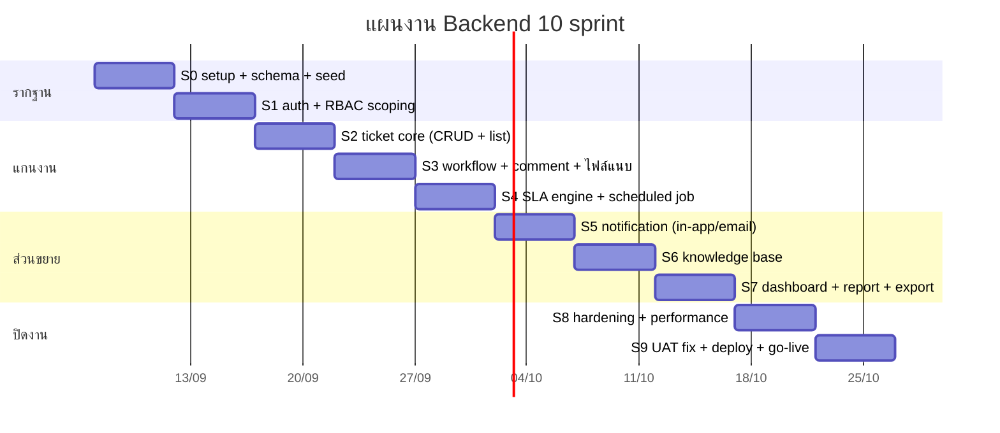
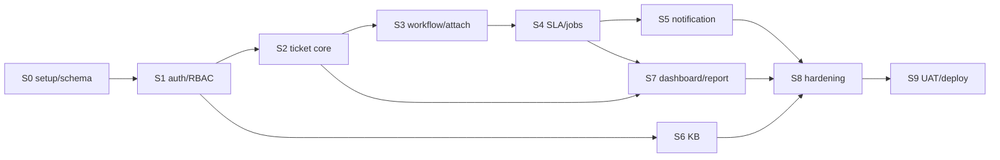
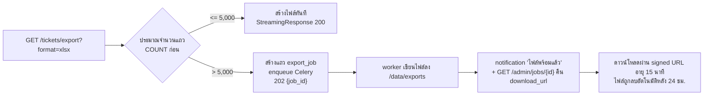

# Backend Implementation Plan — AIDC Helpdesk

| หัวข้อ | รายละเอียด |
|---|---|
| รหัสเอกสาร | BE-003 |
| เวอร์ชัน | 1.0 |
| ผู้จัดทำ | Senior Backend |
| สมมติฐาน | sprint ละ 1 สัปดาห์ (5 วันทำงาน), Backend 1 คน ทำงานขนานกับ Frontend 1 คน |
| เอกสารอ้างอิง | `01-srs.md`, `02-data-model.md`, `03-api-spec.md`, `04-rbac-sla.md`, `10-backend-architecture.md`, `11-sla-engine.md` |

---

## 1. ภาพรวมแผน



| Sprint | ธีม | Endpoint ที่ส่งมอบ (สะสม) |
|---|---|---|
| S0 | โครงโปรเจกต์ + schema + seed | 1 / 84 |
| S1 | Auth + RBAC + scoping | 14 / 84 |
| S2 | Ticket core | 27 / 84 |
| S3 | Workflow + comment + attachment | 40 / 84 |
| S4 | SLA + งานเบื้องหลัง | 50 / 84 |
| S5 | Notification | 58 / 84 |
| S6 | Knowledge Base | 68 / 84 |
| S7 | Dashboard + report + export | 84 / 84 |
| S8 | Hardening (ไม่เพิ่ม endpoint) | 84 / 84 |
| S9 | แก้จาก UAT + deploy | 84 / 84 |

---

## 2. รายละเอียดรายสprint

### S0 — โครงโปรเจกต์ / Schema / Seed

| หัวข้อ | รายละเอียด |
|---|---|
| ส่งมอบ | โครงโฟลเดอร์ตาม `10-backend-architecture.md`, `docker compose up` ขึ้นครบ 5 service, migration ครบ 21 ตาราง, seed data ครบ, `GET /health` ทำงาน, CI รัน lint+test |
| ขึ้นกับ | ปิด `02-data-model.md` และประเด็น B-01…B-05 ใน `10-backend-architecture.md` |
| Definition of Done | `alembic upgrade head` + `alembic downgrade base` ผ่านทั้งคู่บน DB เปล่า · `python -m app.db.seed` รันซ้ำได้โดยไม่พัง (idempotent) · `pytest` ผ่าน · `openapi.json` ถูก commit · README บอกวิธี start ใน 3 คำสั่ง |
| ส่งให้ FE | `openapi.json` ฉบับแรก (มีแค่ health) + docker compose สำหรับ mock |

### S1 — Auth + RBAC + Scoping

| หัวข้อ | รายละเอียด |
|---|---|
| ส่งมอบ | `/auth/*` 6 endpoint, `/users` 8 endpoint (ยกเว้น import ถ้าไม่ทัน), `AccessScope` + `ScopedRepository` + `require_perm` ครบ, audit log ของ login/permission change |
| ขึ้นกับ | S0 |
| Definition of Done | เทสต์ `tests/api/test_cross_tenant.py` ผ่านทุก role × ทุก endpoint ที่มี · ล็อกอินผิด 5 ครั้ง → 423 มีเทสต์ · refresh rotation + denylist มีเทสต์ · coverage ของ `core/scope.py` = 100% · FE ล็อกอินผ่าน SPA ได้จริง |
| ความเสี่ยง | ถ้า scoping ออกแบบผิดตรงนี้ ทุก sprint ถัดไปได้รับผลกระทบ → **ห้ามลัด** ให้ SA รีวิว `AccessScope` ก่อนปิด sprint |

### S2 — Ticket Core

| หัวข้อ | รายละเอียด |
|---|---|
| ส่งมอบ | `POST /tickets`, `GET /tickets` (filter/sort/paging ครบตาม API spec), `GET/PATCH /tickets/{id}`, `/categories` 5 endpoint, `/companies` + `/departments` 7 endpoint, ออกเลข `ticket_no` ด้วย sequence table, Idempotency-Key |
| ขึ้นกับ | S1 (scope), ยืนยันประเด็น B-03 (ตาราง sequence) |
| Definition of Done | ยิง 200 request พร้อมกันแล้ว `ticket_no` ไม่ซ้ำ (เทสต์ concurrency จริง) · filter ที่ไม่รู้จัก → 400 `INVALID_PARAMETER` · `company_id` นอกขอบเขตถูกตัดทิ้งเงียบ ๆ · list endpoint ใช้ ≤ 3 query (เทสต์นับ query) |

### S3 — Workflow + Comment + Attachment

| หัวข้อ | รายละเอียด |
|---|---|
| ส่งมอบ | `state_machine` ครบทุก transition ตาม `02-data-model.md` 4.1, `/tickets/{id}/status·assign·claim·priority·history`, comment 3 endpoint (internal/public), attachment 3 endpoint + signed URL + X-Accel-Redirect |
| ขึ้นกับ | S2 |
| Definition of Done | ตาราง transition มีเทสต์ครบทุกช่อง รวม transition ที่ต้องตอบ 409 · end_user เห็น internal comment ไม่ได้ (เทสต์) · อัปโหลดไฟล์ปลอมนามสกุลถูกปฏิเสธ 415 · path traversal มีเทสต์ · ไฟล์ > 20 MB ถูกตัดตั้งแต่ระหว่าง stream ไม่ใช่หลังเขียนจบ |

### S4 — SLA Engine + งานเบื้องหลัง

| หัวข้อ | รายละเอียด |
|---|---|
| ส่งมอบ | `business_time.py` + `sla_service` (ทำเสร็จแล้วบางส่วน ดู `11-sla-engine.md`), `/sla/*` `/business-hours` `/holidays` 10 endpoint, Celery worker + beat, `scan_sla`, `auto_close_resolved`, `auto_resolve_pending` |
| ขึ้นกับ | S3 (state machine), ยืนยัน D-01…D-03, D-08 กับ PM |
| Definition of Done | เทสต์ SLA 23 เคสผ่าน (มีอยู่แล้ว) · `scan_sla` มีเทสต์ idempotency (รัน 2 ครั้งติด → notification ไม่เพิ่ม) · เปลี่ยน priority แล้ว due คำนวณใหม่ถูกต้อง · แก้ business_hours แล้ว cache ถูก invalidate |
| หมายเหตุ | โมดูล `business_time.py` เขียนและทดสอบเสร็จแล้วตั้งแต่ก่อนเริ่ม sprint นี้ (ดู `11-sla-engine.md` หัวข้อ 4) จึงเหลือแค่งานเชื่อมกับ DB และ Celery |

### S5 — Notification

| หัวข้อ | รายละเอียด |
|---|---|
| ส่งมอบ | `notify_service` + adapter `in_app` และ `email`, `/notifications` 8 endpoint, `send_notification` task พร้อม retry 3 ครั้ง (1/5/15 นาที), ตั้งค่าช่องทางรายผู้ใช้ |
| ขึ้นกับ | S4 (event จาก SLA), **การตัดสินใจของ PM เรื่องช่องทางแทน LINE Notify** (หัวข้อ 6) |
| Definition of Done | ทุก event ใน `03-api-spec.md` หัวข้อ 4 สร้างแถว notification ครบ · ปิดช่องทางแล้วไม่ส่งจริง (เทสต์) · SMTP ล่ม → status `failed` + retry ครบ 3 แล้วหยุด · ไม่มีการส่งซ้ำเมื่อ worker restart กลางทาง |
| ทางเลี่ยง | ถ้า PM ยังไม่ตัดสินใจเรื่อง LINE ให้ปล่อย `in_app` + `email` ก่อน — adapter เสียบเพิ่มได้ในภายหลังโดยไม่แตะ service |

### S6 — Knowledge Base

| หัวข้อ | รายละเอียด |
|---|---|
| ส่งมอบ | `/kb/*` 10 endpoint, ค้นหาภาษาไทยด้วย `pg_trgm`, visibility scoping 3 ระดับ, feedback กันโหวตซ้ำ (ต้องมีตาราง `kb_feedback` — ประเด็น B-05) |
| ขึ้นกับ | S1 (scope) — ไม่ขึ้นกับ ticket จึงเลื่อนขึ้นมาทำก่อนได้ถ้า sprint อื่นติด |
| Definition of Done | end_user ไม่เห็น `agent_only` และไม่เห็น `draft` (เทสต์) · ค้น "ปริ้นเตอร์ไม่ออก" เจอบทความที่ตั้งใจ ภายใน 2 วินาทีบนข้อมูล 2,000 บทความ (เทสต์ performance) · โหวตซ้ำ → 409 |

### S7 — Dashboard + Report + Export

| หัวข้อ | รายละเอียด |
|---|---|
| ส่งมอบ | `/dashboard/*` 5, `/reports/*` 2, export xlsx/pdf ทั้งแบบ sync และ background job, `/admin/jobs/{job_id}` |
| ขึ้นกับ | S2–S4 (ข้อมูลครบ) |
| Definition of Done | ตัวเลขบน dashboard เคารพ scoping ทุก role (เทสต์เทียบกับ query ตรง) · export 10,000 แถว ≤ 30 วินาที (NFR-04) · PDF ภาษาไทยไม่มีตัวอักษรกลายเป็นกล่อง (มีไฟล์ตัวอย่างแนบใน PR) · ทุก export บันทึก audit log |

### S8 — Hardening

| หัวข้อ | รายละเอียด |
|---|---|
| ส่งมอบ | rate limit ครบทุกชั้น, security header, index tuning จาก `EXPLAIN ANALYZE` ของ query จริง, load test 200 concurrent, backup/restore ซ้อมจริง 1 รอบ, เอกสาร runbook |
| Definition of Done | p95 ≤ 500 ms ที่ 200 concurrent (NFR-01/05) · coverage รวม ≥ 70%, ส่วน RBAC + SLA ≥ 80% (NFR-25) · `pip-audit` ไม่มีช่องโหว่ระดับ high · restore จาก dump ขึ้นระบบใช้งานได้จริงภายใน 4 ชั่วโมง (NFR-22) |

### S9 — UAT + Deploy + Go-live

| หัวข้อ | รายละเอียด |
|---|---|
| ส่งมอบ | แก้บั๊กจาก UAT, ติดตั้งบนเซิร์ฟเวอร์จริง, นำเข้าผู้ใช้จริง, ตั้ง backup cron, ส่งมอบเอกสารผู้ดูแล |
| Definition of Done | UAT ผ่านทุก User Story ระดับ MVP · ไม่มีบั๊กระดับ blocker/critical ค้าง · backup รันอัตโนมัติและทดสอบ restore แล้ว · super_admin 1 บัญชีถูกสร้างพร้อมบังคับเปลี่ยนรหัส |

### 2.1 ความสัมพันธ์การพึ่งพา



> **เส้นทางวิกฤต:** S0 → S1 → S2 → S3 → S4 → S5 → S8 → S9 (8 sprint) — S6 และ S7 มี slack สลับที่ได้ถ้าติดขัด

---

## 3. Migration Strategy (Alembic)

### 3.1 กติกา

| กฎ | รายละเอียด |
|---|---|
| ทุก migration มี `downgrade` | NFR-24 — ถ้า downgrade เขียนไม่ได้จริง (เช่นลบคอลัมน์ที่มีข้อมูล) ต้องเขียนคอมเมนต์อธิบายและแจ้ง PM ก่อน merge |
| ห้าม autogenerate ล้วน ๆ | รัน `alembic revision --autogenerate` แล้ว**อ่านและแก้ทุกครั้ง** (autogenerate จับ CHECK constraint และ index บางส่วนไม่ได้) |
| ตั้งชื่อ | `{revision}_{sprint}_{คำอธิบายสั้น}.py` เช่น `0003_s2_ticket_sequence.py` |
| Migration ห้าม import `app.*` | ต้องรันได้แม้โค้ดแอปเปลี่ยนไปแล้ว |
| Data migration แยกจาก schema migration | ไฟล์คนละใบ ทำให้ rollback แยกส่วนได้ |
| รันก่อนสลับ image | one-off container `alembic upgrade head` ตาม ADR-001 6.2 |
| Index ขนาดใหญ่ | ใช้ `CREATE INDEX CONCURRENTLY` (ต้องตั้ง `autocommit_block()` ใน Alembic) — เฉพาะตาราง `ticket` / `audit_log` หลังมีข้อมูลจริง |

### 3.2 ลำดับ migration ตาม sprint

| # | ไฟล์ | เนื้อหา | sprint |
|---|---|---|---|
| 0001 | `initial_org_and_auth` | `company`, `department`, `app_user`, `role`, `permission`, `role_permission`, `user_role`, `user_role_scope` | S0 |
| 0002 | `sla_and_calendar` | `sla_policy`, `sla_target`, `business_hours`, `holiday` | S0 |
| 0003 | `ticket_core` | `ticket_category`, `ticket`, `ticket_status_history`, `ticket_comment`, `ticket_sequence` | S0 |
| 0004 | `attachment_kb_notification_audit` | `attachment`, `kb_category`, `kb_article`, `kb_feedback`, `notification`, `notification_channel`, `audit_log` | S0 |
| 0005 | `search_indexes` | GIN trigram บน `ticket.subject`, `kb_article.title/summary` + extension `pg_trgm`, `unaccent` | S2/S6 |
| 0006 | `perf_indexes` | index ตาม `02-data-model.md` 3.6 + partial unique ของ `notification` | S4/S8 |

### 3.3 ลำดับ Seed Data (ต้องเรียงตาม FK)

```text
1. permission          43 แถว   (04-rbac-sla.md หัวข้อ 7)
2. role                5 แถว
3. role_permission     ตาม permission matrix (04-rbac-sla.md หัวข้อ 2)
4. company             7 แถว    (02-data-model.md 6.1)
5. business_hours      7 แถว    company_id = NULL (จ.-ส. 08:00-17:00)
6. holiday             วันหยุดราชการไทยปีปัจจุบัน + ปีหน้า, company_id = NULL
7. sla_policy          1 แถว    company_id = NULL, is_default = true
8. sla_target          4 แถว    critical/high/medium/low
9. ticket_category     หมวดกลาง 6 หมวดหลัก + ~22 หมวดย่อย (company_id = NULL)
10. ticket_category    หมวดเฉพาะบริษัท 2,3,4,5,6,7 (02-data-model.md 6.5)
11. kb_category        6 หมวด
12. app_user           super_admin 1 บัญชี (รหัสชั่วคราวจาก env, must_change_password = true)
13. user_role          ผูก super_admin
14. department         [ต้องขอไฟล์จาก PM] โครงสร้างแผนกจริงของ 7 บริษัท
```

| ข้อกำหนดของ seed | เหตุผล |
|---|---|
| ต้อง idempotent (upsert ด้วย `code` / natural key) | รันซ้ำตอน deploy ใหม่ได้โดยไม่สร้างข้อมูลซ้ำ |
| แยกเป็น `--core` (จำเป็นต่อระบบ) และ `--demo` (ข้อมูลตัวอย่างสำหรับ dev/UAT) | ห้าม demo data หลุดขึ้น production |
| รหัส super_admin มาจาก `SEED_ADMIN_PASSWORD` ใน env | ห้าม hardcode ในโค้ด |
| `department` นำเข้าจาก Excel ด้วย `POST /users/import` ไม่ใช่ seed script | รายชื่อจริงเปลี่ยนบ่อย |

---

## 4. กลยุทธ์การทดสอบ

### 4.1 พีระมิด

| ระดับ | จำนวนที่ตั้งเป้า | เร็วแค่ไหน | ครอบคลุมอะไร |
|---|---|---|---|
| Unit (ไม่มี I/O) | ~150 เคส | < 2 วินาทีทั้งชุด | SLA engine, state machine, `AccessScope`, password/JWT, ตัว validate ไฟล์ |
| Integration (มี DB จริง) | ~80 เคส | < 60 วินาที | repository + scoping, sequence ของ `ticket_no`, transaction rollback |
| API contract (httpx) | ~120 เคส | < 90 วินาที | ทุก endpoint × role, รูปแบบ error, pagination, RBAC |
| Performance (ไม่อยู่ใน CI ปกติ) | 6 สถานการณ์ | รันมือ/รายสัปดาห์ | list ticket 30,000 แถว, dashboard, export 10,000 แถว, KB search |

### 4.2 เป้าหมาย Coverage

| ส่วน | เป้าหมาย | บังคับใน CI |
|---|---|---|
| `services/sla/**` | ≥ 95% | ใช่ (NFR-25) |
| `core/scope.py` + `repositories/**` | ≥ 90% | ใช่ (NFR-25) |
| `services/**` อื่น ๆ | ≥ 80% | ใช่ |
| รวมทั้งโปรเจกต์ | ≥ 70% | ใช่ (`--cov-fail-under=70`) |
| `api/v1/endpoints/**` | ไม่ตั้งเป้าแยก | วัดผ่าน API test แทน |

### 4.3 ฐานข้อมูลสำหรับทดสอบ — เลือก "DB แยกใน compose" ไม่ใช่ testcontainers

| ทางเลือก | ข้อดี | ข้อเสีย | ตัดสิน |
|---|---|---|---|
| **Postgres service แยกใน docker-compose (`db_test`)** | เร็วที่สุด ไม่ต้องรอ pull image ทุกครั้ง, ใช้ได้ทั้งเครื่อง dev และ CI runner ที่ไม่มี Docker-in-Docker | ต้องดูแลการล้างข้อมูลเอง | **เลือก** — ทีมเล็ก ไม่ต้องการ dependency เพิ่ม |
| testcontainers-python | แยกขาดสมบูรณ์ ไม่ต้องมี compose | ต้องมี Docker socket ใน CI, ช้ากว่า 20–40 วิ/รอบ | ไม่ใช้ในเฟส 1 |
| SQLite in-memory | เร็วสุด | ไม่มี `JSONB`, partial index, `pg_trgm`, `FOR UPDATE` ต่างพฤติกรรม → เทสต์ผ่านแต่ production พัง | **ห้ามใช้** |

```python
# tests/conftest.py — แต่ละเทสต์อยู่ใน transaction ที่ rollback เสมอ (เร็วกว่า TRUNCATE มาก)
import pytest
import pytest_asyncio
from httpx import ASGITransport, AsyncClient
from sqlalchemy.ext.asyncio import async_sessionmaker, create_async_engine

from app.main import app
from app.core.deps import get_db


@pytest.fixture(scope="session")
def engine():
    return create_async_engine(TEST_DATABASE_URL, poolclass=None)


@pytest_asyncio.fixture
async def db(engine):
    """1 เทสต์ = 1 transaction ที่ถูก rollback ตอนจบ → ข้อมูลไม่รั่วข้ามเทสต์"""
    async with engine.connect() as conn:
        trans = await conn.begin()
        session = async_sessionmaker(bind=conn, expire_on_commit=False)()
        yield session
        await session.close()
        await trans.rollback()


@pytest_asyncio.fixture
async def client(db):
    app.dependency_overrides[get_db] = lambda: db
    async with AsyncClient(
        transport=ASGITransport(app=app), base_url="http://test"
    ) as c:
        yield c
    app.dependency_overrides.clear()


@pytest.fixture
def seed(db):
    """factory สร้าง company/user ทุก role/ticket — ดู tests/factories.py"""
    return SeedFactory(db)
```

### 4.4 API Contract Test — ป้องกัน spec ล้าหลังโค้ด

```python
def test_openapi_snapshot_unchanged():
    """ถ้า schema เปลี่ยน ต้องตั้งใจ commit openapi.json ใหม่พร้อมแจ้ง FE"""
    current = app.openapi()
    committed = json.loads(Path("openapi.json").read_text())
    assert current == committed, (
        "OpenAPI เปลี่ยน — รัน `make openapi` แล้ว commit พร้อมแจ้ง Senior Frontend"
    )
```

| กติกาเพิ่มเติม | เหตุผล |
|---|---|
| ทุก endpoint ต้องมีเทสต์อย่างน้อย: 200 (happy), 403 (ไม่มีสิทธิ์), 404/422 (ตามบริบท) | ตรงกับตาราง status ใน `03-api-spec.md` |
| ทุก endpoint ที่คืนข้อมูลรายบริษัทต้องอยู่ในรายการของ `test_cross_tenant.py` | บังคับใน PR checklist |
| CI รัน `ruff` + `mypy --strict` เฉพาะ `core/`, `services/sla/` | ส่วนที่ผิดแล้วเจ็บที่สุด |

---

## 5. Notification Service

### 5.1 โครงสร้าง Adapter (เสียบช่องทางเพิ่มได้)

```python
from typing import Protocol, runtime_checkable


@runtime_checkable
class NotificationChannel(Protocol):
    """สัญญาของทุกช่องทาง — เพิ่มช่องทางใหม่ = เขียนคลาสใหม่ 1 ไฟล์ ไม่แตะ service"""

    code: str                      # 'in_app' | 'email' | 'line' | 'teams' | 'webpush'
    requires_binding: bool         # ต้องผูกบัญชีก่อนใช้หรือไม่

    async def is_available(self) -> bool:
        """ช่องทางนี้ถูกตั้งค่าครบและใช้งานได้จริงหรือไม่ (ตรวจตอน startup)"""

    async def send(self, dest: str, title: str, body: str,
                   ctx: "NotifyContext") -> "SendResult":
        """ส่งจริง; โยน RetryableError เมื่อควรลองใหม่, PermanentError เมื่อไม่ควร"""


class NotifyService:
    def __init__(self, registry: dict[str, NotificationChannel]) -> None:
        self.registry = registry

    async def dispatch(self, event_type: str, ticket, audience: list) -> None:
        """สร้างแถว notification 1 แถวต่อ (ผู้รับ x ช่องทางที่เปิดไว้) แล้ว enqueue

        - เคารพ notification_channel.is_enabled และ is_verified
        - ข้าม ticket ที่อยู่สถานะ pending_user (04-rbac-sla.md 4.3)
        - ไม่ส่ง escalation นอกเวลาทำการ ยกเว้น priority critical
        """
        for user in audience:
            for ch in await self.enabled_channels(user):
                row = await self.repo.create(
                    user_id=user.id, ticket_id=ticket.id, event_type=event_type,
                    channel=ch.code, title=..., body=..., status="pending",
                )
                send_notification.apply_async(
                    args=[row.id], countdown=0,
                    retry_backoff=[60, 300, 900],   # 1, 5, 15 นาที (FR-45)
                )
```

| จุดออกแบบ | เหตุผล |
|---|---|
| 1 แถว `notification` = 1 ช่องทาง | ตรงกับ data model 3.13 และทำให้ retry รายช่องทางแยกกันได้ |
| `in_app` ไม่ต้อง enqueue | เขียนแถวแล้วจบ (status = `sent` ทันที) ลดภาระคิว |
| ช่องทางที่ `is_available() == False` | แถวถูกตั้งเป็น `skipped` ไม่ใช่ `failed` — รายงานแยกได้ว่า "ยังไม่ตั้งค่า" กับ "ส่งไม่สำเร็จ" |
| ปิดสวิตช์ทั้งช่องทาง | `NOTIFY_CHANNELS` ใน env — ปิด LINE ทั้งระบบได้โดยไม่ต้อง deploy ใหม่ |

### 5.2 Email (SMTP ภายในองค์กร)

| หัวข้อ | ค่า |
|---|---|
| ไลบรารี | `aiosmtplib` (async) + `email.message.EmailMessage` |
| การเชื่อมต่อ | `SMTP_HOST:SMTP_PORT` — รองรับทั้งไม่ auth (relay ภายใน), STARTTLS และ SMTP AUTH |
| เนื้อหา | multipart: plain text + HTML (Jinja2 template) — plain text สำคัญเพราะบางองค์กรบล็อก HTML |
| หัวข้อ | `[AIDC Helpdesk] {ticket_no} {เหตุการณ์}` เช่น `[AIDC Helpdesk] AIDC-LOG-202608-0042 มีผู้รับผิดชอบแล้ว` |
| ภาษาไทยใน header | ต้อง encode ด้วย `utf-8` (`Header(subject, 'utf-8')`) มิฉะนั้นบาง client แสดงเป็นขยะ |
| ข้อควรระวัง | ห้ามใส่เนื้อหา ticket แบบเต็มในอีเมล (อาจมีข้อมูลอ่อนไหว) — ใส่หัวข้อ + ลิงก์กลับระบบ |
| ทดสอบ | container `mailpit` ใน compose profile `dev` (ไม่ขึ้น production) |

---

## 6. ช่องทางแจ้งเตือนแทน LINE Notify — **[ต้องให้ PM ตัดสิน]**

> **ข้อเท็จจริง:** LINE Notify **ปิดให้บริการแล้ว** (สิ้นสุดบริการ 31 มีนาคม 2025) — token เดิมใช้ไม่ได้ และออก token ใหม่ไม่ได้ ดังนั้น FR-41 ในรูปแบบที่ SRS เขียนไว้ **ทำไม่ได้**
> `01-srs.md` A-05 และ `04-rbac-sla.md` ยังอ้าง "LINE Notify" อยู่ — ต้องแก้เอกสารตามการตัดสินใจของ PM

### 6.1 ตัวเลือกที่ใช้ได้จริง

| # | ทางเลือก | ข้อดี | ข้อเสีย / ต้นทุน | งาน BE | เหมาะเมื่อ |
|---|---|---|---|---|---|
| A | **LINE Official Account + Messaging API** (push message) | ผู้ใช้ยังได้รับแจ้งเตือนใน LINE ที่ใช้อยู่แล้วทุกวัน — เป็นเหตุผลเดิมที่เลือก LINE ตั้งแต่แรก · รองรับปุ่ม/การ์ดสวยงาม | ต้องสมัคร LINE OA · ผู้ใช้ทุกคนต้อง **เพิ่มเพื่อน OA** ก่อน (ถ้าไม่เพิ่ม = ส่งไม่ได้เลย) · ต้องผูกบัญชี LINE กับบัญชีในระบบ (LINE Login หรือ QR + รหัสผูก) · **มีค่าใช้จ่ายรายเดือนตามจำนวนข้อความ** (แผนฟรีจำกัดจำนวนข้อความ/เดือน) — ต้องประเมินจากปริมาณ ticket จริง · ต้องมีผู้ดูแล OA ในองค์กร | 3–4 วัน (bind flow + webhook ตรวจลายเซ็น + push adapter) | ผู้ใช้หน้างานส่วนใหญ่ไม่เปิดอีเมล และองค์กรยอมรับค่าใช้จ่ายรายเดือน |
| B | **Microsoft Teams — Workflows (Power Automate) webhook** | ถ้าองค์กรมี M365 อยู่แล้ว = ไม่มีค่าใช้จ่ายเพิ่ม · ตั้งค่าง่ายมาก (URL เดียวต่อ channel) · เหมาะกับการแจ้ง **ทีม IT** (escalation, breach) | เป็นการแจ้งเข้า **ช่องทีม ไม่ใช่รายบุคคล** — ผู้แจ้งทั่วไปไม่ได้ประโยชน์ · พนักงานหน้างาน/คนขับมักไม่มี Teams บนมือถือ · (หมายเหตุ: Office 365 Connector แบบเดิมถูกยกเลิกแล้ว ต้องใช้ Workflows แทน) | 1 วัน | ใช้เสริมสำหรับ escalation ของทีม support โดยเฉพาะ |
| C | **Email อย่างเดียว** (in-app + email) | ไม่มีค่าใช้จ่าย ไม่มี dependency ภายนอก ทำเสร็จใน sprint เดียว · ใช้ SMTP ภายในที่มีอยู่แล้ว | ผู้ใช้หน้างาน (ก่อสร้าง/คลัง/คนขับ) มักไม่เปิดอีเมลบนมือถือ → **ความเสี่ยงที่แจ้งเตือนไม่ถึงคนที่ต้องรีบ** สูงจริง | 0 (อยู่ในแผน S5 แล้ว) | เป็น baseline ที่ต้องมีอยู่แล้วไม่ว่าเลือกอะไร |
| D | **Web Push (PWA)** | ฟรี ไม่มี vendor · เด้งบนมือถือได้จริงเหมือนแอป · ทำงานได้แม้ปิดเบราว์เซอร์ (Android) | iOS ต้อง Safari 16.4+ และผู้ใช้ต้อง "เพิ่มลงหน้าจอโฮม" ก่อน (ขั้นตอนที่ผู้ใช้ทั่วไปไม่ทำเอง) · ต้องมี HTTPS ที่ certificate เชื่อถือได้ (ใบรับรองภายในองค์กรอาจมีปัญหาบนมือถือส่วนตัว) · เป็นงานฝั่ง FE ด้วย | 2 วัน BE (VAPID + subscription) + งาน FE | ต้องการเด้งบนมือถือโดยไม่จ่ายรายเดือน และคุมเครื่องผู้ใช้ได้ระดับหนึ่ง |

### 6.2 ข้อเสนอของ Backend

| เฟส | ช่องทาง | เหตุผล |
|---|---|---|
| **MVP (S5)** | `in_app` + `email` | ทำได้แน่นอน ไม่ขึ้นกับการตัดสินใจภายนอก และเป็น fallback ที่ต้องมีอยู่แล้ว |
| **MVP+ (S5 ปลาย sprint ถ้า PM ตัดสินทัน)** | เพิ่ม `teams` webhook สำหรับ escalation L2/L3/L5 เข้าห้องทีม IT | ต้นทุนต่ำสุด (1 วัน) แต่แก้ปัญหาที่แพงที่สุดคือ "breach แล้วไม่มีใครเห็น" |
| **เฟส 1.5 (หลัง go-live 1 เดือน)** | `line` ผ่าน Messaging API ถ้า PM อนุมัติ OA + งบ | ตัดสินจากข้อมูลจริงว่าผู้ใช้เปิดอีเมลกันจริงแค่ไหน แทนที่จะเดาตั้งแต่ต้น |
| ไม่ทำ | SMS | ค่าใช้จ่ายต่อข้อความสูงและไม่ตอบโจทย์ปริมาณนี้ |

> **สิ่งที่ต้องเตรียมตั้งแต่ MVP ไม่ว่าจะเลือกอะไร:** `notification_channel` เก็บ `channel` + `destination` + `is_verified` อยู่แล้ว จึงรองรับทุกทางเลือกโดยไม่ต้องแก้ schema — ยกเว้น CHECK constraint ที่จำกัดไว้ 3 ค่า (ประเด็น B-06)

---

## 7. Export Excel และ PDF

### 7.1 ไลบรารีและวิธีทำงาน

| รูปแบบ | ไลบรารี | วิธี |
|---|---|---|
| Excel `.xlsx` | `openpyxl` 3.1 โหมด `write_only=True` | เขียนทีละแถวแบบ stream ไม่โหลดทั้ง workbook เข้า RAM; query ด้วย `yield_per(1000)` |
| PDF | `WeasyPrint` 62 + Jinja2 (HTML/CSS → PDF) | เขียน HTML ที่หน้าตาเหมือนรายงานบนเว็บ แล้วแปลง — ทีมเล็กดูแลง่ายกว่าการวางพิกัดด้วย ReportLab |

```python
# app/exports/excel.py — เขียนแบบ stream รองรับ 10,000+ แถวโดยไม่กิน RAM
from openpyxl import Workbook


def write_tickets_xlsx(path: str, rows_iter, columns: list[tuple[str, str]]) -> None:
    """rows_iter เป็น generator จาก stats_repo (yield_per) ไม่ใช่ list ทั้งก้อน"""
    wb = Workbook(write_only=True)
    ws = wb.create_sheet("Tickets")
    ws.append([label for _, label in columns])
    for row in rows_iter:
        ws.append([getattr(row, key) for key, _ in columns])
    wb.save(path)
```

### 7.2 การทำงานแบบ Async Job



| หัวข้อ | ค่า |
|---|---|
| เกณฑ์ตัดสิน sync/async | 5,000 แถว (ตาม `03-api-spec.md` 2.4 และ US-10 AC-3) |
| ที่เก็บไฟล์ | `/data/exports/{user_id}/{job_id}.{ext}` — volume แยกจากไฟล์แนบ |
| อายุไฟล์ | 24 ชั่วโมง ลบด้วย task `cleanup_exports` ทุกวัน 03:00 |
| ขอบเขตข้อมูล | **worker ต้องใช้ `AccessScope` ของผู้ขอ export** ไม่ใช่สิทธิ์ระบบ — เก็บ snapshot ของ scope ไว้ในแถว job (จุดที่พลาดง่ายที่สุดและรั่วข้ามบริษัทได้) |
| audit | บันทึก `action='export'` พร้อม filter ที่ใช้ (US-10 AC-4) |

### 7.3 ฟอนต์ไทยใน PDF (สำคัญ — จุดที่พังบ่อยที่สุด)

| ประเด็น | สิ่งที่ต้องทำ |
|---|---|
| ฟอนต์ที่เลือก | **Sarabun** (ฟอนต์ราชการไทย, สัญญาอนุญาต SIL OFL 1.1 ใช้เชิงพาณิชย์ได้) เป็นหลัก และ **Noto Sans Thai** เป็น fallback |
| น้ำหนักที่ต้องมี | Regular 400, Bold 700 (อย่างน้อย) — ถ้าไม่มี Bold จริง เบราว์เซอร์/WeasyPrint จะทำ synthetic bold ซึ่งสระบนล่างจะเบลอ |
| วางไฟล์ใน image | คัดลอกไป `/usr/share/fonts/truetype/thai/` แล้วรัน `fc-cache -fv` ใน Dockerfile |
| **การตัดคำภาษาไทย** | ภาษาไทยไม่มีเว้นวรรค — ต้องติดตั้ง **`libthai0`** (และ `libdatrie1`) ในอิมเมจ มิฉะนั้น Pango จะตัดบรรทัดกลางคำหรือดันข้อความล้นตาราง |
| การขึ้นรูปอักขระ | ต้องมี `libpango-1.0-0`, `libpangoft2-1.0-0`, `libharfbuzz0b` — ถ้าขาด สระ/วรรณยุกต์จะลอยผิดตำแหน่ง (ปัญหา "สระซ้อน") |
| การตรวจสอบ | เพิ่มเทสต์ `test_pdf_thai_font.py` ที่สร้าง PDF แล้วสกัดข้อความกลับด้วย `pdfminer.six` เทียบกับต้นฉบับ — จับเคส "กลายเป็นกล่อง" ได้อัตโนมัติ (US-10 AC-2) |

```dockerfile
# ส่วนที่เกี่ยวกับฟอนต์ไทยใน Dockerfile (ฉบับเต็มใน 13-deployment.md)
RUN apt-get update && apt-get install -y --no-install-recommends \
        libpango-1.0-0 libpangoft2-1.0-0 libharfbuzz0b \
        libthai0 libdatrie1 \
        libcairo2 libgdk-pixbuf-2.0-0 shared-mime-info fontconfig \
    && rm -rf /var/lib/apt/lists/*
COPY assets/fonts/Sarabun-*.ttf /usr/share/fonts/truetype/thai/
COPY assets/fonts/NotoSansThai-*.ttf /usr/share/fonts/truetype/thai/
RUN fc-cache -fv
```

```css
/* app/exports/templates/report.css */
@font-face {
  font-family: "Sarabun";
  src: url("file:///usr/share/fonts/truetype/thai/Sarabun-Regular.ttf");
  font-weight: 400;
}
@font-face {
  font-family: "Sarabun";
  src: url("file:///usr/share/fonts/truetype/thai/Sarabun-Bold.ttf");
  font-weight: 700;
}
body {
  font-family: "Sarabun", "Noto Sans Thai", sans-serif;
  font-size: 10.5pt;
  line-height: 1.6;          /* เผื่อพื้นที่สระบน-ล่างของไทย อย่าใช้ 1.2 */
}
@page {
  size: A4;
  margin: 15mm 12mm;
  @bottom-center { content: "หน้า " counter(page) " / " counter(pages); }
}
table { width: 100%; border-collapse: collapse; }
th, td { border: 0.5pt solid #999; padding: 3pt 4pt; word-break: break-word; }
```

---

## 8. ความเสี่ยงทางเทคนิคและวิธีลดความเสี่ยง

| # | ความเสี่ยง | ระดับ | ผลถ้าเกิด | วิธีลดความเสี่ยง | ตัวชี้วัดเตือนล่วงหน้า |
|---|---|---|---|---|---|
| TR-01 | **ข้อมูลรั่วข้ามบริษัท** จาก query ที่ลืมใส่ scope | **สูง** | ละเมิดความปลอดภัยข้อมูล เสียความเชื่อมั่นทั้งโครงการ ย้อนกลับไม่ได้ | `ScopedRepository` บังคับรับ `AccessScope` ตอนสร้าง (ลืม = TypeError) · เทสต์ cross-tenant แบบ parametrize ทุก endpoint × ทุก role · CI ห้าม `select(` ใน `api/` · code review บังคับ 2 ตา | จำนวน endpoint ที่ไม่อยู่ใน `test_cross_tenant.py` |
| TR-02 | **Backup อยู่เครื่องเดียวกับระบบ** (R-02 ของ SRS) | **สูง** | ดิสก์เสีย = ข้อมูลหายทั้งหมด กู้ไม่ได้ | ยืนยันปลายทาง offsite (NAS/external) **ก่อน go-live** เป็นเงื่อนไขบังคับ · ซ้อม restore จริงใน S8 และบันทึกผล · `/admin/system-info` แสดงเวลา backup ล่าสุด + ปลายทาง | ไม่มี backup ที่ปลายทางนอกเครื่อง > 24 ชม. |
| TR-03 | **ช่องทางแจ้งเตือนไม่ถึงผู้ใช้หน้างาน** (LINE Notify ปิดบริการ) | **สูง** | ticket วิกฤตไม่มีคนเห็น = ระบบล้มเหลวในวัตถุประสงค์ข้อ 1 ของ SRS | in-app + email เป็น baseline ตั้งแต่ S5 · escalation L2/L5 เข้าห้องทีมผ่าน Teams webhook (ต้นทุน 1 วัน) · adapter รองรับเสียบ LINE OA ทีหลังโดยไม่แก้ service | อัตราการเปิดอ่าน in-app ภายใน 30 นาทีของ ticket critical |
| TR-04 | Migration ผิดพลาดบน production ที่มีข้อมูลจริง | กลาง | downtime ยาว / ข้อมูลเสียหาย | ทุก migration มี `downgrade` + ทดสอบ up/down บน dump จริงก่อน deploy · `pg_dump` ก่อนรัน migration ทุกครั้ง (อยู่ในสคริปต์ deploy) · หน้าต่างบำรุงรักษานอกเวลาทำการ | migration ที่ downgrade ไม่ได้จริง |
| TR-05 | ฟอนต์ไทยใน PDF แสดงผิด (กล่อง/สระลอย/ตัดคำผิด) | กลาง | ผู้บริหารใช้รายงานไม่ได้ = FR-64/US-10 ไม่ผ่าน | ติดตั้ง `libthai0` + Pango + Sarabun ใน image ตั้งแต่ S0 · เทสต์อัตโนมัติสกัดข้อความกลับจาก PDF · สร้างไฟล์ตัวอย่างให้ PM ดูตั้งแต่ S7 ไม่ใช่ก่อน go-live | เทสต์ `test_pdf_thai_font.py` ล้ม |
| TR-06 | Performance ตกเมื่อ ticket โต (N+1 query, list ช้า) | กลาง | NFR-01/02 ไม่ผ่าน ผู้ใช้มือถือหน้างานเลิกใช้ | `selectinload` ทุก relation ที่ serialize · เทสต์นับจำนวน query ต่อ endpoint · seed 30,000 ticket ใน staging แล้ววัดจริงใน S8 | p95 ของ `GET /tickets` > 400 ms |
| TR-07 | `ticket_no` ซ้ำจาก race condition | กลาง | ละเมิด UNIQUE = คำขอผู้ใช้ล้มเหลว | sequence table + `SELECT ... FOR UPDATE` ในทรานแซกชันเดียวกับ insert · เทสต์ concurrency 200 request | เกิด `DUPLICATE_ENTRY` ที่ `ticket_no` แม้แต่ครั้งเดียว |
| TR-08 | ทีมมีคนเดียวต่อบทบาท — BE ไม่พร้อม = งานหยุด (R-05) | กลาง | เลื่อนกำหนดส่ง | ปิด OpenAPI ก่อนเริ่มโค้ดทุก sprint (FE ไม่ block) · commit เล็กและถี่ · เอกสารนี้ + README ทำให้คนอื่นรับช่วงได้ | PR ค้างเกิน 3 วัน |
| TR-09 | ดิสก์เต็มจากไฟล์แนบ/log/audit | กลาง | ระบบเขียนไม่ได้ทั้งระบบ | quota เตือนที่ 80% ใน `/health` · log rotation ที่ Docker · ประเมิน 50 GB/ปี บนดิสก์ 200 GB = พอ 3 ปี · `cleanup_exports` + `_trash` ลบจริง 30 วัน | พื้นที่ว่าง `/data` < 20% |
| TR-10 | เปลี่ยน `SECRET_KEY` แล้วผู้ใช้ทุกคนหลุดพร้อมกัน | ต่ำ | ผู้ใช้ต้องล็อกอินใหม่ทั้งหมด | ทำเฉพาะในหน้าต่างบำรุงรักษาและแจ้งล่วงหน้า · เก็บ key ใน `.env` ที่มี backup แยก | — |

---

## 9. ประเด็นที่ต้องคุยกับ SA

> (เพิ่มเติมจาก B-01…B-10 ใน `10-backend-architecture.md` และ S-01…S-07 ใน `11-sla-engine.md`)

| # | ประเด็น | ข้อเสนอ |
|---|---|---|
| P-01 | `01-srs.md` FR-41 และ A-05 ยังเขียนว่า "LINE Notify" ซึ่งปิดบริการแล้ว | ขอแก้ SRS เป็น "แจ้งเตือนผ่านช่องทาง chat ที่กำหนด (adapter)" แล้วให้ PM เลือกช่องทางจริงตามหัวข้อ 6 |
| P-02 | `notification.channel` / `notification_channel.channel` จำกัดค่าไว้ 3 ค่า | ขยาย CHECK เป็น `in_app, email, line, teams, webpush` ตั้งแต่ migration แรก (ถูกกว่าการแก้ทีหลังมาก) |
| P-03 | `03-api-spec.md` 2.11 นับ notification เป็น 8 endpoint แต่ตารางแสดง 6 + LINE binding 2 | เป็นแค่การนับ ไม่กระทบงาน — แจ้งให้ทราบเพื่อความตรงกันของเอกสาร |
| P-04 | `POST /notifications/line/*` จะเปลี่ยนชื่อหรือไม่ถ้าไม่ใช้ LINE | เสนอ `POST /notifications/channels/{channel}/bind-url` และ `/callback` แบบทั่วไป ไม่ผูกชื่อ vendor |
| P-05 | `/tickets/export` และ `/reports/{name}/export` คืนได้ทั้ง 200 (ไฟล์) และ 202 (job) | ขอยืนยันว่า FE รับมือทั้งสองแบบ (จะ generate type ให้เป็น union) |

---

## 10. ประเด็นที่ต้องให้ PM ตัดสิน

| # | ประเด็น | ทำไมต้องตัดสินตอนนี้ | ค่าที่ BE จะใช้ถ้าไม่มีคำตอบ | เส้นตาย |
|---|---|---|---|---|
| PM-01 | **ช่องทางแจ้งเตือนแทน LINE Notify** (หัวข้อ 6) — ถ้าเลือก LINE OA ต้องมีบัญชี OA + งบรายเดือน + ผู้ดูแล | กระทบขอบเขต S5 และการสื่อสารกับผู้ใช้ตอน go-live | in-app + email + Teams webhook สำหรับ escalation | ก่อนเริ่ม S5 |
| PM-02 | **ปลายทาง backup นอกเซิร์ฟเวอร์** (NAS / external drive) | ความเสี่ยงสูงสุดของโครงการ; ถ้าไม่มีต้องจัดหาก่อน go-live | หยุดและแจ้งเป็น blocker ก่อน go-live | ก่อน S8 |
| PM-03 | เวลาทำการเหมือนกันทุกบริษัทหรือไม่ (A-01 / D-02) | กระทบจำนวนเคสทดสอบ SLA และ seed | จ.–ส. 08:00–17:00 เหมือนกันทั้ง 7 บริษัท | ก่อน S4 |
| PM-04 | ค่า SLA และ escalation 75% (D-01 / D-07) | เปลี่ยนได้ผ่านหน้าตั้งค่า แต่ต้องใช้ค่าตั้งต้นในการ seed และ UAT | ตามตาราง `04-rbac-sla.md` 3.2 | ก่อน S4 |
| PM-05 | มี SMTP relay ภายในที่ส่งได้จริงหรือไม่ + จาก IP ของเซิร์ฟเวอร์นี้ (A-06) | ถ้าไม่มี ต้องหาทางเลือกซึ่งอาจต้องขออนุมัติส่งข้อมูลออกนอกองค์กร | สมมติว่ามีและไม่ต้อง auth | ก่อน S5 |
| PM-06 | ระบบ Antivirus ที่สแกน file share ได้มีอยู่แล้วหรือไม่ | ถ้ามี ไม่ต้องเพิ่ม ClamAV (ประหยัด RAM 1.5 GB และงาน 3 วัน) | เลื่อน virus scan ไปเฟส 2 ทั้งก้อน | ก่อน S8 |
| PM-07 | โครงสร้างแผนกจริงของ 7 บริษัท (ไฟล์ Excel) | ต้องใช้ seed + ทดสอบ UAT ด้วยข้อมูลจริง | ใช้ข้อมูลตัวอย่างและเปลี่ยนตอน go-live | ก่อน S9 |
| PM-08 | หน้าต่าง downtime สำหรับ deploy (ADR-001 ระบุ < 2 นาที นอกเวลาทำการ) | ต้องนัดกับผู้ใช้ล่วงหน้า | อาทิตย์ 20:00–23:00 ตาม NFR-21 | ก่อน S9 |
| PM-09 | `company_admin` แก้ SLA ของบริษัทตนได้หรือไม่ (D-04) | กระทบ permission matrix และ UI | **ไม่ได้** ตามที่ SA เสนอ | ก่อน S4 |
| PM-10 | ใครเป็นผู้ดูแลระบบหลังส่งมอบ (รับ runbook, มีสิทธิ์ SSH, ถือ `.env`) | ต้องระบุก่อนติดตั้งจริง มิฉะนั้นไม่มีคนกู้ระบบตอนกลางคืน | ระบุเป็นข้อค้างใน checklist go-live | ก่อน S9 |
