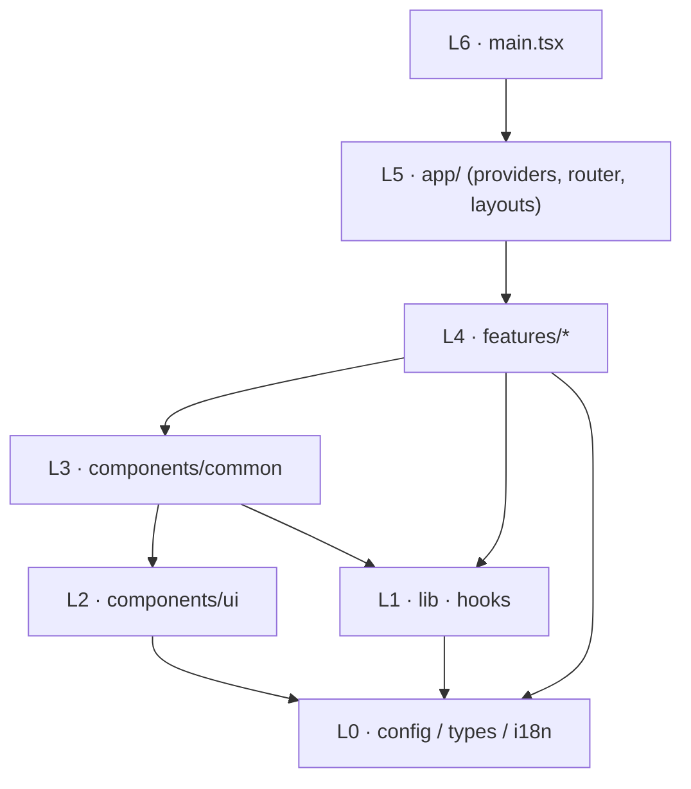

# Frontend Architecture — AIDC Helpdesk

| หัวข้อ | รายละเอียด |
|---|---|
| รหัสเอกสาร | FE-001 |
| เวอร์ชัน | 1.0 |
| วันที่ | 2026-08-31 |
| ผู้จัดทำ | Senior Frontend |
| สแตก | React 18 + TypeScript + Vite (SPA) คุย FastAPI ผ่าน `/api/v1` |
| เอกสารอ้างอิง | `00-tech-stack-decision.md`, `01-srs.md`, `02-data-model.md`, `03-api-spec.md`, `04-rbac-sla.md` |
| เอกสารต่อเนื่อง | `21-ui-ux-design.md`, `22-component-spec.md`, `23-frontend-implementation-plan.md` |

---

## 1. หลักการที่ยึด

| # | หลักการ | เหตุผล |
|---|---|---|
| 1 | **Server state อยู่ที่ TanStack Query เท่านั้น** | ตัด Redux/Zustand ทิ้ง ลดโค้ดที่ต้องดูแล ทีมมีคนเดียวทำ FE |
| 2 | **Feature-based ไม่ใช่ type-based** | งานหนึ่งเรื่อง (เช่น ticket) อยู่ในโฟลเดอร์เดียว เปิดไฟล์น้อยลงตอนแก้ |
| 3 | **Type มาจาก OpenAPI ไม่เขียนมือซ้ำ** | `openapi-typescript` gen จาก `/api/v1/openapi.json` ตาม ADR-001 §5.2 |
| 4 | **UI ที่ซ่อนตาม permission ไม่ใช่ security** | ตาม `04-rbac-sla.md` §1.1 ข้อ 6 และ NFR-13 — backend ตรวจซ้ำเสมอ |
| 5 | **Mobile-first จริง** | ผู้ใช้หลักคือพนักงานหน้างาน (AIDC-CON, AIDC-LOG) บน 4G สัญญาณอ่อน |
| 6 | **ไม่ over-engineer** | ไม่ทำ micro-frontend, ไม่ทำ design system เป็น package แยก, ไม่ทำ SSR, ไม่ทำ offline-first (PWA ยกไปเฟส 2) |

---

## 2. โครงสร้างโฟลเดอร์

```
frontend/
├─ index.html
├─ vite.config.ts
├─ vitest.config.ts
├─ playwright.config.ts
├─ tailwind.config.ts
├─ tsconfig.json                    # paths: "@/*" -> "src/*"
├─ .env.example                     # VITE_API_BASE_URL, VITE_ENABLE_MSW
├─ public/
│  └─ fonts/                        # Noto Sans Thai .woff2 (self-host, on-prem ไม่พึ่ง Google CDN)
└─ src/
   ├─ main.tsx                      # ReactDOM.createRoot + <Providers>
   ├─ App.tsx                       # <RouterProvider>
   │
   ├─ app/                          # ชั้นประกอบร่างแอป (ไม่มี business logic)
   │  ├─ providers/
   │  │  ├─ AppProviders.tsx        # ครอบ QueryClient + Auth + Toaster + ErrorBoundary
   │  │  ├─ QueryProvider.tsx
   │  │  └─ ThaiDateProvider.tsx    # ตั้ง locale th + timezone Asia/Bangkok
   │  ├─ router/
   │  │  ├─ routes.tsx              # route tree ทั้งหมด (lazy ทุก page)
   │  │  ├─ ProtectedRoute.tsx      # ต้องล็อกอิน + must_change_password guard
   │  │  ├─ PermissionRoute.tsx     # กัน route ตาม permission (UX ไม่ใช่ security)
   │  │  └─ RootRedirect.tsx        # "/" -> หน้าแรกตาม role
   │  └─ layouts/
   │     ├─ AppShell.tsx            # Sidebar(desktop) / BottomNav(mobile) + Topbar
   │     ├─ AuthLayout.tsx
   │     ├─ Sidebar.tsx
   │     ├─ Topbar.tsx              # ค้นหา, CompanySwitcher, NotificationBell, UserMenu
   │     └─ BottomNav.tsx
   │
   ├─ features/                     # หน่วยงานหลัก — 1 โฟลเดอร์ = 1 โดเมน
   │  ├─ auth/
   │  │  ├─ api/authApi.ts
   │  │  ├─ hooks/useAuth.tsx        # AuthProvider + useAuth
   │  │  ├─ hooks/useLoginMutation.ts
   │  │  ├─ components/LoginForm.tsx
   │  │  ├─ components/Can.tsx
   │  │  ├─ pages/LoginPage.tsx
   │  │  ├─ pages/ForceChangePasswordPage.tsx
   │  │  ├─ schemas/authSchemas.ts
   │  │  ├─ lib/tokenStorage.ts
   │  │  └─ index.ts                 # public API ของ feature (ดู §3)
   │  ├─ tickets/
   │  │  ├─ api/ticketApi.ts
   │  │  ├─ hooks/{useTickets,useTicket,useTicketMutations,useTicketFilters}.ts
   │  │  ├─ components/{TicketForm,TicketTable,TicketCardList,TicketFilterBar,
   │  │  │              TicketDetailHeader,TicketTimeline,TicketCommentBox,
   │  │  │              StatusBadge,PriorityBadge,SlaIndicator,StatusActionMenu}.tsx
   │  │  ├─ pages/{NewTicketPage,MyTicketsPage,TicketListPage,AgentQueuePage,TicketDetailPage}.tsx
   │  │  ├─ schemas/ticketSchemas.ts
   │  │  ├─ lib/{statusMachine.ts,ticketDisplay.ts}
   │  │  └─ index.ts
   │  ├─ attachments/                # FileUploader + บีบอัดรูป + ดาวน์โหลดผ่าน signed URL
   │  ├─ kb/
   │  ├─ dashboard/
   │  ├─ reports/
   │  ├─ notifications/
   │  ├─ profile/
   │  └─ admin/
   │     ├─ users/  ├─ org/  ├─ sla/  ├─ roles/  └─ audit/
   │
   ├─ components/                   # ใช้ได้ทุก feature ห้ามรู้จัก domain
   │  ├─ ui/                        # primitive จาก shadcn/ui (Button, Input, Select, Dialog, ...)
   │  └─ common/                    # composite: DataTable, PageHeader, EmptyState, ErrorState,
   │                                #  LoadingSkeleton, ConfirmDialog, Pagination, DateRangePicker,
   │                                #  SearchInput, CopyableText, ThaiDate
   │
   ├─ lib/                          # โค้ดบริสุทธิ์ ไม่มี React (ยกเว้น hook กลาง)
   │  ├─ apiClient.ts               # axios instance + interceptor
   │  ├─ errors.ts                  # ApiError + toApiError + mapping ข้อความไทย
   │  ├─ queryClient.ts             # default options + global error handling
   │  ├─ queryKeys.ts               # qk — แหล่งความจริงเดียวของ query key
   │  ├─ permissions.ts             # PermissionCode union + helper
   │  ├─ datetime.ts                # format Asia/Bangkok, พ.ศ., relative time
   │  ├─ format.ts                  # เลข, ขนาดไฟล์, นาที -> "3 ชม. 20 น."
   │  ├─ image.ts                   # บีบอัดรูปก่อนอัปโหลด
   │  ├─ urlFilters.ts              # sync filter <-> query string
   │  └─ cn.ts                      # clsx + tailwind-merge
   │
   ├─ hooks/                        # hook กลางที่ไม่ผูก domain
   │  └─ {useDebouncedValue,useMediaQuery,useUrlState,useConfirm,useDocumentTitle}.ts
   │
   ├─ types/
   │  ├─ api.generated.ts           # ← openapi-typescript (ห้ามแก้มือ)
   │  └─ domain.ts                  # alias ที่อ่านง่ายจาก api.generated.ts
   │
   ├─ config/
   │  ├─ env.ts                     # อ่าน import.meta.env แบบ typed
   │  ├─ constants.ts               # PAGE_SIZE, MAX_FILE_MB, ALLOWED_MIME, ...
   │  └─ enums.ts                   # TICKET_STATUS/PRIORITY/SLA_STATUS + metadata แสดงผล
   │
   ├─ i18n/
   │  ├─ th.ts                      # dictionary ภาษาไทย (แหล่งข้อความเดียว)
   │  └─ t.ts                       # t() แบบ typed (เตรียมรองรับ FR-74 เฟส 2)
   │
   ├─ styles/
   │  ├─ tokens.css                 # CSS variable ของ design token
   │  └─ index.css                  # @tailwind base/components/utilities
   │
   └─ test/
      ├─ setup.ts
      ├─ renderWithProviders.tsx
      └─ msw/{handlers,server,browser,fixtures}.ts
```

### 2.1 กฎการพึ่งพาระหว่าง layer



| กฎ | รายละเอียด | บังคับด้วย |
|---|---|---|
| G-1 | import ได้เฉพาะจาก layer ที่ **ต่ำกว่า** เท่านั้น | `eslint-plugin-boundaries` |
| G-2 | `lib/` และ `components/` **ห้าม** import จาก `features/` | ESLint `no-restricted-imports` |
| G-3 | feature A import feature B ได้เฉพาะผ่าน `features/B/index.ts` เท่านั้น (ห้ามเจาะ `features/B/components/...`) | ESLint pattern `features/*/!(index)` |
| G-4 | `app/` import ได้ทุกอย่าง แต่ห้ามมี business logic ของตัวเอง | code review |
| G-5 | `types/api.generated.ts` ห้ามแก้มือ — แก้ที่ backend แล้ว regen | CI ตรวจ `git diff --exit-code` หลัง regen |
| G-6 | ทุก page component ต้องถูก import แบบ `lazy()` ใน `routes.tsx` เท่านั้น | code review |

**ข้อยกเว้นที่ยอมรับ:** `features/auth` เป็น feature เดียวที่ layer อื่นเรียกได้กว้าง (`useAuth`, `<Can>`) เพราะเป็นบริบทระดับแอป — จึง re-export ผ่าน `app/providers` ให้ชัดเจน

### 2.2 กติกาแยกไฟล์

| สถานการณ์ | ทำอย่างไร |
|---|---|
| component < 150 บรรทัด และใช้ที่เดียว | อยู่ในไฟล์ page ได้เลย ไม่ต้องแยก |
| component ใช้ ≥ 2 ที่ใน feature เดียว | ย้ายไป `features/X/components/` |
| component ใช้ข้าม feature และไม่รู้จัก domain | ย้ายไป `components/common/` |
| ฟังก์ชันบริสุทธิ์ที่ทดสอบได้ | ต้องอยู่ใน `lib/` หรือ `features/X/lib/` เสมอ (ไม่ฝังใน component) |

---

## 3. ไลบรารีที่เลือก

| หมวด | แพ็กเกจ | เวอร์ชัน (pin) | เหตุผลย่อ |
|---|---|---|---|
| Core | `react`, `react-dom` | 18.3.1 | ตาม ADR-001 |
| ภาษา/บิลด์ | `typescript` / `vite` / `@vitejs/plugin-react` | 5.6.3 / 5.4.10 / 4.3.3 | build เร็ว dev server เบา |
| Routing | `react-router-dom` | 6.26.2 | มาตรฐาน SPA, `createBrowserRouter` + lazy route ทำ code splitting ได้ในตัว |
| Data fetching | `@tanstack/react-query` | 5.59.16 | cache/refetch/retry/dedupe ครบ ตัดงาน state management ทิ้ง |
| | `@tanstack/react-query-devtools` | 5.59.16 | dev only |
| HTTP | `axios` | 1.7.7 | ต้องการ interceptor refresh + `onUploadProgress` (fetch ทำ progress อัปโหลดไม่ได้) |
| Form | `react-hook-form` | 7.53.1 | uncontrolled → re-render น้อย สำคัญกับมือถือเครื่องช้า |
| Validation | `zod` + `@hookform/resolvers` | 3.23.8 / 3.9.1 | schema เดียวใช้ทั้ง validate และ infer type |
| Table | `@tanstack/react-table` | 8.20.5 | headless — คุม markup เองได้เต็ม, sort/column/row-selection ครบ, ไม่ผูก UI |
| Virtualization | `@tanstack/react-virtual` | 3.10.8 | ใช้เฉพาะคิว agent ที่ `page_size=100` |
| Chart | `recharts` | 2.12.7 | ตาม ADR-001; API แบบ declarative เขียนเร็ว **โหลดแบบ lazy เฉพาะ route dashboard/reports** |
| UI kit | `tailwindcss` + `shadcn/ui` (copy-in) | 3.4.14 | shadcn คัดลอกโค้ดเข้าโปรเจกต์ ไม่ใช่ dependency → แก้ได้ตรง ไม่มีปัญหา upgrade |
| | `@radix-ui/react-*` | ตาม shadcn | a11y ของ dialog/select/dropdown มาให้ครบ (focus trap, aria) |
| | `class-variance-authority` / `tailwind-merge` / `clsx` | 0.7.1 / 2.5.4 / 2.1.1 | variant ของ component |
| Icon | `lucide-react` | 0.454.0 | tree-shakeable, ชุดไอคอนครบพอสำหรับสถานะ/priority |
| Date | `date-fns` + `date-fns-tz` | 3.6.0 / 3.2.0 | tree-shakeable (นำเข้าเฉพาะฟังก์ชันที่ใช้), มี locale `th`, ต้องใช้ `date-fns-tz` เพราะ backend ส่ง UTC/+07:00 ปนกันได้ (`03-api-spec.md` §1.5) |
| อัปโหลดรูป | `browser-image-compression` | 2.0.2 | บีบอัดใน Web Worker ไม่ค้าง UI — ตอบ FR-13/US-01 AC-2 · **import แบบ dynamic** |
| Markdown (KB) | `react-markdown` + `remark-gfm` + `rehype-sanitize` | 9.0.1 / 4.0.0 / 6.0.0 | KB เก็บเป็น Markdown (`kb_article.body_markdown`) — `rehype-sanitize` บังคับ ป้องกัน XSS จากบทความที่ agent เขียน |
| Toast | `sonner` | 1.5.0 | เบา (~3 KB) ใช้กับ error กลางและผลลัพธ์ mutation |
| Mock API | `msw` | 2.4.11 | dev + test เท่านั้น (ดู `23-frontend-implementation-plan.md`) |
| Test | `vitest` / `@testing-library/react` / `@testing-library/user-event` / `jsdom` | 2.1.4 / 16.0.1 / 14.5.2 / 25.0.1 | |
| E2E | `@playwright/test` | 1.48.2 | |
| Codegen | `openapi-typescript` | 7.4.2 | dev only |
| Lint | `eslint` + `typescript-eslint` + `eslint-plugin-boundaries` + `prettier` | 9.13 / 8.11 / 4.2 / 3.3 | บังคับกฎ layer §2.1 |

### 3.1 สิ่งที่ **ไม่** ใช้ และเหตุผล

| ไม่ใช้ | เหตุผล |
|---|---|
| Redux / Zustand / Jotai | server state อยู่ที่ React Query แล้ว; client state ที่เหลือมีแค่ auth (Context) และ filter (URL) |
| i18next | เฟส 1 ภาษาไทยล้วน (NFR-32) — ใช้ dictionary + `t()` ของเราเอง ~40 บรรทัด รอ FR-74 เฟส 2 ค่อยสลับ |
| MUI / Ant Design | bundle ใหญ่เกิน NFR-03 (300 KB gzip) และ override สไตล์ให้ตรงดีไซน์ไทยได้ยาก |
| Storybook | ทีม FE คนเดียว ต้นทุนดูแลไม่คุ้มในเฟส 1 (ทบทวนใหม่เมื่อมี FE คนที่สอง) |
| Socket.io / SSE | ไม่มี endpoint realtime ใน `03-api-spec.md` — ใช้ polling (§5.5) |
| PWA / service worker | ยกไปเฟส 2 พร้อม offline draft |

---

## 4. Data Fetching

### 4.1 Query key convention

**กติกา:** key ทุกตัวมาจาก `lib/queryKeys.ts` ไฟล์เดียว ห้ามเขียน array ดิบใน component

```ts
// src/lib/queryKeys.ts
import type { TicketListParams, KbListParams, DashboardParams } from '@/types/domain';

export const qk = {
  auth: {
    me: () => ['auth', 'me'] as const,
  },
  tickets: {
    all: ['tickets'] as const,
    lists: () => [...qk.tickets.all, 'list'] as const,
    list: (params: TicketListParams) => [...qk.tickets.lists(), params] as const,
    details: () => [...qk.tickets.all, 'detail'] as const,
    detail: (id: number) => [...qk.tickets.details(), id] as const,
    comments: (id: number) => [...qk.tickets.detail(id), 'comments'] as const,
    history: (id: number) => [...qk.tickets.detail(id), 'history'] as const,
  },
  categories: {
    all: ['categories'] as const,
    tree: (companyId: number | null) => [...qk.categories.all, 'tree', companyId] as const,
  },
  companies: { all: ['companies'] as const },
  users: {
    all: ['users'] as const,
    list: (params: Record<string, unknown>) => [...qk.users.all, 'list', params] as const,
    detail: (id: number) => [...qk.users.all, 'detail', id] as const,
    assignable: (companyId: number) => [...qk.users.all, 'assignable', companyId] as const,
  },
  kb: {
    all: ['kb'] as const,
    list: (params: KbListParams) => [...qk.kb.all, 'list', params] as const,
    detail: (id: number) => [...qk.kb.all, 'detail', id] as const,
    categories: () => [...qk.kb.all, 'categories'] as const,
  },
  dashboard: {
    all: ['dashboard'] as const,
    summary: (p: DashboardParams) => [...qk.dashboard.all, 'summary', p] as const,
    byCompany: (p: DashboardParams) => [...qk.dashboard.all, 'by-company', p] as const,
    byCategory: (p: DashboardParams) => [...qk.dashboard.all, 'by-category', p] as const,
    byAssignee: (p: DashboardParams) => [...qk.dashboard.all, 'by-assignee', p] as const,
    trend: (p: DashboardParams) => [...qk.dashboard.all, 'trend', p] as const,
  },
  reports: {
    all: ['reports'] as const,
    slaCompliance: (month: string, companyId?: number) =>
      [...qk.reports.all, 'sla-compliance', month, companyId ?? null] as const,
  },
  notifications: {
    all: ['notifications'] as const,
    list: (params: Record<string, unknown>) => [...qk.notifications.all, 'list', params] as const,
    unreadCount: () => [...qk.notifications.all, 'unread-count'] as const,
    channels: () => [...qk.notifications.all, 'channels'] as const,
  },
  jobs: {
    detail: (jobId: string) => ['jobs', jobId] as const,
  },
} as const;
```

**รูปแบบ:** `[โดเมน, ชนิด, พารามิเตอร์]` — เรียงจากกว้างไปแคบเสมอ เพื่อให้ `invalidateQueries({ queryKey: qk.tickets.all })` ล้มทั้งโดเมนได้ในบรรทัดเดียว

> พารามิเตอร์ object ต้องถูก **normalize** ก่อนใส่ key (ตัด key ที่เป็น `undefined`/ค่าว่างออก และเรียงคีย์) มิฉะนั้น `{status:'new'}` กับ `{status:'new', q:''}` จะกลายเป็นสอง cache — ทำใน `lib/urlFilters.ts` ฟังก์ชัน `normalizeParams()`

### 4.2 นโยบาย cache / stale

| ประเภทข้อมูล | `staleTime` | `gcTime` | refetch on focus | หมายเหตุ |
|---|---|---|---|---|
| `companies`, `categories`, `kb/categories`, `roles`, `permissions` | 30 นาที | 60 นาที | ไม่ | ข้อมูลอ้างอิง เปลี่ยนน้อยมาก |
| `auth/me` | 5 นาที | ตลอด session | ใช่ | permission เปลี่ยน = ต้องรู้เร็ว |
| ticket list / my tickets | 30 วินาที | 5 นาที | ใช่ | |
| ticket detail / comments / history | 15 วินาที | 5 นาที | ใช่ | หน้าที่ agent เปิดค้างทั้งวัน |
| คิวงาน agent (`AgentQueuePage`) | 30 วินาที | 5 นาที | ใช่ + `refetchInterval: 60_000` | ต้องเห็นงานใหม่โดยไม่ต้องกด refresh |
| dashboard / reports | 2 นาที | 10 นาที | ไม่ | ตัวเลขสรุป ไม่ต้องสด |
| `notifications/unread-count` | 30 วินาที | 5 นาที | ใช่ + `refetchInterval: 60_000` | ดู §5.5 |

```ts
// src/lib/queryClient.ts
import { QueryClient, MutationCache, QueryCache } from '@tanstack/react-query';
import { toast } from 'sonner';
import { ApiError } from '@/lib/errors';
import { authEvents } from '@/features/auth/lib/authEvents';

/** 4xx ไม่ retry (ยกเว้น 408/429) — 5xx และ network error retry 2 ครั้ง */
function shouldRetry(failureCount: number, error: unknown): boolean {
  if (failureCount >= 2) return false;
  if (!(error instanceof ApiError)) return true;
  if (error.status === 0) return true; // network / timeout
  if (error.status === 408 || error.status === 429) return true;
  return error.status >= 500;
}

export const queryClient = new QueryClient({
  defaultOptions: {
    queries: {
      staleTime: 30_000,
      gcTime: 5 * 60_000,
      retry: shouldRetry,
      retryDelay: (attempt) => Math.min(1000 * 2 ** attempt, 8000),
      refetchOnWindowFocus: true,
      refetchOnReconnect: true,
    },
    mutations: { retry: false },
  },
  queryCache: new QueryCache({
    onError: (error) => {
      // query ที่ error จะแสดง <ErrorState> ในหน้าอยู่แล้ว
      // ที่นี่จัดการเฉพาะเคสระดับ session
      if (error instanceof ApiError && error.code === 'PASSWORD_CHANGE_REQUIRED') {
        authEvents.emit('password-change-required');
      }
    },
  }),
  mutationCache: new MutationCache({
    onError: (error) => {
      const apiError = ApiError.from(error);
      // VALIDATION_ERROR ผูกกับฟิลด์ในฟอร์มแทน ไม่ toast ซ้ำ
      if (apiError.code === 'VALIDATION_ERROR') return;
      toast.error(apiError.message, {
        description: apiError.requestId ? `รหัสอ้างอิง: ${apiError.requestId}` : undefined,
      });
    },
  }),
});
```

### 4.3 กติกา invalidation

| การกระทำ | สิ่งที่ทำหลังสำเร็จ |
|---|---|
| สร้าง ticket | `setQueryData(qk.tickets.detail(id), res)` + `invalidateQueries({ queryKey: qk.tickets.lists() })` + `invalidateQueries(qk.dashboard.all)` |
| เปลี่ยนสถานะ / assign / claim / เปลี่ยน priority | `setQueryData(qk.tickets.detail(id), merge(old, res))` + invalidate `qk.tickets.lists()`, `qk.tickets.history(id)` |
| คอมเมนต์ | invalidate `qk.tickets.comments(id)` + `qk.tickets.detail(id)` (เพราะ `comment_count`, `first_response_at`, และสถานะอาจเปลี่ยนจาก `pending_user` → `in_progress`) |
| แนบไฟล์ / ลบไฟล์ | invalidate `qk.tickets.detail(id)` |
| สร้าง/แก้/เผยแพร่บทความ KB | invalidate `qk.kb.all` |
| แก้ไขผู้ใช้ / มอบ role | invalidate `qk.users.all`; ถ้าเป็นตัวเอง invalidate `qk.auth.me()` ด้วย |
| แก้ SLA / business hours / holiday | invalidate query ของหน้านั้นเท่านั้น (ไม่กระทบ ticket เดิม ตาม US-11 AC-1) |
| logout | `queryClient.clear()` **บังคับ** — กันข้อมูลบริษัทเดิมค้างเมื่อสลับบัญชี |
| สลับบริษัทที่ดูอยู่ (CompanySwitcher) | เปลี่ยน `activeCompanyId` ที่อยู่ใน query key อยู่แล้ว → cache แยกกันเอง ไม่ต้อง invalidate |

> **หลักคิด:** ใช้ `setQueryData` จาก **response ของ server** เท่านั้น ห้ามคำนวณสถานะ/SLA ใหม่ฝั่ง client เพราะ `resolution_due_at`, `pending_duration_minutes`, `is_*_breached` เป็นผลของ business-minute calculation ที่ backend เป็นเจ้าของ (`04-rbac-sla.md` §3.3)

### 4.4 Optimistic update — ทำที่ไหนบ้าง

| ที่ | ทำ optimistic? | เหตุผล |
|---|---|---|
| อ่านการแจ้งเตือน (`POST /notifications/{id}/read`, `read-all`) | ✔ **ทำ** | ผลลัพธ์เดาได้ 100%, ผิดพลาดแล้วเสียหายน้อย, ผู้ใช้กดถี่ |
| ให้คะแนนบทความ KB (`POST /kb/articles/{id}/feedback`) | ✔ **ทำ** | ปุ่มต้องตอบสนองทันที; ถ้า `409 CONFLICT` (โหวตซ้ำ) rollback + toast |
| เลือกแถวใน TicketTable (bulk selection) | ✔ (client state ล้วน) | ไม่ใช่ server state |
| สร้าง/เปลี่ยนสถานะ/assign ticket | ✘ **ไม่ทำ** | server เป็นคนออก `ticket_no`, คำนวณ SLA ใหม่, และอาจตอบ `409 INVALID_STATE_TRANSITION` — optimistic แล้ว rollback ทำให้ผู้ใช้สับสนเรื่องสถานะ |
| คอมเมนต์ | ✘ **ไม่ทำ** (แต่แสดง pending row) | server กำหนด `created_at`, และการคอมเมนต์อาจเปลี่ยนสถานะ ticket อัตโนมัติ (`pending_user` → `in_progress`) |
| อัปโหลดไฟล์ | ✘ | ใช้ progress bar จริงจาก `onUploadProgress` แทน |

ตัวอย่างที่ทำจริง:

```ts
// src/features/notifications/hooks/useMarkNotificationRead.ts
import { useMutation, useQueryClient } from '@tanstack/react-query';
import { qk } from '@/lib/queryKeys';
import { markRead } from '../api/notificationApi';
import type { UnreadCount } from '@/types/domain';

export function useMarkNotificationRead() {
  const queryClient = useQueryClient();

  return useMutation({
    mutationFn: (id: number) => markRead(id),
    onMutate: async (id) => {
      const countKey = qk.notifications.unreadCount();
      await queryClient.cancelQueries({ queryKey: countKey });
      const previous = queryClient.getQueryData<UnreadCount>(countKey);
      queryClient.setQueryData<UnreadCount>(countKey, (old) =>
        old ? { count: Math.max(0, old.count - 1) } : old,
      );
      return { previous, id };
    },
    onError: (_error, _id, context) => {
      if (context?.previous) {
        queryClient.setQueryData(qk.notifications.unreadCount(), context.previous);
      }
    },
    onSettled: () => {
      void queryClient.invalidateQueries({ queryKey: qk.notifications.all });
    },
  });
}
```

### 4.5 การจัดการ error กลาง

สี่ชั้น ไม่ทับกัน:

| ชั้น | ที่อยู่ | รับผิดชอบ |
|---|---|---|
| 1. **แปลง error** | `apiClient` interceptor → `toApiError()` | ทำให้ทุก error เป็น `ApiError` เดียวกัน (มี `status`, `code`, `message` ไทย, `details[]`, `requestId`) |
| 2. **Session** | interceptor + `authEvents` | `TOKEN_EXPIRED` → refresh อัตโนมัติ 1 ครั้ง (§5.2); ล้มเหลว → เคลียร์ token + ไปหน้า login พร้อม `?redirect=` |
| 3. **Mutation** | `MutationCache.onError` | toast กลางสำหรับทุก mutation ยกเว้น `VALIDATION_ERROR` (ไปผูกกับฟิลด์ฟอร์ม) |
| 4. **Query** | `<ErrorState>` ในหน้า + `<RouteErrorBoundary>` | query error แสดงในบริบทของ widget นั้น ไม่เด้ง toast (ไม่งั้น dashboard 5 widget = 5 toast) |

การแปลงเป็นข้อความผู้ใช้ — ใช้ `error.message` จาก backend ตรง ๆ (เป็นภาษาไทยแล้วตาม `03-api-spec.md` §6) และ override เฉพาะเคสที่ FE ให้บริบทได้ดีกว่า:

| `code` | สิ่งที่ FE ทำเพิ่ม |
|---|---|
| `VALIDATION_ERROR` | map `details[].field` → `setError()` ของ react-hook-form; ฟิลด์ที่ไม่รู้จัก → รวมไว้ที่หัวฟอร์ม |
| `INVALID_STATE_TRANSITION` | แสดง dialog + refetch ticket detail (ข้อมูลบนจอเก่าไปแล้ว) |
| `ALREADY_ASSIGNED` | refetch คิวงาน + toast "มีเพื่อนร่วมทีมรับเรื่องนี้ไปแล้ว" |
| `OUT_OF_SCOPE` / `FORBIDDEN` | นำไปหน้า `/403` ถ้าเกิดตอนโหลดหน้า; toast ถ้าเกิดตอนกดปุ่ม |
| `PASSWORD_CHANGE_REQUIRED` | redirect ไป `/change-password?forced=1` |
| `RATE_LIMITED` | toast + ปิดปุ่ม 10 วินาที |
| `NETWORK_ERROR` / `TIMEOUT` (status 0) | banner "เชื่อมต่อไม่ได้ กำลังลองใหม่..." + ปุ่มลองอีกครั้ง (สำคัญมากกับ 4G หน้างาน) |
| `INTERNAL_ERROR` | toast + แสดง `request_id` พร้อมปุ่มคัดลอก เพื่อให้ผู้ใช้แจ้งผู้ดูแล |

---

## 5. Authentication ฝั่ง Client

### 5.1 เก็บ token ที่ไหน

**ที่ทำในเฟส 1 (ตาม `03-api-spec.md` §1.1):** `localStorage`

| ประเด็น | รายละเอียด |
|---|---|
| ทำไม localStorage | SA กำหนดไว้ในสัญญา API; ผู้ใช้หน้างานรีเฟรชหน้า/สลับแอปบนมือถือบ่อย ถ้าเก็บใน memory อย่างเดียวจะต้องล็อกอินใหม่ทุกครั้ง |
| **ความเสี่ยงที่ยอมรับ** | localStorage อ่านได้จาก JavaScript ทุกตัวใน origin เดียวกัน → ถ้ามีช่อง **XSS** หนึ่งจุด token ถูกขโมยได้ทั้งก้อน (`httpOnly` cookie ไม่มีปัญหานี้) |
| มาตรการชดเชยที่ FE ต้องทำ | (1) `rehype-sanitize` บังคับกับทุกจุดที่ render Markdown/HTML จากผู้ใช้ (KB, คอมเมนต์) (2) ห้ามใช้ `dangerouslySetInnerHTML` ทุกกรณี — ESLint บล็อก (3) Nginx ตั้ง `Content-Security-Policy` `default-src 'self'` ไม่มี `unsafe-inline`/`unsafe-eval` (4) ห้ามโหลดสคริปต์จาก CDN ภายนอก — self-host ทุกอย่างรวมฟอนต์ |
| จุดต่อขยาย | ทุกการเข้าถึง token ผ่านโมดูลเดียว `features/auth/lib/tokenStorage.ts` — ถ้าเปลี่ยนไปเป็น httpOnly cookie แก้ไฟล์เดียว + ลบ `Authorization` header ออกจาก interceptor |

> **ข้อเสนอที่ยกไปคุยกับ SA** (ดู §9 ประเด็น FE-01): เก็บ **access token ใน memory** (ตัวแปรโมดูล) + **refresh token ใน `httpOnly; Secure; SameSite=Strict` cookie** จะปลอดภัยกว่าอย่างมีนัยสำคัญและยังรีเฟรชหน้าได้ ต้องให้ backend ตั้ง cookie ที่ `/auth/login` และอ่านจาก cookie ที่ `/auth/refresh` (+ CSRF token) — งานเพิ่มฝั่ง BE ประมาณ 0.5 วัน

```ts
// src/features/auth/lib/tokenStorage.ts
const ACCESS_KEY = 'aidc.access_token';
const REFRESH_KEY = 'aidc.refresh_token';

/** จุดเดียวในระบบที่แตะ token — เปลี่ยนกลไกเก็บได้โดยไม่กระทบที่อื่น */
export const tokenStorage = {
  getAccessToken(): string | null {
    try {
      return window.localStorage.getItem(ACCESS_KEY);
    } catch {
      return null; // โหมดส่วนตัวของ Safari บางเวอร์ชันโยน error
    }
  },
  getRefreshToken(): string | null {
    try {
      return window.localStorage.getItem(REFRESH_KEY);
    } catch {
      return null;
    }
  },
  setTokens(accessToken: string, refreshToken: string): void {
    try {
      window.localStorage.setItem(ACCESS_KEY, accessToken);
      window.localStorage.setItem(REFRESH_KEY, refreshToken);
    } catch {
      /* เก็บไม่ได้ก็ยังใช้งานต่อได้ในแท็บนี้ */
    }
  },
  clear(): void {
    try {
      window.localStorage.removeItem(ACCESS_KEY);
      window.localStorage.removeItem(REFRESH_KEY);
    } catch {
      /* ignore */
    }
  },
} as const;
```

### 5.2 apiClient + interceptor refresh

```ts
// src/lib/apiClient.ts
import axios, {
  AxiosHeaders,
  type AxiosError,
  type AxiosInstance,
  type InternalAxiosRequestConfig,
} from 'axios';
import { env } from '@/config/env';
import { tokenStorage } from '@/features/auth/lib/tokenStorage';
import { authEvents } from '@/features/auth/lib/authEvents';
import { ApiError, type ApiErrorBody } from '@/lib/errors';

type RetriableConfig = InternalAxiosRequestConfig & { _retried?: boolean };

interface RefreshResponse {
  access_token: string;
  refresh_token: string;
  token_type: 'bearer';
  expires_in: number;
}

export const apiClient: AxiosInstance = axios.create({
  baseURL: env.apiBaseUrl, // '/api/v1'
  timeout: 20_000,
  headers: { Accept: 'application/json' },
});

apiClient.interceptors.request.use((config) => {
  const token = tokenStorage.getAccessToken();
  const headers = AxiosHeaders.from(config.headers);
  if (token) headers.set('Authorization', `Bearer ${token}`);
  config.headers = headers;
  return config;
});

/** single-flight: หลายคำขอที่ 401 พร้อมกัน ต้องเรียก /auth/refresh แค่ครั้งเดียว */
let refreshPromise: Promise<string> | null = null;

async function refreshAccessToken(): Promise<string> {
  const refreshToken = tokenStorage.getRefreshToken();
  if (!refreshToken) {
    throw new ApiError(401, 'UNAUTHENTICATED', 'กรุณาเข้าสู่ระบบใหม่');
  }
  // ใช้ axios ดิบ ไม่ผ่าน apiClient เพื่อไม่ให้ interceptor ตัวนี้วนซ้ำ
  const response = await axios.post<RefreshResponse>(
    `${env.apiBaseUrl}/auth/refresh`,
    { refresh_token: refreshToken },
    { timeout: 15_000 },
  );
  tokenStorage.setTokens(response.data.access_token, response.data.refresh_token);
  return response.data.access_token;
}

const AUTH_ENDPOINTS = /\/auth\/(login|refresh)$/;

apiClient.interceptors.response.use(
  (response) => response,
  async (error: AxiosError<ApiErrorBody>) => {
    const config = error.config as RetriableConfig | undefined;
    const status = error.response?.status;
    const code = error.response?.data?.error?.code;

    const shouldRefresh =
      config !== undefined &&
      config._retried !== true &&
      status === 401 &&
      (code === 'TOKEN_EXPIRED' || code === 'UNAUTHENTICATED') &&
      !AUTH_ENDPOINTS.test(config.url ?? '');

    if (shouldRefresh && config) {
      config._retried = true; // ลอง refresh ได้ครั้งเดียวต่อคำขอ (`03-api-spec.md` §6 กติกา 1)
      try {
        refreshPromise ??= refreshAccessToken().finally(() => {
          refreshPromise = null;
        });
        const newToken = await refreshPromise;
        const headers = AxiosHeaders.from(config.headers);
        headers.set('Authorization', `Bearer ${newToken}`);
        config.headers = headers;
        return await apiClient.request(config);
      } catch {
        tokenStorage.clear();
        authEvents.emit('session-expired');
        return Promise.reject(
          new ApiError(401, 'TOKEN_EXPIRED', 'เซสชันหมดอายุ กรุณาเข้าสู่ระบบใหม่'),
        );
      }
    }

    if (status === 403 && code === 'PASSWORD_CHANGE_REQUIRED') {
      authEvents.emit('password-change-required');
    }

    return Promise.reject(ApiError.from(error));
  },
);
```

`authEvents` เป็น emitter จิ๋ว เพื่อให้ `lib/` (layer 1) ไม่ต้อง import React หรือ router:

```ts
// src/features/auth/lib/authEvents.ts
export type AuthEvent = 'session-expired' | 'password-change-required';

type Listener = (event: AuthEvent) => void;
const listeners = new Set<Listener>();

export const authEvents = {
  emit(event: AuthEvent): void {
    listeners.forEach((listener) => listener(event));
  },
  subscribe(listener: Listener): () => void {
    listeners.add(listener);
    return () => listeners.delete(listener);
  },
} as const;
```

### 5.3 `useAuth`

```tsx
// src/features/auth/hooks/useAuth.tsx
import { createContext, useCallback, useContext, useEffect, useMemo, useState } from 'react';
import type { ReactNode } from 'react';
import { useQuery, useQueryClient } from '@tanstack/react-query';
import { qk } from '@/lib/queryKeys';
import type { PermissionCode } from '@/lib/permissions';
import type { CurrentUser, LoginInput, LoginResponse } from '@/types/domain';
import { authApi } from '../api/authApi';
import { authEvents } from '../lib/authEvents';
import { tokenStorage } from '../lib/tokenStorage';

export type AuthStatus = 'loading' | 'authenticated' | 'unauthenticated';

export interface AuthContextValue {
  user: CurrentUser | null;
  status: AuthStatus;
  mustChangePassword: boolean;
  /** บริษัทที่กำลังดูอยู่ (null = ทุกบริษัทในขอบเขต) — ใช้กับ CompanySwitcher */
  activeCompanyId: number | null;
  setActiveCompanyId: (companyId: number | null) => void;
  login: (input: LoginInput) => Promise<LoginResponse>;
  logout: () => Promise<void>;
  hasPermission: (permission: PermissionCode) => boolean;
  hasAnyPermission: (permissions: readonly PermissionCode[]) => boolean;
  hasAllPermissions: (permissions: readonly PermissionCode[]) => boolean;
  /** อยู่ในขอบเขตบริษัทหรือไม่ — ใช้ซ่อน UI เท่านั้น backend ตรวจซ้ำเสมอ */
  isInScope: (companyId: number) => boolean;
}

const AuthContext = createContext<AuthContextValue | null>(null);
const ACTIVE_COMPANY_KEY = 'aidc.active_company_id';

export function AuthProvider({ children }: { children: ReactNode }) {
  const queryClient = useQueryClient();
  const [hasToken, setHasToken] = useState(() => tokenStorage.getAccessToken() !== null);
  const [mustChangePassword, setMustChangePassword] = useState(false);
  const [activeCompanyId, setActiveCompanyIdState] = useState<number | null>(() => {
    const raw = window.localStorage.getItem(ACTIVE_COMPANY_KEY);
    return raw === null || raw === '' ? null : Number(raw);
  });

  const meQuery = useQuery({
    queryKey: qk.auth.me(),
    queryFn: authApi.me,
    enabled: hasToken,
    staleTime: 5 * 60_000,
    retry: false,
  });

  useEffect(
    () =>
      authEvents.subscribe((event) => {
        if (event === 'session-expired') {
          setHasToken(false);
          queryClient.clear();
        }
        if (event === 'password-change-required') {
          setMustChangePassword(true);
        }
      }),
    [queryClient],
  );

  const setActiveCompanyId = useCallback((companyId: number | null) => {
    setActiveCompanyIdState(companyId);
    window.localStorage.setItem(ACTIVE_COMPANY_KEY, companyId === null ? '' : String(companyId));
  }, []);

  const login = useCallback(
    async (input: LoginInput): Promise<LoginResponse> => {
      const response = await authApi.login(input);
      tokenStorage.setTokens(response.access_token, response.refresh_token);
      setMustChangePassword(response.must_change_password);
      setHasToken(true);
      await queryClient.invalidateQueries({ queryKey: qk.auth.me() });
      return response;
    },
    [queryClient],
  );

  const logout = useCallback(async () => {
    const refreshToken = tokenStorage.getRefreshToken();
    try {
      if (refreshToken !== null) await authApi.logout(refreshToken);
    } finally {
      tokenStorage.clear();
      setHasToken(false);
      setMustChangePassword(false);
      queryClient.clear(); // บังคับ — กันข้อมูลบริษัทเดิมค้างเมื่อสลับบัญชี
    }
  }, [queryClient]);

  const value = useMemo<AuthContextValue>(() => {
    const user = meQuery.data ?? null;
    const permissions = new Set<string>(user?.permissions ?? []);
    const scopedCompanyIds = new Set<number>(
      (user?.scoped_companies ?? []).map((company) => company.id),
    );
    const isSuperAdmin = (user?.roles ?? []).includes('super_admin');

    const status: AuthStatus = !hasToken
      ? 'unauthenticated'
      : meQuery.isPending
        ? 'loading'
        : user !== null
          ? 'authenticated'
          : 'unauthenticated';

    return {
      user,
      status,
      mustChangePassword,
      activeCompanyId,
      setActiveCompanyId,
      login,
      logout,
      hasPermission: (permission) => permissions.has(permission),
      hasAnyPermission: (list) => list.some((permission) => permissions.has(permission)),
      hasAllPermissions: (list) => list.every((permission) => permissions.has(permission)),
      isInScope: (companyId) => isSuperAdmin || scopedCompanyIds.has(companyId),
    };
  }, [meQuery.data, meQuery.isPending, hasToken, mustChangePassword, activeCompanyId, setActiveCompanyId, login, logout]);

  return <AuthContext.Provider value={value}>{children}</AuthContext.Provider>;
}

export function useAuth(): AuthContextValue {
  const context = useContext(AuthContext);
  if (context === null) {
    throw new Error('useAuth ต้องอยู่ภายใน <AuthProvider>');
  }
  return context;
}
```

### 5.4 Protected route

```tsx
// src/app/router/ProtectedRoute.tsx
import { Navigate, Outlet, useLocation } from 'react-router-dom';
import { useAuth } from '@/features/auth';
import { FullPageSpinner } from '@/components/common/FullPageSpinner';

export function ProtectedRoute() {
  const { status, mustChangePassword } = useAuth();
  const location = useLocation();

  if (status === 'loading') return <FullPageSpinner label="กำลังตรวจสอบสิทธิ์…" />;

  if (status === 'unauthenticated') {
    const redirect = encodeURIComponent(location.pathname + location.search);
    return <Navigate to={`/login?redirect=${redirect}`} replace />;
  }

  // FR-01/US-18 AC-1: บังคับเปลี่ยนรหัสผ่านก่อนใช้งานฟังก์ชันอื่น
  if (mustChangePassword && location.pathname !== '/change-password') {
    return <Navigate to="/change-password?forced=1" replace />;
  }

  return <Outlet />;
}
```

```tsx
// src/app/router/PermissionRoute.tsx
import { Navigate, Outlet } from 'react-router-dom';
import { useAuth } from '@/features/auth';
import type { PermissionCode } from '@/lib/permissions';

interface PermissionRouteProps {
  /** ต้องมีอย่างน้อยหนึ่งรายการ */
  anyOf: readonly PermissionCode[];
}

/**
 * กัน route ตาม permission เพื่อ "ไม่พาผู้ใช้ไปหน้าที่จะเจอ 403"
 * ไม่ใช่มาตรการความปลอดภัย — backend ตรวจซ้ำทุกคำขอ (NFR-13)
 */
export function PermissionRoute({ anyOf }: PermissionRouteProps) {
  const { hasAnyPermission } = useAuth();
  return hasAnyPermission(anyOf) ? <Outlet /> : <Navigate to="/403" replace />;
}
```

### 5.5 การซ่อน/แสดง UI ตาม permission

> ⚠️ **คำเตือนที่ทุกคนในทีมต้องเข้าใจตรงกัน:** `<Can>` และ `PermissionRoute` เป็น **ประสบการณ์ผู้ใช้** ไม่ใช่ security boundary — ผู้ใช้แก้ JavaScript ในเบราว์เซอร์ให้ปุ่มโผล่ได้เสมอ ความปลอดภัยจริงอยู่ที่ backend ทุกกรณีตาม `04-rbac-sla.md` §1.1 ข้อ 6 และ NFR-13 · **ห้ามใช้ `<Can>` เพื่อกันการเห็นข้อมูลลับ** เช่นคอมเมนต์ภายใน — ข้อมูลนั้นต้องไม่ถูกส่งมาใน API response ตั้งแต่แรก (US-02 AC-3)

```tsx
// src/features/auth/components/Can.tsx
import type { ReactElement, ReactNode } from 'react';
import { useAuth } from '../hooks/useAuth';
import type { PermissionCode } from '@/lib/permissions';

export interface CanProps {
  /** permission เดียว หรือหลายรายการ */
  permission: PermissionCode | readonly PermissionCode[];
  /** 'any' (ค่าเริ่มต้น) = มีอย่างน้อยหนึ่ง · 'all' = ต้องมีครบ */
  mode?: 'any' | 'all';
  /** ตรวจขอบเขตบริษัทเพิ่ม — ใส่ `ticket.company.id` เมื่ออยู่ในหน้ารายละเอียด */
  companyId?: number;
  /** แสดงอะไรเมื่อไม่ผ่าน (ค่าเริ่มต้น = ไม่แสดงอะไรเลย) */
  fallback?: ReactNode;
  children: ReactNode;
}

export function Can({
  permission,
  mode = 'any',
  companyId,
  fallback = null,
  children,
}: CanProps): ReactElement {
  const { hasAnyPermission, hasAllPermissions, isInScope } = useAuth();

  const list = Array.isArray(permission) ? permission : [permission as PermissionCode];
  const permissionOk = mode === 'all' ? hasAllPermissions(list) : hasAnyPermission(list);
  const scopeOk = companyId === undefined || isInScope(companyId);

  return <>{permissionOk && scopeOk ? children : fallback}</>;
}
```

การใช้งาน:

```tsx
// src/features/tickets/components/TicketActionPanel.tsx (ตัดตอน)
export function TicketActionPanel({ ticket, filters }: TicketActionPanelProps) {
  return (
    <div className="flex flex-col gap-2">
      <Can permission="ticket.assign" companyId={ticket.company.id}>
        <AssignButton ticketId={ticket.id} />
      </Can>

      <Can
        permission={['ticket.change_status', 'ticket.close_own']}
        companyId={ticket.company.id}
      >
        <StatusActionMenu ticket={ticket} />
      </Can>

      <Can permission="report.export" fallback={<ExportDisabledHint />}>
        <ExportMenu filters={filters} />
      </Can>
    </div>
  );
}
```

**การแสดงเมนูฝั่งซ้าย** ใช้ตารางเดียวใน `app/layouts/navItems.ts` ที่ผูก `permission` กับแต่ละเมนู แล้วกรองด้วย `hasAnyPermission` ครั้งเดียว — ไม่กระจาย `<Can>` ทีละอัน

### 5.6 การแจ้งเตือน in-app (ไม่มี realtime)

`03-api-spec.md` ไม่มี WebSocket/SSE → ใช้ polling:

| สิ่งที่ poll | ความถี่ | เงื่อนไข |
|---|---|---|
| `GET /notifications/unread-count` | 60 วินาที | หยุดเมื่อแท็บถูกซ่อน (`refetchIntervalInBackground: false` ซึ่งเป็นค่าเริ่มต้น) |
| `GET /tickets` ในหน้าคิว agent | 60 วินาที | เฉพาะหน้าคิวเท่านั้น |
| `GET /admin/jobs/{job_id}` (export) | 2 วินาที (สูงสุด 5 นาที) | เฉพาะขณะมี job ค้าง |

ประเมินภาระ: 1 คน × 60 req/ชม. — ห่างจาก rate limit 120 req/นาที/user (NFR-17) มาก

---

## 6. ตัวอย่าง hook: `useTickets`

```ts
// src/features/tickets/api/ticketApi.ts
import { apiClient } from '@/lib/apiClient';
import { normalizeParams } from '@/lib/urlFilters';
import type { Paginated, Ticket, TicketListItem, TicketListParams } from '@/types/domain';

export const ticketApi = {
  list: async (params: TicketListParams, signal?: AbortSignal) => {
    const response = await apiClient.get<Paginated<TicketListItem>>('/tickets', {
      params: normalizeParams(params),
      signal,
    });
    return response.data;
  },
  detail: async (id: number, signal?: AbortSignal) => {
    const response = await apiClient.get<Ticket>(`/tickets/${id}`, { signal });
    return response.data;
  },
  changeStatus: async (id: number, body: ChangeStatusInput) => {
    const response = await apiClient.post<Ticket>(`/tickets/${id}/status`, body);
    return response.data;
  },
  claim: async (id: number) => {
    const response = await apiClient.post<Ticket>(`/tickets/${id}/claim`);
    return response.data;
  },
} as const;

export interface ChangeStatusInput {
  to_status: Ticket['status'];
  reason?: string;
  resolution_note?: string;
  comment?: string;
}
```

```ts
// src/features/tickets/hooks/useTickets.ts
import { keepPreviousData, useQuery, useQueryClient, useMutation } from '@tanstack/react-query';
import { toast } from 'sonner';
import { qk } from '@/lib/queryKeys';
import { ApiError } from '@/lib/errors';
import type { Paginated, Ticket, TicketListItem, TicketListParams } from '@/types/domain';
import { ticketApi, type ChangeStatusInput } from '../api/ticketApi';

interface UseTicketsOptions {
  /** ใช้ในหน้าคิว agent — poll ทุก 60 วินาที */
  autoRefresh?: boolean;
  enabled?: boolean;
}

export function useTickets(params: TicketListParams, options: UseTicketsOptions = {}) {
  const { autoRefresh = false, enabled = true } = options;

  const query = useQuery<Paginated<TicketListItem>, ApiError>({
    queryKey: qk.tickets.list(params),
    queryFn: ({ signal }) => ticketApi.list(params, signal),
    enabled,
    // คงข้อมูลหน้าเดิมไว้ระหว่างเปลี่ยนหน้า/ตัวกรอง → ตารางไม่กระพริบ
    placeholderData: keepPreviousData,
    staleTime: 30_000,
    refetchInterval: autoRefresh ? 60_000 : false,
  });

  return {
    ...query,
    tickets: query.data?.items ?? [],
    total: query.data?.total ?? 0,
    totalPages: query.data?.total_pages ?? 0,
    /** true เมื่อกำลังโหลดข้อมูลชุดใหม่ทับของเดิม — ใช้หรี่ตารางแทน skeleton */
    isRefreshing: query.isFetching && !query.isPending,
  };
}

export function useTicket(id: number) {
  return useQuery<Ticket, ApiError>({
    queryKey: qk.tickets.detail(id),
    queryFn: ({ signal }) => ticketApi.detail(id, signal),
    staleTime: 15_000,
  });
}

export function useChangeTicketStatus(ticketId: number) {
  const queryClient = useQueryClient();

  return useMutation<Ticket, ApiError, ChangeStatusInput>({
    mutationFn: (input) => ticketApi.changeStatus(ticketId, input),
    onSuccess: (ticket) => {
      // ไม่คำนวณ SLA เอง — ใช้ค่าที่ backend ส่งกลับเสมอ
      queryClient.setQueryData<Ticket>(qk.tickets.detail(ticketId), (old) =>
        old ? { ...old, ...ticket } : ticket,
      );
      void queryClient.invalidateQueries({ queryKey: qk.tickets.lists() });
      void queryClient.invalidateQueries({ queryKey: qk.tickets.history(ticketId) });
      void queryClient.invalidateQueries({ queryKey: qk.tickets.comments(ticketId) });
      toast.success('อัปเดตสถานะเรียบร้อย');
    },
    onError: (error) => {
      // ข้อมูลบนจอเก่ากว่าที่ server มี → ดึงใหม่ให้ผู้ใช้เห็นสถานะจริง
      if (error.code === 'INVALID_STATE_TRANSITION' || error.code === 'ALREADY_ASSIGNED') {
        void queryClient.invalidateQueries({ queryKey: qk.tickets.detail(ticketId) });
      }
    },
  });
}
```

---

## 7. Performance

เป้าหมายที่ต้องผ่าน: **NFR-02** (รายการ 50 รายการ ≤ 2 วินาทีบน 4G) · **NFR-03** (bundle แรก ≤ 300 KB gzip)

### 7.1 Code splitting

| ระดับ | ทำอย่างไร |
|---|---|
| **Route** | ทุก page เป็น `lazy()` ใน `routes.tsx`; `<Suspense fallback={<PageSkeleton />}>` ที่ระดับ layout |
| **ไลบรารีหนัก** | `recharts` แตกเป็น chunk ของ `dashboard`/`reports` โดยอัตโนมัติ (import อยู่ในนั้นที่เดียว); `browser-image-compression` และ `react-markdown` ใช้ `await import()` ตอนต้องใช้จริง |
| **vendor chunk** | `manualChunks`: `react-vendor` (react, react-dom, react-router), `query` (tanstack), `ui` (radix+lucide) — ให้ผู้ใช้ที่กลับมาใช้ cache เดิมได้แม้โค้ดแอปเปลี่ยน |
| **บังคับงบ** | `rollup-plugin-visualizer` ใน CI + สคริปต์ `check-bundle-size` ที่ fail เมื่อ entry chunk (gzip) > 300 KB |

```ts
// vite.config.ts (ส่วนที่เกี่ยวกับ performance)
export default defineConfig({
  plugins: [react()],
  resolve: { alias: { '@': fileURLToPath(new URL('./src', import.meta.url)) } },
  build: {
    target: 'es2020',
    sourcemap: true, // อัปโหลดไป error tracking ภายใน ไม่ deploy ขึ้น public
    rollupOptions: {
      output: {
        manualChunks: {
          'react-vendor': ['react', 'react-dom', 'react-router-dom'],
          query: ['@tanstack/react-query'],
        },
      },
    },
  },
});
```

ประมาณการ entry chunk (gzip): react+dom 45 · router 12 · react-query 13 · axios 14 · RHF 10 · zod 14 · radix ที่ใช้จริง ~20 · lucide (เฉพาะไอคอนที่ import) ~6 · แอป ~60 · CSS ~12 → **~206 KB** เหลือช่องว่างพอสมควร (recharts ~95 KB อยู่นอก entry)

### 7.2 Virtualization ตารางยาว

| หน้า | ขนาดข้อมูลจริง | ทำอะไร |
|---|---|---|
| รายการ ticket ทั่วไป / เรื่องของฉัน | `page_size=20` (สูงสุด 100) | **ไม่ virtualize** — pagination ปกติเพียงพอ อย่าเพิ่มความซับซ้อนโดยไม่จำเป็น |
| **คิวงาน agent** | agent เลือก "แสดง 100 แถว" ได้ และเปิดค้างทั้งวัน | ใช้ `@tanstack/react-virtual` เมื่อ `rows.length > 50` เท่านั้น (สลับอัตโนมัติ) |
| Dropdown เลือกผู้รับผิดชอบ / หมวดหมู่ / ผู้ใช้ | ผู้ใช้ 3,000 คน (NFR-06) | ค้นหาฝั่ง server (`?q=`) + debounce 300 ms + จำกัด 20 รายการ — **ไม่โหลดทั้งหมดมา virtualize** |
| Timeline ของ ticket | ปกติ < 50 รายการ | ไม่ virtualize; ถ้าเกิน 100 ให้ "แสดงเพิ่มเติม" |

```tsx
// src/components/common/VirtualRows.tsx (ใจความ)
const virtualizer = useVirtualizer({
  count: rows.length,
  getScrollElement: () => scrollRef.current,
  estimateSize: () => 56,      // ความสูงแถว desktop
  overscan: 8,
});
```

> ข้อควรระวัง: การ virtualize ทำให้ `Ctrl+F` ของเบราว์เซอร์หาไม่เจอและ screen reader อ่านได้ไม่ครบ — จึงใช้เฉพาะที่จำเป็น และต้องมี `aria-rowcount`/`aria-rowindex` กำกับเสมอ

### 7.3 การอัปโหลดรูปจากมือถือ

โจทย์: US-01 AC-2 — รูป 8 MB จากกล้องมือถือ ต้องถูกบีบให้ ≤ 2 MB ก่อนอัปโหลด บนเน็ต 4G ที่ไซต์งาน

| ขั้น | รายละเอียด |
|---|---|
| 1. เลือกไฟล์ | `<input type="file" accept="image/*,application/pdf,..." capture="environment" multiple>` — `capture` ให้เปิดกล้องหลังตรงบนมือถือ |
| 2. ตรวจก่อนบีบ | นับจำนวน ≤ 5 ไฟล์, นามสกุล/MIME อยู่ใน allowlist, ขนาดดิบ ≤ 20 MB → ไม่ผ่านให้ error ทันทีโดยไม่เสียเน็ต |
| 3. บีบอัด | `browser-image-compression` ใน Web Worker: `maxSizeMB: 1.5`, `maxWidthOrHeight: 1920`, `useWebWorker: true`, `initialQuality: 0.8` — ข้ามไฟล์ที่ไม่ใช่รูป, ข้าม GIF (เสียแอนิเมชัน), ข้ามไฟล์ที่เล็กอยู่แล้ว (< 1 MB) |
| 4. อัปโหลด | `POST /attachments` ทีละไฟล์ **พร้อมกันไม่เกิน 2 ไฟล์** (เน็ตหน้างานแบนด์วิดท์แคบ ยิงพร้อมกัน 5 ไฟล์ทำให้ทุกไฟล์ช้าและ timeout) |
| 5. แสดงผล | progress ต่อไฟล์จาก `onUploadProgress`; ปุ่มลองใหม่รายไฟล์เมื่อพลาด; ปุ่มส่ง ticket ยังกดได้ถ้ามีไฟล์อย่างน้อยหนึ่งไฟล์สำเร็จ |
| 6. กันข้อมูลหาย | ร่างฟอร์ม (หัวข้อ/รายละเอียด/หมวดหมู่) เก็บใน `sessionStorage` ทุก 2 วินาที — สัญญาณหลุดกลางทางแล้วกลับมากรอกต่อได้ (ตอบ US-01 AC-4 "ไม่ล้างข้อมูลที่กรอกไว้") |
| 7. กันกดซ้ำ | ส่ง header `Idempotency-Key` (UUID สร้างตอนเปิดฟอร์ม) ตาม `03-api-spec.md` §1.5 |

```ts
// src/lib/image.ts
import { MAX_UPLOAD_BYTES, COMPRESS_THRESHOLD_BYTES } from '@/config/constants';

const COMPRESSIBLE = new Set(['image/jpeg', 'image/png', 'image/webp']);

export interface CompressResult {
  file: File;
  originalBytes: number;
  compressed: boolean;
}

/**
 * บีบอัดรูปก่อนอัปโหลด (FR-13)
 * - ไม่ใช่รูป / เป็น GIF / เล็กกว่าเกณฑ์ → คืนไฟล์เดิม
 * - บีบแล้วใหญ่กว่าเดิม (เกิดได้กับ PNG ภาพจอ) → คืนไฟล์เดิม
 */
export async function compressImageIfNeeded(file: File): Promise<CompressResult> {
  const originalBytes = file.size;

  if (!COMPRESSIBLE.has(file.type) || originalBytes <= COMPRESS_THRESHOLD_BYTES) {
    return { file, originalBytes, compressed: false };
  }

  try {
    const { default: imageCompression } = await import('browser-image-compression');
    const compressed = await imageCompression(file, {
      maxSizeMB: 1.5,
      maxWidthOrHeight: 1920,
      useWebWorker: true,
      initialQuality: 0.8,
      fileType: file.type === 'image/png' ? 'image/jpeg' : file.type,
    });

    if (compressed.size >= originalBytes) {
      return { file, originalBytes, compressed: false };
    }
    // รักษาชื่อไฟล์เดิมไว้ให้ผู้ใช้จำได้ว่ารูปไหน
    const renamed = new File([compressed], file.name, { type: compressed.type });
    return { file: renamed, originalBytes, compressed: true };
  } catch {
    // บีบไม่สำเร็จ (เครื่องเก่า/หน่วยความจำไม่พอ) → ส่งไฟล์เดิมไป ถ้าเกิน 20 MB จะโดน 413 จาก server
    return { file, originalBytes, compressed: false };
  }
}

export function isWithinSizeLimit(file: File): boolean {
  return file.size <= MAX_UPLOAD_BYTES;
}
```

### 7.4 อื่น ๆ ที่ทำและไม่ทำ

| ทำ | ไม่ทำ (และเพราะอะไร) |
|---|---|
| Self-host ฟอนต์ `.woff2` + `font-display: swap` + preload เฉพาะน้ำหนัก 400/600 | ไม่ subset ฟอนต์ไทยเอง — เสี่ยงตัวอักษรหาย (สระ/วรรณยุกต์ผสม) ไม่คุ้มกับที่ประหยัดได้ |
| `` + thumbnail ของไฟล์แนบ | ไม่ทำ image CDN / resize ฝั่ง server (ไม่มีในขอบเขต MVP) |
| Brotli/gzip ที่ Nginx (ADR-001 §4) | ไม่ทำ SSR/prerender |
| `React.memo` เฉพาะแถวตารางและ chart | ไม่ memo ทุก component (ทำให้อ่านโค้ดยากโดยไม่ได้อะไร) |
| Debounce ช่องค้นหา 300 ms + `AbortSignal` ยกเลิกคำขอเก่า | ไม่ทำ infinite scroll ในตารางงาน (agent ต้องการเลขหน้าเพื่ออ้างอิงกัน) |

---

## 8. คุณภาพโค้ดและ codegen

| หัวข้อ | แนวทาง |
|---|---|
| Type จาก API | `npm run gen:api` → `openapi-typescript http://localhost:8000/api/v1/openapi.json -o src/types/api.generated.ts`; CI รัน regen แล้ว `git diff --exit-code` ถ้าไม่ตรง = build fail (บังคับวินัย OpenAPI ตาม ADR-001 §7) |
| `strict` | `strict: true`, `noUncheckedIndexedAccess: true`, `exactOptionalPropertyTypes: true`, `verbatimModuleSyntax: true` |
| ห้าม `any` | ESLint `@typescript-eslint/no-explicit-any: error` — ถ้าจำเป็นจริงต้องใช้ `unknown` + type guard |
| ห้าม `dangerouslySetInnerHTML` | ESLint `react/no-danger: error` |
| Import order + layer | `eslint-plugin-boundaries` ตาม §2.1 |
| Format | Prettier + `prettier-plugin-tailwindcss` (เรียง class อัตโนมัติ) |
| Pre-commit | `lint-staged`: eslint --fix + prettier + `tsc --noEmit` บนไฟล์ที่แตะ |

---

## 9. ประเด็นที่ต้องคุยกับ SA

| # | ประเด็น | ผลกระทบต่อ FE | ข้อเสนอของ FE |
|---|---|---|---|
| **FE-01** | **การเก็บ token** — `03-api-spec.md` §1.1 เลือก `localStorage` ซึ่งเสี่ยง XSS ขโมย token ทั้งก้อน | เป็นความเสี่ยงด้านความปลอดภัยที่ FE ชดเชยได้แค่บางส่วน (CSP + sanitize) | ให้ backend ตั้ง refresh token เป็น `httpOnly; Secure; SameSite=Strict` cookie แล้ว FE เก็บ access token ใน memory · งาน BE ~0.5 วัน · **ถ้า PM รับความเสี่ยงได้ FE ทำตามสัญญาเดิมได้ทันที** |
| **FE-02** | **ไม่มีข้อมูลว่า "ผู้ใช้คนนี้ทำอะไรกับ ticket ใบนี้ได้บ้าง"** — `/auth/me` คืน `permissions[]` แบบรวม แต่ matrix ใน `04-rbac-sla.md` มีเงื่อนไข **O** (เฉพาะของตน) และ **S** (เฉพาะบริษัทตน) ที่ FE ต้องเดาเอง เช่น `ticket.update` ของ end_user ทำได้เฉพาะสถานะ `new` และเฉพาะเรื่องของตน | FE ต้อง re-implement กฎ RBAC ฝั่ง client = โค้ดสองชุดที่หลุดจากกันได้ง่าย และปุ่มจะโผล่ผิด | ให้ `GET /tickets/{id}` คืนบล็อก `can: { update, assign, claim, change_status, change_priority, comment, comment_internal, close, reopen, cancel, delete }` เป็น boolean ที่ backend คำนวณแล้ว — **นี่คือประเด็นที่กระทบ FE มากที่สุด** |
| **FE-03** | **`must_change_password` ไม่มีใน `GET /auth/me`** — มีเฉพาะใน response ของ login | ถ้าผู้ใช้รีเฟรชหน้าระหว่างถูกบังคับเปลี่ยนรหัส FE จะไม่รู้แล้วปล่อยผ่าน (ขัด US-18 AC-1) | เพิ่ม `must_change_password` ใน `/auth/me` |
| **FE-04** | **ไม่มี endpoint บันทึก `satisfaction_score`** — มีคอลัมน์ใน `02-data-model.md` §3.6 และเป็น KPI ใน `04-rbac-sla.md` §5 แต่ไม่มีทางส่งค่า | ทำหน้ายืนยันปิดงานให้ครบไม่ได้ | รับ `satisfaction_score` (1–5) ใน `POST /tickets/{id}/status` เมื่อ `to_status = closed` |
| **FE-05** | **ไม่มีทางผูก `resolved_by_kb_id`** — FR-55 บอกให้แนบบทความ KB เข้ากับ ticket แต่ไม่มีฟิลด์ใน API | ทำ FR-55 ไม่ได้ | รับ `resolved_by_kb_id` ใน `POST /tickets/{id}/status` (ตอน `resolved`) หรือใน `PATCH /tickets/{id}` |
| **FE-06** | **ไม่มี bulk action** — คิวงาน agent ต้องการ "รับงานหลายใบ / เปลี่ยนสถานะหลายใบ" | ถ้าไม่มี FE ต้องยิงทีละคำขอ N ครั้ง เสี่ยงชน rate limit (NFR-17) และ error กลางทางทำให้สถานะครึ่ง ๆ | เพิ่ม `POST /tickets/bulk` รับ `ticket_ids[]` + `action` คืนผลรายใบ · ระหว่างรอ FE จะจำกัด bulk ไว้ที่ **20 ใบต่อครั้ง** และยิงแบบต่อเนื่องพร้อมรายงานผลรายใบ |
| **FE-07** | **`remaining_minutes` เป็น "นาทีทำการ"** — เดินหน้าเป็น countdown ฝั่ง client ไม่ได้ เพราะนอกเวลาทำการ/วันหยุดต้องหยุดนับ | ถ้าทำนาฬิกานับถอยหลังจะแสดงผิดทุกเย็นและทุกวันอาทิตย์ | FE จะ **ไม่ทำ countdown** — แสดงค่าคงที่ "เหลือ 3 ชม. 20 นาที (เวลาทำการ)" + เวลาครบกำหนดจริง แล้ว refetch ทุก 60 วินาทีในหน้าที่เปิดค้าง · ขอให้ SA ยืนยันว่ารับได้ |
| **FE-08** | **โครงสร้าง response ของ `GET /categories?tree=true` ไม่ได้ระบุ** | เขียน type และ mock ไม่ได้ | ขอตัวอย่าง JSON: FE ขอเป็น `{ items: Array<{...category, children: Category[]}> }` |
| **FE-09** | **รายการ ticket (§3.3) ไม่มี `department`, `reopen_count`, `is_resolution_breached`** | คอลัมน์ในตารางคิวงานและตัวกรอง "แผนก" ทำไม่ได้ / ต้องเปิดทีละใบ | เพิ่ม 3 ฟิลด์นี้ใน list item และเพิ่ม `department_id` เป็น filter ของ `GET /tickets` |
| **FE-10** | **`ticket.close_own` ไม่มี endpoint ของตัวเอง** — ต้องปิดผ่าน `POST /tickets/{id}/status` ที่ระบุสิทธิ์เป็น `ticket.change_status` ซึ่ง end_user ไม่มี | ปุ่ม "ยืนยันปิดงาน" ของผู้แจ้งจะถูกซ่อนผิด หรือกดแล้ว 403 | ยืนยันว่า endpoint นี้ยอมรับ `ticket.close_own` สำหรับ transition `resolved → closed` (และ `ticket.reopen`, `ticket.cancel` ในทำนองเดียวกัน) แล้วระบุไว้ในตาราง §2.4 |
| **FE-11** | **การดาวน์โหลดไฟล์ export ที่เป็น background job** — `GET /admin/jobs/{job_id}` คืน `download_url` แต่ไม่ระบุว่า URL นั้นต้องแนบ `Authorization` หรือเป็น signed URL | เขียนโค้ดดาวน์โหลดไม่ได้ (ถ้าต้องแนบ header จะเปิดด้วย `<a href>` ไม่ได้ ต้อง fetch เป็น blob) | ขอให้เป็น signed URL อายุ 15 นาทีแบบเดียวกับ attachment (`NFR-16`) เพื่อให้เปิดตรงได้ |
| **FE-12** | **ไม่มี realtime channel** | การแจ้งเตือน/คิวงานอัปเดตช้าสุด 60 วินาที | ยอมรับในเฟส 1 (polling ตาม §5.6) — บันทึกไว้ว่าถ้า PM ต้องการ "เห็นทันที" ต้องเพิ่ม SSE ในเฟส 2 |
</content>
