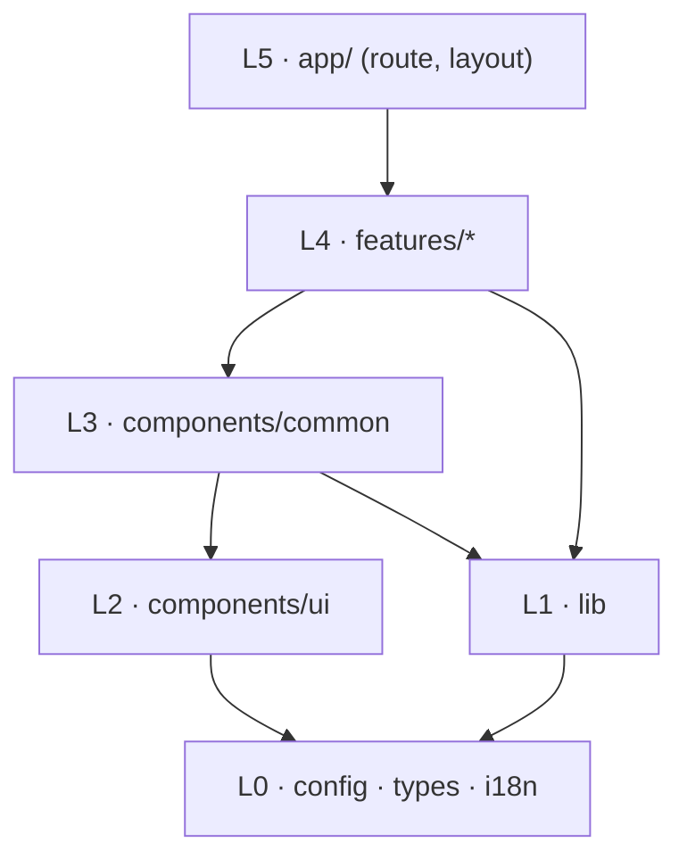
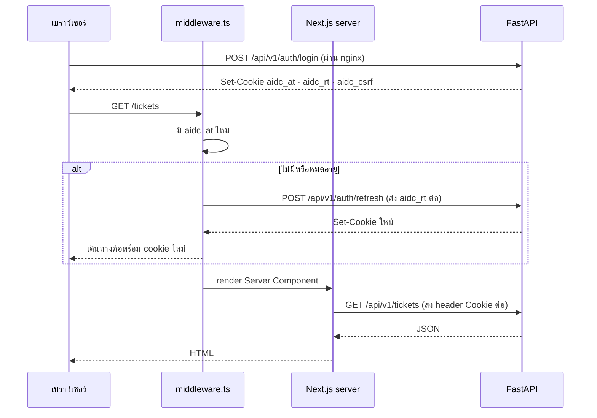

# Frontend Architecture — AIDC Helpdesk

| หัวข้อ | รายละเอียด |
|---|---|
| รหัสเอกสาร | FE-001 |
| เวอร์ชัน | **2.0** — เขียนใหม่ทั้งฉบับ |
| วันที่ | 2026-08-31 |
| สแตก | **Next.js 15 App Router + React 19 + TypeScript + Tailwind + shadcn/ui** |
| เอกสารอ้างอิง | `07-adr-002-tech-stack.md` · `08-adr-003-ui-direction.md` · `03-api-spec.md` v2.0 · `04-rbac-sla.md` v2.0 · `21-ui-ux-design.md` |
| เอกสารที่ถูกแทนที่ | v1.0 ซึ่งเขียนสำหรับ **Vite SPA + React Router + axios interceptor** — ใช้ไม่ได้ทั้งฉบับ |

---

## 0. ทำไมต้องเขียนใหม่

| v1.0 (Vite SPA) | v2.0 (Next.js) |
|---|---|
| `react-router-dom` + `createBrowserRouter` | **App Router** — โครงสร้างโฟลเดอร์เป็น routing |
| ทุกอย่างเป็น Client Component | **Server Component เป็นค่าเริ่มต้น** — Client Component เมื่อจำเป็นเท่านั้น |
| `axios` + interceptor แนบ `Authorization: Bearer` | **cookie แนบอัตโนมัติ** — ไม่มี token ใน JavaScript เลย |
| `tokenStorage.ts` อ่าน/เขียน `localStorage` | **ไม่มีไฟล์นี้** — backend เป็นผู้ตั้ง httpOnly cookie |
| interceptor refresh แบบ single-flight ฝั่ง client | **refresh ที่ middleware ฝั่ง server** |
| TanStack Query ทุกหน้า | **เฉพาะหน้าที่ต้อง poll** — หน้าอื่นอ่านผ่าน RSC |
| bundle budget 300 KB คือทั้งแอป | **First Load JS** ต่อ route |

---

## 1. หลักการที่ยึด

| # | หลักการ | เหตุผล |
|---|---|---|
| 1 | **frontend ไม่มี business logic เลย** | กฎ SLA/RBAC/state machine อยู่ที่ FastAPI ที่เดียว — ถ้าเขียนซ้ำ สองชุดจะหลุดจากกันแน่นอน |
| 2 | **ไม่มี `DATABASE_URL` ไม่มี ORM ไม่มี SQL** | ADR-002 §2.1 — CI ล้มถ้าเจอคำเหล่านี้ในโปรเจกต์นี้ |
| 3 | **Server Component เป็นค่าเริ่มต้น** | ส่ง HTML ที่อ่านได้มาก่อน สำคัญกับมือถือ 4G ที่ไซต์งาน |
| 4 | **สิทธิ์บน UI มาจาก `can` ที่ API ส่งมา ไม่คำนวณเอง** | ปิดประเด็น FE-02 — เงื่อนไข **O**/**S** ในเมทริกซ์ RBAC ซับซ้อนเกินกว่าจะเดาจาก `permissions[]` |
| 5 | **Type มาจาก OpenAPI ไม่เขียนมือซ้ำ** | `openapi-typescript` + CI ตรวจว่าไม่หลุด |
| 6 | **Mobile-first จริง** | ผู้ใช้หลักคือพนักงานหน้างาน AIDC-CON / AIDC-LOG |
| 7 | **ไม่ over-engineer** | ไม่ทำ micro-frontend · ไม่แยก design system เป็น package · ไม่ทำ offline-first (ยกไปเฟส 2) |

---

## 2. โครงสร้างโฟลเดอร์

```text
frontend/
├─ next.config.ts                 # standalone + CSP default-src 'self'
├─ tailwind.config.ts             # design token แนวทาง B (ADR-003)
├─ tsconfig.json                  # strict + noUncheckedIndexedAccess + exactOptionalPropertyTypes
├─ playwright.config.ts
├─ vitest.config.ts
└─ src/
   ├─ middleware.ts               # ★ ด่านแรก: ตรวจ session + refresh + กัน route ตาม role
   │
   ├─ app/                        # App Router — โครงสร้างโฟลเดอร์คือ routing
   │  ├─ layout.tsx               # <html lang="th"> + ฟอนต์ + skip link
   │  ├─ globals.css              # design token ทั้งหมด
   │  ├─ not-found.tsx  error.tsx  forbidden.tsx
   │  ├─ healthz/route.ts         # ให้ docker healthcheck เรียก
   │  │
   │  ├─ (auth)/                  # โซนก่อนเข้าระบบ — ไม่มี AppShell
   │  │  ├─ layout.tsx
   │  │  ├─ login/page.tsx
   │  │  └─ change-password/page.tsx
   │  │
   │  └─ (app)/                   # โซนหลังเข้าระบบ — มี AppShell
   │     ├─ layout.tsx            # Sidebar / BottomNav / Topbar  (Server Component)
   │     ├─ page.tsx              # เปลี่ยนเส้นทางตามบทบาท
   │     ├─ tickets/
   │     │  ├─ page.tsx           # เรื่องทั้งหมด        (RSC + Client filter)
   │     │  ├─ my/page.tsx        # เรื่องของฉัน          (RSC)
   │     │  ├─ new/page.tsx       # แจ้งเรื่องใหม่        (Client — ฟอร์ม)
   │     │  └─ [id]/
   │     │     ├─ page.tsx        # รายละเอียด           (RSC)
   │     │     └─ loading.tsx     # skeleton โครงเหมือนของจริง
   │     ├─ queue/page.tsx        # คิวงาน agent          (Client — poll 60 วิ)
   │     ├─ approvals/page.tsx    # คำขอที่รอฉันอนุมัติ    (RSC)
   │     ├─ dashboard/page.tsx    # (RSC + chart เป็น Client)
   │     ├─ reports/{page,sla-compliance,kpi,aged-backlog,uptime}/
   │     ├─ kb/{page,[id],new,[id]/edit}/
   │     ├─ notifications/page.tsx
   │     ├─ profile/page.tsx
   │     └─ admin/{users,departments,categories,catalog,sla,business-hours,
   │               services,escalation,roles,audit-logs,system}/
   │
   ├─ features/                   # 1 โฟลเดอร์ = 1 โดเมน
   │  ├─ auth/{api,components,schemas}
   │  ├─ tickets/{api,hooks,components,lib,schemas}
   │  ├─ approvals/  checklists/  attachments/  kb/
   │  ├─ dashboard/  reports/  notifications/  admin/
   │  └─ …           # แต่ละ feature มี index.ts เป็น public API
   │
   ├─ components/
   │  ├─ ui/                      # primitive จาก shadcn/ui (copy-in)
   │  └─ common/                  # DataTable · PageHeader · EmptyState · ErrorState
   │                              # LoadingSkeleton · ConfirmDialog · Pagination
   │                              # SearchInput · ThaiDate · StatusBadge · PriorityMeter
   │
   ├─ lib/
   │  ├─ api/
   │  │  ├─ server.ts             # ★ fetch จาก Server Component (ส่ง cookie ต่อ)
   │  │  ├─ client.ts             # ★ fetch จาก Client Component (เบราว์เซอร์แนบ cookie เอง + CSRF)
   │  │  └─ errors.ts             # ApiError + แปลง error body เป็นชนิดเดียว
   │  ├─ queryClient.ts           # TanStack Query — ใช้เฉพาะหน้าที่ poll
   │  ├─ queryKeys.ts
   │  ├─ datetime.ts              # พ.ศ. · relative · formatBusinessMinutes
   │  ├─ format.ts                # ขนาดไฟล์ · เลข · นาที -> "3 ชม. 20 น."
   │  ├─ image.ts                 # บีบอัดรูปก่อนอัปโหลด
   │  ├─ urlFilters.ts            # sync filter <-> query string
   │  └─ cn.ts
   │
   ├─ config/
   │  ├─ env.ts                   # อ่าน env แบบ typed
   │  ├─ constants.ts
   │  └─ enums.ts                 # ★ metadata แสดงผลของ 7 สถานะ / P1-P4 / 4 SLA
   │
   ├─ types/
   │  ├─ api.generated.ts         # ← openapi-typescript (ห้ามแก้มือ)
   │  └─ domain.ts                # alias ที่อ่านง่าย
   │
   ├─ i18n/th.ts                  # dictionary ภาษาไทย (แหล่งข้อความเดียว)
   └─ test/{setup.ts, msw/}
```

### 2.1 กฎการพึ่งพา (บังคับด้วย ESLint)



| กฎ | บังคับด้วย |
|---|---|
| import ได้เฉพาะจาก layer ที่ต่ำกว่า | `eslint-plugin-boundaries` |
| `lib/` และ `components/` ห้าม import จาก `features/` | `no-restricted-imports` |
| feature A เข้า feature B ได้เฉพาะผ่าน `features/B/index.ts` | ESLint pattern |
| `types/api.generated.ts` ห้ามแก้มือ | CI `npm run check:contract` |
| ห้ามมีคำว่า `postgres://` `prisma` `DATABASE_URL` ในโปรเจกต์นี้ | CI grep |
| ห้าม `dangerouslySetInnerHTML` | `react/no-danger: error` |

---

## 3. Server Component หรือ Client Component — กฎตัดสิน

> นี่คือการตัดสินใจที่ผิดบ่อยที่สุดใน Next.js ทีมต้องใช้กฎเดียวกัน

**ค่าเริ่มต้นคือ Server Component** เติม `'use client'` ต่อเมื่อเข้าข้อใดข้อหนึ่ง:

| ต้องเป็น Client Component เมื่อ | ตัวอย่างในระบบนี้ |
|---|---|
| มี state ที่ผู้ใช้เปลี่ยน | ฟอร์มแจ้งเรื่อง · ตัวกรอง · เลือกหลายแถว |
| ใช้ event handler | ปุ่มรับงาน · ติ๊ก checklist |
| ต้อง poll ข้อมูล | คิวงาน agent · กระดิ่งแจ้งเตือน · สถานะ export job |
| ใช้ browser API | บีบอัดรูป · `navigator.onLine` · คีย์ลัด |
| ใช้ไลบรารีที่ต้องมี DOM | Recharts · Radix |

**กติกาสำคัญ:** ถ้าหน้าไหนต้อง interactive **ให้ทั้งหน้าเป็น Client Component ไปเลย ห้ามผสมครึ่ง ๆ** — การแบ่งละเอียดเกินไปทำให้ debug ยากโดยไม่ได้ประโยชน์ที่วัดได้ที่ขนาดแอปนี้

### 3.1 ตารางตัดสินรายหน้า

| หน้า | ชนิด | เหตุผล |
|---|---|---|
| `/login` · `/change-password` | Client | ฟอร์ม |
| `/tickets` · `/tickets/my` | **RSC** + `<TicketFilterBar>` เป็น Client | ตารางอ่านอย่างเดียว · ตัวกรองอยู่ใน URL |
| `/tickets/new` | Client | ฟอร์ม + อัปโหลด + ร่างอัตโนมัติ |
| `/tickets/[id]` | **RSC** + แผงการดำเนินการเป็น Client | เนื้อหาส่วนใหญ่อ่านอย่างเดียว |
| `/queue` | Client | poll ทุก 60 วินาที + bulk + คีย์ลัด |
| `/approvals` | **RSC** + ปุ่มตัดสินเป็น Client | |
| `/dashboard` | **RSC** ดึงข้อมูล + `<TicketChart>` เป็น Client | Recharts ต้องมี DOM |
| `/kb` · `/kb/[id]` | **RSC** | อ่านอย่างเดียว · ได้ประโยชน์จาก SSR มากที่สุด |
| `/admin/**` | ส่วนใหญ่ Client | เป็นฟอร์ม CRUD |

---

## 4. Authentication

### 4.1 ไม่มี token ใน JavaScript เลย



| จุด | รายละเอียด |
|---|---|
| ที่เก็บ token | **httpOnly cookie ที่ FastAPI เป็นผู้ตั้ง** — `lib/api/*` ไม่เคยเห็นค่า token |
| refresh | ทำที่ `middleware.ts` ก่อน render — ผู้ใช้ไม่เห็นการกะพริบ |
| CSRF | client fetch อ่าน cookie `aidc_csrf` แล้วใส่ header `X-CSRF-Token` ทุก `POST/PUT/PATCH/DELETE` |
| บังคับเปลี่ยนรหัสผ่าน | middleware อ่าน `must_change_password` จาก `/auth/me` แล้วบังคับไป `/change-password` |
| logout | `POST /auth/logout` → backend ลบ cookie + ใส่ jti ลง denylist |

### 4.2 `src/middleware.ts`

```ts
import { NextResponse, type NextRequest } from 'next/server';

const PUBLIC_PATHS = ['/login', '/healthz'];
const AT = 'aidc_at';
const RT = 'aidc_rt';

/**
 * ด่านแรกของทุกคำขอ — ทำ 3 อย่าง
 *   1. ยังไม่ล็อกอิน -> ส่งไป /login พร้อม ?redirect=
 *   2. access token หมดอายุแต่มี refresh -> ต่ออายุที่นี่ ผู้ใช้ไม่รู้สึก
 *   3. must_change_password -> บังคับไป /change-password
 *
 * หมายเหตุ: นี่คือ "ประสบการณ์ผู้ใช้" ไม่ใช่ security boundary
 * FastAPI ตรวจสิทธิ์ซ้ำทุกคำขอเสมอ (NFR-13)
 */
export async function middleware(req: NextRequest) {
  const { pathname, search } = req.nextUrl;
  if (PUBLIC_PATHS.some((p) => pathname.startsWith(p)) || pathname.startsWith('/_next')) {
    return NextResponse.next();
  }

  const hasAccess = req.cookies.has(AT);
  const hasRefresh = req.cookies.has(RT);

  if (!hasAccess && !hasRefresh) {
    const url = req.nextUrl.clone();
    url.pathname = '/login';
    url.searchParams.set('redirect', pathname + search);
    return NextResponse.redirect(url);
  }

  if (!hasAccess && hasRefresh) {
    const refreshed = await fetch(`${process.env.INTERNAL_API_URL}/auth/refresh`, {
      method: 'POST',
      headers: { cookie: req.headers.get('cookie') ?? '' },
    });
    if (!refreshed.ok) {
      const url = req.nextUrl.clone();
      url.pathname = '/login';
      return NextResponse.redirect(url);
    }
    const res = NextResponse.next();
    // ส่ง Set-Cookie ที่ backend ออกให้ต่อไปยังเบราว์เซอร์
    for (const c of refreshed.headers.getSetCookie()) res.headers.append('set-cookie', c);
    return res;
  }

  return NextResponse.next();
}

export const config = {
  matcher: ['/((?!_next/static|_next/image|favicon.ico).*)'],
};
```

---

## 5. Data Fetching

### 5.1 อ่านข้อมูลใน Server Component

```ts
// src/lib/api/server.ts
import { cookies } from 'next/headers';
import { ApiError } from './errors';

const BASE = process.env.INTERNAL_API_URL ?? 'http://api:8000/api/v1';

/**
 * เรียก FastAPI จาก Server Component / middleware
 * ส่ง cookie ของผู้ใช้ต่อไป เพื่อให้ backend บังคับ scoping ด้วยตัวตนที่ถูกต้อง
 *
 * ห้ามใช้จาก Client Component — ฟังก์ชันนี้อ่าน cookies() ของ Next.js
 */
export async function apiServer<T>(
  path: string,
  init: RequestInit & { revalidate?: number } = {},
): Promise<T> {
  const cookieHeader = (await cookies()).toString();
  const { revalidate, ...rest } = init;

  const res = await fetch(`${BASE}${path}`, {
    ...rest,
    headers: { accept: 'application/json', cookie: cookieHeader, ...rest.headers },
    // ข้อมูลของ ticket เปลี่ยนตลอด และ scoped ตามผู้ใช้ จึงห้าม cache ข้ามคำขอ
    cache: revalidate === undefined ? 'no-store' : 'force-cache',
    ...(revalidate !== undefined ? { next: { revalidate } } : {}),
  });

  if (!res.ok) throw await ApiError.fromResponse(res);
  return res.status === 204 ? (undefined as T) : ((await res.json()) as T);
}
```

> **ห้าม cache คำขอที่ scoped ตามผู้ใช้** — ถ้าเผลอ cache ผู้ใช้บริษัท A จะเห็นข้อมูลบริษัท B
> `revalidate` ใช้ได้เฉพาะข้อมูลอ้างอิงที่เหมือนกันทุกคน (เช่น `/companies`, `/sla/policies`)

### 5.2 เขียนข้อมูลและ poll จาก Client Component

```ts
// src/lib/api/client.ts
import { ApiError } from './errors';

const BASE = process.env.NEXT_PUBLIC_API_BASE_URL ?? '/api/v1';

function csrfToken(): string {
  return document.cookie.match(/(?:^|;\s*)aidc_csrf=([^;]+)/)?.[1] ?? '';
}

/**
 * เรียก FastAPI จากเบราว์เซอร์ — origin เดียวกันผ่าน nginx cookie จึงแนบอัตโนมัติ
 * ไม่มีการอ่าน/เขียน token ใน JavaScript เลย มีแต่ CSRF token ที่อ่านได้โดยเจตนา
 */
export async function apiClient<T>(path: string, init: RequestInit = {}): Promise<T> {
  const method = (init.method ?? 'GET').toUpperCase();
  const needsCsrf = !['GET', 'HEAD', 'OPTIONS'].includes(method);

  const res = await fetch(`${BASE}${path}`, {
    ...init,
    credentials: 'same-origin',
    headers: {
      accept: 'application/json',
      ...(needsCsrf ? { 'X-CSRF-Token': csrfToken() } : {}),
      ...init.headers,
    },
  });

  if (!res.ok) throw await ApiError.fromResponse(res);
  return res.status === 204 ? (undefined as T) : ((await res.json()) as T);
}
```

### 5.3 นโยบาย cache ของ TanStack Query (เฉพาะหน้าที่ poll)

| ข้อมูล | `staleTime` | `refetchInterval` | หมายเหตุ |
|---|---|---|---|
| คิวงาน agent | 30 วินาที | **60 วินาที** | หยุดเมื่อแท็บถูกซ่อน (ค่าเริ่มต้น) |
| `notifications/unread-count` | 30 วินาที | **60 วินาที** | |
| สถานะ export job | 0 | **2 วินาที** (สูงสุด 5 นาที) | เฉพาะขณะมี job ค้าง |
| ticket detail ที่เปิดค้าง | 15 วินาที | 60 วินาที | agent เปิดทั้งวัน |
| ที่เหลือทั้งหมด | — | — | **อ่านผ่าน Server Component ไม่ใช้ Query** |

ประเมินภาระ: 1 คน × ~60 req/ชม. — ห่างจาก rate limit 120 req/นาที/user มาก

### 5.4 หลังเขียนข้อมูลสำเร็จ

| การกระทำ | สิ่งที่ทำ |
|---|---|
| ในหน้า RSC (รายละเอียด · อนุมัติ · checklist) | `router.refresh()` — Next.js ดึง RSC payload ใหม่ ไม่โหลดทั้งหน้า |
| ในหน้าที่ใช้ Query (คิวงาน) | `invalidateQueries` ตาม `queryKeys` |
| ทั้งสองแบบ | **ใช้ค่าที่ backend ส่งกลับเสมอ ห้ามคำนวณ SLA/สถานะ/สิทธิ์ใหม่ฝั่ง client** |

### 5.5 Optimistic update — ทำที่ไหนบ้าง

| ที่ | ทำ? | เหตุผล |
|---|---|---|
| อ่านการแจ้งเตือน | ✔ | ผลลัพธ์เดาได้ 100% ผู้ใช้กดถี่ |
| ให้คะแนนบทความ KB | ✔ | ปุ่มต้องตอบสนองทันที · `409` แล้ว rollback |
| ติ๊ก checklist ที่ไม่ต้องแนบหลักฐาน | ✔ | |
| สร้าง/เปลี่ยนสถานะ/assign ticket | ✘ | server ออกเลข · คำนวณ SLA ใหม่ · อาจตอบ `409` |
| อนุมัติ/ปฏิเสธคำขอ | ✘ | เปลี่ยนสถานะ ticket ตามไปด้วย |
| คอมเมนต์ | ✘ (แสดงแถว pending แทน) | อาจเปลี่ยนสถานะอัตโนมัติจาก `pending_user` |
| อัปโหลดไฟล์ | ✘ | ใช้ progress bar จริง |

---

## 6. สิทธิ์บน UI — ใช้ `can` จาก API เท่านั้น

> ⚠️ `<Can>` และการซ่อนปุ่มเป็น **ประสบการณ์ผู้ใช้ ไม่ใช่ security boundary** — ผู้ใช้แก้ JavaScript ให้ปุ่มโผล่ได้เสมอ ความปลอดภัยจริงอยู่ที่ backend ทุกกรณี (NFR-13)
> **ห้ามใช้เพื่อกันการเห็นข้อมูลลับ** เช่นคอมเมนต์ภายใน — ข้อมูลนั้นต้องไม่ถูกส่งมาใน API response ตั้งแต่แรก

```tsx
// src/features/tickets/components/TicketActionPanel.tsx
import type { Ticket } from '@/types/domain';

/**
 * ทุกปุ่มอ่านจาก ticket.can ที่ backend คำนวณมาแล้ว
 *
 * เหตุผลที่ไม่เช็คจาก permissions[] เอง (FE-02):
 * เมทริกซ์ RBAC มีเงื่อนไข O (เฉพาะของตน) และ S (เฉพาะบริษัทตน) ที่ผูกกับ
 * สถานะ ticket ด้วย เช่น end_user แก้ ticket ได้เฉพาะตอนสถานะ new และเฉพาะเรื่องของตน
 * ถ้า frontend เดาเอง จะได้กฎสองชุดที่หลุดจากกันภายในไม่กี่สปรินต์
 */
export function TicketActionPanel({ ticket }: { ticket: Ticket }) {
  const { can } = ticket;
  return (
    <div className="flex flex-col gap-2">
      {can.change_status && <StatusActionMenu ticket={ticket} />}
      {can.assign && <AssignButton ticketId={ticket.id} />}
      {can.claim && <ClaimButton ticketId={ticket.id} />}
      {can.set_workaround && <WorkaroundButton ticket={ticket} />}
      {can.change_tier && <EscalateTierButton ticket={ticket} />}
      {can.request_priority_review && <PriorityReviewButton ticket={ticket} />}
      {can.close && <ConfirmCloseButton ticket={ticket} />}
      {can.reopen && <ReopenButton ticket={ticket} />}
    </div>
  );
}
```

**เมนูฝั่งซ้าย** ใช้ตารางเดียวใน `app/(app)/_nav.ts` ที่ผูก permission กับแต่ละเมนู แล้วกรองครั้งเดียวใน layout — ไม่กระจาย `<Can>` ทีละอัน

---

## 7. การจัดการ Error — 4 ชั้น ไม่ทับกัน

| ชั้น | ที่อยู่ | รับผิดชอบ |
|---|---|---|
| 1. **แปลง error** | `lib/api/errors.ts` | ทำให้ทุก error เป็น `ApiError` เดียวกัน (`status`, `code`, `message` ไทย, `details[]`, `requestId`) |
| 2. **Session** | `middleware.ts` | `TOKEN_EXPIRED` → refresh · ล้มเหลว → `/login?redirect=` |
| 3. **Mutation** | จุดที่เรียก | toast กลาง ยกเว้น `VALIDATION_ERROR` ที่ผูกกับฟิลด์ฟอร์ม |
| 4. **Route** | `error.tsx` ต่อ segment | RSC ที่โยน error แสดงในบริบทของ segment นั้น ไม่ล้มทั้งหน้า |

| `code` | สิ่งที่ frontend ทำเพิ่ม |
|---|---|
| `VALIDATION_ERROR` | map `details[].field` → `setError()` ของ react-hook-form · ฟิลด์ที่ไม่รู้จักรวมไว้หัวฟอร์ม |
| `INVALID_STATE_TRANSITION` | dialog + `router.refresh()` (ข้อมูลบนจอเก่าไปแล้ว) |
| `ALREADY_ASSIGNED` | refetch คิวงาน + toast "มีเพื่อนร่วมทีมรับเรื่องนี้ไปแล้ว" |
| **`CHECKLIST_INCOMPLETE`** | แสดงรายการที่ขาดจาก `details[]` แล้วเลื่อนจอไปที่ checklist |
| **`APPROVAL_PENDING`** | แสดงว่ากำลังรออนุมัติจากใคร พร้อมลิงก์ไปดูขั้นการอนุมัติ |
| **`WORKAROUND_REQUIRES_PROBLEM`** | เปิด dialog สร้าง Problem ให้เลย ไม่ให้ผู้ใช้ต้องไปหาเอง |
| **`CSRF_FAILED`** | `location.reload()` เพื่อรับ cookie ใหม่ — **ไม่ต้องล็อกเอาต์** |
| `OUT_OF_SCOPE` / `FORBIDDEN` | ไป `/forbidden` ถ้าเกิดตอนโหลดหน้า · toast ถ้าเกิดตอนกดปุ่ม |
| `RATE_LIMITED` | toast + ปิดปุ่ม 10 วินาทีพร้อมนับถอยหลัง |
| status 0 (เน็ตหลุด) | แถบส้มค้างบนสุด "ไม่ได้เชื่อมต่ออินเทอร์เน็ต — จะลองใหม่อัตโนมัติ" |
| `INTERNAL_ERROR` | toast + แสดง `request_id` พร้อมปุ่มคัดลอก |

---

## 8. Performance

เป้าที่ต้องผ่าน: **NFR-02** (รายการ 50 รายการ ≤ 2 วินาทีบน 4G) · **NFR-03** (First Load JS ≤ 300 KB gzip)

| เทคนิค | รายละเอียด |
|---|---|
| RSC เป็นค่าเริ่มต้น | หน้าอ่านอย่างเดียวแทบไม่ส่ง JS ของตัวเองไปเบราว์เซอร์เลย |
| `loading.tsx` ต่อ segment | skeleton ที่มีโครงเหมือนของจริง — ไม่ใช่ spinner กลางจอ · CLS = 0 |
| Recharts | อยู่ใน Client Component ของ dashboard/reports เท่านั้น → Next.js แยก chunk ให้เอง · **CI ตรวจว่าไม่หลุดเข้า shared bundle** |
| `browser-image-compression` | `await import()` ตอนเลือกไฟล์จริง |
| ฟอนต์ | `next/font` self-host ตอน build — ไม่มีการเรียก Google CDN ตอน runtime (จำเป็นเพราะ on-prem + CSP) |
| Virtualization | `@tanstack/react-virtual` เฉพาะคิว agent เมื่อแถว > 50 |
| Dropdown ผู้รับผิดชอบ/หมวดหมู่ | ค้นที่ server (`?q=`) + debounce 300 ms + จำกัด 20 รายการ — ไม่โหลดผู้ใช้ 3,000 คนมา virtualize |
| งบ bundle | CI ล้มเมื่อ First Load JS ของ route ใดเกิน 300 KB (gzip) |

### 8.1 อัปโหลดรูปจากมือถือ (US-01 AC-4)

| ขั้น | รายละเอียด |
|---|---|
| 1 | `<input type="file" accept="image/*,application/pdf,…" capture="environment" multiple>` |
| 2 | ตรวจก่อนบีบ — ≤ 5 ไฟล์ · MIME อยู่ใน allowlist · ขนาดดิบ ≤ 20 MB (ไม่ผ่านให้ error ทันทีโดยไม่เสียเน็ต) |
| 3 | บีบใน Web Worker: `maxSizeMB 1.5` · `maxWidthOrHeight 1920` · ข้าม GIF และไฟล์ < 1 MB |
| 4 | อัปโหลด **พร้อมกันไม่เกิน 2 ไฟล์** — เน็ตหน้างานแบนด์วิดท์แคบ ยิงพร้อมกัน 5 ไฟล์ทำให้ทุกไฟล์ช้าและ timeout |
| 5 | progress ต่อไฟล์ · ปุ่มลองใหม่รายไฟล์ · ส่งเรื่องได้ถ้ามีไฟล์สำเร็จอย่างน้อยหนึ่ง |
| 6 | ร่างฟอร์มเก็บใน `sessionStorage` ทุก 2 วินาที — สัญญาณหลุดแล้วกลับมากรอกต่อได้ |
| 7 | ส่ง header `Idempotency-Key` (UUID สร้างตอนเปิดฟอร์ม) กันกดซ้ำ |

---

## 9. การแสดงเวลาและ SLA

| กฎ | เหตุผล |
|---|---|
| **ไม่ทำนาฬิกานับถอยหลัง** | `remaining_minutes` เป็น **นาทีทำการ** — ตอน 17:31 หรือวันเสาร์นาฬิกาต้องหยุด ซึ่ง client คำนวณเองไม่ได้โดยไม่ดึง business hours + holiday ทั้งชุดมาคำนวณซ้ำ |
| แสดงค่าคงที่ + refetch ทุก 60 วินาที | ในหน้าที่เปิดค้างเท่านั้น |
| **ระบุหน่วยเสมอ** | `remaining_unit` จาก API บอกว่าเป็น `business_minutes` หรือ `calendar_minutes` → แสดง "เหลือ 42 นาทีทำการ" หรือ "เหลือ 42 นาที (นับต่อเนื่อง)" |
| แสดงเวลาครบกำหนดจริงคู่กันเสมอ | "เหลือ 42 นาทีทำการ · ครบกำหนด 31 ส.ค. 17:15 น." |
| วันที่ | แสดงเป็น **พ.ศ.** ("31 ส.ค. 2569 09:15 น.") · ส่ง ISO 8601 (ค.ศ.) ไป API เสมอ 🟡 *รอ PM ยืนยัน UX-05* |
| ผู้แจ้งเห็นอะไร | เห็น "กำหนดแก้ไขเสร็จโดยประมาณ" ไม่เห็น %/นาทีที่เหลือ และไม่เห็นคำว่า "เกินกำหนด" 🟡 *รอ PM ยืนยัน UX-03* |

---

## 10. คุณภาพโค้ดและ codegen

| หัวข้อ | แนวทาง |
|---|---|
| Type จาก API | `npm run gen:api` → `openapi-typescript ../backend/openapi.json -o src/types/api.generated.ts` · CI รัน `check:contract` แล้ว `git diff --exit-code` |
| TypeScript | `strict` · `noUncheckedIndexedAccess` · `exactOptionalPropertyTypes` · `verbatimModuleSyntax` |
| ห้าม `any` | `@typescript-eslint/no-explicit-any: error` |
| a11y | `eslint-plugin-jsx-a11y` ระดับ **error** ไม่ใช่ warning |
| Format | Prettier + `prettier-plugin-tailwindcss` |
| Pre-commit | `lint-staged`: eslint --fix + prettier + `tsc --noEmit` |

### 10.1 กลยุทธ์การทดสอบ

| ระดับ | เครื่องมือ | ครอบคลุมอะไร |
|---|---|---|
| Unit | Vitest | `lib/datetime.ts` · `lib/image.ts` · `lib/urlFilters.ts` · schema ของ Zod |
| Component | Vitest + Testing Library + MSW | ฟอร์มแจ้งเรื่อง · ตาราง · แผงการดำเนินการ (ตรวจว่าปุ่มโผล่ตาม `can` จริง) |
| a11y | `vitest-axe` | component ใหม่/ที่แก้ ต้องไม่มี violation ระดับ serious/critical |
| E2E | Playwright | 6 เส้นทาง: ล็อกอิน → แจ้งเรื่อง → รับงาน → รอผู้แจ้ง → แก้ไขเสร็จ → ยืนยันปิด · คำขอที่ต้องอนุมัติ · onboarding checklist · ตรวจว่า company_admin ไม่เห็นข้ามบริษัท |
| Contract | CI | `openapi.json` ↔ `api.generated.ts` ต้องตรงกัน |

### 10.2 MSW — frontend ไม่ต้องรอ backend

| ช่วง | สถานะ |
|---|---|
| P1–P2 | **MSW เต็มรูปแบบ** — handler เขียนจาก type ที่ gen แล้ว ครอบคลุม 200/401/403/409/422/429/500 + จำลอง delay 3 วินาที (4G) |
| P3–P6 | **ผสม** — ต่อ API จริงเฉพาะกลุ่มที่ backend ส่งแล้ว |
| P7 เป็นต้นไป | **API จริงล้วน** — MSW เหลือใช้ใน test เท่านั้น |

> **เงื่อนไขบังคับ:** MSW handler ต้องสร้างจาก type ที่ gen ด้วย `openapi-typescript` — ถ้า schema เปลี่ยน handler จะ compile ไม่ผ่านทันที จับความหลุดของสัญญาได้ตั้งแต่ build ไม่ใช่ตอนต่อ API จริง

---

## 11. สถานะประเด็นที่ยกไว้ในเวอร์ชัน 1.0

| # | ประเด็น | สถานะ |
|---|---|---|
| FE-01 | token ใน `localStorage` เสี่ยง XSS | ✅ **ปิด** — httpOnly cookie ที่ backend ตั้งเอง (ADR-002 D-01) |
| FE-02 | ไม่รู้ว่าผู้ใช้ทำอะไรกับ ticket ใบนี้ได้บ้าง | ✅ **ปิด** — บล็อก `can{}` ใน `GET /tickets/{id}` |
| FE-03 | `must_change_password` ไม่มีใน `/auth/me` | ✅ **ปิด** |
| FE-04 | ไม่มีทางส่ง `satisfaction_score` | ✅ **ปิด** — รับใน `POST /tickets/{id}/status` เมื่อปิดงาน |
| FE-05 | ไม่มีทางผูก `resolved_by_kb_id` | ✅ **ปิด** |
| FE-06 | ไม่มี bulk action | ✅ **ปิด** — `POST /tickets/bulk` (≤ 20 ใบ คืนผลรายใบ) |
| FE-07 | `remaining_minutes` เป็นนาทีทำการ ทำ countdown ไม่ได้ | ✅ **ปิด** — API ส่ง `remaining_unit` มาด้วย · frontend ไม่ทำ countdown |
| FE-08 | โครงสร้าง `GET /categories?tree=true` ไม่ระบุ | ✅ **ปิด** — `{ items: [{ ...category, children: [] }] }` |
| FE-09 | list item ขาด `department` / `reopen_count` / `is_resolution_breached` | ✅ **ปิด** — เพิ่มครบ + `ticket_type` + `support_tier` |
| FE-10 | `ticket.close_own` ไม่มี endpoint ของตัวเอง | ✅ **ปิด** — ระบุไว้ในตาราง 2.4 ว่า `/status` ยอมรับ permission นี้ |
| FE-11 | `download_url` ของ export job ต้องแนบ header ไหม | ✅ **ปิด** — เป็น signed URL อายุ 15 นาที เปิดตรงได้ |
| FE-12 | ไม่มี realtime channel | ⚪ **ยอมรับในเฟส 1** — polling 60 วินาที · ถ้า PM ต้องการ "เห็นทันที" ต้องเพิ่ม SSE ในเฟส 2 |

### 11.1 ประเด็นใหม่ที่ยังต้องคุยกับ SA/PM

| # | ประเด็น | ข้อเสนอ |
|---|---|---|
| **FE-13** | หน้าจอของ **คำขอที่ต้องอนุมัติ** ยังไม่มี wireframe ใน `21-ui-ux-design.md` (เอกสารนั้นเขียนก่อนที่ approval จะเข้าขอบเขต) | ขอเพิ่ม wireframe 2 หน้า: `/approvals` และแผงขั้นอนุมัติในหน้ารายละเอียด |
| **FE-14** | **checklist** ก็ยังไม่มี wireframe | ขอเพิ่มแผง checklist ในหน้ารายละเอียด พร้อมสถานะ "ต้องแนบหลักฐาน" |
| **FE-15** | ผู้อนุมัติอาจเป็นคนที่ไม่มี role `agent` เลย และอาจอยู่คนละบริษัทกับ ticket | ยืนยันว่า `/approvals/pending` ข้ามขอบเขตบริษัทได้ และเมนู "รออนุมัติ" ต้องโผล่ให้ผู้ใช้ที่มีคำขอค้างแม้เป็น `end_user` ล้วน |
| **FE-16** | หน้า **บันทึกเหตุขัดข้อง** (`service_outage`) เป็นงานที่ต้องทำเร็วตอนเกิดเหตุจริง | เสนอทำเป็นปุ่มลัดในหน้ารายละเอียด ticket ไม่ใช่หน้าแยกใน `/admin` |
| **FE-17** | `21-ui-ux-design.md` ยังเขียนว่า "จ–ส 08:00–17:00" และป้ายระดับเป็น `วิกฤต/สูง/ปานกลาง/ต่ำ` | ต้องแก้เป็น จ–ศ 08:30–17:30 และ `P1 – วิกฤต` … `P4 – ต่ำ` (อยู่ในรายการงานของ ADR-003 §4 แล้ว) |
