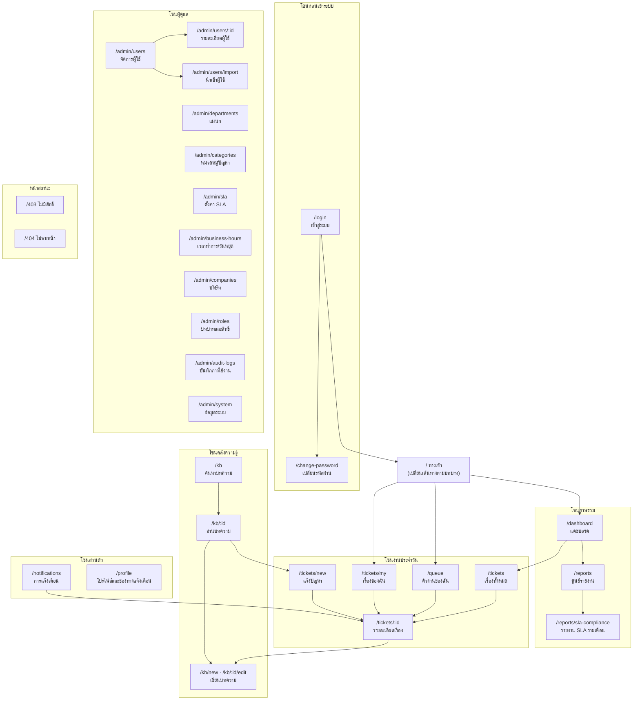
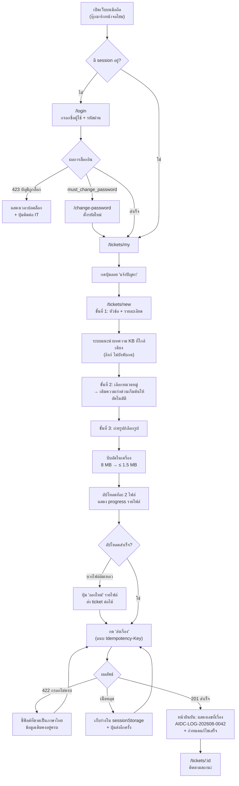
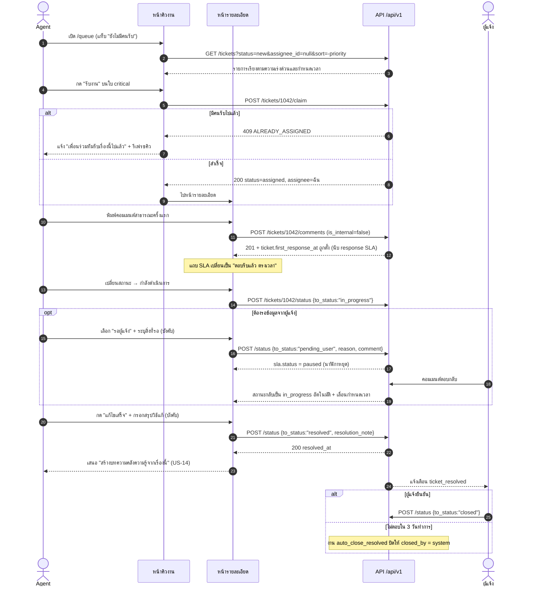
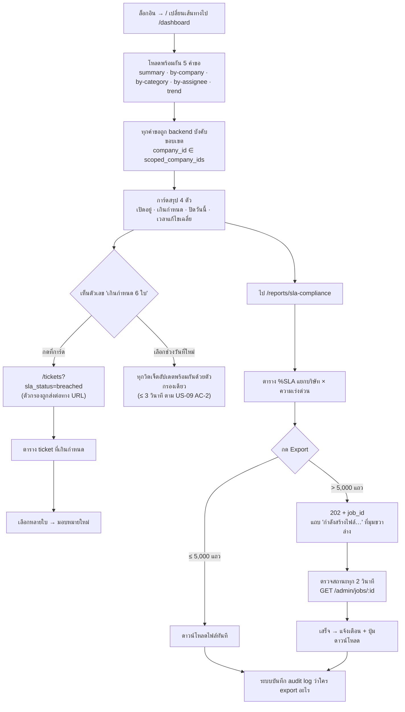
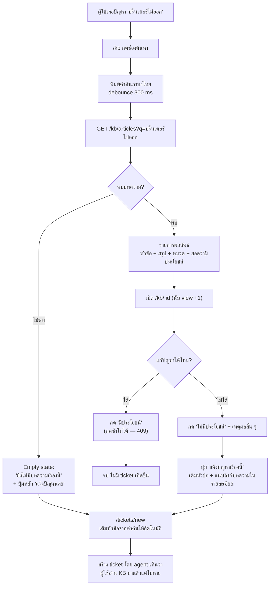

# UI/UX Design — AIDC Helpdesk

| หัวข้อ | รายละเอียด |
|---|---|
| รหัสเอกสาร | FE-002 |
| เวอร์ชัน | 1.0 |
| วันที่ | 2026-08-31 |
| ผู้จัดทำ | Senior Frontend |
| เอกสารอ้างอิง | `01-srs.md`, `02-data-model.md`, `03-api-spec.md`, `04-rbac-sla.md`, `20-frontend-architecture.md` |

---

## 0. หลักการออกแบบ 6 ข้อ

| # | หลักการ | มาจากไหน |
|---|---|---|
| 1 | **แจ้งปัญหาให้จบใน 4 ฟิลด์ ไม่เกิน 2 นาที** | NFR-33, US-01 |
| 2 | **มือถือคือหน้าจอหลัก ไม่ใช่หน้าจอรอง** — ออกแบบที่ 360 px ก่อน แล้วขยายขึ้น | NFR-30, ผู้ใช้ AIDC-CON / AIDC-LOG |
| 3 | **ใช้คำที่พนักงานหน้างานเข้าใจ ห้ามศัพท์ ITIL** — "เรื่องที่แจ้ง" ไม่ใช่ "incident", "ความเร่งด่วน" ไม่ใช่ "priority" | NFR-32 |
| 4 | **สถานะต้องอ่านออกโดยไม่ต้องพึ่งสี** — สี + ไอคอน + ข้อความ ครบสามอย่างเสมอ | WCAG 1.4.1, ผู้ใช้ตาบอดสีในกลุ่มผู้ใช้หลักพันคน |
| 5 | **agent คือ power user** — หน้าคิวงานต้องหนาแน่น มี keyboard shortcut และ bulk action | ทีม support ไม่กี่คน ทำ ticket ทั้งวัน |
| 6 | **ทุกสิ่งที่ย้อนไม่ได้ต้องถามซ้ำ และบอกผลที่จะเกิด** | US-08 AC-3, FR-73 |

---

## 1. Sitemap



### 1.1 ตารางหน้าจอทั้งหมด (29 หน้า)

> `E` = end_user · `A` = agent · `CA` = company_admin · `MV` = manager_viewer · `SA` = super_admin

| # | ชื่อหน้า (ไทย) | Path | Role ที่เข้าได้ | จุดประสงค์ |
|---|---|---|---|---|
| 1 | เข้าสู่ระบบ | `/login` | ทุกคน (ยังไม่ล็อกอิน) | ยืนยันตัวตน, แจ้งบัญชีถูกล็อก (423) |
| 2 | เปลี่ยนรหัสผ่าน | `/change-password` | ทุก role | บังคับเปลี่ยนครั้งแรก (US-18) และเปลี่ยนเองภายหลัง |
| 3 | ทางเข้าตามบทบาท | `/` | ทุก role | เปลี่ยนเส้นทาง: E→เรื่องของฉัน, A→คิวงาน, CA/SA/MV→แดชบอร์ด |
| 4 | **แจ้งปัญหา** | `/tickets/new` | ทุก role | สร้าง ticket + แนบรูปจากมือถือ (US-01) |
| 5 | **เรื่องของฉัน** | `/tickets/my` | ทุก role | ติดตามสถานะเรื่องที่ตนแจ้ง (US-02) |
| 6 | เรื่องทั้งหมด | `/tickets` | A, CA, MV, SA | ค้น/กรอง ticket ทั้งขอบเขต + export (FR-16, US-10) |
| 7 | **คิวงานของฉัน** | `/queue` | A, CA, SA | หน้าทำงานหลักของ agent: งานที่ยังไม่มีคนรับ + งานของฉัน (US-03) |
| 8 | **รายละเอียดเรื่อง** | `/tickets/:id` | ทุก role (scoped) | ดู/ตอบ/เปลี่ยนสถานะ/มอบหมาย + ไทม์ไลน์ |
| 9 | **แดชบอร์ด** | `/dashboard` | A, CA, MV, SA | การ์ดสรุป 4 ตัว + กราฟ (FR-60, FR-61, US-09) |
| 10 | ศูนย์รายงาน | `/reports` | A, CA, MV, SA | รวมรายงาน 5 ชุดตาม `04-rbac-sla.md` §5 |
| 11 | **รายงาน SLA รายเดือน** | `/reports/sla-compliance` | A, CA, MV, SA | %SLA แยกบริษัท × priority + export (FR-63) |
| 12 | **คลังความรู้** | `/kb` | ทุก role | ค้นหาบทความภาษาไทย (US-13) |
| 13 | อ่านบทความ | `/kb/:id` | ทุก role (scoped visibility) | อ่าน + ให้คะแนน + แจ้งปัญหาต่อถ้ายังไม่หาย |
| 14 | เขียน/แก้ไขบทความ | `/kb/new`, `/kb/:id/edit` | A, CA, SA | เขียน KB จาก ticket ที่แก้แล้ว (US-14) |
| 15 | การแจ้งเตือน | `/notifications` | ทุก role | รายการ in-app + ทำเครื่องหมายอ่านแล้ว |
| 16 | โปรไฟล์และการตั้งค่า | `/profile` | ทุก role | ข้อมูลส่วนตัว, เปลี่ยนรหัสผ่าน, ช่องทางแจ้งเตือน + ผูก LINE (US-15) |
| 17 | **จัดการผู้ใช้** | `/admin/users` | CA (บริษัทตน), SA | ค้น/สร้าง/ปิดใช้งาน/รีเซ็ตรหัสผ่าน (US-08) |
| 18 | รายละเอียดผู้ใช้ | `/admin/users/:id` | CA, SA | แก้ข้อมูล + มอบ role + ขอบเขตบริษัท |
| 19 | นำเข้าผู้ใช้จากไฟล์ | `/admin/users/import` | CA, SA | อัปโหลด .xlsx/.csv + แสดงผลลัพธ์รายแถว (FR-06) |
| 20 | จัดการแผนก | `/admin/departments` | CA, SA | CRUD แผนกของบริษัทในขอบเขต (FR-27) |
| 21 | จัดการหมวดหมู่ปัญหา | `/admin/categories` | CA (หมวดบริษัทตน), SA | หมวด 2 ระดับ + default priority/assignee (FR-25, FR-28) |
| 22 | ตั้งค่า SLA | `/admin/sla` | SA | policy + target 4 priority (FR-30, US-11) |
| 23 | เวลาทำการและวันหยุด | `/admin/business-hours` | SA | 7 วัน + วันหยุดนักขัตฤกษ์ (FR-36) |
| 24 | จัดการบริษัท | `/admin/companies` | SA | ข้อมูล 7 บริษัท + โลโก้หัวรายงาน |
| 25 | บทบาทและสิทธิ์ | `/admin/roles` | CA (อ่าน), SA (แก้) | ดู/แก้ permission ของ role |
| 26 | บันทึกการใช้งาน | `/admin/audit-logs` | CA (บริษัทตน), SA | สืบร่องรอย (US-16) |
| 27 | ข้อมูลระบบ | `/admin/system` | SA | เวอร์ชัน, จำนวนผู้ใช้/ticket, เวลา backup ล่าสุด |
| 28 | ไม่มีสิทธิ์เข้าถึง | `/403` | ทุก role | อธิบายว่าทำไมเข้าไม่ได้ + ทางออก |
| 29 | ไม่พบหน้า | `/404` (และ `*`) | ทุกคน | |

**หน้าจอหลัก 8 หน้าที่มี wireframe ในเอกสารนี้:** 4, 5, 7, 8, 9, 11, 12, 17 (ตัวหนาในตาราง)

### 1.2 การนำทาง (Navigation)

| อุปกรณ์ | รูปแบบ |
|---|---|
| **มือถือ (< 768 px)** | Topbar (โลโก้ + กระดิ่ง + เมนูผู้ใช้) + **Bottom nav 4 ช่อง** ตามบทบาท · ปุ่ม **"แจ้งปัญหา"** เป็น FAB วงกลมมุมขวาล่างเสมอ (นิ้วโป้งถึง) |
| **แท็บเล็ต/เดสก์ท็อป (≥ 768 px)** | Sidebar ซ้ายพับได้ + Topbar (ค้นหาทั่วระบบ, CompanySwitcher, กระดิ่ง, เมนูผู้ใช้) |

**Bottom nav ตามบทบาท**

| Role | ช่อง 1 | ช่อง 2 | ช่อง 3 | ช่อง 4 |
|---|---|---|---|---|
| `end_user` | เรื่องของฉัน | คลังความรู้ | แจ้งเตือน | ฉัน |
| `agent` | คิวงาน | เรื่องทั้งหมด | คลังความรู้ | แจ้งเตือน |
| `company_admin` | แดชบอร์ด | เรื่องทั้งหมด | ผู้ใช้ | แจ้งเตือน |
| `manager_viewer` | แดชบอร์ด | รายงาน | เรื่องทั้งหมด | ฉัน |

---

## 2. User Flow สำคัญ 4 flow

### 2.1 พนักงานหน้างานแจ้งปัญหาจากมือถือ (US-01)



### 2.2 Agent รับงานและปิดงาน (US-03, US-05, US-06)



### 2.3 Company admin ดูภาพรวมบริษัทตน (US-07, US-09, US-10)



### 2.4 ค้นหาคลังความรู้ก่อนแจ้งปัญหา (US-13)



> **หมายเหตุขอบเขต:** บทความที่ผู้ใช้เห็นถูกกรองที่ backend ตาม `02-data-model.md` §5.2 — `end_user` เห็นเฉพาะ `published` + (`public` หรือ `company` ของบริษัทตน) ไม่มีทางเห็น `agent_only` แม้จะรู้ id (US-13 AC-2)

---

## 3. Wireframe หน้าจอหลัก 8 หน้า

> สัญลักษณ์: `[ปุ่ม]` = ปุ่ม · `( )` = radio · `[ ]` = checkbox · `▾` = dropdown · `▓` = แถบสี/ไอคอนสถานะ · `···` = เมนูเพิ่มเติม

### 3.1 แจ้งปัญหา — **มือถือ** (`/tickets/new` @ 360 px)

```
┌──────────────────────────────┐
│ ←  แจ้งปัญหา                 │  ← Topbar สูง 56px, ปุ่มย้อนกลับซ้าย
├──────────────────────────────┤
│ ● ─── ○ ─── ○                │  ← ตัวบอกขั้น 1/3 (ไม่ใช่ wizard บังคับ
│ ปัญหา  หมวด  รูป             │     เลื่อนดูทั้งหมดได้ในหน้าเดียว)
├──────────────────────────────┤
│ หัวข้อปัญหา *                │
│ ┌──────────────────────────┐ │
│ │ เครื่องยิงบาร์โค้ดอ่านไม่ติด│ │  ← 16px กัน iOS zoom
│ └──────────────────────────┘ │
│ 32/255 ตัวอักษร              │
│                              │
│ 💡 บทความที่อาจช่วยได้        │  ← แสดงเมื่อพิมพ์ ≥ 8 ตัวอักษร
│ ┌──────────────────────────┐ │     (เฟส 1: ค้น KB ด้วยหัวข้อ)
│ │ › เครื่องยิงบาร์โค้ดอ่านไม่ │ │
│ │   ติด แก้เบื้องต้น 3 ขั้น  │ │
│ └──────────────────────────┘ │
│                              │
│ รายละเอียด *                 │
│ ┌──────────────────────────┐ │
│ │ เครื่องยิง 3 ตัวที่โซนรับ  │ │
│ │ สินค้าคลัง 2 อ่านไม่ติด    │ │
│ │ ตั้งแต่เช้า มีรถรอ 4 คัน   │ │
│ │                          │ │
│ └──────────────────────────┘ │
│                              │
│ หมวดหมู่ปัญหา *              │
│ [ เลือกหมวดหมู่          ▾ ] │  ← Sheet เต็มจอ: หมวดหลัก → หมวดย่อย
│                              │     + ช่องค้นหาบนสุด
│ ความเร่งด่วน *               │
│ ┌────┬────┬────┬────┐        │  ← เลือกได้ 1 · ปุ่มสูง 48px
│ │▓วิกฤต│▓สูง │▓ปาน │▓ต่ำ │        │     เติมค่าจากหมวดหมู่ให้อัตโนมัติ
│ └────┴────┴────┴────┘        │
│ ⓘ ปานกลาง = ทำงานได้แต่ติดขัด│  ← คำอธิบายเปลี่ยนตามที่เลือก
│                              │
│ แผนก (ถ้ามี)                 │
│ [ คลังสินค้า             ▾ ] │
│                              │
│ รูปหรือไฟล์แนบ (สูงสุด 5)    │
│ ┌──────────┬──────────┐      │
│ │ 📷 ถ่ายรูป│ 📎 เลือก  │      │  ← 2 ปุ่มใหญ่ นิ้วโป้งถึง
│ └──────────┴──────────┘      │
│ ┌──────────────────────────┐ │
│ │ [รูป] scanner.jpg    ✕   │ │
│ │ 8.1 MB → 1.4 MB ✓        │ │  ← แสดงผลการบีบอัดให้เห็นชัด
│ ├──────────────────────────┤ │
│ │ [รูป] คิวรถ.jpg      ✕   │ │
│ │ ████████░░ 78%           │ │
│ └──────────────────────────┘ │
├──────────────────────────────┤
│ ┌──────────────────────────┐ │  ← แถบล่างติดหน้าจอ (sticky)
│ │     ส่งเรื่อง             │ │     ปุ่มสูง 52px เต็มความกว้าง
│ └──────────────────────────┘ │
│ ร่างถูกบันทึกอัตโนมัติ        │
└──────────────────────────────┘
```

### 3.2 แจ้งปัญหา — **เดสก์ท็อป** (`/tickets/new` @ ≥ 1024 px)

```
┌────────────┬───────────────────────────────────────────────────────────────────┐
│            │ แจ้งปัญหา                                    [ยกเลิก] [ส่งเรื่อง] │
│  AIDC      ├───────────────────────────────────────────────────────────────────┤
│  Helpdesk  │                                                                   │
│            │ ┌───────────────────────────────────┬───────────────────────────┐ │
│ ▸ คิวงาน   │ │ หัวข้อปัญหา *                     │ 💡 บทความที่อาจช่วยได้     │ │
│ ▸ เรื่อง   │ │ ┌───────────────────────────────┐ │ ┌───────────────────────┐ │ │
│   ทั้งหมด  │ │ │                               │ │ │ › เครื่องยิงบาร์โค้ด   │ │ │
│ ▸ แดชบอร์ด │ │ └───────────────────────────────┘ │ │   อ่านไม่ติด 3 ขั้น    │ │ │
│ ▸ รายงาน   │ │                                   │ │ › ตั้งค่าเครื่องพิมพ์  │ │ │
│ ▸ คลัง     │ │ รายละเอียด *                      │ │   ฉลากคลังสินค้า      │ │ │
│   ความรู้  │ │ ┌───────────────────────────────┐ │ └───────────────────────┘ │ │
│ ▸ ผู้ใช้   │ │ │                               │ │                           │ │
│            │ │ │                               │ │ ⓘ เกณฑ์ความเร่งด่วน       │ │
│ ───────    │ │ │                               │ │ วิกฤต = ธุรกิจหยุดชะงัก   │ │
│ ⚙ ตั้งค่า  │ │ └───────────────────────────────┘ │ สูง = มีทางเลี่ยงชั่วคราว │ │
│            │ │                                   │ ปานกลาง = ติดขัดรายคน     │ │
│            │ │ บริษัท *      หมวดหมู่ *          │ ต่ำ = คำขอทั่วไป          │ │
│            │ │ [AIDC-LOG ▾] [เครื่องยิง...  ▾]   │                           │ │
│            │ │                                   │ ⓘ กำหนดเวลาโดยประมาณ      │ │
│            │ │ ความเร่งด่วน *   แผนก             │ วิกฤต: ตอบรับ 30 นาที     │ │
│            │ │ [▓ วิกฤต     ▾] [คลังสินค้า  ▾]   │        แก้ไข 4 ชม.ทำการ   │ │
│            │ │                                   │ (นับเฉพาะเวลาทำการ        │ │
│            │ │ ผู้ร้องขอ  (agent เท่านั้น)       │  จ–ส 08:00–17:00)         │ │
│            │ │ [ สมชาย กิตติวัฒน์           ▾]   │                           │ │
│            │ │                                   │                           │ │
│            │ │ ไฟล์แนบ (สูงสุด 5 ไฟล์ · 20 MB)   │                           │ │
│            │ │ ┌───────────────────────────────┐ │                           │ │
│            │ │ │  ลากไฟล์มาวางที่นี่            │ │                           │ │
│            │ │ │  หรือ [เลือกไฟล์]              │ │                           │ │
│            │ │ └───────────────────────────────┘ │                           │ │
│            │ └───────────────────────────────────┴───────────────────────────┘ │
└────────────┴───────────────────────────────────────────────────────────────────┘
```

### 3.3 เรื่องของฉัน (`/tickets/my`) — มือถือ = การ์ด, เดสก์ท็อป = ตาราง

```
มือถือ (< 768 px)                       เดสก์ท็อป (≥ 768 px)
┌──────────────────────────────┐        ┌──────────────────────────────────────────────────────────┐
│ เรื่องของฉัน            🔔3  │        │ เรื่องของฉัน                          [+ แจ้งปัญหา]      │
├──────────────────────────────┤        ├──────────────────────────────────────────────────────────┤
│ [ทั้งหมด][กำลังทำ][รอฉัน][ปิด]│        │ [ทั้งหมด 12][กำลังดำเนินการ 3][รอฉันตอบ 1][ปิดแล้ว 8]   │
│  ▲ แท็บเลื่อนแนวนอน           │        │ 🔍 [ค้นหาเลขที่หรือหัวข้อ...        ]  ช่วงวันที่ [▾]     │
├──────────────────────────────┤        ├──────┬────────────────┬──────┬──────┬──────┬────────────┤
│ ┌──────────────────────────┐ │        │ เลขที่│ หัวข้อ         │สถานะ │เร่งด่วน│ผู้รับผิดชอบ│อัปเดต   │
│ │ AIDC-LOG-202608-0042     │ │        ├──────┼────────────────┼──────┼──────┼──────┼────────────┤
│ │ เครื่องยิงบาร์โค้ดคลัง 2  │ │        │ ...42│เครื่องยิงบาร์โค้ด│▓⚙ กำลัง│▓▲วิกฤต│ปิยะ ศรีสุข│11:02 น.  │
│ │ อ่านไม่ติด                │ │        │ ...39│ขอสิทธิ์โฟลเดอร์ │▓⏸ รอฉัน│▓● ปาน │สมหญิง    │เมื่อวาน   │
│ │ ▓⚙ กำลังดำเนินการ         │ │        │ ...31│Wi-Fi ชั้น 3     │▓✓ เสร็จ│▓▼ ต่ำ  │ปิยะ ศรีสุข│2 วันก่อน │
│ │ ▓▲ วิกฤต                  │ │        │      │  ⚠ รอยืนยันปิด │      │      │      │           │
│ │ 👤 ปิยะ ศรีสุข            │ │        └──────┴────────────────┴──────┴──────┴──────┴────────────┘
│ │ 🕐 อัปเดต 11:02 น.        │ │        │            ‹ 1 2 3 ›   แสดง 20 จาก 12 รายการ            │
│ └──────────────────────────┘ │        └──────────────────────────────────────────────────────────┘
│ ┌──────────────────────────┐ │
│ │ AIDC-LOG-202608-0039     │ │        แถวที่ต้องผู้ใช้ทำอะไร (รอฉันตอบ / รอยืนยันปิด)
│ │ ขอสิทธิ์เข้าโฟลเดอร์      │ │        มีแถบซ้ายสีส้มหนา 3px + ไอคอน ⚠ นำหน้า
│ │ ▓⏸ รอฉันตอบ  ▓● ปานกลาง  │ │
│ │ ⚠ ต้องการคำตอบจากคุณ      │ │
│ └──────────────────────────┘ │
│         ⟳ ดึงลงเพื่อรีเฟรช   │
├──────────────────────────────┤
│                        ┌───┐ │
│                        │ + │ │  ← FAB แจ้งปัญหา
│                        └───┘ │
├──────────────────────────────┤
│ 📋เรื่อง 📚คลัง 🔔แจ้ง 👤ฉัน │  ← Bottom nav
└──────────────────────────────┘
```

### 3.4 คิวงาน agent (`/queue` @ ≥ 1280 px)

```
┌────────────────────────────────────────────────────────────────────────────────────────────┐
│ คิวงานของฉัน            [AIDC-LOG ▾]   🔍 ค้นหา          🔔 5    ปิยะ ศรีสุข ▾            │
├────────────────────────────────────────────────────────────────────────────────────────────┤
│ ┌────────────┬────────────┬────────────┬────────────┐                                      │
│ │ ยังไม่มีคน │ งานของฉัน  │ รอผู้แจ้ง  │ เกินกำหนด  │   ⟳ อัปเดตล่าสุด 11:03 น. (ทุก 1 นาที)│
│ │ รับ    8   │      12    │      3     │  ⚠   2     │                                      │
│ └────────────┴────────────┴────────────┴────────────┘                                      │
├────────────────────────────────────────────────────────────────────────────────────────────┤
│ สถานะ[หลายค่า ▾] เร่งด่วน[▾] หมวดหมู่[▾] ผู้รับผิดชอบ[▾] SLA[▾] วันที่[▾]  [ล้างตัวกรอง]  │
│ ตัวกรองที่ใช้:  (×สถานะ: ใหม่, มอบหมายแล้ว)  (×SLA: ใกล้ครบ, เกินกำหนด)                     │
├───┬──────────┬─────────────────────────┬────────┬────────┬──────────┬─────────┬────────────┤
│[ ]│ เลขที่    │ หัวข้อ                  │ บริษัท │สถานะ   │ เร่งด่วน │ SLA ↑   │ ผู้รับผิดชอบ│
├───┼──────────┼─────────────────────────┼────────┼────────┼──────────┼─────────┼────────────┤
│[✓]│…-0042    │ เครื่องยิงบาร์โค้ดคลัง 2 │AIDC-LOG│▓◆ ใหม่ │▓▲ วิกฤต  │▓⏱ 42 นาที│ —  [รับงาน]│
│   │          │ 📎2 💬3                 │        │        │          │ ใกล้ครบ │            │
│[✓]│…-0038    │ WMS ล็อกอินไม่ได้        │AIDC-LOG│▓◆ ใหม่ │▓▲ วิกฤต  │▓✕ เกิน   │ —  [รับงาน]│
│   │          │                         │        │        │          │ 1 ชม. 12 น│           │
│[ ]│…-0035    │ plotter พิมพ์แบบไม่ออก   │AIDC-CON│▓⚙ กำลัง│▓■ สูง    │▓✓ 5 ชม.  │ ปิยะ ศรีสุข│
│[ ]│…-0031    │ ขอสิทธิ์โฟลเดอร์ส่วนกลาง │AIDC-LOG│▓⏸ รอผู้ │▓● ปานกลาง│▓⏸ หยุดนับ│ สมหญิง ก. │
│   │          │                         │        │  แจ้ง   │          │          │            │
├───┴──────────┴─────────────────────────┴────────┴────────┴──────────┴─────────┴────────────┤
│ ┌────────────────────────────────────────────────────────────────────────────────────────┐ │
│ │ เลือกไว้ 2 รายการ   [รับงานทั้งหมด] [มอบหมายให้… ▾] [เปลี่ยนความเร่งด่วน ▾]  [ยกเลิก] │ │
│ └────────────────────────────────────────────────────────────────────────────────────────┘ │
│  ‹ 1 2 3 4 ›   แสดง 20 / 50 / 100 ต่อหน้า   ทั้งหมด 63 รายการ      [⬇ Export Excel]       │
└────────────────────────────────────────────────────────────────────────────────────────────┘

คีย์ลัด:  j/k เลื่อนแถว · Enter เปิดเรื่อง · c รับงาน · a มอบหมาย · / โฟกัสช่องค้นหา · ? ดูคีย์ลัดทั้งหมด
```

### 3.5 รายละเอียดเรื่อง (`/tickets/:id` @ ≥ 1024 px)

```
┌────────────────────────────────────────────────────────────┬───────────────────────────────┐
│ ← กลับคิวงาน                                               │  ข้อมูลเรื่อง                 │
│                                                            │ ┌───────────────────────────┐ │
│ AIDC-LOG-202608-0042                              [⧉ คัดลอก]│ │ บริษัท   เอไอดีซี โลจิสติกส์│ │
│ เครื่องยิงบาร์โค้ดคลัง 2 อ่านไม่ติด                         │ │ แผนก     คลังสินค้า        │ │
│                                                            │ │ หมวดหมู่  ระบบขนส่ง ›       │ │
│ ▓⚙ กำลังดำเนินการ   ▓▲ วิกฤต   👤 ปิยะ ศรีสุข              │ │          เครื่องยิงบาร์โค้ด │ │
│                                                            │ │ ผู้แจ้ง   สมชาย กิตติวัฒน์  │ │
│ ┌────────────────────────────────────────────────────────┐ │ │ ช่องทาง   เว็บบนมือถือ      │ │
│ │ ⏱ SLA                                                  │ │ │ แจ้งเมื่อ 31 ส.ค. 09:15 น. │ │
│ │ ตอบรับ   ✓ ตรงเวลา (9 นาที / เป้า 30 นาที)             │ │ │ อัปเดต   31 ส.ค. 11:02 น.  │ │
│ │ แก้ไข    ⏱ เหลือ 42 นาที (เวลาทำการ)  ▓▓▓▓▓▓▓░░░       │ │ │ เปิดซ้ำ   0 ครั้ง          │ │
│ │          ครบกำหนด 31 ส.ค. 13:15 น.        ใกล้ครบกำหนด │ │ └───────────────────────────┘ │
│ └────────────────────────────────────────────────────────┘ │                               │
│                                                            │  การดำเนินการ                 │
│ รายละเอียด                                                 │ ┌───────────────────────────┐ │
│ เครื่องยิงบาร์โค้ด 3 ตัวที่โซนรับสินค้าคลัง 2 อ่านไม่ติด    │ │ [เปลี่ยนสถานะ         ▾] │ │
│ ตั้งแต่เช้า ทำให้รับของเข้าระบบไม่ได้ มีรถรอคิวอยู่ 4 คัน  │ │   → รอผู้แจ้ง             │ │
│                                                            │ │   → แก้ไขเสร็จ            │ │
│ ไฟล์แนบ (2)                                                │ │   → ยกเลิก                │ │
│ ┌──────────┬──────────┐                                    │ │ [มอบหมายให้…          ▾] │ │
│ │ [ภาพย่อ]  │ [ภาพย่อ]  │                                    │ │ [เปลี่ยนความเร่งด่วน  ▾] │ │
│ │scanner.jpg│คิวรถ.jpg  │                                    │ │ [แนบบทความคลังความรู้]   │ │
│ │ 1.4 MB   │ 1.9 MB   │                                    │ │ ───────────────────────  │ │
│ └──────────┴──────────┘                                    │ │ [··· เพิ่มเติม]           │ │
│                                                            │ │    ลบเรื่องนี้ (soft)     │ │
│ ┌── ไทม์ไลน์ ─────────────────────────────────────────────┐ │ └───────────────────────────┘ │
│ │ [ทั้งหมด] [เฉพาะบทสนทนา] [เฉพาะประวัติสถานะ]            │ │                               │
│ │                                                        │ │  บทความที่เกี่ยวข้อง          │
│ │ ● 09:15  ระบบ · สร้างเรื่อง สถานะ "ใหม่"               │ │ ┌───────────────────────────┐ │
│ │ │                                                      │ │ │ › เครื่องยิงบาร์โค้ดอ่าน  │ │
│ │ ● 09:22  ปิยะ ศรีสุข · รับงาน → "มอบหมายแล้ว"          │ │ │   ไม่ติด แก้เบื้องต้น     │ │
│ │ │                                                      │ │ └───────────────────────────┘ │
│ │ ● 09:24  ปิยะ ศรีสุข · ตอบกลับ            [สาธารณะ]    │ │                               │
│ │ │  กำลังเข้าไปดูหน้างานครับ รบกวนลองเสียบ                │ │                               │
│ │ │  สาย USB ใหม่ก่อนนะครับ                               │ │                               │
│ │ │  ✓ นับเป็นการตอบรับครั้งแรก                           │ │                               │
│ │ │                                                      │ │                               │
│ │ ● 09:40  ปิยะ ศรีสุข · บันทึกภายใน    [🔒 ภายในทีม]    │ │  ← พื้นสีเหลืองอ่อน + เส้นขอบ  │
│ │ │  สงสัยเป็นไดรเวอร์เวอร์ชัน 3.2 เหมือนคลัง 1           │ │     ประ + ไอคอนกุญแจ          │
│ │ │  เตรียมแผ่นติดตั้งไปด้วย                              │ │     (ผู้แจ้งไม่เห็นทั้ง UI     │
│ │ │                                                      │ │      และ API)                 │
│ │ ● 11:02  สมชาย กิตติวัฒน์ · ตอบกลับ       [สาธารณะ]    │ │                               │
│ │    เปลี่ยนสายแล้วยังไม่ได้ครับ                           │ │                               │
│ └────────────────────────────────────────────────────────┘ │                               │
│ ┌────────────────────────────────────────────────────────┐ │                               │
│ │ ( ) ตอบผู้แจ้ง (สาธารณะ)   ( ) บันทึกภายในทีม           │ │                               │
│ │ ┌────────────────────────────────────────────────────┐ │ │                               │
│ │ │ พิมพ์ข้อความ…                                       │ │ │                               │
│ │ └────────────────────────────────────────────────────┘ │ │                               │
│ │ [📎 แนบไฟล์]                              [ส่งข้อความ] │ │                               │
│ └────────────────────────────────────────────────────────┘ │                               │
└────────────────────────────────────────────────────────────┴───────────────────────────────┘

มือถือ: คอลัมน์ขวายุบเป็นแท็บ [บทสนทนา] [ข้อมูล] [ประวัติ] · การดำเนินการอยู่ในแถบล่างติดหน้าจอ
ผู้แจ้ง (end_user) เห็นเฉพาะ: SLA แบบย่อ (ไม่มีตัวเลขเป้า), บทสนทนาสาธารณะ, ปุ่ม [ยืนยันปิดงาน] [ยังไม่หาย]
```

### 3.6 แดชบอร์ด (`/dashboard` @ ≥ 1280 px)

```
┌────────────────────────────────────────────────────────────────────────────────────────────┐
│ แดชบอร์ด          บริษัท [ทั้งหมดในขอบเขต ▾]   ช่วงเวลา [1–31 ส.ค. 2569 ▾]  [⬇ Export]   │
├────────────────────────────────────────────────────────────────────────────────────────────┤
│ ┌──────────────────┐┌──────────────────┐┌──────────────────┐┌──────────────────┐          │
│ │ เรื่องที่เปิดอยู่ ││ ⚠ เกินกำหนด SLA  ││ ปิดวันนี้        ││ เวลาแก้ไขเฉลี่ย  │          │
│ │                  ││                  ││                  ││                  │          │
│ │       43         ││        6         ││       12         ││   6 ชม. 26 น.    │          │
│ │  ▲ +5 จากเดือนก่อน││  ▼ -2 จากเดือนก่อน││  ▲ +3 จากเมื่อวาน││  ▼ -48 นาที      │          │
│ │  [ดูรายการ →]    ││  [ดูรายการ →]    ││  [ดูรายการ →]    ││  (นาทีทำการ)     │          │
│ └──────────────────┘└──────────────────┘└──────────────────┘└──────────────────┘          │
├─────────────────────────────────────────────┬──────────────────────────────────────────────┤
│ แนวโน้ม 30 วัน (สร้าง / ปิด)                │ สัดส่วนตามสถานะ                              │
│  40┤                                        │  ใหม่          ████████ 9                    │
│    │        ╭─╮      ╭╮                     │  มอบหมายแล้ว   ██████████ 11                 │
│  20┤  ╭╮ ╭─╯ ╰─╮ ╭──╯╰─╮   ── สร้าง        │  กำลังดำเนินการ ████████████████ 17          │
│    │╭─╯╰─╯     ╰─╯     ╰─  ── ปิด          │  รอผู้แจ้ง      █████ 6                      │
│   0└─┬────┬────┬────┬────┬─              │  แก้ไขเสร็จ     █████████████ 14              │
│      1   8   15   22   29 ส.ค.            │  ปิดแล้ว        ██████████████████████ 128    │
│                                            │  ยกเลิก        ███ 4                         │
├─────────────────────────────────────────────┼──────────────────────────────────────────────┤
│ ตามบริษัท (เฉพาะบริษัทในขอบเขต)             │ 10 หมวดหมู่ที่แจ้งบ่อยที่สุด                  │
│  AIDC-LOG  ████████████████████ 68          │  1. เครื่องพิมพ์/สแกนเนอร์      ██████ 24    │
│  AIDC-CON  ███████████ 37                   │  2. เครื่องยิงบาร์โค้ด          █████ 19     │
│                                             │  3. ขอสิทธิ์เข้าถึงระบบ         ████ 16      │
│  ⓘ แสดงเฉพาะ 2 บริษัทที่คุณดูแล             │  4. Wi-Fi / เครือข่าย           ███ 12       │
├─────────────────────────────────────────────┴──────────────────────────────────────────────┤
│ ภาระงานรายผู้รับผิดชอบ                                                                     │
│ ┌──────────────────┬────────┬──────────────┬──────────────┬────────────┬─────────────────┐ │
│ │ ผู้รับผิดชอบ      │ เปิดอยู่│กำลังดำเนินการ│ ⚠ เกินกำหนด  │ ปิดเดือนนี้│ %SLA ตรงเวลา   │ │
│ ├──────────────────┼────────┼──────────────┼──────────────┼────────────┼─────────────────┤ │
│ │ ปิยะ ศรีสุข       │   14   │      9       │  ▓⚠ 3        │     31     │ ▓ 91.2%         │ │
│ │ สมหญิง กันทะวงศ์  │    9   │      5       │  ▓⚠ 1        │     24     │ ▓ 95.8%         │ │
│ │ ยังไม่มีผู้รับผิดชอบ│    8   │      —       │  ▓⚠ 2        │      —     │ —               │ │
│ └──────────────────┴────────┴──────────────┴──────────────┴────────────┴─────────────────┘ │
└────────────────────────────────────────────────────────────────────────────────────────────┘

มือถือ: การ์ด 4 ตัวเรียง 2×2 → กราฟเรียงลงมาทีละอัน → ตารางภาระงานกลายเป็นการ์ดรายคน
```

### 3.7 รายงาน SLA รายเดือน (`/reports/sla-compliance`)

```
┌────────────────────────────────────────────────────────────────────────────────────────────┐
│ ศูนย์รายงาน                                                                                │
│ [SLA รายเดือน] [เรื่องเกินกำหนด] [ภาระงาน agent] [หมวดหมู่ยอดนิยม] [อัตราเปิดซ้ำ]          │
├────────────────────────────────────────────────────────────────────────────────────────────┤
│ เดือน [สิงหาคม 2569 ▾]   บริษัท [ทั้งหมดในขอบเขต ▾]      [⬇ Excel]  [⬇ PDF]               │
├────────────────────────────────────────────────────────────────────────────────────────────┤
│ ┌───────────────────────┬───────────────────────┬───────────────────────┐                  │
│ │ %ตอบรับตรงเวลา        │ %แก้ไขตรงเวลา         │ จำนวนเรื่องที่วัดผล   │                  │
│ │  95.8%  ✓ ผ่านเป้า 95%│  88.7%  ✕ ต่ำกว่าเป้า │        168 ใบ         │                  │
│ │  161 / 168 ใบ         │  149 / 168 ใบ  (90%)  │                       │                  │
│ └───────────────────────┴───────────────────────┴───────────────────────┘                  │
├──────────────────┬──────────┬──────┬───────────┬───────────┬──────────────┬────────────────┤
│ บริษัท           │ เร่งด่วน │จำนวน │ ตอบรับตรง │ แก้ไขตรง  │ เวลาตอบเฉลี่ย│ เวลาแก้ไขเฉลี่ย│
├──────────────────┼──────────┼──────┼───────────┼───────────┼──────────────┼────────────────┤
│ เอไอดีซี โลจิสติกส์│▓▲ วิกฤต │   5  │ 5 (100%)  │▓ 4 (80.0%)│    18 นาที   │  3 ชม. 16 น.   │
│                  │▓■ สูง    │  21  │ 20 (95.2%)│▓ 19(90.5%)│    41 นาที   │  6 ชม. 02 น.   │
│                  │▓● ปานกลาง│  42  │ 41 (97.6%)│▓ 38(90.5%)│ 2 ชม. 11 น.  │ 14 ชม. 38 น.   │
│                  │▓▼ ต่ำ    │  18  │ 18 (100%) │▓ 17(94.4%)│ 3 ชม. 40 น.  │ 27 ชม. 10 น.   │
│ ── รวมบริษัท ──  │          │  86  │ 84 (97.7%)│  78(90.7%)│              │                │
├──────────────────┼──────────┼──────┼───────────┼───────────┼──────────────┼────────────────┤
│ เอไอดีซี คอนสตรัค │▓▲ วิกฤต │   3  │ 3 (100%)  │▓ 2 (66.7%)│    22 นาที   │  4 ชม. 51 น.   │
│  ⋮               │          │      │           │           │              │                │
├──────────────────┴──────────┴──────┴───────────┴───────────┴──────────────┴────────────────┤
│ ── รวมทั้งหมด ──              168   161 (95.8%)  149 (88.7%)                                │
├────────────────────────────────────────────────────────────────────────────────────────────┤
│ ⓘ นับเฉพาะนาทีทำการ (จ–ส 08:00–17:00) ไม่รวมวันหยุดนักขัตฤกษ์ และหักเวลาที่รอผู้แจ้งออกแล้ว │
│ ⓘ เซลล์ที่ต่ำกว่าเป้าหมายมีพื้นสีแดงอ่อน + ไอคอน ✕ (ไม่พึ่งสีอย่างเดียว)                    │
└────────────────────────────────────────────────────────────────────────────────────────────┘
```

### 3.8 คลังความรู้ (`/kb`)

```
┌────────────┬───────────────────────────────────────────────────────────────────────────────┐
│  หมวดหมู่  │ คลังความรู้                                        [+ เขียนบทความ] (agent+)  │
│            ├───────────────────────────────────────────────────────────────────────────────┤
│ ▸ ทั้งหมด  │  ┌─────────────────────────────────────────────────────────────────────────┐  │
│   (48)     │  │ 🔍  ปริ้นเตอร์ไม่ออก                                              [ค้นหา]│  │
│ ▸ เริ่มต้น │  └─────────────────────────────────────────────────────────────────────────┘  │
│   ใช้งาน(6)│  คำค้นยอดนิยม: [รีเซ็ตรหัสผ่าน] [ต่อ Wi-Fi] [ตั้งค่าอีเมลมือถือ] [VPN]        │
│ ▸ บัญชีและ │                                                                               │
│   รหัสผ่าน │  พบ 4 บทความ · เรียงตาม [ความเกี่ยวข้อง ▾]                                   │
│   (5)      │  ┌─────────────────────────────────────────────────────────────────────────┐  │
│ ▸ เครื่อง  │  │ เครื่องพิมพ์พิมพ์ไม่ออก — ตรวจ 5 ข้อก่อนแจ้ง IT                          │  │
│   พิมพ์(11)│  │ ลองตรวจสายไฟ คิวงานพิมพ์ ไดรเวอร์ และสถานะออนไลน์ ตามลำดับ…             │  │
│ ▸ เครือข่าย│  │ 📁 เครื่องพิมพ์   👁 342 ครั้ง   👍 28   🌐 ทุกบริษัท                    │  │
│   (9)      │  ├─────────────────────────────────────────────────────────────────────────┤  │
│ ▸ อีเมลและ │  │ เพิ่มเครื่องพิมพ์ในสำนักงานลงเครื่องคอมพิวเตอร์                          │  │
│   Office(8)│  │ ขั้นตอนเพิ่มเครื่องพิมพ์ผ่าน Windows Settings…                          │  │
│ ▸ ระบบงาน  │  │ 📁 เครื่องพิมพ์   👁 210 ครั้ง   👍 19   🏢 เฉพาะ AIDC-LOG              │  │
│   เฉพาะ    │  ├─────────────────────────────────────────────────────────────────────────┤  │
│   บริษัท(9)│  │ เครื่องพิมพ์ฉลากคลังสินค้าพิมพ์เบลอ    [🔒 เฉพาะทีม support]            │  │
│            │  │ 📁 ระบบงานเฉพาะบริษัท   👁 45   👍 7                                    │  │
│  การมองเห็น│  └─────────────────────────────────────────────────────────────────────────┘  │
│  [ ] ทุกคน │                                                                               │
│  [ ] บริษัท│  ┌─────────────────────────────────────────────────────────────────────────┐  │
│  [ ] ทีม   │  │  ไม่เจอสิ่งที่ต้องการ?                                                  │  │
│   support  │  │  [แจ้งปัญหาเรื่องนี้ →]  (เติมหัวข้อจากคำค้นให้อัตโนมัติ)               │  │
│            │  └─────────────────────────────────────────────────────────────────────────┘  │
└────────────┴───────────────────────────────────────────────────────────────────────────────┘

หน้าอ่านบทความ /kb/:id
┌────────────────────────────────────────────────────────────────────────────────────────────┐
│ ← คลังความรู้ › เครื่องพิมพ์                                    [แก้ไข] [เก็บเข้าคลัง]     │
│                                                                                            │
│ เครื่องพิมพ์พิมพ์ไม่ออก — ตรวจ 5 ข้อก่อนแจ้ง IT                                            │
│ 🌐 ทุกบริษัท · เผยแพร่ 12 ส.ค. 2569 · แก้ไขล่าสุด 20 ส.ค. · โดย ปิยะ ศรีสุข · 👁 342       │
│ ────────────────────────────────────────────────────────────────────────────────────────── │
│  1. ตรวจไฟเข้าเครื่อง                                                                      │
│     กดปุ่มเปิด/ปิด สังเกตไฟสถานะสีเขียว…                                                   │
│  2. ตรวจคิวงานพิมพ์ที่ค้าง                                                                 │
│     [ภาพประกอบ]                                                                            │
│  ⋮                                                                                         │
│ ────────────────────────────────────────────────────────────────────────────────────────── │
│  บทความนี้ช่วยแก้ปัญหาของคุณได้ไหม?     [👍 มีประโยชน์ 28]  [👎 ไม่มีประโยชน์ 3]           │
│  ยังแก้ไม่ได้?  [แจ้งปัญหาเรื่องนี้ →]                                                     │
└────────────────────────────────────────────────────────────────────────────────────────────┘
```

### 3.9 จัดการผู้ใช้ (`/admin/users`)

```
┌────────────────────────────────────────────────────────────────────────────────────────────┐
│ จัดการผู้ใช้                                     [⬆ นำเข้าจากไฟล์]  [+ เพิ่มผู้ใช้]        │
├────────────────────────────────────────────────────────────────────────────────────────────┤
│ ⓘ คุณเป็นผู้ดูแลของ "เอไอดีซี โลจิสติกส์" — เห็นและแก้ไขได้เฉพาะผู้ใช้ในบริษัทนี้           │
├────────────────────────────────────────────────────────────────────────────────────────────┤
│ 🔍[ ค้นหาชื่อ / ชื่อผู้ใช้ / รหัสพนักงาน ]  บทบาท[ทั้งหมด ▾] แผนก[▾] สถานะ[ใช้งานอยู่ ▾]  │
├──────────────────────┬──────────────┬──────────┬────────────────┬────────────┬─────────────┤
│ ชื่อ-นามสกุล          │ ชื่อผู้ใช้    │ แผนก     │ บทบาท          │ สถานะ      │             │
├──────────────────────┼──────────────┼──────────┼────────────────┼────────────┼─────────────┤
│ 👤 สมชาย กิตติวัฒน์   │ somchai.k    │คลังสินค้า│ ผู้แจ้ง        │ ▓✓ ใช้งาน  │ [แก้ไข] ··· │
│ 👤 ปิยะ ศรีสุข        │ piya.s       │ ไอที     │ ผู้แจ้ง +      │ ▓✓ ใช้งาน  │ [แก้ไข] ··· │
│                      │              │          │ เจ้าหน้าที่    │            │             │
│                      │              │          │ 🏢 2 บริษัท    │            │             │
│ 👤 สมหญิง กันทะวงศ์   │ somying.k    │ ไอที     │ ผู้แจ้ง +      │ ▓✓ ใช้งาน  │ [แก้ไข] ··· │
│                      │              │          │ ผู้ดูแลบริษัท  │            │             │
│ 👤 อนันต์ พรหมมา      │ anan.p       │ ขนส่ง    │ ผู้แจ้ง        │ ▓✕ ปิดใช้  │ [แก้ไข] ··· │
├──────────────────────┴──────────────┴──────────┴────────────────┴────────────┴─────────────┤
│  ‹ 1 2 ›     แสดง 20 จาก 34 คน                                                             │
└────────────────────────────────────────────────────────────────────────────────────────────┘

เมนู ···  =  [รีเซ็ตรหัสผ่าน] [มอบหมายบทบาท] [ปิดใช้งานบัญชี]

Dialog ยืนยันปิดใช้งาน (US-08 AC-3)
┌────────────────────────────────────────────────────────────┐
│ ⚠ ปิดใช้งานบัญชี "ปิยะ ศรีสุข"?                            │
├────────────────────────────────────────────────────────────┤
│ ผู้ใช้รายนี้ยังมี **9 เรื่องที่ยังไม่ปิด** อยู่ในความดูแล  │
│ ถ้าปิดใช้งานตอนนี้ เรื่องเหล่านั้นจะไม่มีผู้รับผิดชอบ      │
│                                                            │
│ โอนงานทั้งหมดให้:                                          │
│ [ สมหญิง กันทะวงศ์                                    ▾ ]  │
│ ( ) ไม่โอน ปล่อยเป็นเรื่องที่ยังไม่มีผู้รับผิดชอบ          │
│                                                            │
│ พิมพ์ชื่อผู้ใช้ **piya.s** เพื่อยืนยัน                     │
│ [                                                       ]  │
│                                                            │
│ ผลที่จะเกิด: บัญชีล็อกอินไม่ได้ทันที · ข้อมูลเดิมยังอยู่ครบ│
│ · เปิดใช้งานกลับได้ภายหลัง                                 │
│                                    [ยกเลิก] [ปิดใช้งาน]    │
└────────────────────────────────────────────────────────────┘
```

---

## 4. Design System

### 4.1 จานสี — ค่ากลาง (neutral & brand)

ทุกค่าตรวจด้วยสูตร WCAG 2.1 relative luminance จริง (สคริปต์ Python) — คอลัมน์ "ผล" คือ contrast ratio ที่วัดได้

| Token | Hex | ใช้กับ | เทียบกับ | ผล | เกณฑ์ |
|---|---|---|---|---|---|
| `--bg-page` | `#F8FAFC` | พื้นหลังหน้า | — | — | — |
| `--bg-surface` | `#FFFFFF` | การ์ด, ตาราง, dialog | — | — | — |
| `--bg-subtle` | `#F1F5F9` | หัวตาราง, แถบเครื่องมือ | — | — | — |
| `--text-primary` | `#0F172A` | หัวข้อ, ข้อความหลัก | `#FFFFFF` | **17.85:1** | AAA |
| `--text-primary` | `#0F172A` | ข้อความบนพื้นหน้า | `#F8FAFC` | **17.06:1** | AAA |
| `--text-secondary` | `#475569` | ป้ายกำกับ, ข้อความรอง | `#FFFFFF` | **7.58:1** | AAA |
| `--text-muted` | `#64748B` | ข้อความช่วยเหลือ, timestamp | `#F8FAFC` | **4.55:1** | AA |
| `--border` | `#E2E8F0` | เส้นคั่นตกแต่ง (ไม่สื่อความหมาย) | `#FFFFFF` | 1.23:1 | ยกเว้นตาม WCAG 1.4.11 (เป็นการตกแต่ง) |
| `--border-control` | `#64748B` | **ขอบ input/select/checkbox** | `#FFFFFF` | **4.76:1** | AA (เกินเกณฑ์ 3:1 ของ 1.4.11) |
| `--primary` | `#1D4ED8` | ปุ่มหลัก, ลิงก์ | `#FFFFFF` | **6.70:1** | AA |
| `--primary` ตัวอักษรขาวบนปุ่ม | `#FFFFFF` บน `#1D4ED8` | ปุ่มหลัก | — | **6.70:1** | AA |
| `--primary-hover` | `#1E40AF` | ปุ่มหลักตอน hover | `#FFFFFF` (ตัวอักษร) | **8.72:1** | AAA |
| `--primary-subtle` | `#EFF6FF` | พื้นปุ่มรอง, แถบ info | ตัวอักษร `#1E40AF` | **8.01:1** | AAA |
| `--focus-ring` | `#2563EB` | วงแหวนโฟกัส (หนา 2px + offset 2px) | `#FFFFFF` | **5.17:1** | ผ่าน 3:1 |

### 4.2 สี Priority (ความเร่งด่วน)

| ค่า | ไทย | ไอคอน | ตัวอักษร | พื้น | ผล | เกณฑ์ | สีทึบ (จุด/แถบ/กราฟ) | ทึบบนขาว |
|---|---|---|---|---|---|---|---|---|
| `critical` | วิกฤต | ▲ `AlertTriangle` | `#991B1B` | `#FEE2E2` | **6.80:1** | AA | `#DC2626` | **4.83:1** |
| `high` | สูง | ■ `ArrowUp` | `#9A3412` | `#FFEDD5` | **6.38:1** | AA | `#C2410C` | **5.18:1** |
| `medium` | ปานกลาง | ● `Minus` | `#854D0E` | `#FEF9C3` | **6.38:1** | AA | `#A16207` | **4.92:1** |
| `low` | ต่ำ | ▼ `ArrowDown` | `#166534` | `#DCFCE7` | **6.49:1** | AA | `#15803D` | **5.02:1** |

> สีทึบทุกตัวผ่านเกณฑ์ non-text 3:1 (WCAG 1.4.11) — ใช้เป็นจุดสี แถบซ้ายของแถว และสีในกราฟได้ · **หมายเหตุ:** `02-data-model.md` §6.3 ระบุ medium = "เหลือง" — เราใช้เหลืองเข้ม (`#A16207`) แทนเหลืองสด เพราะเหลืองสด (`#CA8A04`) ได้เพียง 2.94:1 ตกเกณฑ์

### 4.3 สี Ticket Status (สถานะเรื่อง)

| ค่า | ไทยที่ใช้ใน UI | ไอคอน (lucide) | ตัวอักษร | พื้น | ผล | เกณฑ์ |
|---|---|---|---|---|---|---|
| `new` | ใหม่ | `Circle` ◆ | `#1E40AF` | `#DBEAFE` | **7.15:1** | AAA |
| `assigned` | มอบหมายแล้ว | `UserCheck` | `#5B21B6` | `#EDE9FE` | **7.57:1** | AAA |
| `in_progress` | กำลังดำเนินการ | `Settings` ⚙ | `#075985` | `#E0F2FE` | **6.59:1** | AA |
| `pending_user` | รอผู้แจ้ง | `PauseCircle` ⏸ | `#92400E` | `#FEF3C7` | **6.37:1** | AA |
| `resolved` | แก้ไขเสร็จ | `CheckCircle2` ✓ | `#166534` | `#DCFCE7` | **6.49:1** | AA |
| `closed` | ปิดแล้ว | `Archive` | `#334155` | `#E2E8F0` | **8.40:1** | AAA |
| `cancelled` | ยกเลิก | `XCircle` ✕ | `#475569` | `#F1F5F9` | **6.92:1** | AA |

> `closed` กับ `cancelled` ใช้โทนเทาใกล้กันโดยตั้งใจ (ทั้งคู่คือ "จบแล้ว") — แยกกันด้วย **ไอคอนคนละตัว + ข้อความ** และ `cancelled` เพิ่มเส้นขอบประ (`border-dashed`) เพื่อให้ต่างกันแม้พิมพ์ขาวดำ

### 4.4 สี SLA

| ค่า | ไทย | ไอคอน | ตัวอักษร | พื้น | ผล | ความหมาย |
|---|---|---|---|---|---|---|
| `on_track` | ตรงเวลา | `CheckCircle2` ✓ | `#166534` | `#DCFCE7` | **6.49:1** | เหลือ > 20% |
| `at_risk` | ใกล้ครบกำหนด | `Clock` ⏱ | `#9A3412` | `#FFEDD5` | **6.38:1** | เหลือ ≤ 20% |
| `breached` | เกินกำหนด | `AlertOctagon` ✕ | `#991B1B` | `#FEE2E2` | **6.80:1** | เกิน `resolution_due_at` |
| `breached` (แถบเน้น) | — | — | `#FFFFFF` | `#B91C1C` | **6.47:1** | ใช้ในแถบเตือนด้านบนหน้า |
| `paused` | หยุดนับชั่วคราว | `PauseCircle` ⏸ | `#475569` | `#F1F5F9` | **6.92:1** | สถานะ `pending_user` |

### 4.5 สี Feedback / Alert

| ชนิด | ตัวอักษร | พื้น | ขอบ | ผล |
|---|---|---|---|---|
| สำเร็จ | `#166534` | `#F0FDF4` | `#15803D` | **6.81:1** |
| ผิดพลาด | `#991B1B` | `#FEF2F2` | `#DC2626` | **7.60:1** |
| เตือน | `#92400E` | `#FFFBEB` | `#A16207` | **6.84:1** |
| ข้อมูล | `#1E40AF` | `#EFF6FF` | `#2563EB` | **8.01:1** |

### 4.6 สีกราฟ (Recharts)

ลำดับสีซีรีส์ — ทุกตัวผ่าน non-text 3:1 บนพื้นขาว และแยกจากกันได้เมื่อจำลองภาวะตาบอดสี deuteranopia

| ลำดับ | Hex | บนขาว | ใช้กับ |
|---|---|---|---|
| 1 | `#1D4ED8` | **6.70:1** | ซีรีส์หลัก (เรื่องที่สร้าง) |
| 2 | `#0E7490` | **5.36:1** | ซีรีส์รอง (เรื่องที่ปิด) |
| 3 | `#7C3AED` | **5.70:1** | |
| 4 | `#C2410C` | **5.18:1** | |
| 5 | `#15803D` | **5.02:1** | |
| 6 | `#DB2777` | **4.60:1** | |

> กราฟทุกอันต้องมี **legend + label ตัวเลขบนแท่ง/จุด** ไม่ให้ผู้ใช้ต้องอ่านค่าจากสีเพียงอย่างเดียว (WCAG 1.4.1) · กราฟแท่งใช้ pattern แรเงาต่างกันเมื่อมีมากกว่า 3 ซีรีส์

### 4.7 Typography

**ฟอนต์ไทยที่เลือก: `Noto Sans Thai` (variable, self-host)**

| เหตุผล | รายละเอียด |
|---|---|
| อ่านง่ายบนหน้าจอเล็ก | เป็นแบบไร้หัว (loopless) ระยะห่างตัวอักษรกว้าง — ทดสอบแล้วอ่านออกที่ 14px บนมือถือกลางแดด (ผู้ใช้หน้างานก่อสร้าง) |
| ครอบคลุมอักขระครบ | รองรับสระซ้อน วรรณยุกต์ และ Latin/ตัวเลขในฟอนต์เดียว ไม่ต้องผสมสองฟอนต์ให้ baseline เหลื่อม |
| น้ำหนักครบ 100–900 | variable font ไฟล์เดียวได้ทุกน้ำหนัก (ลดจำนวนไฟล์ที่ต้องโหลด) |
| ตรงกับ PDF ที่ backend สร้าง | ADR-001 §5.1 ระบุติดตั้ง Sarabun/Noto Sans Thai ใน image ของ WeasyPrint → รายงานบนจอกับใน PDF หน้าตาตรงกัน |
| ลิขสิทธิ์ | SIL Open Font License — ใช้เชิงพาณิชย์และ self-host ได้ (สำคัญเพราะ on-prem ห้ามเรียก Google Fonts CDN) |

```css
font-family: 'Noto Sans Thai', 'Sarabun', -apple-system, BlinkMacSystemFont,
             'Segoe UI', system-ui, sans-serif;
```

**สเกล** — Thai ต้องการ line-height สูงกว่าภาษาอังกฤษ เพราะสระบน/ล่างและวรรณยุกต์ซ้อนกันได้ 2 ชั้น จึงใช้ **1.6–1.75** ตลอด (ไม่ใช่ 1.4 แบบ default ของ Tailwind)

| Token | ขนาด | line-height | น้ำหนัก | ใช้กับ |
|---|---|---|---|---|
| `display` | 30px / 1.4 | 42px | 700 | ตัวเลขบนการ์ดสรุป |
| `h1` | 24px / 1.5 | 36px | 700 | หัวข้อหน้า |
| `h2` | 20px / 1.6 | 32px | 600 | หัวข้อส่วน |
| `h3` | 18px / 1.6 | 29px | 600 | หัวข้อการ์ด |
| `body` | **16px** / 1.75 | 28px | 400 | ข้อความทั่วไป, **ทุก input** |
| `body-sm` | 14px / 1.7 | 24px | 400 | เซลล์ตาราง, ข้อความรอง |
| `caption` | 13px / 1.6 | 21px | 400 | timestamp, ข้อความช่วยเหลือ |
| `label` | 14px / 1.5 | 21px | 600 | ป้ายกำกับฟอร์ม |
| `mono` | 14px | 22px | 500 | `ticket_no`, `request_id` — `ui-monospace, 'SF Mono', 'Cascadia Code', monospace` |

**กฎบังคับ**
- ขนาดเล็กสุดที่ใช้ได้ = **13px** (ต่ำกว่านี้ภาษาไทยอ่านสระไม่ออก)
- `<input>`, `<textarea>`, `<select>` ต้อง **≥ 16px เสมอ** ไม่งั้น iOS Safari จะซูมหน้าจอเองตอนโฟกัส
- ห้ามใช้ `text-transform: uppercase` กับข้อความไทย
- ห้ามตัดคำไทยด้วย `word-break: break-all` — ใช้ `overflow-wrap: break-word` และ `hyphens: none`

### 4.8 Spacing / Radius / Elevation

**Spacing** — ฐาน 4px (ตรงกับ Tailwind default)

| Token | px | ใช้กับ |
|---|---|---|
| `space-1` | 4 | ช่องไฟไอคอน–ข้อความ |
| `space-2` | 8 | ภายใน badge, ระหว่างปุ่มติดกัน |
| `space-3` | 12 | ภายในเซลล์ตาราง |
| `space-4` | 16 | padding การ์ด (มือถือ), ระยะระหว่างฟิลด์ฟอร์ม |
| `space-6` | 24 | padding การ์ด (เดสก์ท็อป), ระหว่างส่วนย่อย |
| `space-8` | 32 | ระหว่างบล็อกใหญ่ |
| `space-12` | 48 | ระยะบน–ล่างของหน้า |
| `space-16` | 64 | padding ของ empty state |

**Radius**

| Token | px | ใช้กับ |
|---|---|---|
| `radius-sm` | 4 | badge, tag |
| `radius-md` | 8 | **ค่าเริ่มต้น** — ปุ่ม, input, การ์ด |
| `radius-lg` | 12 | dialog, sheet, popover |
| `radius-full` | 9999 | avatar, FAB, ตัวนับแจ้งเตือน |

**Elevation** (เงาโทนน้ำเงินอมเทา ไม่ใช่ดำล้วน — ดูสะอาดกว่าบนพื้น `#F8FAFC`)

| Token | ค่า | ใช้กับ |
|---|---|---|
| `elev-0` | `none` + `1px solid var(--border)` | การ์ดนิ่ง, แถวตาราง — **ใช้เส้นขอบแทนเงาเป็นค่าเริ่มต้น** |
| `elev-1` | `0 1px 2px rgba(15,23,42,.06), 0 1px 3px rgba(15,23,42,.10)` | การ์ดที่กดได้, dropdown |
| `elev-2` | `0 4px 6px -1px rgba(15,23,42,.08), 0 2px 4px -2px rgba(15,23,42,.06)` | popover, tooltip |
| `elev-3` | `0 10px 15px -3px rgba(15,23,42,.10), 0 4px 6px -4px rgba(15,23,42,.08)` | dialog, sheet มือถือ |
| `elev-sticky` | `0 -2px 8px rgba(15,23,42,.08)` | แถบล่างติดหน้าจอ (ปุ่มส่งเรื่อง) |

### 4.9 Design token ใน CSS

```css
/* src/styles/tokens.css */
:root {
  /* พื้นผิว */
  --bg-page: #F8FAFC;
  --bg-surface: #FFFFFF;
  --bg-subtle: #F1F5F9;

  /* ข้อความ */
  --text-primary: #0F172A;
  --text-secondary: #475569;
  --text-muted: #64748B;
  --text-inverse: #FFFFFF;

  /* เส้นขอบ */
  --border: #E2E8F0;          /* ตกแต่งเท่านั้น */
  --border-control: #64748B;  /* ขอบ input — ต้องผ่าน 3:1 */

  /* แบรนด์ */
  --primary: #1D4ED8;
  --primary-hover: #1E40AF;
  --primary-subtle: #EFF6FF;
  --focus-ring: #2563EB;

  /* ความเร่งด่วน */
  --priority-critical-fg: #991B1B; --priority-critical-bg: #FEE2E2; --priority-critical-solid: #DC2626;
  --priority-high-fg:     #9A3412; --priority-high-bg:     #FFEDD5; --priority-high-solid:     #C2410C;
  --priority-medium-fg:   #854D0E; --priority-medium-bg:   #FEF9C3; --priority-medium-solid:   #A16207;
  --priority-low-fg:      #166534; --priority-low-bg:      #DCFCE7; --priority-low-solid:      #15803D;

  /* สถานะเรื่อง */
  --status-new-fg:          #1E40AF; --status-new-bg:          #DBEAFE;
  --status-assigned-fg:     #5B21B6; --status-assigned-bg:     #EDE9FE;
  --status-in-progress-fg:  #075985; --status-in-progress-bg:  #E0F2FE;
  --status-pending-user-fg: #92400E; --status-pending-user-bg: #FEF3C7;
  --status-resolved-fg:     #166534; --status-resolved-bg:     #DCFCE7;
  --status-closed-fg:       #334155; --status-closed-bg:       #E2E8F0;
  --status-cancelled-fg:    #475569; --status-cancelled-bg:    #F1F5F9;

  /* SLA */
  --sla-on-track-fg: #166534; --sla-on-track-bg: #DCFCE7;
  --sla-at-risk-fg:  #9A3412; --sla-at-risk-bg:  #FFEDD5;
  --sla-breached-fg: #991B1B; --sla-breached-bg: #FEE2E2; --sla-breached-solid: #B91C1C;
  --sla-paused-fg:   #475569; --sla-paused-bg:   #F1F5F9;

  /* กราฟ */
  --chart-1: #1D4ED8; --chart-2: #0E7490; --chart-3: #7C3AED;
  --chart-4: #C2410C; --chart-5: #15803D; --chart-6: #DB2777;

  /* ระยะ / มุม / เงา */
  --radius-sm: 4px; --radius-md: 8px; --radius-lg: 12px;
  --elev-1: 0 1px 2px rgba(15,23,42,.06), 0 1px 3px rgba(15,23,42,.10);
  --elev-2: 0 4px 6px -1px rgba(15,23,42,.08), 0 2px 4px -2px rgba(15,23,42,.06);
  --elev-3: 0 10px 15px -3px rgba(15,23,42,.10), 0 4px 6px -4px rgba(15,23,42,.08);
}
```

> **โหมดมืด:** ไม่ทำในเฟส 1 (ระบบใช้งานในเวลาทำการเป็นหลัก และเพิ่มงานตรวจ contrast อีกเท่าตัว) — แต่ประกาศสีทั้งหมดเป็น CSS variable แล้ว จึงเพิ่มภายหลังได้โดยไม่แตะ component

---

## 5. การแสดงสถานะโดยไม่พึ่งสีอย่างเดียว

**กฎ:** ทุกป้ายสถานะ = **สี + ไอคอน + ข้อความไทย** ครบสามอย่าง ห้ามตัดอันใดอันหนึ่งออกแม้ในตารางที่แน่น

### 5.1 Ticket status

| ค่า | สิ่งที่ผู้ใช้เห็น | รูปทรงป้าย | ความหมายที่ผู้ใช้เข้าใจ |
|---|---|---|---|
| `new` | ◆ **ใหม่** | เต็ม (filled) | ยังไม่มีใครรับเรื่อง |
| `assigned` | 👤✓ **มอบหมายแล้ว** | เต็ม | มีคนรับแล้ว แต่ยังไม่ลงมือ |
| `in_progress` | ⚙ **กำลังดำเนินการ** | เต็ม | กำลังแก้อยู่ |
| `pending_user` | ⏸ **รอผู้แจ้ง** | เต็ม + เส้นขอบทึบ | รอคำตอบจากผู้แจ้ง (นาฬิกา SLA หยุด) |
| `resolved` | ✓ **แก้ไขเสร็จ** | เต็ม | แก้แล้ว รอผู้แจ้งยืนยัน |
| `closed` | 🗄 **ปิดแล้ว** | เต็ม (เทา) | จบเรียบร้อย |
| `cancelled` | ✕ **ยกเลิก** | **เส้นขอบประ** (dashed) | ไม่ดำเนินการต่อ |

### 5.2 Priority

| ค่า | สิ่งที่ผู้ใช้เห็น | สัญญาณเสริม |
|---|---|---|
| `critical` | ▲ **วิกฤต** | แถบซ้ายของแถวหนา **4px**; ในคิว agent มีพื้นแถวสีแดงอ่อนมาก `#FEF2F2` |
| `high` | ■ **สูง** | แถบซ้าย 3px |
| `medium` | ● **ปานกลาง** | แถบซ้าย 2px |
| `low` | ▼ **ต่ำ** | แถบซ้าย 1px |

> ความหนาของแถบซ้ายไล่ระดับตามความเร่งด่วน — ผู้ใช้ตาบอดสีอ่านลำดับได้จากความหนาโดยไม่ต้องดูสี และไอคอนลูกศรขึ้น/ลงสื่อทิศทางในตัว

### 5.3 SLA

```
รูปแบบที่แสดง (SlaIndicator)
┌─────────────────────────────────────────────┐
│ ⏱ ใกล้ครบกำหนด · เหลือ 42 นาที (เวลาทำการ)  │
│ ▓▓▓▓▓▓▓▓▓░░░  ครบกำหนด 31 ส.ค. 13:15 น.    │
└─────────────────────────────────────────────┘
```

| ค่า | ไอคอน + ข้อความ | แถบความคืบหน้า | เพิ่มเติม |
|---|---|---|---|
| `on_track` | ✓ ตรงเวลา · เหลือ 3 ชม. 20 นาที | เขียว ทึบ | |
| `at_risk` | ⏱ ใกล้ครบกำหนด · เหลือ 42 นาที | ส้ม ทึบ | ป้ายกะพริบครั้งเดียวตอนโหลด (`prefers-reduced-motion` ปิด) |
| `breached` | ✕ **เกินกำหนด 1 ชม. 12 นาที** | แดง เต็มแถบ + ลายทแยง | แถบเตือนสีแดงทึบด้านบนหน้ารายละเอียด |
| `paused` | ⏸ หยุดนับชั่วคราว (รอผู้แจ้ง) | เทา ลายเส้นประ | แสดง "หยุดมาแล้ว 4 ชม. 10 นาที" |

**สิ่งที่ไม่ทำ:** ไม่ทำนาฬิกานับถอยหลังแบบวินาที เพราะ `remaining_minutes` เป็น**นาทีทำการ** — ตอน 17:01 หรือวันอาทิตย์ นาฬิกาต้องหยุด ซึ่ง client คำนวณเองไม่ได้โดยไม่ดึง business hours + holiday ทั้งชุดมาคำนวณซ้ำ (ดู `20-frontend-architecture.md` §9 FE-07) → แสดงค่าคงที่แล้ว refetch ทุก 60 วินาที

---

## 6. Responsive และ Mobile-first

### 6.1 Breakpoint

| ชื่อ | ความกว้าง | อุปกรณ์ตัวแทน | เลย์เอาต์ |
|---|---|---|---|
| (base) | 360–639 px | มือถือหน้างาน | คอลัมน์เดียว, bottom nav, การ์ดแทนตาราง, FAB |
| `sm` | 640–767 px | มือถือใหญ่ | คอลัมน์เดียว, ฟอร์ม 2 คอลัมน์บางส่วน |
| `md` | 768–1023 px | แท็บเล็ต | sidebar พับ, ตารางแบบย่อ (5 คอลัมน์) |
| `lg` | 1024–1279 px | โน้ตบุ๊ก | sidebar เต็ม, ตาราง 7 คอลัมน์, รายละเอียด 2 คอลัมน์ |
| `xl` | ≥ 1280 px | จอ agent | ตารางเต็ม, dashboard 4 คอลัมน์ |

### 6.2 กฎมือถือที่บังคับ

| # | กฎ | เหตุผล |
|---|---|---|
| M-1 | เป้าแตะ (touch target) ≥ **44×44 px** และห่างกัน ≥ 8 px | นิ้วมีถุงมือ/มือเปื้อนที่ไซต์งาน |
| M-2 | ปุ่มหลักของหน้าอยู่ในโซนนิ้วโป้ง (1/3 ล่างของจอ) และเป็นแถบติดหน้าจอ | ใช้มือเดียว (NFR-30) |
| M-3 | ตารางกลายเป็นการ์ด ห้ามใช้ horizontal scroll กับข้อมูลหลัก | scroll แนวนอนบนมือถือทำให้พลาดข้อมูล |
| M-4 | input ทุกตัว ≥ 16px + `inputmode`/`autocomplete` ที่ถูกต้อง | กัน iOS ซูม, ลดการพิมพ์ |
| M-5 | ทุกฟอร์มยาวต้องบันทึกร่างอัตโนมัติทุก 2 วินาที | สัญญาณ 4G หลุดกลางทาง |
| M-6 | รูปที่แสดงในรายการใช้ thumbnail + `loading="lazy"` | ประหยัดเน็ต |
| M-7 | ห้ามใช้ hover เป็นทางเดียวที่เข้าถึงฟังก์ชัน | มือถือไม่มี hover |
| M-8 | dialog บนมือถือใช้ **bottom sheet** ไม่ใช่ modal กลางจอ | ปิดง่ายด้วยนิ้วโป้ง |

### 6.3 การแปลงตาราง → การ์ด

| คอลัมน์ในตาราง | ตำแหน่งในการ์ดมือถือ |
|---|---|
| `ticket_no` | บรรทัดบนสุด ตัวเล็ก สี muted |
| `subject` | บรรทัดหลัก ตัวหนา สูงสุด 2 บรรทัดแล้วตัดด้วย `…` |
| `status` + `priority` | แถวป้ายสถานะ |
| `assignee` | ไอคอนคน + ชื่อ |
| `sla` | ป้าย SLA (แสดงเฉพาะเมื่อ `at_risk`/`breached`) |
| `updated_at` | มุมขวาล่าง แบบ relative ("2 ชม.ที่แล้ว") |
| คอลัมน์อื่น | ซ่อน — ดูได้ในหน้ารายละเอียด |

---

## 7. สถานะของหน้าจอ (Empty / Loading / Error)

### 7.1 Empty state

โครงเดียวกันทุกที่: **ไอคอน → หัวข้อ (บอกว่าเกิดอะไร) → คำอธิบาย 1 บรรทัด → ปุ่มการกระทำหลัก**

| หน้า | หัวข้อ | คำอธิบาย | ปุ่ม |
|---|---|---|---|
| เรื่องของฉัน (ยังไม่เคยแจ้ง) | "ยังไม่มีเรื่องที่คุณแจ้ง" | เมื่อเจอปัญหาการใช้งาน แจ้งได้ที่นี่ ทีม IT จะเห็นทันที | **แจ้งปัญหา** + ลิงก์ "ดูคลังความรู้ก่อน" |
| เรื่องของฉัน (มีตัวกรอง) | "ไม่พบเรื่องที่ตรงกับตัวกรอง" | ลองลดเงื่อนไขลง | **ล้างตัวกรอง** |
| คิวงาน (แท็บยังไม่มีคนรับ) | "ไม่มีงานค้างในคิว 🎉" | งานใหม่จะขึ้นที่นี่อัตโนมัติภายใน 1 นาที | ลิงก์ "ดูงานของฉัน" |
| ผลค้นหา KB | "ยังไม่มีบทความเรื่องนี้" | ลองใช้คำอื่น หรือแจ้งให้ทีม IT ช่วย | **แจ้งปัญหาเลย** (เติมหัวข้อจากคำค้น) |
| การแจ้งเตือน | "ไม่มีการแจ้งเตือนใหม่" | — | — |
| แดชบอร์ด (ไม่มีข้อมูลในช่วงที่เลือก) | "ไม่มีข้อมูลในช่วงเวลานี้" | ลองขยายช่วงวันที่ | **ดู 30 วันล่าสุด** |
| จัดการผู้ใช้ | "ยังไม่มีผู้ใช้ในบริษัทนี้" | เพิ่มทีละคน หรือนำเข้าจาก Excel | **เพิ่มผู้ใช้** / **นำเข้าจากไฟล์** |

### 7.2 Loading skeleton

**กฎ:** ใช้ skeleton ที่มี **โครงเหมือนของจริง** ไม่ใช่ spinner กลางจอ — ลดความรู้สึกว่าช้า (NFR-02 เป้า ≤ 2 วินาทีบน 4G)

| หน้า | Skeleton |
|---|---|
| รายการ ticket | 5 แถว/การ์ดจำลอง โครงเดียวกับของจริง (แถบสถานะ, หัวข้อ 2 บรรทัด, meta) |
| รายละเอียด ticket | หัวเรื่อง + แถบ SLA + ย่อหน้า 3 บรรทัด + ไทม์ไลน์ 3 รายการ |
| แดชบอร์ด | 4 การ์ดว่าง + กล่องกราฟที่มีขนาดเท่าของจริง (กัน layout shift, CLS = 0) |
| ตารางผู้ใช้ | 8 แถวจำลอง |
| ปุ่มที่กำลังส่ง | spinner ในปุ่ม + ข้อความเปลี่ยนเป็น "กำลังส่ง…" + `disabled` + `aria-busy="true"` |
| โหลดหน้าใหม่ (lazy route) | skeleton ของหน้านั้น ๆ ไม่ใช่จอขาว |

ระยะเวลา: ถ้าโหลดเสร็จภายใน **200 ms** ไม่ต้องแสดง skeleton (กันการกะพริบ) — ใช้ delay ที่ `<LoadingSkeleton delayMs={200}>`

### 7.3 Error state

| สถานการณ์ | สิ่งที่แสดง | ทางออกที่ให้ผู้ใช้ |
|---|---|---|
| โหลดข้อมูลในหน้าไม่สำเร็จ (5xx) | กล่อง error ในตำแหน่งของ widget นั้น: "โหลดข้อมูลไม่สำเร็จ" + `request_id` | **ลองอีกครั้ง** (refetch) |
| ออฟไลน์ / เน็ตหลุด | **แถบส้มค้างบนสุดของหน้า**: "ไม่ได้เชื่อมต่ออินเทอร์เน็ต — จะลองใหม่อัตโนมัติ" | กลับมาออนไลน์แล้ว refetch เอง (`refetchOnReconnect`) |
| 403 ตอนเปิดหน้า | หน้า `/403`: "คุณไม่มีสิทธิ์เข้าถึงส่วนนี้" + บอกว่าใครขอสิทธิ์ให้ได้ | **กลับหน้าหลัก** / ลิงก์อีเมล IT บริษัท |
| 404 / ticket ถูกลบ | "ไม่พบเรื่องที่ต้องการ อาจถูกลบหรือคุณไม่มีสิทธิ์เข้าถึง" | **กลับรายการ** |
| 409 เปลี่ยนสถานะไม่ได้ | Dialog: "สถานะของเรื่องนี้เปลี่ยนไปแล้ว" + แสดงสถานะล่าสุด | **โหลดข้อมูลล่าสุด** |
| 422 ฟอร์มไม่ผ่าน | ข้อความสีแดง**ใต้ฟิลด์ที่ผิด** + `aria-describedby` + เลื่อนจอไปฟิลด์แรกที่ผิด + สรุปจำนวนข้อผิดพลาดบนหัวฟอร์ม | แก้แล้วกดใหม่ · **ข้อมูลที่กรอกไว้ต้องอยู่ครบ** (US-01 AC-4) |
| 413 ไฟล์ใหญ่เกิน | บอกชื่อไฟล์ + ขนาดจริง + ขนาดสูงสุด 20 MB | ลบไฟล์นั้นออกแล้วส่งต่อได้ |
| 429 ยิงถี่เกิน | toast + ปิดปุ่ม 10 วินาทีพร้อมนับถอยหลัง | — |
| Component พัง (JS error) | `<ErrorBoundary>` ระดับ route: "ส่วนนี้ขัดข้อง" + ปุ่มรีโหลด | ส่วนอื่นของหน้ายังใช้ได้ |

### 7.4 การยืนยันก่อนทำสิ่งที่ย้อนไม่ได้

**สามระดับ** — เลือกตามความเสียหายถ้าพลาด

| ระดับ | รูปแบบ | ใช้กับ |
|---|---|---|
| **L1 — Undo** (ไม่ถาม) | ทำทันที + toast "ยกเลิกได้ใน 5 วินาที [เลิกทำ]" | ทำเครื่องหมายอ่านแจ้งเตือน, ลบไฟล์แนบที่เพิ่งอัปโหลด |
| **L2 — ยืนยันธรรมดา** | Dialog: ชื่อสิ่งที่ทำ + **ผลที่จะเกิด** + ปุ่ม 2 ปุ่ม (ปุ่มทำลายเป็นสีแดง อยู่ขวา) | ยกเลิกเรื่อง (ต้องกรอกเหตุผล), ยืนยันปิดงาน, เก็บบทความเข้าคลัง, รีเซ็ตรหัสผ่านผู้อื่น, มอบหมายงานให้คนอื่น |
| **L3 — ยืนยันแบบพิมพ์ชื่อ** | Dialog + ต้องพิมพ์ชื่อ/รหัสของสิ่งนั้นให้ตรง จึงกดปุ่มได้ | ปิดใช้งานผู้ใช้ที่มีงานค้าง, ลบเรื่อง (soft delete), ลบบทความ KB, ลบหมวดหมู่ที่มีการอ้างอิง |

**เนื้อหาที่ dialog ทุกใบต้องมี**
1. หัวข้อที่บอกการกระทำ + ชื่อสิ่งที่ถูกกระทำ (ไม่ใช่ "คุณแน่ใจหรือไม่?")
2. **ผลที่จะเกิดจริง** เป็นข้อความสั้น เช่น "บัญชีจะล็อกอินไม่ได้ทันที · ข้อมูลเดิมยังอยู่ครบ · เปิดใช้งานกลับได้ภายหลัง"
3. จำนวนที่กระทบ ถ้ามี ("มี 9 เรื่องที่ยังไม่ปิดในความดูแล")
4. ทางเลือกแทน ถ้ามี ("โอนงานให้คนอื่นก่อน")
5. ปุ่มยกเลิกเป็นค่าเริ่มต้นที่โฟกัส (กด Esc ได้)

> **สิ่งที่ไม่ใส่ dialog:** การเปลี่ยนสถานะปกติ (`in_progress`, `resolved`) เพราะย้อนได้และ agent ทำวันละหลายสิบครั้ง — ถามซ้ำจะกลายเป็นการกดผ่านโดยไม่อ่าน

---

## 8. Accessibility Checklist

ทีมต้องผ่านทุกข้อก่อนถือว่าหน้าจอ "เสร็จ" — เป้าหมาย **WCAG 2.1 ระดับ AA**

### 8.1 สี และการมองเห็น

- [ ] ข้อความปกติผ่าน contrast ≥ **4.5:1** และข้อความใหญ่ (≥ 24px หรือ ≥ 19px ตัวหนา) ≥ **3:1** — ตรวจด้วยสคริปต์ ไม่ใช่ด้วยสายตา
- [ ] องค์ประกอบ UI ที่สื่อความหมาย (ขอบ input, ไอคอนสถานะ, แท่งกราฟ) ผ่าน ≥ **3:1**
- [ ] ไม่มีข้อมูลใดที่สื่อด้วย**สีอย่างเดียว** — ตรวจโดยเปิดหน้าในโหมด grayscale แล้วยังอ่านสถานะได้ครบ
- [ ] ใช้งานได้ที่ zoom 200% โดยไม่มี horizontal scroll (ยกเว้นตารางที่อยู่ในกล่อง scroll ของตัวเอง)
- [ ] รองรับ `prefers-reduced-motion` — ปิด animation/การกะพริบทั้งหมด

### 8.2 คีย์บอร์ด

- [ ] ทุกฟังก์ชันใช้คีย์บอร์ดอย่างเดียวได้ครบ (ทดสอบโดยถอดเมาส์ออกจริง)
- [ ] วงแหวนโฟกัสมองเห็นชัดทุกองค์ประกอบ (`focus-visible`, หนา 2px, offset 2px, `#2563EB`) — **ห้าม `outline: none` โดยไม่มีของทดแทน**
- [ ] ลำดับ tab เป็นไปตามลำดับที่มองเห็น ไม่มี `tabIndex` > 0
- [ ] Dialog/Sheet: focus ถูกดักไว้ข้างใน, Esc ปิดได้, ปิดแล้ว focus กลับไปที่ปุ่มที่เปิดมัน
- [ ] มีลิงก์ **"ข้ามไปเนื้อหาหลัก"** เป็น element แรกของหน้า
- [ ] Dropdown/Combobox: ↑↓ เลื่อน, Enter เลือก, Esc ปิด (ได้ฟรีจาก Radix — ห้ามเขียน dropdown เองด้วย `div`)

### 8.3 โครงสร้างและ Screen reader

- [ ] `<html lang="th">` และเปลี่ยน `<title>` ทุกหน้า
- [ ] ลำดับหัวข้อถูกต้อง — มี `<h1>` เดียวต่อหน้า ไม่ข้ามระดับ
- [ ] ใช้ landmark: `<header> <nav> <main> <aside> <footer>`
- [ ] ปุ่มที่มีแต่ไอคอนต้องมี `aria-label` ภาษาไทย (เช่น `aria-label="ลบไฟล์แนบ scanner.jpg"`)
- [ ] ตารางข้อมูลใช้ `<table>` จริง มี `<caption>` (อ่าน screen reader) และ `<th scope="col">`
- [ ] ป้ายสถานะมีข้อความจริงใน DOM ไม่ใช่สีล้วน (ไอคอนเป็น `aria-hidden="true"` ปล่อยให้ข้อความทำงาน)
- [ ] รูปที่สื่อความหมายมี `alt` ที่บอกเนื้อหา; รูปตกแต่งใช้ `alt=""`

### 8.4 ฟอร์ม

- [ ] ทุก input มี `<label>` ที่ผูก `htmlFor` จริง (placeholder ไม่นับเป็น label)
- [ ] ฟิลด์บังคับมี `aria-required="true"` และเครื่องหมาย `*` พร้อมคำอธิบาย "ช่องที่มี * ต้องกรอก"
- [ ] ข้อความ error ผูกด้วย `aria-describedby` และตั้ง `aria-invalid="true"`
- [ ] สรุปข้อผิดพลาดหลังกดส่งอยู่ใน `role="alert"` และย้าย focus ไปฟิลด์แรกที่ผิด
- [ ] `autocomplete` ถูกต้อง (`username`, `current-password`, `new-password`, `email`, `tel`)
- [ ] `inputmode` เหมาะกับข้อมูล (`numeric` สำหรับรหัสพนักงาน, `tel` สำหรับเบอร์)

### 8.5 เนื้อหาที่เปลี่ยนแบบไดนามิก

- [ ] toast/แจ้งเตือนใช้ `role="status"` (ข้อมูลทั่วไป) หรือ `role="alert"` (ข้อผิดพลาด)
- [ ] จำนวนแจ้งเตือนที่ยังไม่อ่านประกาศเป็นข้อความ (`aria-label="การแจ้งเตือน 5 รายการที่ยังไม่อ่าน"`) ไม่ใช่แค่จุดสีแดง
- [ ] ผลการค้นหาที่อัปเดตประกาศผ่าน `aria-live="polite"` ("พบ 4 บทความ")
- [ ] progress การอัปโหลดใช้ `role="progressbar"` + `aria-valuenow`
- [ ] ตารางที่ virtualize มี `aria-rowcount` และแต่ละแถวมี `aria-rowindex`

### 8.6 ภาษาไทยโดยเฉพาะ

- [ ] line-height ≥ 1.6 ทุกที่ที่มีข้อความไทย (สระบน/ล่างไม่ชนกัน)
- [ ] ไม่ตัดคำกลางคำ — `overflow-wrap: break-word`, ห้าม `word-break: break-all`
- [ ] ไม่ใช้ตัวพิมพ์ใหญ่ทั้งหมดกับข้อความไทย
- [ ] วันที่แสดงเป็นรูปแบบไทยที่ไม่กำกวม ("31 ส.ค. 2569 09:15 น." ไม่ใช่ "08/31/26")
- [ ] ตัวเลขใช้ตัวเลขอารบิกและมีตัวคั่นหลักพัน (`1,042`)

### 8.7 เครื่องมือและกระบวนการ

| เมื่อไร | ทำอะไร |
|---|---|
| ทุก PR | `eslint-plugin-jsx-a11y` (error ไม่ใช่ warning) ผ่าน |
| ทุก PR | `vitest-axe` รันบน component ใหม่/ที่แก้ ต้องไม่มี violation ระดับ serious/critical |
| ก่อนปิดแต่ละ sprint | รัน Lighthouse Accessibility ทั้ง 8 หน้าหลัก — ต้อง ≥ **95** |
| ก่อนปิดแต่ละ sprint | ทดสอบ 3 หน้าหลักด้วยคีย์บอร์ดล้วน + NVDA (Windows) หนึ่งรอบ |
| ก่อน go-live | ตรวจ grayscale mode ทั้ง 8 หน้าหลัก |

---

## 9. ประเด็นที่ต้องคุยกับ SA/PM (ฝั่ง UI/UX)

| # | ประเด็น | รายละเอียด |
|---|---|---|
| UX-01 | **สี `medium` ใน `02-data-model.md` §6.3 ระบุว่า "เหลือง"** | เหลืองสดตกเกณฑ์ contrast (2.94:1) — เอกสารนี้ใช้เหลืองเข้ม `#A16207` (4.92:1) แทน ขอ SA รับทราบว่าเป็นการปรับเฉดไม่ใช่เปลี่ยนความหมาย |
| UX-02 | **การแนะนำบทความ KB ขณะพิมพ์หัวข้อ (FR-56) เป็น P2** | แต่ flow 2.1 และ 2.4 ได้ประโยชน์มาก — FE เสนอทำเวอร์ชันง่ายในเฟส 1 โดยเรียก `GET /kb/articles?q=<หัวข้อ>` ตอน blur ช่องหัวข้อ (ไม่ต้องมี AI) ใช้ endpoint ที่มีอยู่แล้ว งานเพิ่ม ~0.5 วัน |
| UX-03 | **ผู้แจ้งเห็นตัวเลข SLA หรือไม่** | เอกสารนี้กำหนดให้ end_user เห็นเฉพาะ "กำหนดแก้ไขเสร็จโดยประมาณ" ไม่เห็น %/นาทีที่เหลือ และไม่เห็นคำว่า "เกินกำหนด" (แสดงเป็น "ทีมงานกำลังเร่งดำเนินการ") — ขอ PM ยืนยัน เพราะกระทบความคาดหวังผู้ใช้โดยตรง |
| UX-04 | **หน่วยเวลาที่แสดงผู้ใช้** | ทุกที่ที่แสดงเวลา SLA จะมีคำว่า "(เวลาทำการ)" กำกับ เพราะ "เหลือ 4 ชั่วโมง" ตอน 16:00 วันเสาร์ หมายถึงบ่ายวันจันทร์ ไม่ใช่ 20:00 วันเสาร์ — ขอ PM ยืนยันถ้อยคำ |
| UX-05 | **ปฏิทิน พ.ศ. หรือ ค.ศ.** | เอกสารนี้ใช้ **พ.ศ.** ในการแสดงผล (31 ส.ค. 2569) และส่ง ISO 8601 (ค.ศ.) ไปที่ API เสมอ — ขอ PM ยืนยัน |
| UX-06 | **ชื่อเรียกในระบบ** | ใช้ "เรื่องที่แจ้ง"/"เรื่อง" แทน "ticket" และ "ผู้รับผิดชอบ" แทน "assignee" ตลอดทั้ง UI (NFR-32) — ดูตารางคำศัพท์ใน `22-component-spec.md` §5.2 ขอทั้งทีมใช้คำเดียวกันในทุกช่องทางรวมถึงอีเมลแจ้งเตือนที่ backend ส่ง |
</content>
