# Frontend Implementation Plan — AIDC Helpdesk

| หัวข้อ | รายละเอียด |
|---|---|
| รหัสเอกสาร | FE-004 |
| เวอร์ชัน | 1.0 |
| วันที่ | 2026-08-31 |
| ผู้จัดทำ | Senior Frontend |
| ระยะเวลา | **10 sprint × 1 สัปดาห์** (S1–S10) + S0 เตรียมการ |
| เอกสารอ้างอิง | `20-frontend-architecture.md`, `21-ui-ux-design.md`, `22-component-spec.md`, `01-srs.md`, `03-api-spec.md` |

---

## 1. หลักการวางแผน

| # | หลักการ | เหตุผล |
|---|---|---|
| 1 | **FE ต้องไม่รอ BE** — ทุกงานเริ่มได้ทันทีด้วย MSW ที่เขียนจาก `03-api-spec.md` | ทีมเล็ก คนใดคนหนึ่งช้า = งานทั้งสายหยุด (R-05 ใน SRS) |
| 2 | **ปิดงานเป็น "หน้าจอ" ไม่ใช่ "component"** | วัดความคืบหน้าได้จริง PM เห็นของทุกสัปดาห์ |
| 3 | **เส้นทางที่มีความเสี่ยงสูงสุดทำก่อน** — auth + ฟอร์มแจ้งปัญหาบนมือถือ + อัปโหลดรูป | ถ้าพังต้องรู้ตั้งแต่สัปดาห์ที่ 3 ไม่ใช่สัปดาห์ที่ 9 |
| 4 | **สาธิตของจริงให้ PM ทุกวันศุกร์** บน environment ที่ต่อ API จริง (หรือ MSW ถ้ายังไม่มี) | กันขอบเขตบานปลายและความเข้าใจไม่ตรงกัน |
| 5 | **ไม่มี "sprint เก็บงาน a11y ทีหลัง"** — a11y และ responsive อยู่ใน DoD ของทุกหน้า | เก็บทีหลังแปลว่าไม่ได้ทำ |

---

## 2. ตารางความคืบหน้าคู่ขนาน FE ↔ BE

```mermaid
gantt
    title แผนงาน Frontend คู่ขนานกับ Backend (สัปดาห์)
    dateFormat X
    axisFormat S%d

    section สัญญา API
    ปิด OpenAPI schema             :milestone, m0, 0, 0
    BE ส่ง auth + companies        :milestone, m1, 2, 0
    BE ส่ง tickets + attachments   :milestone, m2, 4, 0
    BE ส่ง dashboard + reports     :milestone, m3, 6, 0
    BE ส่ง kb + admin              :milestone, m4, 8, 0

    section Frontend
    S0 เตรียม + design token      :s0, 0, 1
    S1 auth + layout + shell      :s1, 1, 1
    S2 ฟอร์มแจ้งปัญหา + อัปโหลด   :s2, 2, 1
    S3 รายการ + รายละเอียด ticket :s3, 3, 1
    S4 คิว agent + การกระทำครบวงจร:s4, 4, 1
    S5 ต่อ API จริง + แจ้งเตือน   :s5, 5, 1
    S6 dashboard                  :s6, 6, 1
    S7 รายงาน + export            :s7, 7, 1
    S8 คลังความรู้                :s8, 8, 1
    S9 ผู้ดูแลระบบ                :s9, 9, 1
    S10 polish + a11y + e2e + UAT :s10, 10, 1

    section การใช้ MSW
    ใช้ MSW เต็มรูปแบบ        :crit, msw1, 1, 4
    ผสม MSW + API จริง        :msw2, 5, 3
    API จริงล้วน (MSW เหลือใน test) :msw3, 8, 3
```

| ช่วง | สถานะการใช้ MSW | รายละเอียด |
|---|---|---|
| **S0–S4** | **MSW เต็มรูปแบบ** (`VITE_ENABLE_MSW=true`) | handler ทั้งหมดเขียนจาก `03-api-spec.md` — ครอบคลุม 200/401/403/409/422/429/500 และเคส network delay 3 วินาที (จำลอง 4G) |
| **S5–S7** | **ผสม** | ต่อ API จริงสำหรับ endpoint ที่ BE ส่งแล้ว; ที่เหลือยังใช้ MSW (สลับได้รายกลุ่มด้วย `VITE_MSW_ONLY=kb,admin`) |
| **S8–S10** | **API จริงล้วน** | MSW เหลือใช้เฉพาะใน unit/integration test (`vitest`) เท่านั้น |

> **เงื่อนไขบังคับ:** MSW handler ต้องถูกสร้างจาก type ที่ gen ด้วย `openapi-typescript` — ถ้า schema เปลี่ยน handler จะ compile ไม่ผ่านทันที (จับความหลุดของสัญญาได้ตั้งแต่ตอน build ไม่ใช่ตอนต่อ API จริง)

---

## 3. แผนราย Sprint

### S0 — เตรียมโครงและ Design Token (สัปดาห์ 0)

| งาน | ผลลัพธ์ |
|---|---|
| ตั้งโปรเจกต์ Vite + TS strict + path alias `@/*` | `npm run dev` ขึ้น |
| ESLint (`typescript-eslint`, `jsx-a11y`, `boundaries`) + Prettier + `lint-staged` | กฎ layer §2.1 บังคับได้จริง |
| Tailwind + `tokens.css` ครบทุกสีตาม `21-ui-ux-design.md` §4.9 | หน้าตัวอย่างที่แสดง token ทั้งหมด |
| ติดตั้งฟอนต์ Noto Sans Thai (self-host `.woff2` + preload 400/600) | ตรวจภาษาไทยไม่มีตัวอักษรกลายเป็นกล่อง |
| ติดตั้ง shadcn/ui primitive ชุดแรก (Button, Input, Select, Dialog, Badge, Card, Skeleton, Toaster) | `components/ui/` |
| `apiClient` + `errors.ts` + `queryClient` + `queryKeys` | มี unit test ของ `toApiError` |
| ตั้ง MSW (browser + node) + `openapi-typescript` script | `npm run gen:api`, `npm run msw:init` |
| Vitest + RTL + `renderWithProviders` | test ตัวอย่างผ่าน |
| Playwright + CI (GitHub Actions/GitLab CI): lint → typecheck → test → build → bundle budget | pipeline เขียว |
| **สคริปต์ตรวจ contrast** (`scripts/check-contrast.py`) รันในCI | ยืนยันค่าในตาราง §4 ของเอกสาร UI |
| **ตรวจสอบ:** ปิด `03-api-spec.md` ร่วมกับ SA + BE | ไม่มีการแก้ contract แบบ breaking หลังจุดนี้โดยไม่คุย |

**ผลลัพธ์ที่สาธิตได้:** หน้า `/styleguide` (dev only) ที่แสดงสี ตัวอักษร ปุ่ม ป้ายสถานะทั้ง 7 + priority 4 + SLA 4 ในทั้งโหมดสีปกติและ grayscale

---

### S1 — Auth + Layout + App Shell

| งาน | อ้างอิง |
|---|---|
| `tokenStorage`, `authEvents`, interceptor refresh (single-flight) | FR-01, FR-02 |
| `AuthProvider` + `useAuth` + `<Can>` + `ProtectedRoute` + `PermissionRoute` | §5 ของเอกสารสถาปัตยกรรม |
| หน้า `/login` — รวมเคส 401 / 423 บัญชีถูกล็อก (แสดงเวลาปลดล็อก) / 429 | US-18 AC-2 |
| หน้า `/change-password` (โหมดบังคับ + โหมดปกติ) | US-18 AC-1 |
| `AppShell`: Sidebar (desktop) + BottomNav (mobile) + Topbar + `RootRedirect` ตามบทบาท | `21-ui-ux-design.md` §1.2 |
| `CompanySwitcher` (ซ่อนเมื่อมีบริษัทเดียว) | §2.8 ของ component spec |
| `NotificationBell` (โครง + polling unread-count) | FR-42 |
| หน้า `/403`, `/404`, `<RouteErrorBoundary>` | |
| `EmptyState`, `ErrorState`, `LoadingSkeleton`, `PageHeader`, `ConfirmDialog` | |
| MSW handler: `/auth/*`, `/companies`, `/notifications/unread-count` | |

**ผลลัพธ์ที่สาธิตได้:** ล็อกอินด้วยบัญชีจำลอง 5 บทบาท แล้วเห็นเมนูต่างกันตาม permission · บังคับเปลี่ยนรหัสผ่านครั้งแรกทำงานจริง · token หมดอายุแล้ว refresh อัตโนมัติ (ทดสอบด้วย MSW ที่ตอบ 401 ครั้งเดียว)

---

### S2 — ฟอร์มแจ้งปัญหา + อัปโหลดรูป **(sprint ที่เสี่ยงที่สุด)**

| งาน | อ้างอิง |
|---|---|
| `lib/image.ts` + unit test (รูปใหญ่/GIF/PNG/ไฟล์ไม่ใช่รูป/บีบแล้วใหญ่กว่าเดิม) | FR-13, US-01 AC-2 |
| `FileUploader` ครบ 8 ข้อกำหนดใน `22-component-spec.md` §2.7 | FR-12 |
| `CategoryPicker` (tree 2 ระดับ + ค้นหา + sheet เต็มจอบนมือถือ) | FR-25 |
| `PrioritySelector` + คำอธิบายเกณฑ์ตาม `04-rbac-sla.md` §6 | |
| `TicketForm` + `ticketCreateSchema` + ร่างอัตโนมัติ + `Idempotency-Key` | US-01 ทั้งหมด |
| หน้า `/tickets/new` ทั้งเวอร์ชันมือถือและเดสก์ท็อป | NFR-30, NFR-33 |
| หน้ายืนยันหลังส่งสำเร็จ (แสดงเลขที่เรื่อง + กำหนดแก้ไขเสร็จ) | |
| แนะนำบทความ KB ตอน blur ช่องหัวข้อ (UX-02 — ถ้า PM อนุมัติ) | FR-56 เวอร์ชันย่อ |
| **ทดสอบบนเครื่องจริง**: Android กลาง ๆ + iPhone, throttle เป็น Slow 4G | NFR-02 |

**ผลลัพธ์ที่สาธิตได้:** ถ่ายรูปจากมือถือจริง 8 MB → บีบเหลือ ~1.4 MB → ส่งเรื่องสำเร็จภายใน 2 นาที · จับเวลาให้ PM ดู

**เกณฑ์ผ่านที่วัดได้:** เวลาจากกดปุ่ม "แจ้งปัญหา" ถึงเห็นเลขที่เรื่อง ≤ **120 วินาที** บน Slow 4G พร้อมแนบรูป 2 ใบ

---

### S3 — รายการและรายละเอียด Ticket

| งาน | อ้างอิง |
|---|---|
| `StatusBadge`, `PriorityBadge`, `PriorityBar`, `SlaIndicator` + `config/enums.ts` | §2.4–2.6 |
| `lib/datetime.ts` (พ.ศ., relative, `formatBusinessMinutes`) + unit test | UX-05 |
| `DataTable` + `TicketTable` + `TicketCardList` (สลับอัตโนมัติที่ 768 px) | FR-16 |
| `TicketFilterBar` + `lib/urlFilters.ts` (sync query string, normalize params) | FR-16, FR-17 |
| หน้า `/tickets/my` และ `/tickets` | US-02 |
| หน้า `/tickets/:id`: header + `SlaIndicator` แบบ detail + รายละเอียด + ไฟล์แนบ + `ImageLightbox` | |
| `TicketTimeline` + `buildTimeline()` + unit test | |
| `TicketCommentBox` (สาธารณะ/ภายใน) + ปุ่มแก้ไขภายใน 15 นาที | FR-18 |
| MSW handler: `/tickets`, `/tickets/{id}`, `/comments`, `/history` ครบทุกสถานะ | |

**ผลลัพธ์ที่สาธิตได้:** กรอง ticket ด้วยเงื่อนไข 6 อย่างพร้อมกัน แล้วส่งลิงก์ให้คนอื่นเปิดเห็นตัวกรองเดียวกัน · เปิดรายละเอียดเห็นไทม์ไลน์ครบ · บนมือถือเห็นเป็นการ์ด

---

### S4 — คิวงาน Agent + การกระทำครบวงจร

| งาน | อ้างอิง |
|---|---|
| หน้า `/queue` 4 แท็บ (ยังไม่มีคนรับ / งานของฉัน / รอผู้แจ้ง / เกินกำหนด) + polling 60 วินาที | US-03 |
| `TicketActionPanel` + `ALLOWED_TRANSITIONS` + `StatusChangeDialog` (บังคับ reason/resolution_note) | `02-data-model.md` §4.1 |
| `AssigneePicker` (combobox ค้นจาก server) + `assign` / `claim` | US-04 |
| เปลี่ยนความเร่งด่วน + เหตุผล + คำเตือนตอนปรับขึ้นเป็น `critical` | US-17 |
| ปุ่มฝั่งผู้แจ้ง: ยืนยันปิดงาน / ยังไม่หาย / เปิดเรื่องซ้ำ / ยกเลิก | US-06 |
| `TicketBulkActionBar` (จำกัด 20 ใบ + สรุปผลรายใบ) | FE-06 |
| Virtualization เมื่อแถว > 50 | NFR-05 |
| คีย์ลัด j/k/Enter/c/a// + หน้าช่วยเหลือ `?` | ประสิทธิภาพ agent |
| จัดการ error: 409 `INVALID_STATE_TRANSITION`, `ALREADY_ASSIGNED` | `03-api-spec.md` §6 |

**ผลลัพธ์ที่สาธิตได้:** agent เดินครบวงจรจาก `new` → `assigned` → `in_progress` → `pending_user` → `in_progress` → `resolved` → `closed` โดยไม่ใช้เมาส์เลย

---

### S5 — ต่อ API จริง + การแจ้งเตือน + โปรไฟล์

| งาน | อ้างอิง |
|---|---|
| **สลับ `/auth`, `/tickets`, `/attachments`, `/categories`, `/companies` ไป API จริง** | จุดตรวจสำคัญที่สุดของโครงการ |
| แก้ความไม่ตรงกันระหว่าง MSW กับของจริง (คาดว่ามี — กันเวลาไว้ 2 วัน) | |
| หน้า `/notifications` + ทำเครื่องหมายอ่าน (optimistic) + read-all | FR-42, FR-43 |
| หน้า `/profile`: ข้อมูลส่วนตัว / เปลี่ยนรหัสผ่าน / ช่องทางแจ้งเตือน + ผูก LINE (QR) | US-15 |
| แถบสถานะออฟไลน์ + refetch on reconnect | ผู้ใช้หน้างาน |
| ตรวจ bundle size จริง เทียบ NFR-03 | |

**ผลลัพธ์ที่สาธิตได้:** ระบบทำงานจริง end-to-end ตั้งแต่ล็อกอินถึงปิดงาน โดยไม่มี mock — **นี่คือ milestone ที่ PM ควรถือเป็น "ระบบใช้ได้แล้วในระดับพื้นฐาน"**

---

### S6 — Dashboard

| งาน | อ้างอิง |
|---|---|
| `StatCard` 4 ใบ (กดแล้วเจาะไปหน้ารายการพร้อมตัวกรอง) | FR-60 |
| `TicketChart` (trend / by-status / by-priority / by-company / by-category) + สวิตช์ "ดูเป็นตาราง" | FR-61 |
| `AssigneeWorkloadTable` | FR-62 |
| `DashboardFilterBar` (ช่วงวันที่ + บริษัท) คุมทุกวิดเจ็ตด้วยตัวกรองเดียว | US-09 AC-2 |
| lazy chunk ของ recharts + ตรวจว่าไม่หลุดเข้า entry bundle | NFR-03 |
| ตรวจว่า dashboard เคารพ scoping (ทดสอบด้วยบัญชี company_admin) | FR-65, US-07 AC-3 |
| Responsive: การ์ด 2×2 → กราฟเรียงลง → ตารางเป็นการ์ด | |

**ผลลัพธ์ที่สาธิตได้:** เปลี่ยนช่วงวันที่แล้วทุกวิดเจ็ตอัปเดตภายใน 3 วินาที · บัญชี company_admin เห็นเฉพาะบริษัทตน

---

### S7 — รายงาน + Export

| งาน | อ้างอิง |
|---|---|
| หน้า `/reports` แบบแท็บ 5 รายงาน | `04-rbac-sla.md` §5 |
| `SlaComplianceTable` (แยกบริษัท × priority + แถวรวม + เน้นเซลล์ที่ต่ำกว่าเป้า) | FR-63 |
| `ExportMenu` (Excel / PDF) ที่ส่งตัวกรองปัจจุบันไปด้วย | US-10 AC-1 |
| `ExportJobTracker`: 202 + `job_id` → poll ทุก 2 วินาที → แจ้งเตือน + ปุ่มดาวน์โหลด | US-10 AC-3 |
| จัดการ `Content-Disposition` / signed URL (ขึ้นกับคำตอบ FE-11) | |
| ตรวจ PDF ภาษาไทยที่ backend สร้าง (ไม่มีตัวอักษรกลายเป็นกล่อง) ร่วมกับ BE | US-10 AC-2 |

**ผลลัพธ์ที่สาธิตได้:** กรอง ticket → export Excel ได้ไฟล์ที่ข้อมูลตรงกับตัวกรอง · export ชุดใหญ่ทำงานเบื้องหลังแล้วแจ้งเตือนเมื่อเสร็จ

---

### S8 — คลังความรู้

| งาน | อ้างอิง |
|---|---|
| หน้า `/kb` + `KbSearchBar` (debounce 300 ms) + `KbCategoryTree` + ตัวกรอง visibility | US-13 AC-1 |
| `KbArticleList` + empty state ที่พาไปแจ้งปัญหา | flow 2.4 |
| `KbArticleViewer` + `react-markdown` + **`rehype-sanitize`** + สารบัญ + lightbox | FR-50 |
| `KbFeedbackButtons` (optimistic + จัดการ 409 โหวตซ้ำ) | US-13 AC-3 |
| `KbArticleEditor` (textarea + ปุ่มจัดรูปแบบพื้นฐาน + ตัวอย่างแบบแบ่งจอ + แนบรูป) | FR-50 |
| เผยแพร่ / เก็บเข้าคลัง + ป้ายสถานะ draft | FR-52 |
| ปุ่ม "สร้างบทความจากเรื่องนี้" ในหน้า ticket ที่ `resolved` (เติมหัวข้อ/รายละเอียดอัตโนมัติ) | US-14 AC-1 |
| ตรวจว่า `agent_only` ไม่หลุดถึง end_user (ทดสอบด้วยบัญชีจริง 2 บทบาท) | US-13 AC-2 |

**ผลลัพธ์ที่สาธิตได้:** ค้นภาษาไทย "ปริ้นเตอร์ไม่ออก" เจอบทความใน < 2 วินาที · agent สร้างบทความจาก ticket ที่เพิ่งแก้เสร็จได้ใน 1 นาที

---

### S9 — ผู้ดูแลระบบ

| งาน | อ้างอิง |
|---|---|
| `/admin/users`: ตาราง + ค้นหา + ตัวกรอง + `UserForm` + `RoleScopeEditor` | US-08 |
| `DeactivateUserDialog` (L3 พิมพ์ยืนยัน + เลือกผู้รับงานแทน + แสดงจำนวนงานค้าง) | US-08 AC-3 |
| `/admin/users/import`: อัปโหลด + แสดงผลรายแถว (สร้าง/อัปเดต/ผิดพลาด) + ดาวน์โหลดเทมเพลต | FR-06 |
| `/admin/departments`, `/admin/categories` (tree editor 2 ระดับ + default priority/assignee) | FR-27, FR-28 |
| `/admin/sla` + `/admin/business-hours` + วันหยุด (super_admin) พร้อมคำเตือนว่ามีผลกับ ticket ใหม่เท่านั้น | US-11 AC-1 |
| `/admin/companies`, `/admin/roles` (`PermissionMatrix` แบบอ่านอย่างเดียวสำหรับ company_admin) | |
| `/admin/audit-logs` + ตัวกรอง + แสดง diff ค่าก่อน/หลัง | US-16 |
| `/admin/system` | FR-72 |

**ผลลัพธ์ที่สาธิตได้:** company_admin สร้างผู้ใช้ในบริษัทตนได้ แต่เลือกบริษัทอื่นไม่ได้และมอบ super_admin ไม่ได้ · นำเข้าผู้ใช้ 50 คนจาก Excel

---

### S10 — Polish + a11y + E2E + UAT

| งาน | เกณฑ์ |
|---|---|
| ตรวจ a11y ครบทั้ง 8 หน้าหลัก (checklist `21-ui-ux-design.md` §8) | Lighthouse a11y ≥ 95 ทุกหน้า |
| ทดสอบคีย์บอร์ดล้วน + NVDA 3 หน้าหลัก | ไม่มีจุดที่ทำไม่ได้ |
| ตรวจ grayscale ทั้ง 8 หน้า | สถานะทั้งหมดยังอ่านออก |
| E2E Playwright 6 flow (§5.3) รันบน Chrome + Safari (WebKit) + Android viewport | เขียวทั้งหมด |
| ตรวจ bundle: entry ≤ 300 KB gzip, ไม่มี recharts ใน entry | NFR-03 |
| ทดสอบบนอุปกรณ์จริง 4 เครื่อง (Android เก่า/ใหม่, iPhone, แท็บเล็ต) | |
| แก้ข้อความไทยให้ตรงตารางคำศัพท์ทั้งระบบ (รวมข้อความที่ BE ส่ง — ตรวจร่วมกับ BE) | `22-component-spec.md` §5.2 |
| หน้า KB ตั้งต้น 6 บทความ ("วิธีแจ้งปัญหาผ่านมือถือ", "ความหมายของแต่ละสถานะ" ฯลฯ) | `02-data-model.md` §6.8 |
| UAT กับผู้ใช้จริง: พนักงานหน้างาน 3 คน + agent 2 คน + company_admin 1 คน | |
| เก็บ bug จาก UAT + แก้ | |

**ผลลัพธ์ที่สาธิตได้:** ระบบพร้อม go-live

---

## 4. Definition of Done ต่อหน้าจอ

หน้าจอหนึ่งจะถือว่า "เสร็จ" เมื่อผ่านครบ **ทุก** ข้อ — ไม่มีข้อยกเว้น ไม่มีการยกไป sprint หน้า

### 4.1 ฟังก์ชัน

- [ ] ทำงานครบตาม User Story และ Acceptance Criteria ที่อ้างถึงใน `01-srs.md`
- [ ] เรียก endpoint ตรงตาม `03-api-spec.md` (path, พารามิเตอร์, ชื่อฟิลด์)
- [ ] จัดการ **ทุก** HTTP status ที่ endpoint นั้นระบุไว้ในตาราง §2 ของ API spec
- [ ] ปุ่ม/เมนูซ่อนแสดงตาม permission ด้วย `<Can>` และ**ไม่พึ่งการซ่อนเป็นมาตรการความปลอดภัย**
- [ ] ตัวกรอง/หน้า/การเรียงลำดับ sync กับ query string (ส่งลิงก์ให้กันได้ กด Back แล้วกลับสภาพเดิม)
- [ ] mutation invalidate query ที่เกี่ยวข้องครบตามตาราง §4.3 ของเอกสารสถาปัตยกรรม

### 4.2 สถานะของหน้า

- [ ] **Loading** — skeleton ที่มีโครงเหมือนของจริง (ไม่ใช่ spinner กลางจอ) และ delay 200 ms
- [ ] **Empty** — มีหัวข้อ คำอธิบาย และปุ่มการกระทำหลัก (ตาราง §7.1 ของเอกสาร UI)
- [ ] **Empty เพราะตัวกรอง** — แยกข้อความจาก empty ปกติ และมีปุ่ม "ล้างตัวกรอง"
- [ ] **Error** — `<ErrorState>` พร้อมปุ่มลองอีกครั้ง และแสดง `request_id` เมื่อเป็น `INTERNAL_ERROR`
- [ ] **Offline** — refetch อัตโนมัติเมื่อกลับมาออนไลน์
- [ ] **Partial** — widget หนึ่งพังไม่ทำให้ทั้งหน้าพัง (dashboard สำคัญมาก)

### 4.3 Responsive

- [ ] ทดสอบที่ **360 / 768 / 1024 / 1440 px** จริง
- [ ] ไม่มี horizontal scroll ที่ระดับ body ในทุกความกว้าง
- [ ] ตารางกลายเป็นการ์ดที่ < 768 px (ไม่ใช่ตารางที่เลื่อนแนวนอน)
- [ ] เป้าแตะ ≥ 44×44 px และห่างกัน ≥ 8 px บนมือถือ
- [ ] ปุ่มหลักอยู่ในโซนนิ้วโป้ง หรือเป็นแถบล่างติดหน้าจอ
- [ ] Dialog บนมือถือเป็น bottom sheet

### 4.4 Accessibility

- [ ] contrast ผ่านทุกคู่สี (ตรวจด้วยสคริปต์ ไม่ใช่สายตา)
- [ ] อ่านสถานะได้ครบในโหมด grayscale
- [ ] ใช้คีย์บอร์ดอย่างเดียวทำได้ทุกฟังก์ชัน + focus ring มองเห็นชัด
- [ ] `eslint-plugin-jsx-a11y` ไม่มี error
- [ ] `vitest-axe` ไม่มี violation ระดับ serious/critical
- [ ] `<h1>` เดียวต่อหน้า, `<title>` เปลี่ยนตามหน้า, ลำดับหัวข้อไม่ข้ามระดับ
- [ ] ปุ่มไอคอนล้วนมี `aria-label` ภาษาไทย
- [ ] ฟอร์ม: `<label htmlFor>` ครบ, error ผูก `aria-describedby`, `aria-invalid`, สรุป error ใน `role="alert"`

### 4.5 คุณภาพและภาษา

- [ ] `tsc --noEmit` ผ่าน · ไม่มี `any` · ไม่มี `@ts-ignore` ที่ไม่มีคำอธิบาย
- [ ] ข้อความไทยทุกคำตรงตารางคำศัพท์ `22-component-spec.md` §5.2
- [ ] ไม่มีข้อความฮาร์ดโค้ดนอก `i18n/th.ts` และ `config/enums.ts`
- [ ] วันที่/เวลาผ่าน `lib/datetime.ts` (พ.ศ., `Asia/Bangkok`) และมี `<time dateTime>`
- [ ] ระยะเวลา SLA มี "(เวลาทำการ)" กำกับ
- [ ] มี unit test ของ logic ที่ไม่ใช่ markup (ฟังก์ชันใน `lib/`) และ integration test ของหน้าที่มี mutation
- [ ] การกระทำที่ย้อนไม่ได้มี `ConfirmDialog` ระดับที่เหมาะสม (L1/L2/L3)

### 4.6 การส่งมอบ

- [ ] Preview deploy สาธิตให้ PM ดูแล้ว และ PM ยืนยันว่าตรงกับที่ต้องการ
- [ ] เก็บ screenshot มือถือ + เดสก์ท็อป ไว้ในบันทึกของ sprint

---

## 5. แนวทางการทดสอบ

### 5.1 พีระมิดที่ใช้จริง (ทีมเล็ก — เน้นความคุ้มค่า ไม่ไล่ตาม coverage)

| ระดับ | เครื่องมือ | สัดส่วนที่ตั้งใจ | ทดสอบอะไร |
|---|---|---|---|
| Unit | Vitest | ~50 ไฟล์ | ฟังก์ชันบริสุทธิ์ใน `lib/` และ `features/*/lib/` |
| Component / Integration | Vitest + RTL + MSW | ~25 ไฟล์ | component ที่มี state/mutation และหน้าจอสำคัญ |
| E2E | Playwright | **6 flow** | เส้นทางที่พังแล้วธุรกิจหยุด |
| ตรวจอัตโนมัติเสริม | `vitest-axe`, ESLint a11y, bundle budget, contrast script | ทุก PR | |

### 5.2 Unit test — สิ่งที่ต้องมี

| โมดูล | เคสที่ต้องครอบ |
|---|---|
| `lib/errors.ts` | axios error ทุกรูปแบบ → `ApiError` ที่ถูกต้อง; network error; timeout; body ไม่มี `error` |
| `lib/image.ts` | รูป 8 MB → ≤ 1.5 MB · GIF ไม่ถูกบีบ · ไฟล์ที่ไม่ใช่รูปคืนเดิม · บีบแล้วใหญ่กว่าเดิมคืนเดิม · ชื่อไฟล์ยังเดิม |
| `lib/datetime.ts` | พ.ศ. ถูกต้อง · แปลง UTC ↔ +07:00 · relative time ภาษาไทย · `formatBusinessMinutes` (42 / 240 / 386 / 2700) |
| `lib/urlFilters.ts` | normalize ตัด `undefined`/ค่าว่าง · เรียงคีย์ · array → comma-separated · round-trip URL ↔ object |
| `lib/permissions.ts` | union ของหลาย role · scope ว่าง → บริษัทต้นสังกัด |
| `features/tickets/lib/statusMachine.ts` | ทุก transition ที่อนุญาต/ไม่อนุญาตตาม `02-data-model.md` §4.1 (7 สถานะ × 7 = 49 เคส) |
| `features/tickets/lib/buildTimeline.ts` | รวม comment + history เรียงถูก · คอมเมนต์ระบบ · ระบุ first response |
| Zod schemas | ทุกข้อความ error ในตาราง §3 ของ component spec |

### 5.3 Component / Integration test — สิ่งที่ต้องมี

| ไฟล์ทดสอบ | เคสสำคัญ |
|---|---|
| `TicketForm` | ส่งไม่ครบ → ขึ้น error ไทยถูกฟิลด์ **และข้อมูลเดิมยังอยู่** (US-01 AC-4) · เลือกหมวดหมู่แล้วเติม priority ให้ · ผู้ใช้แตะ priority เองแล้วไม่ถูกทับ · 422 จาก server map เข้าฟิลด์ |
| `FileUploader` | ไฟล์เกิน 20 MB ถูกปฏิเสธก่อนอัปโหลด · เกิน 5 ไฟล์ · 413/415 แสดงข้อความถูก · ปุ่มลองใหม่รายไฟล์ |
| `TicketTable` | กรอง/เรียง/เปลี่ยนหน้าอัปเดต query string · ไม่มีข้อมูล → empty state · error → ErrorState + retry |
| `StatusBadge` / `PriorityBadge` / `SlaIndicator` | render ครบทั้ง 7/4/4 ค่า มีทั้งไอคอนและข้อความ · `paused` ไม่แสดงคำว่าเกินกำหนด · `audience='requester'` ซ่อนตัวเลขเป้า |
| `Can` | ไม่มี permission → ไม่ render · นอกขอบเขตบริษัท → ไม่ render · `mode='all'` |
| `TicketActionPanel` | ปุ่มที่แสดงตรงกับ `ALLOWED_TRANSITIONS` ในทุกสถานะ · 409 → เปิด dialog + refetch |
| `useAuth` + interceptor | 401 `TOKEN_EXPIRED` → refresh 1 ครั้งแล้วยิงซ้ำ · refresh ล้มเหลว → เคลียร์ token + ไปหน้า login · หลายคำขอ 401 พร้อมกัน → เรียก refresh **ครั้งเดียว** |
| `NotificationBell` | optimistic ลดจำนวน · error rollback |
| `DeactivateUserDialog` | ต้องพิมพ์ชื่อให้ตรงจึงกดได้ · แสดงจำนวนงานค้าง |

### 5.4 E2E (Playwright) — 6 flow ที่คุ้มค่าที่จะทำ

เลือกจากเกณฑ์: **พังแล้วธุรกิจหยุด** + **ข้ามหลายหน้าจอ** + **มีเงื่อนไขสิทธิ์**

| # | Flow | ทำไมถึงคุ้ม | ขั้นตอนย่อ |
|---|---|---|---|
| **E1** | **แจ้งปัญหาจากมือถือพร้อมแนบรูป** (viewport 390×844, Slow 4G) | เส้นทางที่ผู้ใช้ 90% ใช้ และผ่านหลายชั้น (auth → ฟอร์ม → บีบอัด → อัปโหลด → สร้าง) | login → กด FAB → กรอก 4 ฟิลด์ → แนบรูป 2 ใบ → ส่ง → ยืนยันเห็น `ticket_no` |
| **E2** | **Agent รับงานจนปิดงานครบวงจร** | ครอบ state machine ทั้งหมด + SLA + คอมเมนต์ | login เป็น agent → claim → คอมเมนต์สาธารณะ → in_progress → pending_user → (ผู้แจ้งตอบ) → resolved → (ผู้แจ้ง) closed |
| **E3** | **การแบ่งขอบเขตข้อมูลข้ามบริษัท** | ความเสี่ยงด้านความปลอดภัยสูงสุดของระบบ multi-company | login เป็น company_admin ของ AIDC-LOG → เปิด `/tickets/:id` ของ AIDC-CON ด้วย URL ตรง → ต้องเห็นหน้า 403 · ใส่ `?company_id=` บริษัทอื่น → ผลลัพธ์ยังเป็นบริษัทตนเท่านั้น |
| **E4** | **ผู้แจ้งไม่เห็นบันทึกภายในทีม** | หลุดแล้วเสียหายต่อความไว้วางใจโดยตรง (US-02 AC-3) | agent เขียนคอมเมนต์ internal → login เป็นผู้แจ้ง → เปิดเรื่องเดียวกัน → ตรวจว่าไม่มีข้อความนั้นทั้งใน DOM และใน network response |
| **E5** | **บังคับเปลี่ยนรหัสผ่านครั้งแรก + บัญชีถูกล็อก** | ประตูทางเข้าระบบ พังแล้วไม่มีใครเข้าได้ | ผู้ใช้ใหม่ล็อกอิน → ถูกบังคับไป `/change-password` → เข้าหน้าอื่นไม่ได้ · กรอกรหัสผิด 5 ครั้ง → เห็นข้อความบัญชีถูกล็อก 15 นาที |
| **E6** | **กรองแล้ว Export Excel** | เป็นสิ่งที่ผู้บริหารใช้และเกี่ยวกับ audit log | login เป็น manager_viewer → กรอง 3 เงื่อนไข → Export → ตรวจว่าไฟล์ถูกดาวน์โหลดและปุ่มแก้ไข/assign ถูกซ่อนทั้งหน้า |

**สิ่งที่ไม่ทำ E2E** (ใช้ integration test แทน เพราะช้าและเปราะโดยไม่ได้ความมั่นใจเพิ่ม): dashboard ทุกกราฟ · CRUD หมวดหมู่/แผนก · ตั้งค่า SLA · audit log · KB editor · การนำเข้าผู้ใช้จาก Excel

**การตั้งค่า E2E**

| หัวข้อ | แนวทาง |
|---|---|
| ข้อมูลทดสอบ | seed script ฝั่ง backend สร้างบัญชี 5 บทบาท + ticket ตัวอย่าง 20 ใบ ก่อนรัน (ประสาน BE) |
| การรัน | ทุกคืน + ก่อน merge เข้า `main`; **ไม่รันทุก commit** (ช้าเกินไปสำหรับทีมเล็ก) |
| Browser | Chromium + WebKit (Safari) — ครอบ NFR-31; Android จำลองด้วย viewport + user agent |
| ความเสถียร | ห้าม `waitForTimeout`; ใช้ `getByRole` / `getByLabel` เป็นหลัก (บังคับให้ a11y ดีไปในตัว); `data-testid` เฉพาะที่จำเป็นจริง |
| หลักฐาน | เก็บ trace + video เฉพาะเมื่อ fail |

### 5.5 เกณฑ์ผ่านของ CI

| ขั้น | เกณฑ์ | บล็อกการ merge? |
|---|---|---|
| `tsc --noEmit` | ไม่มี error | ✔ |
| ESLint (รวม jsx-a11y, boundaries) | ไม่มี error | ✔ |
| Vitest | ผ่านทั้งหมด · coverage ของ `src/lib` และ `src/features/*/lib` ≥ **80%** | ✔ |
| `vitest-axe` | ไม่มี violation serious/critical | ✔ |
| Build | สำเร็จ | ✔ |
| Bundle budget | entry chunk ≤ 300 KB gzip | ✔ |
| `openapi-typescript` regen diff | ไม่มีความต่าง | ✔ |
| Contrast script | ทุกคู่สีในตารางผ่านเกณฑ์ | ✔ |
| Playwright | เขียว | ✔ เฉพาะ merge เข้า `main` |

> **ไม่ตั้งเป้า coverage รวมทั้งโปรเจกต์** — ตั้งเฉพาะโฟลเดอร์ logic เพราะไล่ coverage ของ markup ทำให้เขียน test ที่ไม่มีคุณค่า

---

## 6. ความเสี่ยงฝั่ง Frontend

| # | ความเสี่ยง | ระดับ | สัญญาณเตือน | แผนรับมือ |
|---|---|---|---|---|
| FR-R1 | **API contract เปลี่ยนหลัง S5** ทำให้ต้องแก้ทั้ง MSW และโค้ดจริง | **สูง** | BE แจ้งว่า "ขอเปลี่ยนชื่อฟิลด์นิดหน่อย" | ปิด schema ที่ S0 · ทุกการเปลี่ยนต้องผ่าน PR ที่ FE review · CI จับ diff ของ `openapi.json` อัตโนมัติ |
| FR-R2 | **FE ต้องเดากฎ RBAC เอง** เพราะ `/auth/me` ไม่บอกว่าทำอะไรกับ ticket ใบนี้ได้ (FE-02) | **สูง** | ปุ่มโผล่แล้วกดได้ 403 | ผลักดันให้ backend คืน `can{}` · ถ้าไม่ได้ ต้องเขียน `lib/ticketAbility.ts` พร้อม unit test ครบทุกเคส (งานเพิ่ม ~2 วัน + ความเสี่ยงที่กฎสองฝั่งหลุดจากกัน) |
| FR-R3 | **การบีบอัดรูปล้มเหลวบนมือถือรุ่นเก่า** (หน่วยความจำไม่พอ) | **สูง** | ผู้ใช้หน้างานรายงานว่าส่งรูปไม่ได้ | ทดสอบบนเครื่องจริงตั้งแต่ S2 · มี fallback ส่งไฟล์เดิม · ลด `maxWidthOrHeight` เป็น 1280 ถ้าจำเป็น |
| FR-R4 | **เน็ตหน้างานช้า/หลุดบ่อย** ทำให้ผู้ใช้กรอกซ้ำแล้วเลิกใช้ | **สูง** | UAT พบว่าพนักงานกลับไปใช้ LINE (R-01 ใน SRS) | ร่างอัตโนมัติใน sessionStorage · `Idempotency-Key` · retry อัตโนมัติ · แถบสถานะออฟไลน์ · ทดสอบด้วย throttle จริงทุก sprint |
| FR-R5 | **Bundle เกิน 300 KB** เมื่อใส่ recharts/markdown | กลาง | CI budget แจ้งเตือน | lazy chunk ตั้งแต่ต้น · CI บล็อกการ merge · ถ้าจำเป็นเปลี่ยน recharts เป็น SVG เขียนเองสำหรับกราฟ 2 แบบ |
| FR-R6 | **ไม่มี realtime** ทำให้ agent สองคนแย่งงานเดียวกัน | กลาง | เกิด `409 ALREADY_ASSIGNED` บ่อย | จัดการ 409 ให้สวย (แจ้ง + รีเฟรชคิว) · poll 60 วินาที · ถ้า UAT พบว่าน่ารำคาญมาก ขอ SSE ในเฟส 2 |
| FR-R7 | **ฟอนต์ไทยแสดงผลเพี้ยน** บน Android รุ่นเก่าหรือใน PDF | กลาง | สระลอย/ตัวอักษรกลายเป็นกล่อง | self-host ฟอนต์ (ไม่พึ่ง CDN) · ทดสอบบนเครื่องจริง S2 · ประสานกับ BE ให้ PDF ใช้ฟอนต์ตระกูลเดียวกัน |
| FR-R8 | **ทีมมี FE คนเดียว** — ป่วย/ติดภารกิจ = งานหยุด | กลาง | — | โค้ดตามโครงมาตรฐาน + เอกสาร 4 ฉบับนี้ + commit ย่อยทุกวัน + ไม่มีงานค้างในเครื่องเกิน 1 วัน |
| FR-R9 | **ขอบเขตบานปลายระหว่าง UAT** ("ขอเพิ่มอีกนิดเดียว") | กลาง | คำขอเพิ่มหลัง S8 | ล็อกขอบเขตตาม FR ระดับ MVP · คำขอใหม่เข้าคิวเฟส 2 ทุกกรณี (R-04 ใน SRS) |
| FR-R10 | **การนับ SLA บนหน้าจอไม่ตรงกับที่ backend คิด** | กลาง | ผู้ใช้ทักว่าตัวเลขไม่ตรง | FE **ไม่คำนวณ SLA เองเลย** ใช้ค่าจาก server ล้วน · ไม่ทำ countdown (FE-07) |

---

## 7. ประเด็นที่ต้องให้ SA/PM ตัดสิน

### 7.1 ต้องได้คำตอบก่อนเริ่ม S1 (บล็อกงาน)

| # | ประเด็น | ผู้ตัดสิน | ผลถ้าไม่ตอบ |
|---|---|---|---|
| **D-FE-01** | **การเก็บ token** — ยอมรับความเสี่ยง `localStorage` หรือให้ BE ทำ httpOnly cookie (FE-01) | PM + SA | FE ทำตามสัญญาเดิม (`localStorage`) และบันทึกความเสี่ยงไว้เป็นลายลักษณ์อักษร |
| **D-FE-02** | **`can{}` ใน ticket detail** (FE-02) | SA | FE เขียนกฎ RBAC ซ้ำฝั่ง client (+2 วัน และเป็นหนี้ทางเทคนิคถาวร) |
| **D-FE-03** | **`must_change_password` ใน `/auth/me`** (FE-03) | SA | US-18 AC-1 ทำได้ไม่ครบ (รีเฟรชหน้าแล้วหลุดการบังคับ) |
| **D-FE-04** | **ปุ่มยืนยันปิดงานของผู้แจ้ง** ใช้ endpoint ไหน / permission ไหน (FE-10) | SA | ปุ่มถูกซ่อนผิดหรือกดแล้ว 403 |

### 7.2 ต้องได้คำตอบก่อนเริ่ม S6 (ไม่บล็อกงานก่อนหน้า)

| # | ประเด็น | ผู้ตัดสิน |
|---|---|---|
| **D-FE-05** | ฟิลด์ `satisfaction_score` และ `resolved_by_kb_id` จะเพิ่มใน API หรือตัดออกจากขอบเขต (FE-04, FE-05) | SA + PM |
| **D-FE-06** | `POST /tickets/bulk` มีหรือไม่ — ถ้าไม่มี FE จำกัด bulk ที่ 20 ใบ (FE-06) | SA |
| **D-FE-07** | รูปแบบ `download_url` ของ export job — signed URL หรือ ต้องแนบ header (FE-11) | SA |
| **D-FE-08** | โครงสร้าง `GET /categories?tree=true` (FE-08) | SA |
| **D-FE-09** | เพิ่ม `department`, `reopen_count`, `is_resolution_breached` ใน ticket list item และ filter `department_id` (FE-09) | SA |

### 7.3 ประเด็น UX ที่ต้องให้ PM ตัดสิน

| # | ประเด็น | ค่าเริ่มต้นที่เอกสารนี้ใช้ |
|---|---|---|
| **D-FE-10** | **ผู้แจ้งเห็นตัวเลข SLA และคำว่า "เกินกำหนด" หรือไม่** (UX-03) | **ไม่เห็น** — เห็นเฉพาะ "กำหนดแก้ไขเสร็จโดยประมาณ"; ถ้า breach แสดง "ทีมงานกำลังเร่งดำเนินการ" |
| **D-FE-11** | **ปฏิทิน พ.ศ. หรือ ค.ศ.** (UX-05) | **พ.ศ.** ในการแสดงผล, ISO 8601 (ค.ศ.) ในการส่ง API |
| **D-FE-12** | **ทำ "แนะนำบทความ KB ตอนพิมพ์หัวข้อ" ในเฟส 1 หรือไม่** (UX-02) | **ทำเวอร์ชันย่อ** ด้วย `GET /kb/articles?q=` (+0.5 วัน) — ช่วยลดจำนวน ticket โดยตรง |
| **D-FE-13** | **คำที่ใช้เรียก ticket ใน UI** (UX-06) | **"เรื่องที่แจ้ง" / "เรื่อง"** — ต้องใช้เหมือนกันในอีเมลและ LINE ที่ backend ส่งด้วย |
| **D-FE-14** | **โหมดมืด** | **ไม่ทำในเฟส 1** (วางโครง CSS variable ไว้แล้ว เพิ่มทีหลังได้) |
| **D-FE-15** | **PWA / ใช้งานออฟไลน์** | **ไม่ทำในเฟส 1** — ถ้าผู้ใช้หน้างานเจอปัญหาสัญญาณหนักกว่าที่คาด ให้ยกเป็นงานลำดับแรกของเฟส 2 |

---

## 8. สิ่งที่ Frontend ต้องได้จากทีมอื่น

| ต้องการจาก | สิ่งที่ต้องได้ | ต้องได้เมื่อ |
|---|---|---|
| SA | `03-api-spec.md` ปิดเวอร์ชัน + คำตอบ D-FE-01 ถึง D-FE-04 | ก่อน S1 |
| Backend | `/api/v1/openapi.json` ที่เข้าถึงได้จากเครื่อง dev (แม้ยังไม่มี logic ครบ) | ต้น S1 |
| Backend | endpoint `/auth/*`, `/companies`, `/categories` ใช้งานได้จริง | ปลาย S4 |
| Backend | endpoint `/tickets/*`, `/attachments/*` ใช้งานได้จริง | ปลาย S4 |
| Backend | seed script สร้างบัญชี 5 บทบาท + ข้อมูลตัวอย่างสำหรับ E2E | S5 |
| Backend | ยืนยันว่าข้อความ error ที่ส่งมาใช้คำตรงตารางคำศัพท์ | S10 |
| PM | ผู้ใช้จริงสำหรับ UAT: พนักงานหน้างาน 3 คน, agent 2 คน, company_admin 1 คน | S10 |
| PM | เนื้อหาบทความ KB ตั้งต้น 6 บทความ (หรืออนุมัติให้ FE ร่างให้) | S8 |
| ทุกฝ่าย | สาธิตทุกวันศุกร์ 30 นาที | ทุก sprint |
</content>
